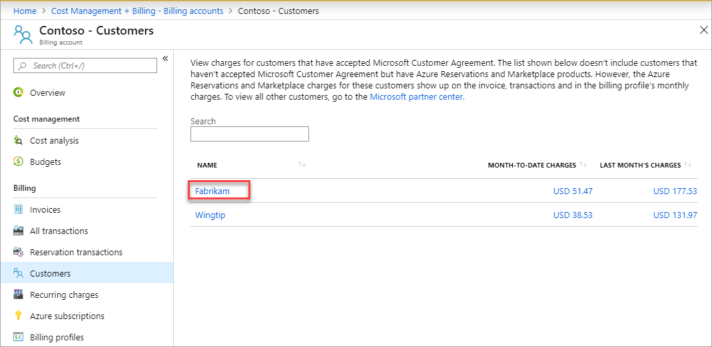
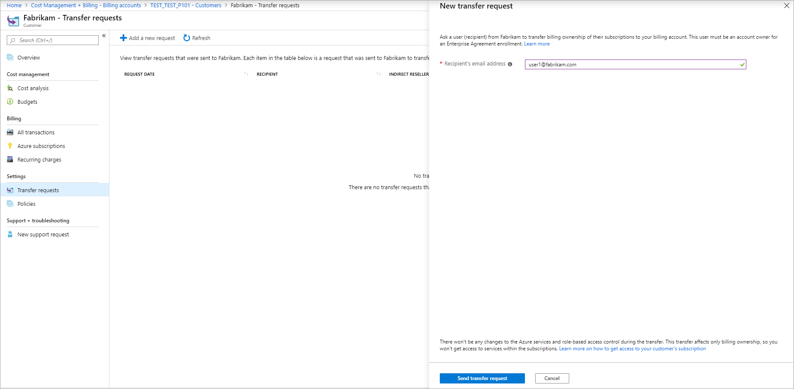
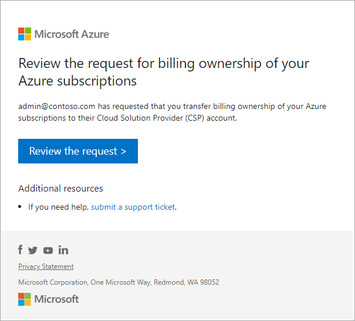
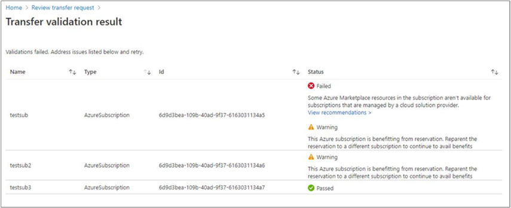
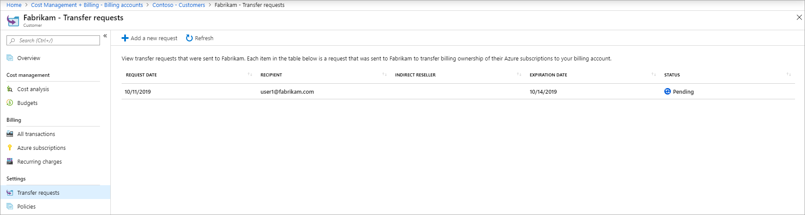
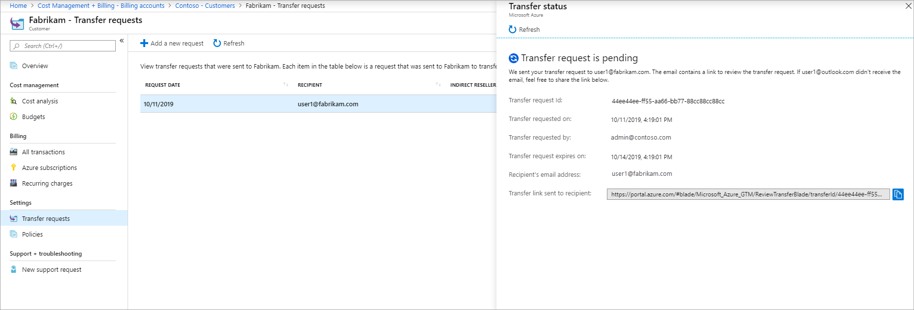

# Get billing ownership of Azure subscriptions to your MPA account

To provide a single combined invoice for managed services and Azure consumption, a Cloud Solution Provider (CSP) can take over billing ownership of Azure subscriptions from their customers with Direct Enterprise Agreements (EA).

This feature is available only for CSP Direct Bill Partners certified as [Azure Expert MSP](https://partner.microsoft.com/membership/azure-expert-msp). It's subject to Microsoft governance and policies and might require review and approval for certain customers.

To request the billing ownership, you must have **Global Admin** or **Admin Agents** role. To learn more, see [Partner Center - Assign users roles and permissions](https://docs.microsoft.com/partner-center/permissions-overview).

This article applies to billing accounts for Microsoft Partner Agreements. These accounts are created for Cloud Solution Providers (CSPs) to manage billing for their customers in the new commerce experience. The new experience is only available for partners, who have at least one customer that has accepted a Microsoft Customer Agreement(MCA) and has an Azure Plan. [Check if you have access to a Microsoft Partner Agreement](#check-access-to-a-microsoft-partner-agreement).

## Prerequisites

1. Establish [reseller relationship](https://docs.microsoft.com/partner-center/request-a-relationship-with-a-customer) with the customer. Check [CSP Regional Authorization Overview](https://docs.microsoft.com/partner-center/regional-authorization-overview) to ensure both customer and Partner tenant are within the same authorized regions.
1. [Confirm customer has accepted the Microsoft Customer Agreement](https://docs.microsoft.com/partner-center/confirm-customer-agreement).
1. Set up an [Azure plan](https://docs.microsoft.com/partner-center/purchase-azure-plan) for the customer. If the customer is purchasing through multiple resellers, you need to set up an Azure plan for each combination of a customer and a reseller.

## Request billing ownership

1. Sign in to the [Azure portal](https://portal.azure.com) using CSP Admin Agent credentials in the CSP tenant.
1. Search for **Cost Management + Billing**.  
    
1. Select **Customers** from the left-hand side and then select a customer from the list.  
    
1. Select **Transfer requests** from the lower-left side and then select **Add a new request**.  
    
1. Enter the email address of the user in the customer organization who will accept the transfer request. The user must be an account owner on an Enterprise Agreement. Select **Send transfer request**.  
    
1. The user gets an email with instructions to review your transfer request.  
    
1. To approve the transfer request, the user selects the link in the email and follows the instructions.  
    
    User can select the billing account that they want to transfer Azure products from. Once selected, eligible products that can be transferred are shown. **Note:** Disabled subscriptions can't be transferred and will show up in the "Non-transferrable Azure Products" list if applicable. Once the Azure products to be transferred are selected, select **Validate**.
1. The **Transfer Validation Result** area will show the impact of the Azure products that are going to be transferred. Here are the possible states:
    * **Passed** - Validation for this Azure product has passed and can be transferred.
    * **Warning** - There's a warning for the selected Azure product. While the product can still be transferred, doing so will have some impact that the user should be aware of in case they want to take mitigating actions. For example, the Azure subscription being transferred is benefitting from an RI. After transfer, the subscription will no longer receive that benefit. To maximize savings, ensure that the RI is associated with another subscription that can use its benefits. Instead, the user can also choose to go back to the selection page and unselect this Azure subscription.
    * **Failed** - The selected Azure product can't be transferred because of an error. The user will need to go back to the selection page and unselect this product to transfer the other selected Azure products.  
    

## Check the transfer request status

1. Sign in to the [Azure portal](https://portal.azure.com).
1. Search for **Cost Management + Billing**.  
    
1. Select **Customers** from the left-hand side.  
    
1. Select the customer from the list for which you sent the transfer request.
1. Select **Transfer requests** from the lower-left side. The Transfer requests page displays the following information:
    

   |Column|Definition|
   |---------|---------|
   |Request date|The date when the transfer request was sent|
   |Recipient|The email address of the user that you sent the request to transfer billing ownership|
   |Expiration date|The date when the request expires|
   |Status|The status of transfer request|

    The transfer request can have one of the following statuses:

   |Status|Definition|
   |---------|---------|
   |In progress|The user hasn't accepted the transfer request|
   |Processing|The user approved the transfer request. Billing for subscriptions that the user selected is getting transferred to your account|
   |Completed| The billing for subscriptions that the user selected is transferred to your account|
   |Finished with errors|The request completed but billing for some subscriptions that the user selected couldn't be transferred|
   |Expired|The user didn't accept the request on time and it expired|
   |Canceled|Someone with access to the transfer request canceled the request|
   |Declined|The user declined the transfer request|

1. Select a transfer request to view details. The transfer details page displays the following information:
   

   |Column  |Definition|
   |---------|---------|
   |Transfer request ID|The unique ID for your transfer request. If you submit a support request, share the ID with Azure support to speed up the support request|
   |Transfer requested on|The date when the transfer request was sent|
   |Transfer requested by|The email address of the user who sent the transfer request|
   |Transfer request expires on| The date when the transfer request expires|
   |Recipient's email address|The email address of the user that you sent the request to transfer billing ownership|
   |Transfer link sent to recipient|The url that was sent to the user to review the transfer request|

## Supported subscription types

You can request billing ownership of the subscription types listed below.

* [Enterprise Dev/Test](https://azure.microsoft.com/offers/ms-azr-0148p/)\*
* [Microsoft Enterprise Agreement](https://azure.microsoft.com/pricing/enterprise-agreement/)

\* You must convert a Dev/Test subscription to an EA Enterprise offer via a support ticket. An Enterprise Dev/Test subscription will be billed at a pay-as-you-go rate after it's transferred. Any discount offered via the Enterprise Dev/Test offer through the customer's EA won't be available to the CSP partner.

## Additional information

The following section provides additional information about transferring subscriptions.

### No service downtime

Azure services in the subscription keep running without any interruption. We only transition the billing relationship for the Azure subscriptions that the user selects to transfer.

### Disabled subscriptions

Disabled subscriptions can't be transferred. Subscriptions must be in active state to transfer their billing ownership.

### Azure resources transfer

All resources from the subscriptions like VMs, disks, and websites transfer.

### Azure Marketplace products transfer

Azure Marketplace products, which are available for subscriptions that are managed by Cloud Solution Providers (CSPs) are transferred along with their respective subscriptions. Subscriptions that have Azure Marketplace products that aren't enabled for CSPs can't be transferred.

### Azure Reservations transfer

Azure Reservations don't automatically move with subscriptions. Either you can keep the Reservation in EAfor other subscriptions or [cancel the Reservation](https://docs.microsoft.com/azure/cost-management-billing/reservations/exchange-and-refund-azure-reservations) and partner can repurchase in CSP.

### Access to Azure services

Access for existing users, groups, or service principals that was assigned using [Azure RBAC (role-based access control)](../../role-based-access-control/overview.md) isn't affected during the transition. The partner won’t get any new RBAC access to the subscriptions.

The partners should work with the customer to get access to subscriptions. The partners need to get either [Admin on Behalf Of - AOBO](https://channel9.msdn.com/Series/cspdev/Module-11-Admin-On-Behalf-Of-AOBO) or [Azure Lighthouse](https://docs.microsoft.com/azure/lighthouse/concepts/cloud-solution-provider) access open support tickets.

### Azure support plan

Azure support doesn't transfer with the subscriptions. If the user transfers all Azure subscriptions, ask them to cancel their support plan. After the transfer, CSP partner is responsible for the support. The customer should work with CSP partner for any support request.  

### Charges for transferred subscription

The original billing owner of the subscriptions is responsible for any charges that were reported up to the point that the transfer is completed. You're  responsible for charges reported from the time of transfer onwards. There may be some charges that took place before transfer but was reported afterwards. These charges show up on your invoice.

### Cancel a transfer request

You can cancel the transfer request until the request is approved or declined. To cancel the transfer request, go to the [transfer details page](#check-the-transfer-request-status) and select cancel from the bottom of the page.

### Software as a Service (SaaS) transfer

SaaS products don't transfer with the subscriptions. Ask the user to [Contact Azure support](https://portal.azure.com/?#blade/Microsoft_Azure_Support/HelpAndSupportBlade) to transfer billing ownership of SaaS products. Along with the billing ownership, the user can also transfer resource ownership. Resource ownership lets you perform management operations like deleting and viewing the details of the product. User must be a resource owner on the SaaS product to transfer resource ownership.

### Additional approval for certain customers

Some of the customer transition requests may require an additional review process with Microsoft because of the nature of the current enterprise enrollment structure of the customer. The partner will be notified of such requirements when trying to send an invitation to customers. Partners are requested to work with their Partner Development Manager and Customer’s account team to complete this review process.

### Azure subscription directory

The directory of the Azure subscriptions that are transferred must match the directory of the customer that was selected while establishing the CSP relationship.

If these two directories don’t match, the subscriptions couldn't be transferred. You need to either establish a new CSP reseller relationship with the customer by selecting the directory of the Azure subscriptions or change the directory of Azure subscriptions to match with the customer CSP relationship directory. For more information, see [Associate an existing subscription to your Azure AD directory](https://docs.microsoft.com/azure/active-directory/fundamentals/active-directory-how-subscriptions-associated-directory#to-associate-an-existing-subscription-to-your-azure-ad-directory).

## Check access to a Microsoft Partner Agreement

[!INCLUDE [billing-check-mpa](../../../includes/billing-check-mpa.md)]

## Need help? Contact support

If you need help, [contact support](https://portal.azure.com/?#blade/Microsoft_Azure_Support/HelpAndSupportBlade) to get your issue resolved quickly.

## Next steps

* The billing ownership of the Azure subscriptions is transferred to you. Keep track of the charges for these subscriptions in the [Azure portal](https://portal.azure.com).
* Work with the customer to get access to the transferred Azure subscriptions. [Manage access to Azure resources using RBAC](https://docs.microsoft.com/azure/role-based-access-control/role-assignments-portal).
