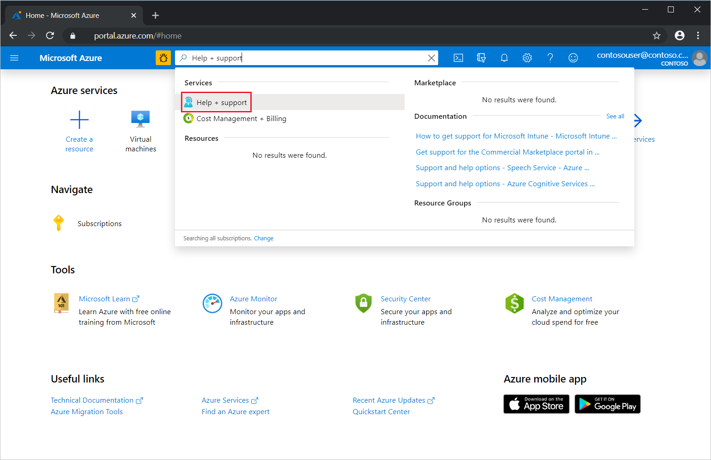
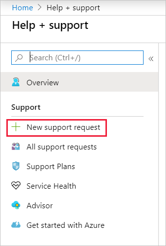
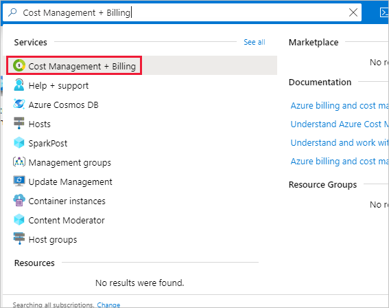
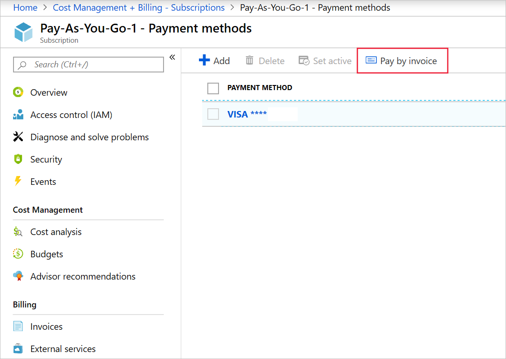
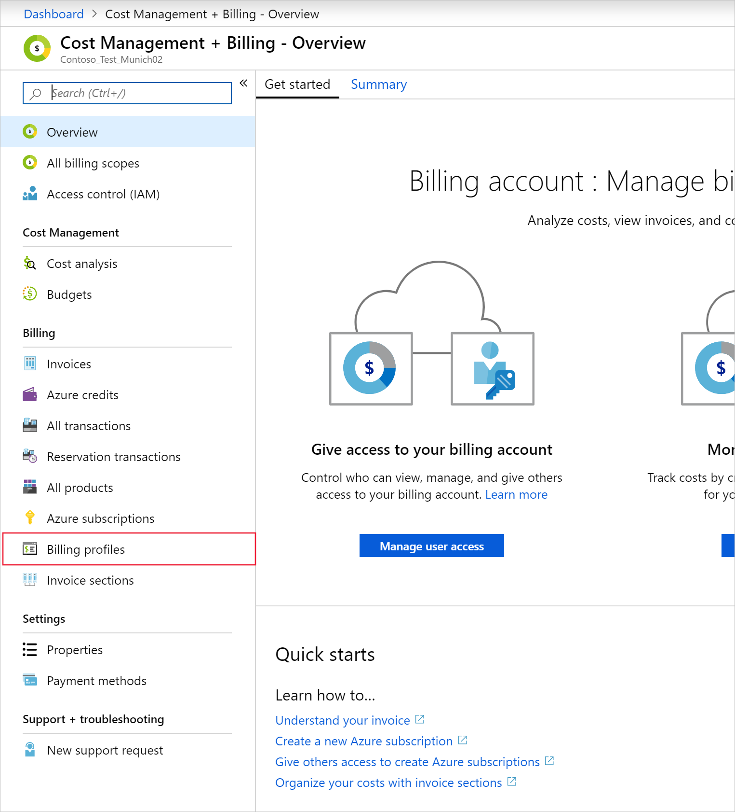
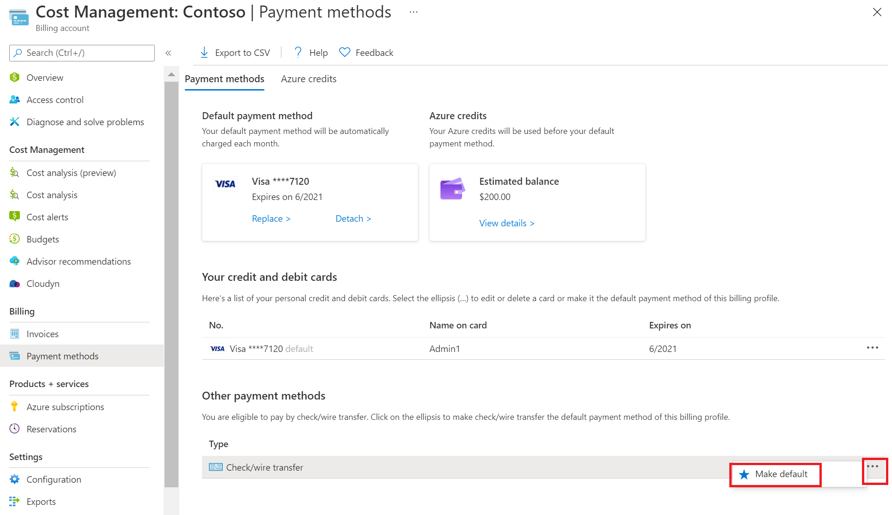

# Pay for your Azure subscription by invoice

This article applies to customers with a Microsoft Customer Agreement (MCA) and who signed up for Azure through the Azure website. [Check your access to a Microsoft Customer Agreement](#check-access-to-a-microsoft-customer-agreement). If you signed up for Azure through a Microsoft representative, then your default payment method will already be set to *check or wire transfer*.

If you switch to pay by invoice, that means you pay your bill within 30 days of the invoice date by check/wire transfer. To become eligible to pay for your Azure subscription by invoice, submit a request to Azure support. Once your request is approved, you can switch to invoice pay (check/wire transfer) in the Azure portal.

> [!IMPORTANT]
> * Invoice pay (check/wire transfer) is only available for customers using Azure on behalf of a company.
> * Pay all outstanding charges before switching to invoice pay.
> * Currently, invoice payment isn't supported for Global Azure in China.

## Request to pay by invoice

1. Sign in to the Azure portal to submit a support request. Search for and select **Help + support**.  
    
1. Select **New support request**.  
    
1. Select **Billing** as the **Issue type**. The *issue type* is the support request category. Select the subscription for which you want to pay by invoice, select a support plan, and then select **Next**.
1. Select **Payment** as the **Problem Type**. The *problem type* is the support request subcategory.
1. Select **Switch to Pay by Invoice** as the **Problem subtype**.
1. Enter the following information in the **Details** box, and then select **Next**.
    - New or existing customer:
    - If existing, current payment method:
    - Order ID (requesting for invoice option):
    - Account Admins Live ID (or Org ID) (should be company domain):
    - Commerce Account ID:
    - Company Name (as registered under VAT or Government Website):
    - Company Address (as registered under VAT or Government Website):
    - Company Website:
    - Country:
    - TAX ID/ VAT ID:
    - Company Established on (Year):
    - Any prior business with Microsoft:
    - Contact Name:
    - Contact Phone:
    - Contact Email:
    - Justification about why you want the invoice option instead of a credit card:
    - For cores increase, provide the following additional information:
        - (Old quota) Existing Cores:
        - (New quota) Requested cores:
        - Specific region & series of Subscription:
    - The **Company name** and **Company address** should match the information that you provided for the Azure account. To view or update the information, see [Change your Azure account profile information](change-azure-account-profile.md).
    - Add your billing contact information in the Azure portal before the credit limit can be approved. The contact details should be related to the company's Accounts Payable or Finance department.
1. Verify your contact information and preferred contact method, and then select **Create**.

If we need to run a credit check because of the amount of credit that you need, we'll send you a credit check application. We might ask you to provide your company’s audited financial statements. If no financial information is provided or if the information isn't strong enough to support the amount of credit limit required, we might ask for a security deposit or a standby letter of credit to approve your credit check request.

## Switch to invoice pay (check/wire transfer)

Once you're approved to pay by invoice, you can switch to invoice pay (check/wire transfer) in the Azure portal.

If you have a Microsoft Online Services Program account, you can switch your Azure subscription to check/wire transfer. With a Microsoft Customer Agreement, you can switch your billing profile to check/wire transfer.

### Switch Azure subscription to check/wire transfer

Follow the steps below to switch your Azure subscription to invoice pay (check/wire transfer). *Once you switch to invoice pay (check/wire transfer), you can't switch back to a credit card*.

1. Go to the Azure portal to sign in as the Account Administrator. Search for and select **Cost Management + Billing**.  
    
1. Select the subscription you'd like to switch to invoice payment.
1. Select **Payment methods**.
1. In the command bar, select the **Pay by invoice** button.  
    

### Switch billing profile to check/wire transfer

Follow the steps below to switch a billing profile to check/wire transfer. Only the person who signed up for Azure can change the default payment method of a billing profile.

1. Go to the Azure portal view your billing information. Search for and select **Cost Management + Billing**.
1. In the menu, choose **Billing profiles**.  
    
1. Select a billing profile.
1. In the **Billing profile** menu, select **Payment methods**.  
   
1. Select the banner that says you're eligible to pay by check/wire transfer.  
    

## Check access to a Microsoft Customer Agreement
[!INCLUDE [billing-check-mca](../../../includes/billing-check-mca.md)]

## Frequently asked questions

*Why have I received a request for a legal document?*

Occasionally Microsoft needs legal documentation if the information you provided is incomplete or not verifiable. Examples might include:

* Name difference between Account name and Company name
* Change in name

## Next steps

* If needed, update your billing contact information at the [Azure portal](https://portal.azure.com).