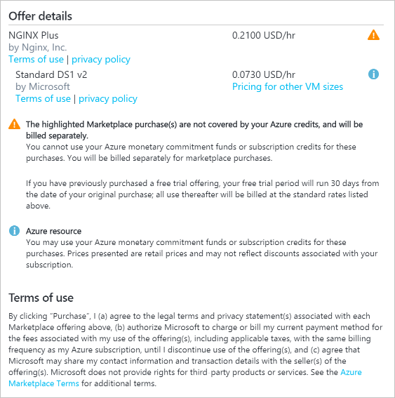

# Azure spending limit

The spending limit in Azure prevents spending over your credit amount. All new customers who sign up for an Azure free account or subscription types that include credits over multiple months have the spending limit turned on by default. The spending limit is equal to the amount of credit and it can’t be changed. For example, if you signed up for Azure free account, your spending limit is $200 and you can't change it to $500. However, you can remove the spending limit. So, you either have no limit, or you have a limit equal to the amount of credit. This prevents you from most kinds of spending. The spending limit isn’t available for subscriptions with commitment plans or with pay-as-you-go pricing. See the [full list of Azure subscription types and the availability of the spending limit](https://azure.microsoft.com/support/legal/offer-details/).

## Reaching a spending limit

When your usage results in charges that exhaust your spending limit, the services that you deployed are disabled for the rest of that billing period.

For example, when you spend all the credit included with your Azure free account, Azure resources that you deployed are removed from production and your Azure virtual machines are stopped and de-allocated. The data in your storage accounts are available as read-only.

If your subscription type includes credits over multiple months, your subscription is re-enabled automatically at the beginning of the next billing period. Then you can redeploy your Azure resources and have full access to your storage accounts and databases.

Azure sends email notifications when you reach the spending limit. Sign in to the [Azure portal](https://portal.azure.com/#blade/Microsoft_Azure_Billing/SubscriptionsBlade) to see notifications about subscriptions that have reached the spending limit.

If you signed up for an Azure free account and reach the spending limit, you can upgrade to a [pay-as-you-go](upgrade-azure-subscription.md) pricing to remove the spending limit and automatically re-enable your subscription.

## Remove the spending limit in Azure portal

You can remove the spending limit at any time as long as there's a valid payment method associated with your Azure subscription. For subscription types that have credit over multiple months such as Visual Studio Enterprise and Visual Studio Professional, you can also enable the spending limit at the beginning of your next billing period.

To remove your spending limit, follow these steps:

1. Sign in to the [Azure portal](https://portal.azure.com/#blade/Microsoft_Azure_Billing/SubscriptionsBlade).
1. Select a subscription. If the spending limit of the subscription is reached, it will be disabled.
1. Select **Remove spending limit** from the top of the page.
1. Select an option that is appropriate for you.

| Option | Effect |
| --- | --- |
| Remove spending limit indefinitely | Removes the spending limit without turning it on automatically at the start of the next billing period. |
| Remove spending limit for the current billing period | Removes the spending limit so that it turns back on automatically at the start of the next billing period. |

## Why you might want to remove the spending limit

The spending limit could prevent you from deploying or using certain third-party and Microsoft services. Here are the situations where you should remove the spending limit on your subscription.

-  You plan to deploy first party images like Oracle or services such as Azure DevOps Services. This situation causes you to reach your spending limit almost immediately and causes your subscription to be disabled.
- You have services that you don't want disrupted. When you reach your spending limit, Azure resources that you deployed are removed from production and your Azure virtual machines are stopped and de-allocated. If you have services that you don't want disrupted, you must remove your spending limit.
- You have services and resources with settings like virtual IP addresses that you don't want to lose. These settings are lost when your reach your spending limit and the services and resources are de-allocated.

## Turn on the spending limit after removing

This feature is available only when the spending limit has been removed indefinitely for subscription types that include credits over multiple months. You can use this feature to turn on your spending limit automatically at the start of the next billing period.

1. Sign in to the [Account Center](https://account.windowsazure.com/Subscriptions).
1. Click the yellow banner to change the spending limit option.
1. Choose **Turn on spending limit in the next billing period \<start date of billing period\>**

## Custom spending limit

Custom spending limits aren't available.

## A spending limit doesn't prevent all charges

[Some external services published in the Azure Marketplace](../understand/understand-azure-marketplace-charges.md) can't be used with your subscription credits, and can incur separate charges even when your spending limit is set. Examples include Visual Studio licenses, Azure Active Directory premium, support plans, and most third-party branded services. When you provision a new external service, a warning is shown to let you know the services are billed separately:

## Need help? Contact us.

If you have questions or need help,  [create a support request](https://go.microsoft.com/fwlink/?linkid=2083458).

## Next steps
- Upgrade to a plan with [pay-as-you-go](upgrade-azure-subscription.md) pricing.
