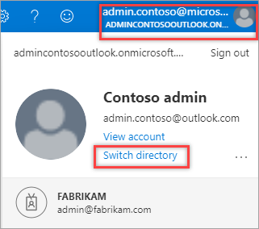
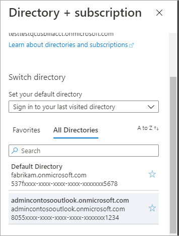

# Troubleshoot viewing your billing account in the Azure portal

A billing account is created when you sign up to use Azure. You use your billing account to manage your invoices, payments, and track costs. You might have access to multiple billing accounts. For example, you might have signed up for Azure for personal use. You could also have access to Azure through your organization's Enterprise Agreement or Microsoft Customer Agreement. For each of these scenarios, you would have a separate billing account. This article helps you troubleshoot problems when trying to view your billing account in the Azure portal.

You can view your billing accounts one the [Cost Management + Billing](https://portal.azure.com/#blade/Microsoft_Azure_GTM/ModernBillingMenuBlade) page.

To learn more about billing accounts and identify your billing account type, see [View billing accounts in Azure portal](view-all-accounts.md).

If you're unable to see your billing account in the Azure portal, try the following options:

## Sign in to a different tenant

Your billing account is associated with a single Azure Active Directory tenant. You won't see your billing account on the Cost Management + Billing page if you're signed in to an incorrect tenant. Use the following steps to switch to another tenant in the Azure portal and view your billing accounts in that tenant.

1. Sign in to the [Azure portal](https://portal.azure.com).
1. Select your profile (email address) at the top right of the page.
1. Select **Switch directory**.  
    
1. Select a directory under the **All directories** section.  
    

## Sign in with a different email address

Some users have multiple email addresses to sign in to the [Azure portal](https://portal.azure.com). Not all email addresses have access to a billing account. If you sign in with an email address that has permissions to manage resources but doesn't have permissions to view a billing account, you wouldn't see the billing account on the [Cost Management + Billing](https://portal.azure.com/#blade/Microsoft_Azure_GTM/ModernBillingMenuBlade) page in the Azure portal.

Sign in to the Azure portal with an email address that has permission to the billing account to access your billing account.

## Sign in with a different identity

Some users have two identities with the same email address - a work or school account and a personal account. Typically, only one of their identities has permissions to view a billing account. You might have two identities with a single email address. When you sign in with an identity that doesn't have permission to view a billing account, you won't see the billing account in the [Cost Management + Billing](https://portal.azure.com/#blade/Microsoft_Azure_GTM/ModernBillingMenuBlade) page. Use the following steps to switch your identity:

1. Sign in to the [Azure portal](https://portal.azure.com) in an InPrivate/Incognito window.
1. If your email address has two identities, you'll see an option to select a personal account or a work or school account. Select one of the accounts.
1. If you can't see the billing account in the Cost Management + Billing page in the Azure portal, repeat steps 1 and 2 and select the other identity.

## Contact us for help

If you have questions or need help, [create a support request](https://portal.azure.com/#blade/Microsoft_Azure_Support/HelpAndSupportBlade/newsupportrequest).

## Next steps

Read the following billing and subscription articles to help troubleshoot problems.

- [Declined card](./troubleshoot-declined-card.md)
- [Subscription sign in issues](./troubleshoot-sign-in-issue.md)
- [No subscriptions found](./no-subscriptions-found.md)
- [Enterprise cost view disabled](./enterprise-mgmt-grp-troubleshoot-cost-view.md)