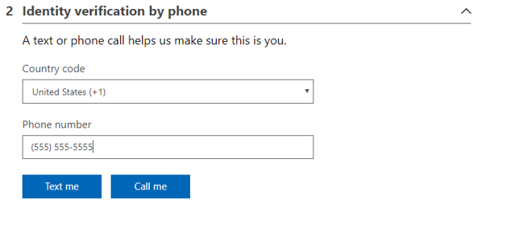

# Troubleshoot issues when you sign up for a new account in the Azure portal

You may experience an issue when you try to sign up for a new account in the Microsoft Azure portal. This short guide walks you through the sign-up process and discusses some common issues at each step.

> [!NOTE]
> If you already have an existing account and are looking for guidance to troubleshoot sign-in issues, see [Troubleshoot Azure subscription sign-in issues](./troubleshoot-sign-in-issue.md).

## Before you begin

Before beginning sign-up, verify the following information:

- The information for your Azure profile (including contact email address, street address, and telephone number) is correct.
- Your credit card information is correct.
- You don't already have a Microsoft account that has the same information.

## Guided walkthrough of Azure sign-up

The Azure sign-up experience consists of four sections:

- About you
- Identity verification by phone
- Identity verification by card
- Agreement

This walkthrough provides examples of the correct information to sign up for an Azure account. Each section also contains some common issues and how to resolve them.

## About you

When you initially sign up for Azure, you have to provide some information about yourself, including:

- Your country/region
- First name
- Last name
- Email address
- Phone number
- Credit card information
 
### Common issues and solutions

#### You see the message “We cannot proceed with sign-up due to an issue with your account. Please contact billing support”

To resolve this error, follow these steps:

1. Sign in to the [Microsoft account center](https://account.microsoft.com/).
1. At the top of the page, select **Your info**.
1. Verify that your billing and shipping details are completed and valid.
1.	When you sign up for the Azure subscription, verify that the billing address for the credit card registration matches your bank records.

If you continue to receive the message, try to sign up by using a different browser.

How about InPrivate browsing?

#### Free trial isn't available

Have you used an Azure subscription in the past? The Azure Terms of Use agreement limits free trial activation only for a user that's new to Azure. If you have had any other type of Azure subscription, you can't activate a free trial. Consider signing up for a [Pay-As-You-Go subscription](https://azure.microsoft.com/offers/ms-azr-0003p/).

#### You see the message 'You are not eligible for an Azure subscription'

To resolve this issue, double-check whether the following items are true:

- The information that you provided for your Azure account profile (including contact email address, street address, and telephone number) is correct.
- The credit card information is correct.
- You don't already have a Microsoft account that uses the same information.

#### You see the message 'Your current account type is not supported'

This issue can occur if the account is registered in an [unmanaged Microsoft Entra directory](../../active-directory/enterprise-users/directory-self-service-signup.md), and it isn't in your organization's Microsoft Entra directory. To resolve this issue, sign up the Azure account by using another account, or take over the unmanaged AD directory. For more information, see [Take over an unmanaged directory as administrator in Microsoft Entra ID](../../active-directory/enterprise-users/domains-admin-takeover.md).

The issue can also occur if the account was created using the Microsoft 365 Developer Program. Microsoft doesn't allow purchasing other paid services using your Microsoft 365 Developer Program subscription. For more information, see [Does the subscription also include a subscription to Azure?](/office/developer-program/microsoft-365-developer-program-faq#does-the-subscription-also-include-a-subscription-to-azure-)

## Identity verification by phone

 
When you get the text message or telephone call, enter the code that you receive in the text box.

### Common issues and solutions

#### No verification text message or phone call

Although the sign-up verification process is typically quick, it may take up to four minutes for a verification code to be delivered.

Here are some other tips:

- You can use any phone number for verification as long as it meets the requirements. The phone number that you enter for verification isn't stored as a contact number for the account.
  - A Voice-over-IP (VoiP) phone number can't be used for the phone verification process.
  - Check that your phone can receive calls or SMS messages from a United States-based telephone number.
- Double-check the phone number that you enter, including the country code that you select in the drop-down menu.
- If your phone doesn't receive text messages (SMS), try the **Call me** option.

## Identity verification by card

 
### Common issues and solutions

#### Credit card declined or not accepted

Virtual or prepaid credit cards aren't accepted as payment for Azure subscriptions. To see what else may cause your card to be declined, see [Troubleshoot a declined card at Azure sign-up](./troubleshoot-declined-card.md).

#### Credit card form doesn't support my billing address

Your billing address must be in the country/region that you select in the **About you** section. Verify that you have selected the correct country/region.

#### Progress bar hangs in identity verification by card section

To complete the identity verification by card, third-party cookies must be allowed for your browser.

Use the following steps to update your browser's cookie settings.

1. Update the cookie settings.
   - If you're using **Chrome**:
     - Select **Settings** > **Show advanced settings** > **Privacy** > **Content settings**. Clear **Block third-party cookies and site data**.

   - If you're using **Microsoft Edge**:
     - Select **Settings** > **View advanced settings** > **Cookies** > **Don't block cookies**.

1. Refresh the Azure sign-up page and check whether the problem is resolved.
1. If the refresh didn't resolve the issue, then exit and restart the browser, and try again.

### I saw a charge on my free trial account

You may see a small, temporary verification hold on your credit card account after you sign up. This hold is removed within three to five days. If you're worried about managing costs, read more about [Analyzing unexpected charges](../understand/analyze-unexpected-charges.md).

## Agreement

Complete the Agreement.

## Other issues

### Can't activate Azure benefit plan like Visual Studio or Microsoft Cloud Partner Program

Check that you're using the correct sign-in credentials. Then, check the benefit program and verify that you're eligible.
- Visual Studio
  - Verify your eligibility status on your [Visual Studio account page](https://my.visualstudio.com/Benefits).
  - If you can't verify your status, contact [Visual Studio Subscription Support](https://visualstudio.microsoft.com/subscriptions/support/).
- Microsoft for Startups
  - Sign in to the [Microsoft for Startups portal](https://startups.microsoft.com/#start-two) to verify your eligibility status for Microsoft for Startups.
  - If you can't verify your status, you can get help on the [Microsoft for Startups forums](https://www.microsoftpartnercommunity.com/t5/Microsoft-for-Startups/ct-p/Microsoft_Startups).
- Cloud Partner Program
  - Sign in to the [Cloud Partner Program portal](https://mspartner.microsoft.com/Pages/Locale.aspx) to verify your eligibility status. If you have the appropriate [Cloud Platform Competencies](https://mspartner.microsoft.com/pages/membership/cloud-platform-competency.aspx), you may be eligible for other benefits.
  - If you can't verify your status, contact [Cloud Partner Program Support](https://mspartner.microsoft.com/Pages/Support/Premium/contact-support.aspx).

### Can't activate new Azure In Open subscription

To create an Azure In Open subscription, you must have a valid Online Service Activation (OSA) key that has at least one Azure In Open token associated with it. If you don't have an OSA key, contact one of the Microsoft Partners that are listed in [Microsoft Pinpoint](https://pinpoint.microsoft.com/).

## Other help resources

Other troubleshooting articles for Azure Billing and Subscriptions

- [Declined card](./troubleshoot-declined-card.md)
- [Subscription sign-in issues](./troubleshoot-sign-in-issue.md)
- [No subscriptions found](./no-subscriptions-found.md)
- [Enterprise cost view disabled](./enterprise-mgmt-grp-troubleshoot-cost-view.md)

## Contact us for help

- Get answers in [Azure forums](https://azure.microsoft.com/support/forums/).
- Connect with [@AzureSupport](https://twitter.com/AzureSupport)- answers, support, experts.
- If you have a support plan, [open a support request](https://portal.azure.com/#blade/Microsoft_Azure_Support/HelpAndSupportBlade/newsupportrequest).

## Next steps

- Read the [Cost Management and Billing documentation](../index.yml)
