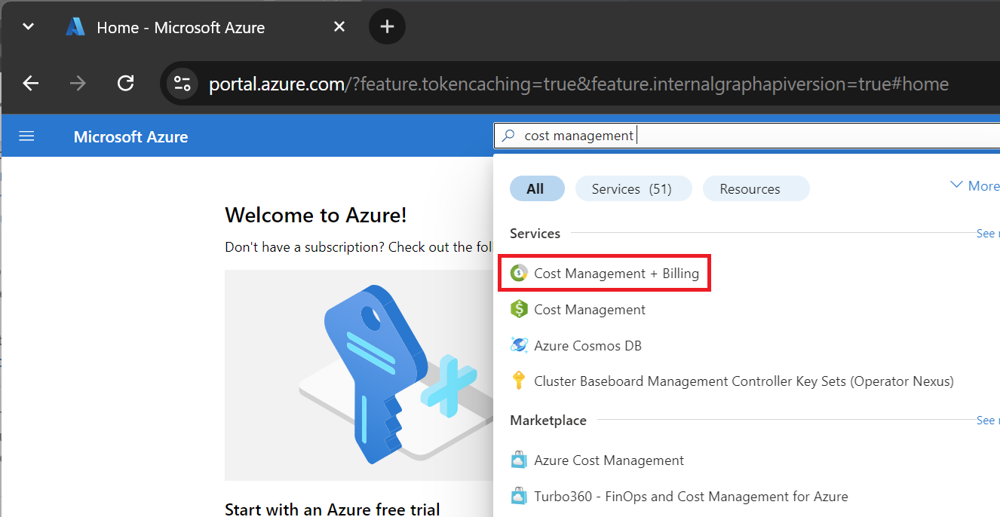
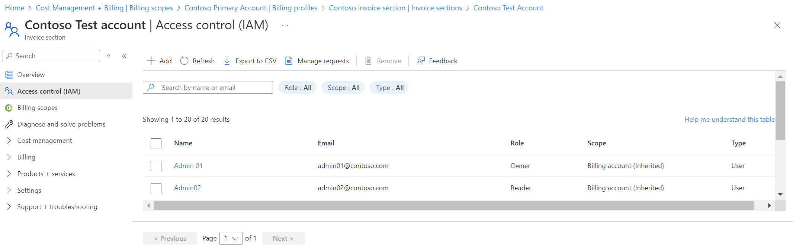
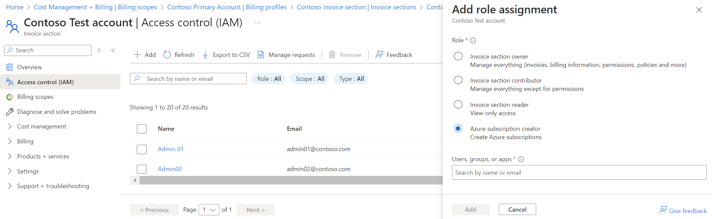
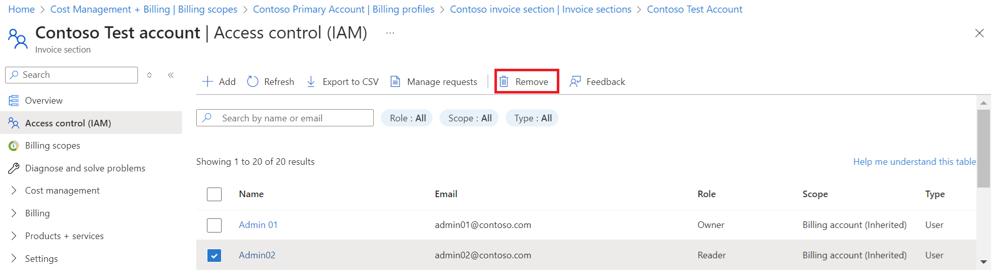

# Understand Microsoft Customer Agreement administrative roles in Azure

To manage your billing account for a Microsoft Customer Agreement, use the roles described in the following sections. These roles are in addition to the built-in roles Azure has to control access to resources. For more information, see [Built-in roles for Azure resources](../../role-based-access-control/built-in-roles.md).

This article applies to a billing account for a Microsoft Customer Agreement. Check if you have access to a Microsoft Customer Agreement.

## Billing role definitions

The following table describes the billing roles you use to manage your billing account, billing profiles, and invoice sections.

|Role|Description|
|---|---|
|Billing account owner|Manage everything for billing account|
|Billing account contributor|Manage everything except permissions on the billing account|
|Billing account reader|Read-only view of everything on billing account|
|Billing profile owner|Manage everything for billing profile|
|Billing profile contributor|Manage everything except permissions on the billing profile|
|Billing profile reader|Read-only view of everything on billing profile|
|Invoice manager|View and pay invoices for billing profile|
|Invoice section owner|Manage everything on invoice section|
|Invoice section contributor|Manage everything except permissions on the invoice section|
|Invoice section reader|Read-only view of everything on the invoice section|
|Azure subscription creator|Create Azure subscriptions|

## Billing account roles and tasks

A billing account lets you manage billing for your organization. You use billing account to organize costs, monitor charges, and invoices and control billing access for your organization. For more information, see [Understand billing account](../understand/mca-overview.md#your-billing-account).

The following tables show what role you need to complete tasks in the context of the billing account.

### Manage billing account permissions and properties

|Task|Billing account owner|Billing account contributor|Billing account reader|
|---|---|---|---|
|View existing permissions for billing account|✔|✔|✔|
|Give others permissions to view and manage the billing account|✔|✘|✘|
|View billing account properties like company name, address, and more|✔|✔|✔|

### Manage billing profiles for billing account

|Task|Billing account owner|Billing account contributor|Billing account reader|
|---|---|---|---|
|View all billing profiles in the account|✔|✔|✔|

### Manage invoices for billing account

|Task|Billing account owner|Billing account contributor|Billing account reader|
|---|---|---|---|
|View all invoices in the account|✔|✔|✔|
|Download invoices, Azure usage and charges files, price sheets and tax documents in the account|✔|✔|✔|

### Manage invoice sections for billing account

|Task|Billing account owner|Billing account contributor|Billing account reader|
|---|---|---|---|
|View all invoice sections in the account|✔|✔|✔|

### Manage transactions for billing account

|Task|Billing account owner|Billing account contributor|Billing account reader|
|---|---|---|---|
|View all billing transactions for the account|✔|✔|✔|
|View all products bought for the account|✔|✔|✔|

### Manage subscriptions for billing account

|Task|Billing account owner|Billing account contributor|Billing account reader|
|---|---|---|---|
|View all Azure subscriptions in the billing account|✔|✔|✔|

## Billing profile roles and tasks

A billing profile lets you manage your invoices and payment methods. A monthly invoice is generated for the Azure subscriptions and other products purchased using the billing profile. You use the payments methods to pay the invoice. For more information, see [Understand billing profiles](../understand/mca-overview.md#billing-profiles).

The following tables show what role you need to complete tasks in the context of the billing profile.

### Manage billing profile permissions, properties, and policies

|Task|Billing profile owner|Billing profile contributor|Billing profile reader|Invoice Manager|Billing account owner|Billing account contributor|Billing account reader
|---|---|---|---|---|---|---|---|
|View existing permissions for the billing profile|✔|✔|✔|✔|✔|✔|✔|
|Give others permissions to view and manage the billing profile|✔|✘|✘|✘|✘|✘|✘|
|View billing profile properties like PO number, email invoice preference, and more|✔|✔|✔|✔|✔|✔|✔|
|Update billing profile properties |✔|✔|✘|✘|✘|✘|✘|
|View policies applied on the billing profile like enable Azure reservation purchases, enable Azure marketplace purchases, and more|✔|✔|✔|✔|✔|✔|✔|
|Apply policies on the billing profile |✔|✔|✘|✘|✘|✘|✘|

### Manage invoices for billing profile

|Task|Billing profile owner|Billing profile contributor|Billing profile reader|Invoice Manager|Billing account owner|Billing account contributor|Billing account reader
|---|---|---|---|---|---|---|---|
|View all the invoices for the billing profile|✔|✔|✔|✔|✔|✔|✔|
|Download invoices, Azure usage and charges files, price sheets and tax documents for the billing profile|✔|✔|✔|✔|✔|✔|✔|

### Manage invoice sections for billing profile

|Task|Billing profile owner|Billing profile contributor|Billing profile reader|Invoice Manager|Billing account owner|Billing account contributor|Billing account reader
|---|---|---|---|---|---|---|---|
|View all the invoice sections for the billing profile|✔|✔|✔|✔|✔|✔|✔|
|Create new invoice section for the billing profile|✔|✔|✘|✘|✘|✘|✘|

### Manage transactions for billing profile

|Task|Billing profile owner|Billing profile contributor|Billing profile reader|Invoice Manager|Billing account owner|Billing account contributor|Billing account reader
|---|---|---|---|---|---|---|---|
|View all billing transactions for the billing profile|✔|✔|✔|✔|✔|✔|✔|

### Manage payment methods for billing profile

|Task|Billing profile owner|Billing profile contributor|Billing profile reader|Invoice Manager|Billing account owner|Billing account contributor|Billing account reader
|---|---|---|---|---|---|---|---|
|View payment methods for the billing profile|✔|✔|✔|✔|✔|✔|✔|
|Track Azure credits balance for the billing profile|✔|✔|✔|✔|✔|✔|✔|

### Manage subscriptions for billing profile

|Task|Billing profile owner|Billing profile contributor|Billing profile reader|Invoice Manager|Billing account owner|Billing account contributor|Billing account reader
|---|---|---|---|---|---|---|---|
|View all Azure subscriptions for the billing profile|✔|✔|✔|✔|✔|✔|✔|

## Invoice section roles and tasks

An invoice section allows you to organize the costs on your invoice. You can create a section to organize your costs by department, development environment, or based on your organization's needs. Give others permission to create Azure subscriptions for the section. Any usage charges and purchases for the subscriptions then show on the section of the invoice. For more information, see [Understand invoice section](../understand/mca-overview.md#invoice-sections).

The following tables show what role you need to complete tasks in the context of invoice sections.

### Manage invoice section permissions and properties

|Tasks|Invoice section owner|Invoice section contributor|Invoice section reader|Azure subscription creator|Billing account owner|Billing account contributor|Billing account reader | |
|---|---|---|---|---|---|---|---|---|
|View all permissions on invoice section|✔|✔|✔|✔|✔|✔|✔| |
|Give others permissions to view and manage the invoice section|✔|✘|✘|✘|✘|✘|✘| |
|View invoice section properties|✔|✔|✔|✔|✔|✔|✔| |
|Update invoice section properties|✔|✔|✘|✘|✘|✘|✘|✘|

### Manage products for invoice section

|Tasks|Invoice section owner|Invoice section contributor|Invoice section reader|Azure subscription creator|Billing account owner|Billing account contributor|Billing account reader
|---|---|---|---|---|---|---|---|
|View all products bought in the invoice section|✔|✔|✔|✘|✔|✔|✔|
|Manage billing for products for invoice section like cancel, turn off auto renewal, and more|✔|✔|✘|✘|✘|✘|✘|
|Change invoice section for the products|✔|✔|✘|✘|✘|✘|✘|

### Manage subscriptions for invoice section

|Tasks|Invoice section owner|Invoice section contributor|Invoice section reader|Azure subscription creator|Billing account owner|Billing account contributor|Billing account reader
|---|---|---|---|---|---|---|---|
|View all Azure subscriptions for invoice section|✔|✔|✔|✘|✔|✔|✔|
|Change invoice section for the subscriptions|✔|✔|✘|✘|✘|✘|✘|
|Request billing ownership of subscriptions from users in other billing accounts|✔|✔|✘|✘|✘|✘|✘|

## Subscription billing roles and tasks

The following table shows what role you need to complete tasks in the context of a subscription.

|Tasks|Invoice section owner|Invoice section contributor|Invoice section reader|Azure subscription creator|
|---|---|---|---|---|
|Create Azure subscriptions|✔|✔|✘|✔|
|Update cost center for the subscription|✔|✔|✘|✘|
|Change invoice section for the subscription|✔|✔|✘|✘|

## Manage billing roles in the Azure portal

1. Sign in to the [Azure portal](https://portal.azure.com).

2. Search for **Cost Management + Billing**.

   

3. Select **Access control (IAM)** at a scope such as billing account, billing profile, or invoice section, where you want to give access.

4. The Access control (IAM) page lists users and groups that are assigned to each role for that scope.

   

5. To give access to a user, Select **Add** from the top of the page. In the Role drop-down list, select a role. Enter the email address of the user to whom you want to give access. Select **Save** to assign the role.

   

6. To remove access for a user, select the user with the role assignment you want to remove. Select Remove.

   

## Check access to a Microsoft Customer Agreement
[!INCLUDE [billing-check-mca](../../../includes/billing-check-mca.md)]

## Need help? Contact support
If you need help, [contact support](https://portal.azure.com/?#blade/Microsoft_Azure_Support/HelpAndSupportBlade) to get your issue resolved quickly.

## Next steps

See the following articles to learn about your billing account:

- [Get stated with your billing account for Microsoft Customer Agreement](../understand/mca-overview.md)
- [Create an Azure subscription for your billing account for Microsoft Customer Agreement](create-subscription.md)
