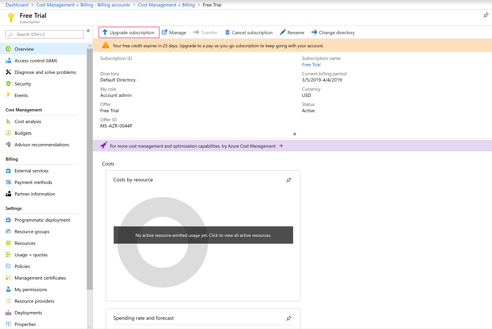

# Upgrade your Azure free account or Azure for Students Starter account

You can upgrade your [Azure free account](https://azure.microsoft.com/free/) or [Azure for Students Starter account](https://azure.microsoft.com/offers/ms-azr-0144p/) to [pay-as-you-go rates](https://azure.microsoft.com/offers/ms-azr-0003p/) in the Azure portal.

If you've signed up for an [Azure for Students Starter account](https://azure.microsoft.com/offers/ms-azr-0144p/) and are eligible for an [Azure free account](https://azure.microsoft.com/free/), you can upgrade to a free account. You'll get $200 of Azure credits and 12 months of free services on upgrade.

## Upgrade your Azure free account

When you upgrade your Azure free account, you keep your remaining credit for the full 30 days from when you signed up. For example: If you signed up on 1 November and upgrade on 5 November, any unused credits will be available until 30 November. You also have access to free services for 12 months after the upgrade.

1. Sign in to the [Azure portal](https://portal.azure.com)
1. Search for **Subscriptions.**

    

1. Select the subscription that was created when you signed up for Azure free account.
1. In the subscription overview, click **Upgrade subscription** button in the command bar. If you don't see the upgrade subscription button, click on the upgrade banner at the top of the page.

    

1. If you don't have a payment method for your account, you'll be prompted to add one.

1. You might need to enter a phone number to verify your identity.

1. Type a name for your subscription.

     

1. Choose a support plan for your subscription. To learn more about support plans, see [Azure support plans](https://azure.microsoft.com/us/support/plans/).

1. Click **Upgrade**.

## Upgrade your Azure for Students Starter account

### Upgrade to an Azure free account

If you're eligible, use the steps below to upgrade to an Azure free account.

1. Sign in to the [Azure portal](https://portal.azure.com)
1. Search for **Subscriptions.**

    

1. Select the subscription that got created when you signed up for your Azure for Students Starter account.
1. In the subscription overview, click **Upgrade subscription** in the command bar.

    

### Upgrade to pay-as-you-go rates

1. If you're upgrading to pay-as-you-go rates and don't already have a payment method for your subscription, you'll be prompted to add one.
1. You might need to enter a phone number to verify your identity.
1. Type a name for your subscription.
1. Choose a support plan for your subscription. To learn more about support plans, see [Azure support plans](https://azure.microsoft.com/us/support/plans/).
1. Click **Upgrade**.

## Next steps

Now that you've upgraded your account, see [Prevent unexpected charges with Azure billing and cost management.](getting-started.md)
