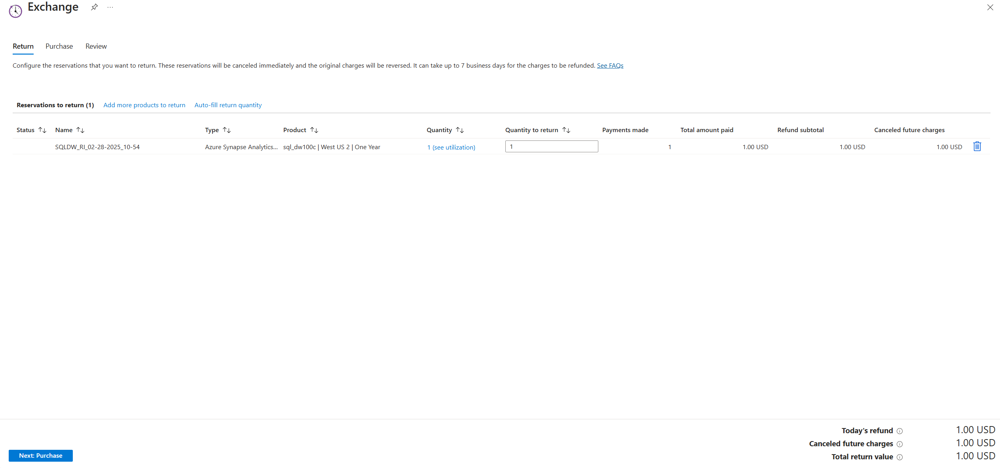
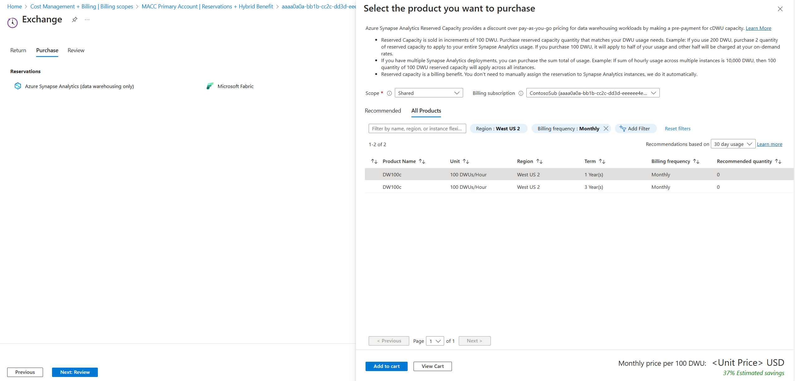
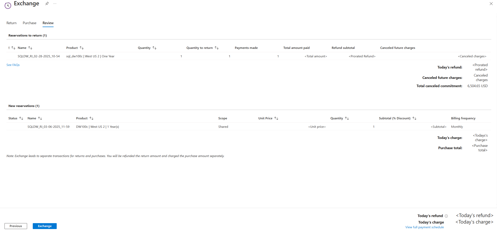

# Self-service exchanges and refunds for Azure Reservations

Azure Reservations provide flexibility to help meet your evolving needs. Reservation products are interchangeable with each other if they're the same type of reservation. For example, you can exchange multiple compute reservations including Azure Dedicated Host, Azure VMware Solution, and Azure Virtual Machines with each other all at once. You can also exchange multiple SQL database reservation types including SQL Managed Instances and Elastic Pool with each other.

However, you can't exchange dissimilar reservations. For example, you can't exchange an Azure Cosmos DB reservation for SQL Database.

You can also exchange a reservation to purchase another reservation of a similar type in a different region. For example, you can exchange a reservation that's in West US 2 region for one that's in West Europe region.

> [!NOTE]
> Through a grace period, you will have the ability to exchange Azure compute reservations (Azure Reserved Virtual Machine Instances, Azure Dedicated Host reservations, and Azure App Services reservations) **until at least July 1, 2024**. In October 2022 it was announced that the ability to exchange Azure compute reservations would be deprecated on January 1, 2024. This policy’s start date remains January 1, 2024 but with this grace period **you now have until at least July 1, 2024 to exchange your Azure compute reservations**. Compute reservations purchased prior to the end of the grace period will reserve the right to exchange one more time after the grace period ends.​
>
> This grace period is designed to provide more time for you to determine your resource needs and plan accordingly. For more information about the exchange policy change, see [Changes to the Azure reservation exchange policy](reservation-exchange-policy-changes.md).​
>
> [Azure savings plan for compute](https://azure.microsoft.com/pricing/offers/savings-plan-compute/) was launched in October 2022 to provide you with more flexibility and accommodate changes such as virtual machine series and regions. With savings plan providing flexibility automatically, we adjusted our reservations exchange policy. You can continue to use [instance size flexibility for VM sizes](../../virtual-machines/reserved-vm-instance-size-flexibility.md), but after the grace period we'll no longer support exchanging instance series or regions for Azure Reserved Virtual Machine Instances, Azure Dedicated Host reservations, and Azure App Services reservations.
>
> You can [trade in](../savings-plan/reservation-trade-in.md) your Azure compute reservations for a savings plan or you can continue to use and purchase reservations for those predictable, stable workloads where the specific configuration need is known. For more information, see [Azure savings plan for compute and how it works with reservations](../savings-plan/decide-between-savings-plan-reservation.md).  

When you exchange a reservation, you can change your term from one-year to three-year. Or, you can change the term from three-year to one-year.

You can also refund reservations, but the sum total of all canceled reservation commitment in your billing scope (such as EA, Microsoft Customer Agreement, and Microsoft Partner Agreement) can't exceed USD 50,000 in a 12 month rolling window.

The following reservations aren't eligible for refunds:

- Azure Databricks reserved capacity
- Synapse Analytics Pre-purchase plan
- Azure VMware solution by CloudSimple
- Azure Red Hat Open Shift
- Red Hat plans
- SUSE Linux plans

> [!NOTE]
> - **You must have owner or Reservation administrator access on the Reservation Order to exchange or refund an existing reservation**. You can [Add or change users who can manage a reservation](./manage-reserved-vm-instance.md#who-can-manage-a-reservation-by-default).
> - Microsoft is not currently charging early termination fees for reservation refunds. We might charge the fees for refunds made in the future. We currently don't have a date for enabling the fee.

## How to exchange or refund an existing reservation

You can exchange your reservation from the [Azure portal](https://portal.azure.com/#blade/Microsoft_Azure_Reservations/ReservationsBrowseBlade).

1. Select the reservations that you want to refund and select **Exchange**.  
    
1. Select the VM product that you want to purchase and type a quantity. Make sure that the new purchase total is more than the return total. [Determine the right size before you purchase](../../virtual-machines/prepay-reserved-vm-instances.md#determine-the-right-vm-size-before-you-buy).  
    
1. Review and complete the transaction.  
    

To refund a reservation, go into the Reservation that you're looking to cancel and select **Return**.

## Exchange multiple reservations

You can return similar types of reservations in one action.

When you exchange reservations, the new purchase currency amount must be greater than the refund amount. You can exchange any number of reservations for other allowed reservations if the currency amount is greater or equal to returned (exchanged) reservations. If your new purchase amount is less than the refund amount, an error message appears. If you see the error, reduce the quantity you want to return or increase the amount to purchase.

1. Sign in to the Azure portal and navigate to **Reservations**.
1. In the list of reservations, select the box for each reservation that you want to exchange.
1. At the top of the page, select **Exchange**.
1. If needed, revise the quantity to return for each reservation.
1. If you select the autofill return quantity, you can choose to **Refund all** to fill the list with the full quantity that you own for each reservation. Or, select **Optimize for utilization (7-day)** to fill the list with a quantity that optimizes for utilization based on the last seven days of usage. **Select Apply**.
1. At the bottom of the page, select **Next: Purchase**.
1. On the purchase tab, select the available products that you want to exchange for. You can select multiple products of different types.
1. In the Select the product you want to purchase pane, select the products you want and then select **Add to cart** and then select **Close**.
1. When done, select **Next: Review**.
1. Review your reservations to return and new reservations to purchase and then select **Confirm exchange**.

## Exchange nonpremium storage for premium storage

You can exchange a reservation purchased for a VM size that doesn't support premium storage to a corresponding VM size that does. For example, an _F1_ for an _F1s_. To make the exchange, go to Reservation Details and select **Exchange**. The exchange doesn't reset the term of the reserved instance or create a new transaction.
If you're exchanging for a different size, series, region or payment frequency, the term is reset for the new reservation. 

## How transactions are processed

Microsoft cancels the existing reservation. Then the pro-rated amount for that reservation is refunded. If there's an exchange, the new purchase is processed. Microsoft processes refunds using one of the following methods, depending on your account type and payment method.

### Enterprise Agreement customers

Money is added to the Azure Prepayment (previously called monetary commitment) for exchanges and refunds if the original purchase was made using one. If the Azure Prepayment term using the reservation was purchased is no longer active, then credit is added to your current enterprise agreement Azure Prepayment term. The credit is valid for 90 days from the date of refund. Unused credit expires at the end of 90 days.

If the original reservation purchase was made from an overage, the refund is returned to you as a partial credit note. The refund doesn’t affect the original or later invoices.

### Microsoft Customer Agreement customers

For customers that pay by wire transfer, the refunded amount is automatically applied to the next month’s invoice. The return or refund doesn't generate a new invoice.

For customers that pay by credit card, the refunded amount is returned to the credit card that was used for the original purchase. If you've changed your card, [contact support](https://portal.azure.com/#blade/Microsoft_Azure_Support/HelpAndSupportBlade/newsupportrequest).

### Pay-as-you-go invoice payments and CSP program

The original reservation purchase invoice is canceled and then a new invoice is created for the refund. For exchanges, the new invoice shows the refund and the new purchase. The refund amount is adjusted against the purchase. If you only refunded a reservation, then the prorated amount stays with Microsoft and it's adjusted against a future reservation purchase. If you bought a reservation at pay-as-you-go rates and later move to a CSP, the reservation can be returned and repurchased without a penalty.

Although a CSP customer can’t exchange, cancel, renew, or refund a reservation themself, they can ask their partner to do it on their behalf.

### Pay-as-you-go credit card customers

The original invoice is canceled, and a new invoice is created. The money is refunded to the credit card that was used for the original purchase. If you've changed your card, [contact support](https://portal.azure.com/#blade/Microsoft_Azure_Support/HelpAndSupportBlade/newsupportrequest).

## Cancel, exchange, and refund policies

Azure has the following policies for cancellations, exchanges, and refunds.

**Exchange policies**

- You can return multiple existing reservations to purchase one new reservation of the same type. You can't exchange reservations of one type for another. For example, you can't return a VM reservation to purchase a SQL reservation. You can change a reservation property such as family, series, version, SKU, region, quantity, and term with an exchange.
- Only reservation owners can process an exchange. [Learn how to Add or change users who can manage a reservation](manage-reserved-vm-instance.md#who-can-manage-a-reservation-by-default).
- An exchange is processed as a refund and a repurchase – different transactions are created for the cancellation and the new reservation purchase. The prorated reservation amount is refunded for the reservations that's traded-in. You're charged fully for the new purchase. The prorated reservation amount is the daily prorated residual value of the reservation being returned.
- You can exchange or refund reservations even if the enterprise agreement used to purchase the reservation is expired and was renewed as a new agreement.
- The new reservation's lifetime commitment should equal or be greater than the returned reservation's remaining commitment. Example: for a three-year reservation that's $100 per month and exchanged after the 18th payment, the new reservation's lifetime commitment should be $1,800 or more (paid monthly or upfront).
- The new reservation purchased as part of exchange has a new term starting from the time of exchange.
- There's no penalty or annual limits for exchanges.
- Exchanges will be unavailable for all compute reservations - Azure Reserved Virtual Machine Instances, Azure Dedicated Host reservations, and Azure App Services reservations - purchased on or after **January 1, 2024**. Compute reservations purchased **prior to January 1, 2024** will reserve the right to **exchange one more time** after the policy change goes into effect. For more information about the exchange policy change, see [Changes to the Azure reservation exchange policy](reservation-exchange-policy-changes.md).

**Refund policies**

- We're currently not charging an early termination fee, but in the future there might be a 12% early termination fee for cancellations.
- The total canceled commitment can't exceed 50,000 USD in a 12-month rolling window for a billing profile or single enrollment. For example, assume you have a three-year reservation (36 months). It costs 100 USD per month. It's refunded in the 12th month. The canceled commitment is 2,400 USD (for the remaining 24 months). After the refund, your new available limit for refund is 47,600 USD (50,000-2,400). In 365 days from the refund, the 47,600 USD limit increases by 2,400 USD. Your new pool is 50,000 USD. Any other reservation cancellation for the billing profile or EA enrollment depletes the same pool, and the same replenishment logic applies.
- Azure doesn't process any refund that exceeds the 50,000 USD limit in a 12-month window for a billing profile or EA enrollment.
    - Refunds that result from an exchange don't count against the refund limit.
- Refunds are calculated based on the lowest price of either your purchase price or the current price of the reservation.
- Only reservation order owners can process a refund. [Learn how to Add or change users who can manage a reservation](manage-reserved-vm-instance.md#who-can-manage-a-reservation-by-default).
- For CSP program, the 50,000 USD limit is per customer.

Let's look at an example with the previous points in mind. If you bought a $300,000 reservation, you can exchange it at any time for another reservation that equals or costs more (of the remaining reservation balance, not the original purchase price). For this example:
- There's no penalty or annual limits for exchanges. 
- The refund that results from the exchange doesn't count against the refund limit. 

## Need help? Contact us.

If you have questions or need help, [create a support request](https://portal.azure.com/#blade/Microsoft_Azure_Support/HelpAndSupportBlade/newsupportrequest).

## Next steps

- To learn how to manage a reservation, see [Manage Azure Reservations](manage-reserved-vm-instance.md).
- Learn about [Azure savings plan for compute](../savings-plan/index.yml)
- To learn more about Azure Reservations, see the following articles:
    - [What are Azure Reservations?](save-compute-costs-reservations.md)
    - [Manage Reservations in Azure](manage-reserved-vm-instance.md)
    - [Understand how the reservation discount is applied](../manage/understand-vm-reservation-charges.md)
    - [Understand reservation usage for your Pay-As-You-Go subscription](understand-reserved-instance-usage.md)
    - [Understand reservation usage for your Enterprise enrollment](understand-reserved-instance-usage-ea.md)
    - [Windows software costs not included with reservations](reserved-instance-windows-software-costs.md)
    - [Azure Reservations in the CSP program](/partner-center/azure-reservations)
