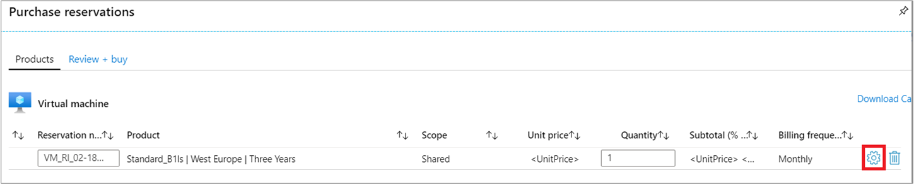
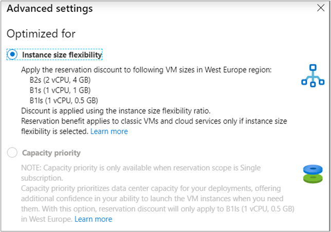
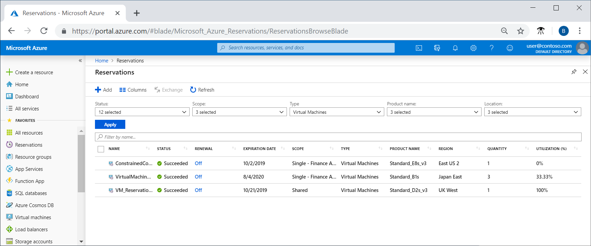
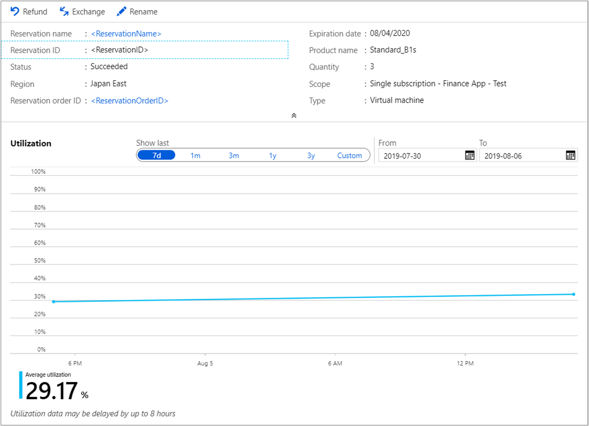

# Manage Reservations for Azure resources

After you buy an Azure reservation, you may need to apply the reservation to a different subscription, change who can manage the reservation, or change the scope of the reservation. You can also split a reservation into two reservations to apply some of the instances you bought to another subscription.

If you bought Azure Reserved Virtual Machine Instances, you can change the optimize setting for the reservation. The reservation discount can apply to VMs in the same series or you can reserve data center capacity for a specific VM size. You should try to optimize reservations so that they're fully used.

*Permission needed to manage a reservation is separate from subscription permission.*

[!INCLUDE [updated-for-az](../../../includes/updated-for-az.md)]

## Reservation Order and Reservation

When you purchase a reservation, two objects are created: **Reservation Order** and **Reservation**.

At the time of purchase, a Reservation Order has one Reservation under it. Actions such as split, merge, partial refund, or exchange create new reservations under the **Reservation Order**.

To view a Reservation Order, go to **Reservations** > select the reservation, and then select the **Reservation order ID**.


A reservation inherits permissions from its reservation order. To exchange or refund a reservation, the user should be added to the reservation order.

## Change the reservation scope

 Your reservation discount applies to virtual machines, SQL databases, Azure Cosmos DB, or other resources that match your reservation and run in the reservation scope. The billing context is dependent on the subscription used to buy the reservation.

To update the scope of a reservation:

1. Sign in to the [Azure portal](https://portal.azure.com).
2. Select **All services** > **Reservations**.
3. Select the reservation.
4. Select **Settings** > **Configuration**.
5. Change the scope.

If you change from shared to single scope, you can only select subscriptions where you're the owner. Only subscriptions within the same billing context as the reservation can be selected.

The scope only applies to individual subscriptions with pay-as-you-go rates (offers MS-AZR-0003P or MS-AZR-0023P), Enterprise offer MS-AZR-0017P or MS-AZR-0148P, or CSP subscription types.

## Who can manage a reservation by default

By default, the following users can view and manage reservations:

- The person who bought the reservation and the account owner for the billing subscription get Azure RBAC access to the reservation order.
-  Enterprise Agreement and Microsoft Customer Agreement billing contributors can manage all reservations from Cost Management + Billing > Reservation Transactions > select the blue banner.

To allow other people to manage reservations, you have two options:

- Delegate access management for an individual reservation order:
    1. Sign in to the [Azure portal](https://portal.azure.com).
    1. Select **All Services** > **Reservation** to list reservations that you have access to.
    1. Select the reservation that you want to delegate access to other users.
    1. From Reservation details, select the reservation order.
    1. Select **Access control (IAM)**.
    1. Select **Add role assignment** > **Role** > **Owner**. If you want to give limited access, select a different role.
    1. Type the email address of the user you want to add as owner.
    1. Select the user, and then select **Save**.

- Add a user as billing administrator to an Enterprise Agreement or a Microsoft Customer Agreement:
    - For an Enterprise Agreement, add users with the _Enterprise Administrator_ role to view and manage all reservation orders that apply to the Enterprise Agreement. Users with the _Enterprise Administrator (read only)_ role can only view the reservation. Department admins and account owners can't view reservations _unless_ they're explicitly added to them using Access control (IAM). For more information, see [Managing Azure Enterprise roles](../manage/understand-ea-roles.md).

        _Enterprise Administrators can take ownership of a reservation order and they can add other users to a reservation using Access control (IAM)._
    - For a Microsoft Customer Agreement, users with the billing profile owner role or the billing profile contributor role can manage all reservation purchases made using the billing profile. Billing profile readers and invoice managers can view all reservations that are paid for with the billing profile. However, they can't make changes to reservations.
    For more information, see [Billing profile roles and tasks](../manage/understand-mca-roles.md#billing-profile-roles-and-tasks).

### How Billing Administrators view or manage reservations

1. Go to **Cost Management + Billing** and then on the left side of the page, select **Reservation Transactions**.
2. If you have the required billing permissions, you can view and manage reservations. If you don't see any reservations, make sure that you're signed in using the Azure AD tenant where the reservations were created.

## Split a single reservation into two reservations

 After you buy more than one resource instance within a reservation, you may want to assign instances within that reservation to different subscriptions. By default, all instances have one scope - either single subscription, resource group or shared. Lets say, you bought a reservation for 10 VM instances and specified the scope to be subscription A. You now want to change the scope for seven VM instances to subscription A and the remaining three to subscription B. Splitting a reservation allows you todo that. After you split a reservation, the original ReservationID is canceled and two new reservations are created. Split doesn't impact the reservation order - there's no new commercial transaction with split and the new reservations have the same end date as the one that was split.

 You can split a reservation into two reservations though PowerShell, CLI, or through the API.

### Split a reservation by using PowerShell

1. Get the reservation order ID by running the following command:

    ```powershell
    # Get the reservation orders you have access to
    Get-AzReservationOrder
    ```

2. Get the details of a reservation:

    ```powershell
    Get-AzReservation -ReservationOrderId a08160d4-ce6b-4295-bf52-b90a5d4c96a0 -ReservationId b8be062a-fb0a-46c1-808a-5a844714965a
    ```

3. Split the reservation into two and distribute the instances:

    ```powershell
    # Split the reservation. The sum of the reservations, the quantity, must equal the total number of instances in the reservation that you're splitting.
    Split-AzReservation -ReservationOrderId a08160d4-ce6b-4295-bf52-b90a5d4c96a0 -ReservationId b8be062a-fb0a-46c1-808a-5a844714965a -Quantity 3,2
    ```
4. You can update the scope by running the following command:

    ```powershell
    Update-AzReservation -ReservationOrderId a08160d4-ce6b-4295-bf52-b90a5d4c96a0 -ReservationId 5257501b-d3e8-449d-a1ab-4879b1863aca -AppliedScopeType Single -AppliedScope /subscriptions/15bb3be0-76d5-491c-8078-61fe3468d414
    ```

## Cancel, exchange, or refund reservations

You can cancel, exchange, or refund reservations with certain limitations. For more information, see [Self-service exchanges and refunds for Azure Reservations](exchange-and-refund-azure-reservations.md).

## Change optimize setting for Reserved VM Instances

 When you buy a Reserved VM Instance, you choose instance size flexibility or capacity priority. Instance size flexibility applies the reservation discount to other VMs in the same [VM size group](../../virtual-machines/reserved-vm-instance-size-flexibility.md). Capacity priority designates data center capacity most important for your deployments. This option offers additional confidence in your ability to launch the VM instances when you need them.

By default, when the scope of the reservation is shared, the instance size flexibility is on. The data center capacity isn't prioritized for VM deployments.

For reservations where the scope is single, you can optimize the reservation for capacity priority instead of VM instance size flexibility.

To update the optimize setting for the reservation:

1. Sign in to the [Azure portal](https://portal.azure.com).
2. Select **All Services** > **Reservations**.
3. Select the reservation.
4. Select **Settings** > **Configuration**.
  
5. Change the **Optimize for** setting.
  

## Optimize reservation use

Azure reservation savings only result from sustained resource use. When you make a reservation purchase, you pay for what is essentially 100% possible resource use over a one- or three-year term. Try to maximize your reservation to get as much use and savings possible. The following sections explain how to monitor a reservation and optimize its use.

### View reservation use in the Azure portal

One way of viewing reservation usage is in the Azure portal.

1. Sign in to the [Azure portal](https://portal.azure.com/).
2. Select  **All services** > [**Reservations**](https://portal.azure.com/#blade/Microsoft_Azure_Reservations/ReservationsBrowseBlade) and note the **Utilization (%)** for a reservation.  
  
3. Select a reservation.
4. Review the reservation use trend over time.
  

### View reservation use with API

If you're an Enterprise Agreement (EA) customer, you can programmatically view how the reservations in your organization are being used. You get unused reservation through usage data. When you review reservation charges, keep in mind that data is divided between actual cost and amortized costs. Actual cost provides data to reconcile you monthly bill. It also has reservation purchase cost and reservation application details. Amortized cost is like actual cost except that the effective price for reservation usage is prorated. Unused reservation hours are shown in amortized cost data. For more information about usage data for EA customers, see [Get Enterprise Agreement reservation costs and usage](understand-reserved-instance-usage-ea.md).

For other subscription types, use the API [Reservations Summaries - List By Reservation Order And Reservation](/rest/api/consumption/reservationssummaries/listbyreservationorderandreservation).

### Optimize your reservation

If you find that your organization's reservations are being underused:

- Make sure the virtual machines that your organization creates match the VM size that's for the reservation.
- Make sure instance size flexibility is on. For more information, see [Manage reservations - Change optimize setting for Reserved VM Instances](#change-optimize-setting-for-reserved-vm-instances).
- Change the scope of the reservation to _shared_ so that it applies more broadly. For more information, see [Change the scope for a reservation](#change-the-reservation-scope).
- Consider exchanging the unused quantity. For more information, see [Cancellations and exchanges](#cancel-exchange-or-refund-reservations).


## Need help? Contact us.

If you have questions or need help,  [create a support request](https://go.microsoft.com/fwlink/?linkid=2083458).

## Next steps

To learn more about Azure Reservations, see the following articles:
 - [View reservation utilization](reservation-utilization.md)
 - [Exchange and refund](exchange-and-refund-azure-reservations.md)
 - [Renew reservations](reservation-renew.md)
 - [Transfers between tenants](troubleshoot-reservation-transfers-between-tenants.md)
 - [Find a reservation purchaser from Azure logs](find-reservation-purchaser-from-logs.md)
 - [Renew a reservation](reservation-renew.md)
