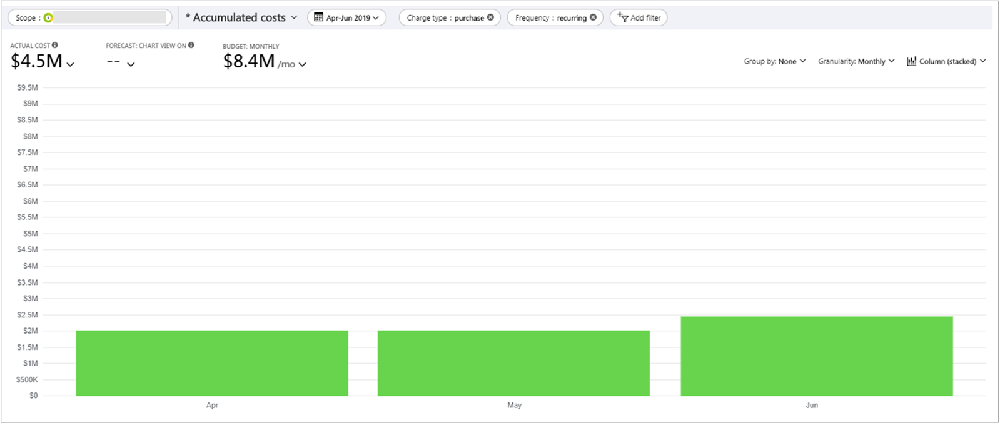

# Buy a reservation

Azure Reservations help you save money by committing to one-year or three-years plans for many Azure resources. Before you enter a commitment to buy a reservation, be sure to review the following sections to prepare for your purchase.

## Who can buy a reservation

To buy a reservation, you must have owner role or reservation purchaser role on an Azure subscription that's of type Enterprise (MS-AZR-0017P or MS-AZR-0148P) or Pay-As-You-Go (MS-AZR-0003P or MS-AZR-0023P) or Microsoft Customer Agreement. 

Cloud solution providers can use the Azure portal or [Partner Center](/partner-center/azure-reservations) to purchase Azure Reservations. CSP partners can buy reservations for them in Partner Center when authorized by their customers. For more information, see [Buy Microsoft Azure reservations on behalf of your customers](/partner-center/azure-reservations-buying). Or, once the partner has given permission to the end customer and they have the reservation purchaser role, they can purchase reservations in the Azure portal.

You can't buy a reservation if you have a custom role that mimics owner role or reservation purchaser role on an Azure subscription. You must use the built-in Owner or built-in Reservation Purchaser role.

Enterprise Agreement (EA) customers can limit purchases to EA admins by disabling the **Add Reserved Instances** option in the EA Portal. Direct EA customers can now disable Reserved Instance setting in [Azure portal](https://portal.azure.com/#blade/Microsoft_Azure_GTM/ModernBillingMenuBlade/BillingAccounts). Navigate to Policies menu to change settings.

EA admins must have owner or reservation purchaser access on at least one EA subscription to purchase a reservation. The option is useful for enterprises that want a centralized team to purchase reservations.

A reservation discount only applies to resources associated with subscriptions purchased through Enterprise, Cloud Solution Provider (CSP), Microsoft Customer Agreement and individual plans with pay-as-you-go rates.

## Scope reservations

You can scope a reservation to a subscription or resource groups. Setting the scope for a reservation selects where the reservation savings apply. When you scope the reservation to a resource group, reservation discounts apply only to the resource group—not the entire subscription.

### Reservation scoping options

You have four options to scope a reservation, depending on your needs:

- **Single resource group scope** - Applies the reservation discount to the matching resources in the selected resource group only.
- **Single subscription scope** - Applies the reservation discount to the matching resources in the selected subscription.
- **Shared scope** - Applies the reservation discount to matching resources in eligible subscriptions that are in the billing context. If a subscription is moved to different billing context, the benefit no longer applies to the subscription. It continues to apply to other subscriptions in the billing context.
    - For Enterprise Agreement customers, the billing context is the enrollment. The reservation shared scope would include multiple Active Directory tenants in an enrollment.
    - For Microsoft Customer Agreement customers, the billing scope is the billing profile.
    - For individual subscriptions with pay-as-you-go rates, the billing scope is all eligible subscriptions created by the account administrator.
- **Management group** - Applies the reservation discount to the matching resource in the list of subscriptions that are a part of both the management group and billing scope. The management group scope applies to all subscriptions throughout the entire management group hierarchy. To buy a reservation for a management group, you must have at least read permission on the management group and be a reservation owner or reservation purchaser on the billing subscription.

While Azure applies reservation discounts on your usage, it processes the reservation in the following order:

1. Reservations with a single resource group scope
2. Reservations with a single subscription scope
3. Reservations scoped to a management group
4. Reservations with a shared scope (multiple subscriptions), described previously

You can always update the scope after you buy a reservation. To do so, go to the reservation, select **Configuration**, and rescope the reservation. Rescoping a reservation isn't a commercial transaction. Your reservation term isn't changed. For more information about updating the scope, see [Update the scope after you purchase a reservation](manage-reserved-vm-instance.md#change-the-reservation-scope).

:::image type="content" source="./media/prepare-buy-reservation/rescope-reservation-management-group.png" alt-text="Example showing a reservation scope change" lightbox="./media/prepare-buy-reservation/rescope-reservation-management-group.png" :::

## Discounted subscription and offer types

Reservation discounts apply to the following eligible subscriptions and offer types.

- Enterprise agreement (offer numbers: MS-AZR-0017P or MS-AZR-0148P)
- Microsoft Customer Agreement subscriptions.
- Individual plans with pay-as-you-go rates (offer numbers: MS-AZR-0003P or MS-AZR-0023P)
- CSP subscriptions

Resources that run in a subscription with other offer types don't receive the reservation discount.

## Purchase reservations

You can purchase reservations from Azure portal, APIs, PowerShell, CLI. Read the following articles that apply to you when you're ready to make a reservation purchase:

- [App Service](prepay-app-service.md)
- [App Service - JBoss EA Integrated Support](prepay-jboss-eap-integrated-support-app-service.md)
- [Azure Backup](../../backup/backup-azure-reserved-pricing-optimize-cost.md)
- [Azure Cache for Redis](../../azure-cache-for-redis/cache-reserved-pricing.md)
- [Azure Data Factory](../../data-factory/data-flow-understand-reservation-charges.md?toc=/azure/cost-management-billing/reservations/toc.json)
- [Azure Database for MariaDB](../../mariadb/concept-reserved-pricing.md)
- [Azure Database for MySQL](../../mysql/concept-reserved-pricing.md)
- [Azure Database for PostgreSQL](../../postgresql/concept-reserved-pricing.md)
- [Azure Blob storage](../../storage/blobs/storage-blob-reserved-capacity.md?toc=/azure/cost-management-billing/reservations/toc.json)
- [Azure Files](../../storage/files/files-reserve-capacity.md?toc=/azure/cost-management-billing/reservations/toc.json)
- [Azure VMware Solution](../../azure-vmware/reserved-instance.md?toc=/azure/cost-management-billing/reservations/toc.json)
- [Azure Cosmos DB](../../cosmos-db/cosmos-db-reserved-capacity.md?toc=/azure/cost-management-billing/reservations/toc.json)
- [Azure SQL Edge](prepay-sql-edge.md)
- [Databricks](prepay-databricks-reserved-capacity.md)
- [Data Explorer](/azure/data-explorer/pricing-reserved-capacity?toc=/azure/cost-management-billing/reservations/toc.json)
- [Dedicated Host](../../virtual-machines/prepay-dedicated-hosts-reserved-instances.md)
- [Disk Storage](../../virtual-machines/disks-reserved-capacity.md)
- [SAP HANA Large Instances](prepay-hana-large-instances-reserved-capacity.md)
- [Software plans](../../virtual-machines/linux/prepay-suse-software-charges.md?toc=/azure/cost-management-billing/reservations/toc.json)
- [SQL Database](/azure/azure-sql/database/reserved-capacity-overview?toc=/azure/cost-management-billing/reservations/toc.json)
- [Synapse Analytics - data warehouse](prepay-sql-data-warehouse-charges.md)
- [Synapse Analytics - Prepurchase](synapse-analytics-pre-purchase-plan.md)
- [Virtual machines](../../virtual-machines/prepay-reserved-vm-instances.md?toc=/azure/cost-management-billing/reservations/toc.json)
- [Virtual machine software](buy-vm-software-reservation.md)

## Buy reservations with monthly payments

You can pay for reservations with monthly payments. Unlike an up-front purchase where you pay the full amount, the monthly payment option divides the total cost of the reservation evenly over each month of the term. The total cost of up-front and monthly reservations is the same and you don't pay any extra fees when you choose to pay monthly.

If reservation is purchased using Microsoft customer agreement (MCA), your monthly payment amount may vary, depending on the current month's market exchange rate for your local currency.

Monthly payments aren't available for: Databricks, Synapse Analytics - Prepurchase, SUSE Linux reservations, Red Hat Plans and Azure Red Hat OpenShift Licenses.

### View payments made

You can view payments that were made using APIs, usage data, and in cost analysis. For reservations paid for monthly, the frequency value is shown as **recurring** in usage data and Reservation Charges API. For reservations paid up front, the value is shown as **onetime**.

Cost analysis shows monthly purchases in the default view. Apply the **purchase** filter to **Charge type** and **recurring** for **Frequency** to see all purchases. To view only reservations, apply a filter for **Reservation**.

### Exchange and refunds

Like other reservations, you can refund or exchange reservations purchased with monthly billing. 

When you exchange a reservation that's paid for monthly, the total lifetime cost of the new purchase should be greater than the leftover payments that are canceled for the returned reservation. There are no other limits or fees for exchanges. You can exchange a reservation that's paid for up front to purchase a new reservation that's billed monthly. However, the lifetime value of the new reservation should be greater than the prorated value of the reservation being returned.

If you cancel a reservation that's paid for monthly, canceled future payments accrue towards the $50,000 USD refund limit.

For more information about exchange and refunds, see [Self-service exchanges and refunds for Azure Reservations](exchange-and-refund-azure-reservations.md).

## Reservation notifications

Depending on how you pay for your Azure subscription, email reservation notifications are sent to the following users in your organization. Notifications are sent for various events including: 

- Purchase
- Upcoming reservation expiration
- Expiry
- Renewal
- Cancellation
- Scope change

Notifications are sent to the following users:

- Customers with EA subscriptions
    - Notifications are sent to the EA notification contacts, EA admin, reservation owners, and the reservation administrator.
- Customers with Microsoft Customer Agreement (Azure Plan)
    - Notifications are sent to the reservation owners and the reservation administrator.
- Cloud Solution Provider and new commerce partners
    - Partner Center Action Center emails are sent to partners. For more information about how partners can update their transactional notifications, see [Action Center preferences](/partner-center/action-center-overview#preferences).
- Individual subscription customers with pay-as-you-go rates
    - Emails are sent to users who are set up as account administrators, reservation owners, and the reservation administrator.

## Next steps

- [Learn more about Reservations permissions](view-reservations.md)
- [Manage Reservations for Azure resources](manage-reserved-vm-instance.md)
- [Automate using REST APIs](/rest/api/reserved-vm-instances/reservationorder)
- [Automate using Azure PowerShell](/powershell/module/az.reservations)
- [Automate using CLI](/cli/azure/reservations)
