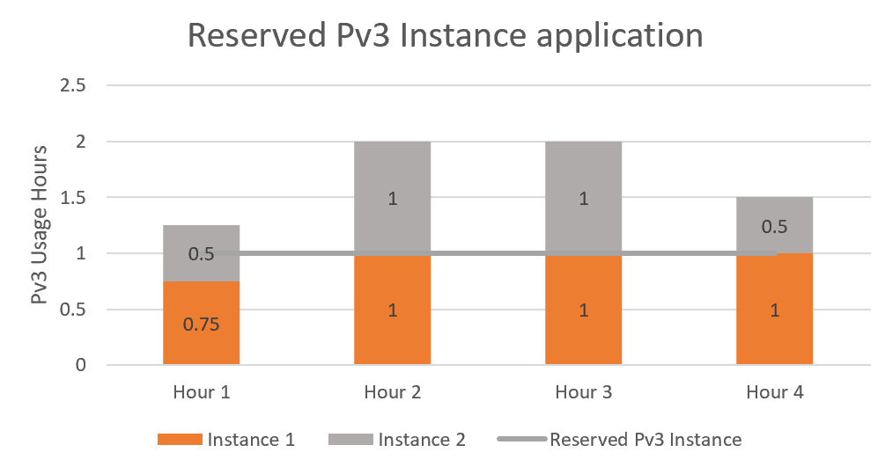

# How reservation discounts apply to Azure App Service

This article helps you understand how discounts apply to Azure App Service Premium v3 instances and Isolated Stamps.

>[!NOTE]
> - App Service Environment v3 uses isolated v2 instances – there are no stamp fees, and you buy a reservation for the instances themselves.
> - App Service Environment v2 uses isolated instances – there is a stamp fee, and you can only buy reservations for the stamp fee, not the instances.

## How reservation discounts apply to Premium v3 instances

After you buy an Azure App Service Premium v3 Reserved Instance, the reservation discount is automatically applied to App Service instances that match the attributes and quantity of the reservation. A reservation covers the cost of your Premium v3 instances. 

### How the discount is applied to Azure App Service 

A reservation discount is *use-it-or-lose-it*. So, if you don't have matching resources for any hour, then you lose a reservation quantity for that hour. You can't carry forward unused reserved hours.

When you shut down a resource, the reservation discount automatically applies to another matching resource in the specified scope. If no matching resources are found in the specified scope, then the reserved hours are lost.

Any management group and shared scope reservations include any development and testing workloads that might be running. Although dev/test subscriptions may have lower rates under [Azure Dev/Test pricing](https://azure.microsoft.com/pricing/dev-test/#overview) than other subscription types, reservations that you bought apply reservation pricing to your workloads.

### Reservation discount for Premium v3 Instances

The Azure reservation discount is applied to running Premium v3 instances on an hourly basis. The reservations that you have purchased are matched to the usage emitted by the running Premium v3 instances to apply the reservation discount. For Premium v3 Instances that may not run the full hour, the reservation is filled from other instances not using a reservation, including concurrently running instances. At the end of the hour, the reservation application for instances in the hour is locked. A reservation is underutilized when it doesn't run for an hour or when concurrent instances within the hour don't fill the hour of the reservation. The following graph illustrates the application of a reservation to billable VM usage. The illustration is based on one reservation purchase and two matching VM instances.

1.	Any usage that's above the reservation line gets charged at the regular pay-as-you-go rates. You're not charged for any usage below the reservations line, since it has been already paid as part of reservation purchase.
2.	In hour 1, instance 1 runs for 0.75 hours and instance 2 runs for 0.5 hours. Total usage for hour 1 is 1.25 hours. You're charged the pay-as-you-go rates for the remaining 0.25 hours.
3.	For hour 2 and hour 3, both instances ran for 1 hour each. One instance is covered by the reservation and the other is charged at pay-as-you-go rates.
4.	For hour 4, instance 1 runs for 0.5 hours and instance 2 runs for 1 hour. Instance 1 is fully covered by the reservation and 0.5 hours of instance 2 is covered. You’re charged the pay-as-you-go rate for the remaining 0.5 hours.

To understand and view the application of your Azure Reservations in billing usage reports, see [Understand reservation usage](understand-reserved-instance-usage-ea.md).

## How reservation discounts apply to Isolated v2 instances

After you buy an Azure App Service Isolated v2 Reserved Instance, the reservation discount is automatically applied to App Service instances that match the attributes and quantity of the reservation. A reservation covers the cost of your Isolated v2 instances.

### How the discount is applied to Azure App Service

A reservation discount is _use-it-or-lose-it_. So, if you don't have matching resources for any hour, then you lose a reservation quantity for that hour. You can't carry forward unused reserved hours. 

When you shut down a resource, the reservation discount automatically applies to another matching resource in the specified scope. If no matching resources are found in the specified scope, then the reserved hours are lost.

Stopped resources are billed and continue to use reservation hours. Deallocate or delete resources or scale-in other resources to use your available reservation hours with other workloads.

Any management group and shared scope reservations include development and testing workloads that might be running. Although dev/test subscriptions may have lower rates under [Azure Dev/Test pricing](https://azure.microsoft.com/pricing/dev-test/#overview) than other subscription types, reservations that you bought apply reservation pricing to your workloads.

### Reservation discount for Isolated v2 Instances

The Azure reservation discount is applied to running Isolated v2 instances on an hourly basis. The reservations that you have purchased are matched to the usage emitted by the running Isolated v2 instances to apply the reservation discount. For Isolated v2 Instances that may not run the full hour, the reservation is filled from other instances not using a reservation, including concurrently running instances. At the end of the hour, the reservation application for instances in the hour is locked. A reservation is underutilized when it doesn't run for an hour or when concurrent instances within the hour don't fill the hour of the reservation.

To understand and view the application of your Azure Reservations in billing usage reports, see [Understand reservation usage](understand-reserved-instance-usage-ea.md).

## How reservation discounts apply to Isolated Stamps

After you buy App Service Isolated Stamp Fee reserved capacity, the reservation discount is automatically applied to the Stamp Fee in a region. The reservation discount applies to the usage emitted by the Isolated Stamp Fee meter. Workers, other Front Ends, and any other resources associated with the stamp continue to get billed at the regular rate.

### Reservation discount application

The App Service Isolated Stamp Fee discount is applied to running isolated stamps on an hourly basis. If you don't have a stamp deployed for an hour, then the reserved capacity is wasted for that hour. It doesn't carry over.

After purchase, the reservation that you buy gets matched to an isolated stamp running in a specific region. If you shut down that stamp, then reservation discounts are automatically applied to any other stamps running in the region. When no stamps exist, the reservation is applied to the next stamp that's created in the region.

When stamps don't run for a full hour, the reservation automatically applies to other matching stamps in the same region during the same hour.

### Choose a stamp type - Windows or Linux

An empty Isolated Stamp emits the Windows stamp meter by default. For example, when no workers are deployed. It continues to emit the meter when Windows workers are deployed. The meter changes to the Linux stamp meter if you deploy a Linux worker. The stamp emits the Windows meter when both Linux and Windows workers are deployed.

As a result, the stamp meter can change between Windows and Linux over the life of the stamp. Meanwhile, reservations are operating system specific. You need to buy a reservation that supports the workers you plan to deploy to the stamp. Windows-only stamps and mixed stamps use the Windows reservation. Stamps with only Linux workers use the Linux reservation.

The only time you should purchase a Linux reservation is when you plan to _only_ have Linux workers in the stamp.

### Discount examples

The following examples show how the Isolated Stamp Fee reserved instance discount applies, depending on the deployments.

- **Example 1**: You purchase one instance of Isolated Reserved Stamp capacity in a region with no App Service Isolated stamps. You deploy a new stamp to the region and pay reserved rates for that stamp.
- **Example 2**: You purchase one instance of Isolated Reserved Stamp capacity in a region that already has an App Service Isolated stamp deployed. You start receiving the reserved rate for the deployed stamp.
- **Example 3**: You purchase one instance of Isolated Reserved Stamp capacity in a region with an App Service Isolated stamp already deployed. You start receiving the reserved rate on the deployed stamp. Later, you delete the stamp and deploy a new one. You receive the reserved rate for the new stamp. Discounts don't carry over for durations without deployed stamps.
- **Example 4**: You purchase one instance of Isolated Linux Reserved Stamp capacity in a region then deploy a new stamp to the region. When the stamp is initially deployed without workers, it emits the Windows stamp meter. No discount is received. When the first Linux worker is deployed the stamp, it emits the Linux Stamp meter and the reservation discount applies. If a windows worker is later deployed to the stamp, the stamp meter reverts to Windows. You no longer receive a discount for the Isolated Linux Reserved Stamp reservation.

## Next steps

- To learn how to manage a reservation, see [Manage Azure Reservations](manage-reserved-vm-instance.md).
- To learn more about prepurchasing App Service Premium v3 and Isolated Stamp reserved capacity to save money, see [Prepay for Azure App Service with reserved capacity](prepay-app-service.md).
- To learn more about Azure Reservations, see the following articles:
  - [What are Azure Reservations?](save-compute-costs-reservations.md)
  - [Manage Reservations in Azure](manage-reserved-vm-instance.md)
  - [Understand reservation usage for a subscription with pay-as-you-go rates](understand-reserved-instance-usage.md)
  - [Understand reservation usage for your Enterprise enrollment](understand-reserved-instance-usage-ea.md)
