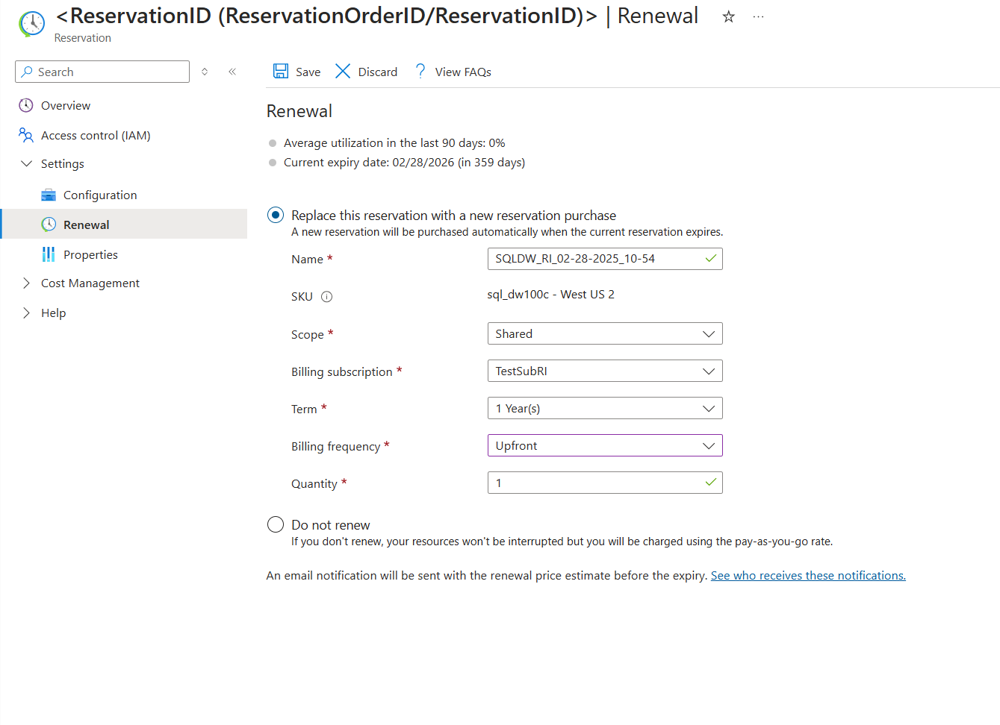

# Automatically renew reservations

You can renew reservations to automatically purchase a replacement when an existing reservation expires. Automatic renewal provides an easy way to continue getting reservation discounts. It also saves you from having to closely monitor a reservation's expiration. With automatic renewal, you prevent savings benefits loss by not having to manually renew. The renewal setting is turned off by default. Enable or disable the renewal setting anytime, up to the expiration of the existing reservation.

Renewing a reservation creates a new reservation when the existing reservation expires. It doesn't extend the term of the existing reservation.

Opt in to automatically renew at any time. The renewal price is available 30 days before the expiry of existing reservation. When you enable renewal more than 30 days before the reservation expiration, you're sent an email detailing renewal costs 30 days before expiration. The reservation price might change between the time that you lock the renewal price and the renewal time. If so, your renewal cost is the lower of the two costs. You can make changes to the reservation quantity. If you do, the renewal is updated to use the in-market price set at the time of the quantity change.

There's no obligation to renew and you can opt out of the renewal at any time before the existing reservation expires.

## Set up renewal

Go to Azure portal > **Reservations**.

1. Select the reservation.
2. Click **Renewal**.
3. Select **Automatically purchase a new reservation upon expiry**.  
  

## If you don't renew

Your services continue to run normally. You're charged pay-as-you-go rates for your usage after the reservation expires.

## Required renewal permissions

The following conditions are required to renew a reservation:

- You must be an owner of the existing reservation.
- You must be an owner of the subscription if the reservation is scoped to a single subscription or resource group.
- You must be an owner of the subscription if it has a shared scope.

## Default renewal settings

By default, the renewal inherits all properties from the expiring reservation. A reservation renewal purchase has the same SKU, region, scope, billing subscription, term, and quantity.

However, you can update the renewal reservation purchase quantity to optimize your savings.

## When the new reservation is purchased

A new reservation is purchased when the existing reservation expires. We try to prevent any delay between the two reservations. Continuity ensures that your costs are predictable, and you continue to get discounts.

## Changing parent reservation after setting renewal

If you make any of the following changes to the expiring reservation, the reservation renewal is canceled:

- Split
- Merge
- Transferring the reservation from one account to another
- Transferring the reservation from a WebDirect subscription to an enterprise agreement (EA) subscription, or any other purchase method
- Renew the enrollment

The new reservation inherits the scope and instance size flexibility setting from the expiring reservation during renewal.

## New reservation permissions

Azure copies the permissions from the expiring reservation to the new reservation. Additionally, the subscription account administrator of the reservation purchase has access to the new reservation.

## Potential renewal problems

Azure may not process the renewal if:

- Payment can't be collected
- A system error occurs during renewal
- The expiring SKU isn't active during renewal
- The EA is renewed into a different EA

You'll receive an email notification if any of the preceding conditions occur and the renewal is deactivated.

## Renewal notification

Emails are sent to different people depending on your purchase method:

- EA customers - Emails are sent to the notification contacts set on the EA portal.
- Individual subscription customers with pay-as-you-go rates - Emails are sent to users who are set up as account administrators.
- Cloud Solution Provider customers - Emails are sent to the partner notification contact.

## Next steps
- To learn more about Azure Reservations, see [What are Azure Reservations?](save-compute-costs-reservations.md)
