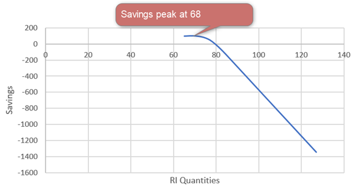

# How reservation recommendations are created

Azure reserved instance (RI) purchase recommendations are generated by the Azure Consumption [Reservation Recommendation API](/rest/api/consumption/reservationrecommendations). Recommendations from the API are also used by [Azure Advisor](../..//advisor/advisor-cost-recommendations.md#buy-reserved-virtual-machine-instances-to-save-money-over-pay-as-you-go-costs). Advisor shows recommendations in the Azure portal.

If you have VMs running in Azure, you can take advantage of discounted pricing for RIs and pre-pay for your VMs. Microsoft Consumption recommendation API evaluates your usage for 7, 30, and 60 days and recommends optimum configurations for RIs. It calculates the cost you'd pay if you didn't have RIs against the cost you'll pay with RIs to optimize savings.

Azure Advisor shows recommendations based on a 30-day period.

For simplicity, the following example shows calculations that happen for a seven-day recommendation. The same method is applied when calculating 30- or 60-day recommendations.

## Calculation method example

Assume that your hourly Windows VM usage for a specific SKU and region varies over seven days (168 hours). The minimum usage is 65 units and the maximum usage is 127 units over the seven days. In this example, hour 79 used 80 VMs and you purchased 75 RIs.

If you purchase 75 reserved instances, you pay the following costs for hour 79:

- 75 reserved instances. The cost is pre-paid when you purchase RIs.
- Reserved instances cover the hardware cost of running VMs, so you'll pay for 75 hours at the software-only price.
- Usage for hour 79 is 80, so you'll pay for five hours of the Windows plus the hardware combination meter price. The combination price is based on either your Enterprise Agreement (EA) or pay-as-you-go rate.

If you buy 75 RIs, you can calculate the total cost by adding the preceding hourly costs. You can also calculate your current cost using your rate. The difference between the two amounts is your savings for seven days in this example.

The API does calculations for each specific usage point. Then it returns the recommended quantity where savings are maximized. In the following example, the graph shows that savings peak at 68. Savings reduce afterward, so the API recommends 68.

## Other expected API behavior

- The API shows possible savings with [Azure Hybrid Benefit](https://azure.microsoft.com/pricing/hybrid-benefit/) for Windows when the benefit is used. If the benefit isn't used, then the API recommendations are based on the core Windows cost. If available to you, consider using Azure Hybrid Benefit to increase savings.
- When using a look back period of seven days, you might not get recommendations when VMs are shut down for more than a day.

## Next steps
- Learn about [how the Azure reservation discount is applied to virtual machines](../manage/understand-vm-reservation-charges.md).
