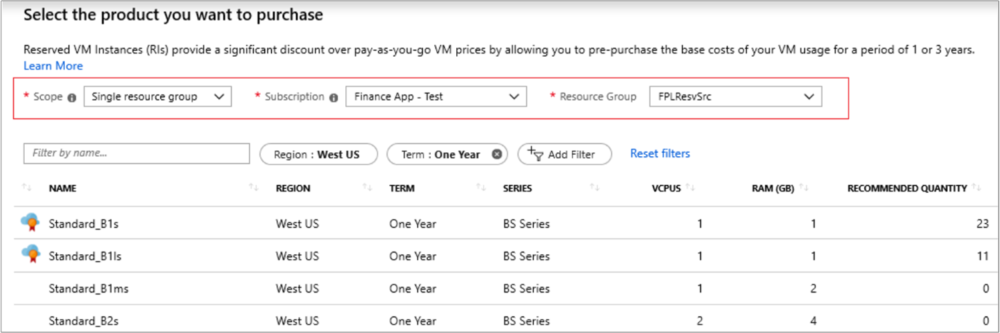

# What are Azure Reservations?

Azure Reservations help you save money by committing to one-year or three-years plans for virtual machines, Azure Blob storage or Azure Data Lake Storage Gen2, SQL Database compute capacity, Azure Cosmos DB throughput, or other Azure resources. Committing allows you to get a discount on the resources you use. Reservations can significantly reduce your resource costs up to 72% on pay-as-you-go prices. Reservations provide a billing discount and don't affect the runtime state of your resources.

You can pay for a reservation up front or monthly. The total cost of up-front and monthly reservations is the same and you don't pay any extra fees when you choose to pay monthly. Monthly payment is available for Azure reservations, not third party products.

You can buy a reservation in the [Azure portal](https://ms.portal.azure.com/?microsoft_azure_marketplace_ItemHideKey=Reservations&Microsoft_Azure_Reservations=true#blade/Microsoft_Azure_Reservations/ReservationsBrowseBlade).

## Why buy a reservation?

If you have virtual machines, Blob storage data, Azure Cosmos DB, or SQL databases that use significant capacity or throughput, or that run for long periods of time, buying a reservation gives you the most cost-effective option. For example, when you continuously run four instances of a service without a reservation, you're charged at pay-as-you-go rates. When you buy a reservation for those resources, you immediately get the reservation discount. The resources are no longer charged at the pay-as-you-go rates.

## Charges covered by reservation

Service plans:

- **Reserved Virtual Machine Instance** - A reservation only covers the virtual machine compute costs. It doesn't cover additional software, networking, or storage charges.
- **Azure Storage reserved capacity** - A reservation covers storage capacity for standard storage accounts for Blob storage or Azure Data Lake Gen2 storage. The reservation does not cover bandwidth or transaction rates.
- **Azure Cosmos DB reserved capacity** - A reservation covers throughput provisioned for your resources. It doesn't cover the storage and networking charges.
- **SQL Database reserved vCore** - Only the compute costs are included with a reservation. The license is billed separately.
- **SQL Data Warehouse** - A reservation covers cDWU usage. It doesn't cover storage or networking charges associated with the SQL Data Warehouse usage.
- **App Service stamp fee** - A reservation covers stamp usage. It doesn't apply to workers, so any other resources associated with the stamp are charged separately.
- Azure Database for MySQL
- Azure Database for PostgreSQL
- Azure Database for MariaDB
- Azure Data Explorer
- Premium SSD Managed Disks

For Windows virtual machines and SQL Database, you can cover the licensing costs with [Azure Hybrid Benefit](https://azure.microsoft.com/pricing/hybrid-benefit/).

## Who's eligible to purchase a reservation?

To buy a plan, you must have a subscription owner role in an Enterprise (MS-AZR-0017P or MS-AZR-0148P) or Pay-As-You-Go subscription (MS-AZR-0003P or MS-AZR-0023P) or Microsoft Customer Agreement subscription. Cloud solution providers can use the Azure portal or [Partner Center](/partner-center/azure-reservations) to purchase Azure Reservations.

Enterprise Agreement (EA) customers can limit purchases to EA admins by disabling the **Add Reserved Instances** option in the EA Portal. EA admins must be a subscription owner for at least one EA subscription to purchase a reservation. The option is useful for enterprises that want a centralized team to purchase reservations for different cost centers. After the purchase, centralized teams can add cost center owners to the reservations. Owners can then scope the reservation to their subscriptions. The central team doesn't need to have subscription owner access where the reservation is purchased.

A reservation discount only applies to resources associated with subscriptions purchased through Enterprise, Cloud Solution Provider (CSP), Microsoft Customer Agreement and individual plans with pay-as-you-go rates.

## Scope reservations

You can scope a reservation to a subscription or resource groups. Setting the scope for a reservation selects where the reservation savings apply. When you scope the reservation to a resource group, reservation discounts apply only to the resource group — not the entire subscription.

### Reservation scoping options

With resource group scoping you have three options to scope a reservation, depending on your needs:

- **Single resource group scope** — Applies the reservation discount to the matching resources in the selected resource group only.
- **Single subscription scope** — Applies the reservation discount to the matching resources in the selected subscription.
- **Shared scope** — Applies the reservation discount to matching resources in eligible subscriptions that are in the billing context. For Enterprise Agreement customers, the billing context is the enrollment. For Microsoft Customer Agreement customers, the billing scope is the billing profile. For individual subscriptions with pay-as-you-go rates, the billing scope is all eligible subscriptions created by the account administrator.

While applying reservation discounts on your usage, Azure processes the reservation in the following order:

1. Reservations that are scoped to a resource group
2. Single scope reservations
3. Shared scope reservations

A single resource group can get reservation discounts from multiple reservations, depending on how you scope your reservations.

### Scope a reservation to a resource group

You can scope the reservation to a resource group when you buy the reservation, or you set the scope after purchase. You must be a subscription owner to scope the reservation to a resource group.

To set the scope, go to the [Purchase reservation](https://ms.portal.azure.com/#blade/Microsoft\_Azure\_Reservations/CreateBlade/referrer/Browse\_AddCommand) page in the Azure portal. Select the reservation type that you want to buy. On the **Select the product that you want to purchase** selection form, change the Scope value to Single resource group. Then, select a resource group.

Purchase recommendations for the resource group in the virtual machine reservation are shown. Recommendations are calculated by analyzing your usage over the last 30 days. A purchase recommendation is made if the cost of running resources with reserved instances is cheaper than the cost of running resources with pay-as-you-go rates. For more information about reservation purchase recommendations, see [Get Reserved Instance purchase recommendations based on usage pattern](https://azure.microsoft.com/blog/get-usage-based-reserved-instance-recommendations).

You can always update the scope after you buy a reservation. To do so, go to the reservation, click **Configuration**, and rescope the reservation. Rescoping a reservation isn't a commercial transaction. Your reservation term isn't changed. For more information about updating the scope, see [Update the scope after you purchase a reservation](manage-reserved-vm-instance.md#change-the-reservation-scope).

### Monitor and optimize reservation usage

You can monitor your reservation usage in multiple ways – through Azure portal, through APIs, or through usage data. To see all the reservations that you have access to, go to **Reservations** in the Azure portal. The reservations grid shows the last recorded utilization percentage for the reservation. Click the reservation to see long-term utilization of the reservation.

You can also get reservation utilization using [APIs](reservation-apis.md#see-reservation-usage) and from your [usage data](understand-reserved-instance-usage-ea.md#common-cost-and-usage-tasks) if you are an enterprise agreement or Microsoft Customer Agreement customer.

If you notice that the utilization of your resource group scoped reservation is low, then you can update the reservation scope to single subscription or share it across the billing context. You can also split the reservation and apply the resulting reservations to different resource groups.

### Other considerations

If you don't have matching resources in a resource group, then the reservation will be underutilized. The reservation doesn't automatically apply to a different resource group or subscription where there's low utilization.

A reservation scope doesn't automatically update if you move the resource group from one subscription to another. The scope doesn't update if you delete the resource group. You will have to [rescope the reservation](manage-reserved-vm-instance.md#change-the-reservation-scope). Otherwise, the reservation will be underutilized.

## Discounted subscription and offer types

Reservation discounts apply to the following eligible subscriptions and offer types.

- Enterprise agreement (offer numbers: MS-AZR-0017P or MS-AZR-0148P)
- Microsoft Customer Agreement subscriptions.
- Individual plans with pay-as-you-go rates (offer numbers: MS-AZR-0003P or MS-AZR-0023P)
- CSP subscriptions

Resources that run in a subscription with other offer types don't receive the reservation discount.

## How is a reservation billed?

The reservation is charged to the payment method tied to the subscription. The reservation cost is deducted from your monetary commitment balance, if available. When your monetary commitment balance doesn't cover the cost of the reservation, you're billed the overage. If you have a subscription from an individual plan with pay-as-you-go rates, the credit card you have on your account is billed immediately for up-front purchases. Monthly payments appear on your invoice and your credit card is charged monthly. When you're billed by invoice, you see the charges on your next invoice.

## How reservation discount is applied

The reservation discount applies to the resource usage matching the attributes you select when you buy the reservation. Attributes include the scope where the matching VMs, SQL databases, Azure Cosmos DB, or other resources run. For example, if you want a reservation discount for four Standard D2 virtual machines in the West US region, then select the subscription where the VMs are running.

A reservation discount is "*use-it-or-lose-it*". If you don't have matching resources for any hour, then you lose a reservation quantity for that hour. You can't carry forward unused reserved hours.

When you shut down a resource, the reservation discount automatically applies to another matching resource in the specified scope. If no matching resources are found in the specified scope, then the reserved hours are *lost*.

For example, you might later create a resource and have a matching reservation that is underutilized. The reservation discount automatically applies to the new matching resource.

If the virtual machines are running in different subscriptions within your enrollment/account, then select the scope as shared. Shared scope allows the reservation discount to be applied across subscriptions. You can change the scope after you buy a reservation. For more information, see [Manage Azure Reservations](manage-reserved-vm-instance.md).

A reservation discount only applies to resources associated with Enterprise, Microsoft Customer Agreement, CSP, or subscriptions with pay-as-you go rates. Resources that run in a subscription with other offer types don't receive the reservation discount.

## When the reservation term expires

At the end of the reservation term, the billing discount expires, and the resources are billed at the pay-as-you go price. By default, the reservations are not set to renew automatically. You can choose to enable automatic renewal of a reservation by selecting the option in the renewal settings. With automatic renewal, a replacement reservation will be purchased upon expiry of the existing reservation. By default, the replacement reservation has the same attributes as the expiring reservation, optionally you change the billing frequency, term or quantity in the renewal settings. Any user with owner access on the reservation and the subscription used for billing can setup renewal.  

## Discount applies to different sizes

When you buy a reservation, the discount can apply to other instances with attributes that are within the same size group. This feature is known as instance size flexibility. The flexibility of the discount coverage depends on the type of reservation and the attributes you pick when you buy the reservation.

Service plans:

- Reserved VM Instances: When you buy the reservation and select **Optimized for instance size flexibility**, the discount coverage depends on the VM size you select. The reservation can apply to the virtual machines (VMs) sizes in the same size series group. For more information, see [Virtual machine size flexibility with Reserved VM Instances](../../virtual-machines/windows/reserved-vm-instance-size-flexibility.md).
- Azure Storage reserved capacity: You can purchase reserved capacity for standard Azure Storage accounts in units of 100 TiB or 1 PiB per month. Azure Storage reserved capacity is available in all regions for any access tier (hot, cool, or archive) and for any replication option (LRS, GRS, or ZRS).
- SQL Database reserved capacity: The discount coverage depends on the performance tier you pick. For more information, see [Understand how an Azure reservation discount is applied](understand-reservation-charges.md).
- Azure Cosmos DB reserved capacity: The discount coverage depends on the provisioned throughput. For more information, see [Understand how an Azure Cosmos DB reservation discount is applied](understand-cosmosdb-reservation-charges.md).

## Reservation notifications

Depending on how you pay for your Azure subscription, we email reservation  notifications to the following users in your organization. Notifications are sent for various events including:

- Purchase
- Upcoming reservation expiration
- Expiry
- Renewal
- Cancellation
- Scope change

For customers with EA subscriptions:
- A purchase notification is sent to the purchaser and the EA notification contacts.
- Other reservation lifecycle notifications are sent only to the EA notification contacts.
- Users added to a reservation using RBAC (IAM) permission don't receive any email notifications.

For customers with individual subscriptions:
- The purchaser receives a purchase notification.
- At the time of purchase, the subscription billing account owner receives a purchase notification.
- The account owner receives all other notifications.

## Need help? Contact us.

If you have questions or need help,  [create a support request](https://go.microsoft.com/fwlink/?linkid=2083458).

## Next steps

- Learn more about Azure Reservations with the following articles:
    - [Manage Azure Reservations](manage-reserved-vm-instance.md)
    - [Understand reservation usage for your subscription with pay-as-you-go rates](understand-reserved-instance-usage.md)
    - [Understand reservation usage for your Enterprise enrollment](understand-reserved-instance-usage-ea.md)
    - [Windows software costs not included with reservations](reserved-instance-windows-software-costs.md)
    - [Azure Reservations in Partner Center Cloud Solution Provider (CSP) program](/partner-center/azure-reservations)

- Learn more about reservations for service plans:
    - [Virtual Machines with Azure Reserved VM Instances](../../virtual-machines/windows/prepay-reserved-vm-instances.md)
    - [Azure Cosmos DB resources with Azure Cosmos DB reserved capacity](../../cosmos-db/cosmos-db-reserved-capacity.md)
    - [SQL Database compute resources with Azure SQL Database reserved capacity](../../sql-database/sql-database-reserved-capacity.md)
Learn more about reservations for software plans:
    - [Red Hat software plans from Azure Reservations](../../virtual-machines/linux/prepay-rhel-software-charges.md)
    - [SUSE software plans from Azure Reservations](../../virtual-machines/linux/prepay-suse-software-charges.md)
