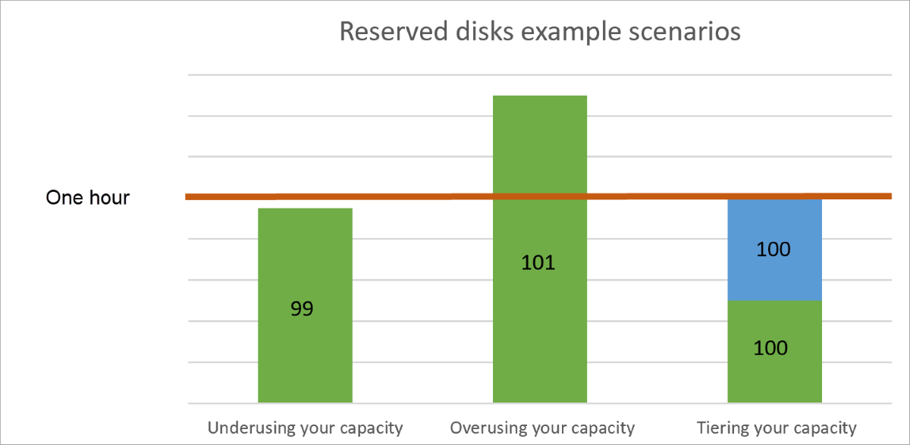

# Understand how your reservation discount is applied to Azure disk storage

After you purchase Azure disk reserved capacity, a reservation discount is automatically applied to disk resources that match the terms of your reservation. The reservation discount applies to disk SKUs only. Disk snapshots are charged at pay-as-you-go rates.

For more information about Azure disk reservation, see [Save costs with Azure disk reservation](../../virtual-machines/disks-reserved-capacity.md). For information about pricing for Azure disk reservation, see [Azure Managed Disks pricing](https://azure.microsoft.com/pricing/details/managed-disks/).

## How the reservation discount is applied

The Azure disk reservation discount is a use-it-or-lose-it discount. It's applied to managed disk resources hourly. For a given hour, if you have no managed disk resources that meet the reservation terms, you lose a reservation quantity for that hour. Unused hours don't carry forward.

When you delete a resource, the reservation discount automatically applies to another matching resource in the specified scope. If no matching resource is found, the reserved hours are lost.

Stopped resources are billed and continue to use reservation hours. Deallocate or delete resources or scale-in other resources to use your available reservation hours with other workloads. 

## Discount examples

The following examples show how the Azure disk reservation discount applies depending on your deployment.

Suppose you purchase and reserve 100 P30 disks in the US West 2 region for a one-year term. Each disk has approximately 1 TiB of storage. Assume the cost of this sample reservation is $140,100‬. You can choose to pay either the full amount up front or fixed monthly installments of $11,675‬ for the next 12 months.

The following scenarios describe what happens if you underuse, overuse, or tier your reserved capacity. For these examples, assume you've signed up for a monthly reservation-payment plan.

### Underusing your capacity

Suppose you deploy only 99 of your 100 reserved Azure premium solid-state drive (SSD) P30 disks for an hour within the reservation period. The remaining P30 disk isn't applied during that hour. It also doesn't carry over.

### Overusing your capacity

Suppose that for an hour within the reservation period, you use 101 premium SSD P30 disks. The reservation discount applies only to 100 P30 disks. The remaining P30 disk is charged at pay-as-you-go rates for that hour. For the next hour, if your usage goes down to 100 P30 disks, all usage is covered by the reservation.

### Tiering your capacity

Suppose that in a given hour within your reservation period, you want to use a total of 200 P30 premium SSDs. Also suppose you use only 100 for the first 30 minutes. During this period, your use is fully covered because you made a reservation for 100 P30 disks. If you then discontinue the use of the first 100 (so that you're using zero) and then begin to use the other 100 for the remaining 30 minutes, that usage is also covered under your reservation.

## Need help? Contact us

If you have questions or need help, [create a support request](https://go.microsoft.com/fwlink/?linkid=2083458).

## Next steps

- [Reduce costs with Azure Disks Reservation](../../virtual-machines/disks-reserved-capacity.md)
- [What are Azure Reservations?](save-compute-costs-reservations.md)
