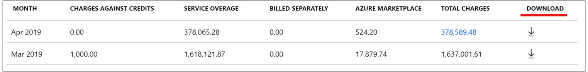
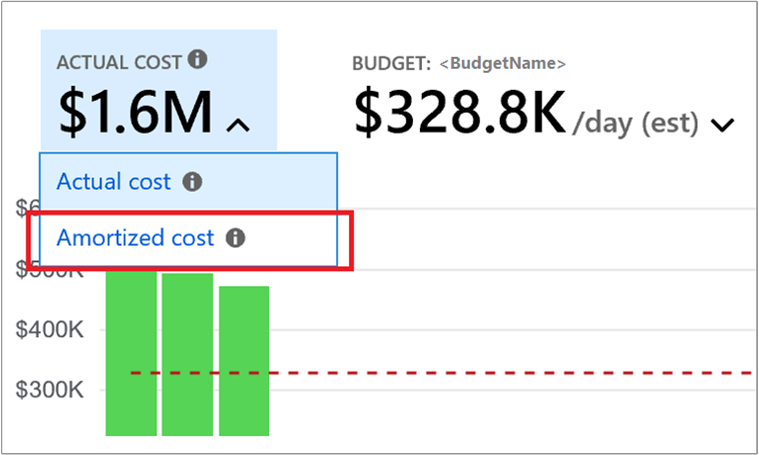

# Get Enterprise Agreement reservation costs and usage

Reservation costs and usage data are available for Enterprise Agreement customers in the Azure portal and REST APIs. This article helps you:

- Get reservation purchase data
- Know which subscription, resource group or resource used the reservation
- Chargeback for reservation utilization
- Calculate reservation savings
- Get reservation under-utilization data
- Amortize reservation costs

Marketplace charges are consolidated in usage data. You view charges for first party usage, marketplace usage, and purchases from a single data source.

## Reservation charges in Azure usage data

Data is divided into two separate data sets: _Actual Cost_ and _Amortized Cost_. How these two datasets differ:

**Actual Cost** - Provides data to reconcile with your monthly bill. This data has reservation purchase costs and reservation application details. With this data, you can know which subscription or resource group or resource received the reservation discount in a particular day. The EffectivePrice for the usage that receives the reservation discount is zero.

**Amortized Cost** - This dataset is similar to the Actual Cost dataset except that - the EffectivePrice for the usage that gets reservation discount is the prorated cost of the reservation (instead of being zero). This helps you know the monetary value of reservation consumption by a subscription, resource group or a resource, and can help you charge back for the reservation utilization internally. The dataset also has unused reservation hours. The dataset does not have reservation purchase records.

Comparison of two data sets:

| Data | Actual Cost data set | Amortized Cost data set |
| --- | --- | --- |
| Reservation purchases | Available in this view.<br><br>  To get this data filter on ChargeType = &quot;Purchase&quot;. <br><br> Refer to ReservationID or ReservationName to know which reservation the charge is for.  | Not applicable to this view. <br><br> Purchase costs aren't provided in amortized data. |
| EffectivePrice | The value is zero for usage that gets reservation discount. | The value is per-hour prorated cost of the reservation for usage that has the reservation discount. |
| Unused reservation (Provides the number of hours the reservation wasn't used in a day and the monetary value of the waste) | Not applicable in this view. | Available in this view.<br><br> To get this data, filter on ChargeType = &quot;UnusedReservation&quot;.<br><br>  Refer to ReservationID or ReservationName to know which reservation was underutilized. This is how much of the reservation was wasted in for the day.  |
| UnitPrice(Price of the resource from your price sheet) | Available | Available |

Other information available in Azure usage data has changed:

- Product and Meter information - Azure doesn't replace the originally consumed meter with the ReservationId and ReservationName, as it did previously.
- ReservationId and ReservationName - They are their own fields in the data. Previously, it used to be available only under AdditionalInfo.
- ProductOrderId - The reservation order ID, added as its own field.
- ProductOrderName - The product name of the purchased reservation.
- Term - 12 months or 36 months.
- RINormalizationRatio - Available under AdditionalInfo. This is the ratio where the reservation is applied to the usage record. If instance size flexibility is enabled on for your reservation, then it can apply to other sizes. The value shows the ratio that the reservation was applied to for the usage record.

[See field definition](https://docs.microsoft.com/rest/api/consumption/usagedetails/list#definitions)

## Get Azure consumption and reservation usage data using API

You can get the data using the API or download it from Azure portal.

You call the [Usage Details API](/rest/api/consumption/usagedetails/list) to get the new data. For details about terminology, see [usage terms](../understand/understand-usage.md). The caller should be an Enterprise Administrator for the enterprise agreement using the [EA portal](https://ea.azure.com). Read-only Enterprise Administrators can also get the data.

Please note that this data is not available in [Reporting APIs for Enterprise customers - Usage Details](/rest/api/billing/enterprise/billing-enterprise-api-usage-detail).

Here's an example call to the Usage Details API:

```
https://management.azure.com/providers/Microsoft.Billing/billingAccounts/{enrollmentId}/providers/Microsoft.Billing/billingPeriods/{billingPeriodId}/providers/Microsoft.Consumption/usagedetails?metric={metric}&amp;api-version=2019-05-01&amp;$filter={filter}
```

For more information about {enrollmentId} and {billingPeriodId}, see the [Usage Details – List](https://docs.microsoft.com/rest/api/consumption/usagedetails/list) API article.

Information in the following table about metric and filter can help solve for common reservation problems.

| **Type of API data** | API call action |
| --- | --- |
| **All Charges (usage and purchases)** | Replace {metric} with ActualCost |
| **Usage that got reservation discount** | Replace {metric} with ActualCost<br><br>Replace {filter} with: properties/reservationId%20ne%20 |
| **Usage that didn't get reservation discount** | Replace {metric} with ActualCost<br><br>Replace {filter} with: properties/reservationId%20eq%20 |
| **Amortized charges (usage and purchases)** | Replace {metric} with AmortizedCost |
| **Unused reservation report** | Replace {metric} with AmortizedCost<br><br>Replace {filter} with: properties/ChargeType%20eq%20'UnusedReservation' |
| **Reservation purchases** | Replace {metric} with ActualCost<br><br>Replace {filter} with: properties/ChargeType%20eq%20'Purchase'  |
| **Refunds** | Replace {metric} with ActualCost<br><br>Replace {filter} with: properties/ChargeType%20eq%20'Refund' |

## Download the usage CSV file with new data

If you are an EA admin, you can download the CSV file that contains new usage data from Azure portal. This data isn't available from the EA portal (ea.azure.com), you must download the usage file from Azure portal (portal.azure.com) to see the new data.

In the Azure portal, navigate to [Cost management + billing](https://portal.azure.com/#blade/Microsoft_Azure_Billing/ModernBillingMenuBlade/BillingAccounts).

1. Select the billing account.
2. Click **Usage + charges**.
3. Click **Download**.  

4. In **Download Usage + Charges** , under **Usage Details Version 2** , select **All Charges (usage and purchases)** and then click download. Repeat for **Amortized charges (usage and purchases)**.

The CSV files that you download contain actual costs and amortized costs.

## Common cost and usage tasks

The following sections are common tasks that most people use to view their reservation cost and usage data.

### Get reservation purchase costs

Reservation purchase costs are available in Actual Cost data. Filter for _ChargeType = Purchase_. Refer to ProductOrderID to determine which reservation order the purchase is for.

### Get underutilized reservation quantity and costs

Get Amortized Cost data and filter for _ChargeType_ _= UnusedReservation_. You get the daily unused reservation quantity and the cost. You can filter the data for a reservation or reservation order using _ReservationId_ and _ProductOrderId_ fields, respectively. If a reservation was 100% utilized, the record has a quantity of 0.

### Amortize reservation costs

Get Amortized Cost data and filter for a reservation order using _ProductOrderID_ to get daily amortized costs for a reservation.

### Chargeback for a reservation

You can chargeback reservation use to other organizations by subscription, resource groups, or tags. Amortized cost data provides monetary value of a reservation's utilization at the following data types:

- Resources (such as a VM)
- Resource group
- Tags
- Subscription

### Get the blended rate for chargeback

To determine the blended rate, get the amortized costs data and aggregate the total cost. For VMs, you can use either MeterName or ServiceType information from AdditionalInfo JSON data. Divide the total cost by the quantity used to get the blended rate.

### Audit optimum reservation use for instance size flexibility

Multiple the quantity with the _RINormalizationRatio_, from AdditionalInfo. The results indicate how many hours of reservation use was applied to the usage record.

### Determine reservation savings

Get the Amortized costs data and filter the data for a reserved instance. Then:

1. Get estimated pay-as-you-go costs. Multiply the _UnitPrice_ value with _Quantity_ values to get estimated pay-as-you-go costs, if the reservation discount didn't apply to the usage.
2. Get the reservation costs. Sum the _Cost_ values to get the monetary value of what you paid for the reserved instance. It includes the used and unused costs of the reservation.
3. Subtract reservation costs from estimated pay-as-you-go costs to get the estimated savings.

## Reservation purchases and amortization in cost analysis

Reservation costs are available in [cost analysis](https://aka.ms/costanalysis). By default, cost analysis shows **Actual cost**, which is how costs will be shown on your bill. To view reservation purchases broken down and associated with the resources which used the benefit, switch to **Amortized cost**:



Group by charge type to see a break down of usage, purchases, and refunds; or by reservation for a breakdown of reservation and on-demand costs. Remember the only reservation costs you will see when looking at actual cost are purchases, but costs will be allocated to the individual resources which used the benefit when looking at amortized cost. You will also see a new **UnusedReservation** charge type when looking at amortized cost.

## Need help? Contact us.

If you have questions or need help, [create a support request](https://go.microsoft.com/fwlink/?linkid=2083458).

## Next steps

To learn more about Azure Reservations, see the following articles:

- [What are Azure Reservations?](save-compute-costs-reservations.md)
- [Prepay for Virtual Machines with Azure Reserved VM Instances](../../virtual-machines/windows/prepay-reserved-vm-instances.md)
- [Prepay for SQL Database compute resources with Azure SQL Database reserved capacity](../../azure-sql/database/reserved-capacity-overview.md)
- [Manage Azure Reservations](manage-reserved-vm-instance.md)
- [Understand how the reservation discount is applied](../manage/understand-vm-reservation-charges.md)
- [Understand reservation usage for your Pay-As-You-Go subscription](understand-reserved-instance-usage.md)
- [Windows software costs not included with Reservations](reserved-instance-windows-software-costs.md)
