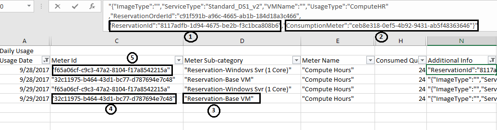

# Understand Azure reservation usage for your individual subscription with pay-as-you-go rates subscription

Use the ReservationId from [Reservation page](https://portal.azure.com/?microsoft_azure_marketplace_ItemHideKey=Reservations&Microsoft_Azure_Reservations=true#blade/Microsoft_Azure_Reservations/ReservationsBrowseBlade) and the usage file from the [Azure Accounts portal](https://account.azure.com) to evaluate your reservation usage.

If you are a customer with an Enterprise Agreement, see [Understand reservation usage for your Enterprise enrollment.](understand-reserved-instance-usage-ea.md).

This article assumes that the reservation is applied to a single subscription. If the reservation is applied to more than one subscription, your reservation benefit may span multiple usage CSV files.

## Usage for Reserved Virtual Machine Instances

For the following sections, assume that you are running a Standard_DS1_v2 Windows VM in the east US region and your reserved VM instance information looks like the following table:

| Field | Value |
|---| :---: |
|ReservationId |8117adfb-1d94-4675-be2b-f3c1bca808b6|
|Quantity |1|
|SKU | Standard_DS1_v2|
|Region | eastus |

The hardware portion of the VM is covered because the deployed VM matches the reservation attributes. To see what Windows software isn't covered by the reserved VM instance, see [Azure Reserve VM Instances Windows software costs](reserved-instance-windows-software-costs.md)

### Statement section of CSV file for VMs

This section of your CSV file shows the total usage for your reservation. Apply the filter on the **Meter Subcategory** field that contains **"Reservation-"**. You see something like the following screenshot:

The **Reservation-Base VM** line has the total number of hours that are covered by the reservation. This line is $0.00 because the reservation covers it. The **Reservation-Windows Svr (1 Core)** line covers the cost of Windows software.

### Daily usage section of CSV file

Filter on **Additional Info** and type in your **Reservation ID**. The following screenshot shows the fields related to the reservation.

1. **ReservationId** in the **Additional Info** field is the reservation that's applied to the VM.
2. **ConsumptionMeter** is the meter ID for the VM.
3. The **Reservation-Base VM** **Meter Subcategory** line represents the $0 cost in statement section. The cost of running this VM is already paid by the reservation.
4. **Meter ID** is the meter ID for the reservation. The cost of this meter is $0. This meter id appears for any VM that qualifies for the reservation discount.
5. Standard_DS1_v2 is one vCPU VM and the VM is deployed without Azure Hybrid Benefit. So, this meter covers the extra charge of the Windows software. To find the meter corresponding to D series 1 core VM, see [Azure Reserve VM Instances Windows software costs](reserved-instance-windows-software-costs.md). If you have the Azure Hybrid Benefit, this extra charge is not applied.

## Usage for SQL Database & Cosmos DB reservations

The following sections use Azure SQL Database as example to describe the usage report. You can use same steps to get usage for Azure Cosmos DB as well.

Assume that you are running a SQL Database Gen 4 in the east US region and your reservation information looks like the following table:

| Field | Value |
|---| --- |
|ReservationId |446ec809-423d-467c-8c5c-bbd5d22906b1|
|Quantity |2|
|Product| SQL Database Gen 4 (2 Core)|
|Region | eastus |

### Statement section of CSV file

Filter on **Reserved Instance Usage** meter name, and choose the required **Meter Category** - Azure SQL database or Azure Cosmos DB. You see something like the following screenshot:

The **Reserved Instance Usage** line has the total number of core hours covered by the reservation. The rate is $0 for this line as the reservation covered the cost.

### Detail section of CSV file

Filter on **Additional Info** and type in your **Reservation ID**. The following screenshot shows the fields related to the SQL Database reserved capacity reservation.

1. **ReservationId** in the **Additional Info** field is the SQL Database reserved capacity reservation that's applied to the SQL database resource.
2. **ConsumptionMeter** is the meter ID for the SQL Database resource.
3. The **Meter Id** is the reservation meter. The cost of this meter is $0. Any SQL Database resources that qualify for the reservation discount shows this meter ID in the CSV file.

## Need help? Contact us.

If you have questions or need help, [create a support request](https://go.microsoft.com/fwlink/?linkid=2083458).

## Next steps

To learn more about Azure Reservations, see the following articles:

- [What are Azure Reservations?](save-compute-costs-reservations.md)
- [Prepay for Virtual Machines with Azure Reserved VM Instances](../../virtual-machines/windows/prepay-reserved-vm-instances.md)
- [Prepay for SQL Database compute resources with Azure SQL Database reserved capacity](../../azure-sql/database/reserved-capacity-overview.md)
- [Manage Azure Reservations](manage-reserved-vm-instance.md)
- [Understand how the reservation discount is applied](../manage/understand-vm-reservation-charges.md)
- [Understand reservation usage for your Enterprise enrollment](understand-reserved-instance-usage-ea.md)
- [Windows software costs not included with Reservations](reserved-instance-windows-software-costs.md)
