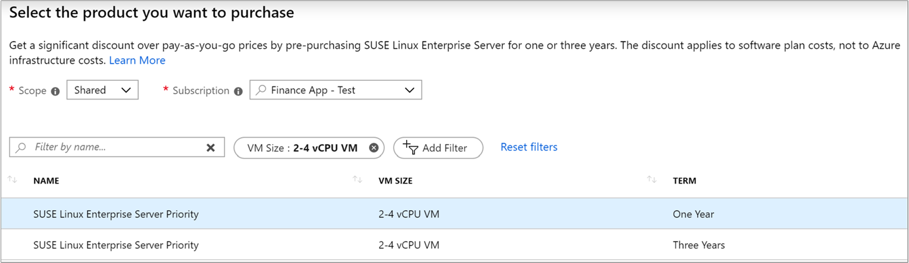

# Azure software plan discount

Azure software plans for SUSE and RedHat are reservations that apply to deployed VMs. The software plan discount is applied to the software usage of deployed VMs that match the reservation.

When you shut down a VM, the discount is automatically applied to another matching VM, if available. A software plan covers the cost of running the software on a VM. Other charges such as compute, storage, and networking are charged separately.

To buy the right plan, you need to understand your VM usage and the number of vCPUs on those VMs. Use the following sections to help identify what plan to buy, based on your usage data.

## How reservation discount is applied

A reservation discount is "*use-it-or-lose-it*." So, if you don't have matching resources for any hour, then you lose a reservation quantity for that hour. You can't carry forward unused reserved hours.

When you shut down a resource, the reservation discount automatically applies to another matching resource in the specified scope. If no matching resources are found in the specified scope, then the reserved hours are *lost*.

Stopped resources are billed and continue to use reservation hours. Deallocate or delete resources or scale-in other resources to use your available reservation hours with other workloads. 

## Review RedHat VM usage before you buy

Get the product name from your usage data and buy the RedHat plan with the same type and size.

For example, if your usage has product **Red Hat Enterprise Linux - 1-4 vCPU VM License**, you should purchase **Red Hat Enterprise Linux** for **1-4 vCPU VM**.

<!--ADD RHEL SCREENSHOT -->

## Review SUSE VM usage before you buy

Get the product name from your usage data and buy the SUSE plan with the same type and size.

For example, if your usage is for product **SUSE Linux Enterprise Server Priority - 2-4 vCPU VM Support**, you should purchase **SUSE Linux Enterprise Server Priority** for **2-4 vCPU**.

## Discount applies to different VM sizes for SUSE plans

Like Reserved VM Instances, SUSE plan purchases offer instance size flexibility. That means that your discount applies even when you deploy a VM with a different vCPU count. The discount applies to different VM sizes within the software plan.

The discount amount depends on the ratio listed in the following tables. The ratio compares the relative footprint for each meter in that group. The ratio depends on the VM vCPUs. Use the ratio value to calculate how many VM instances get the SUSE Linux plan discount.

For example, if you buy a plan for SUSE Linux Enterprise Server for HPC Priority for a VM with 3 or 4 vCPUs, the ratio for that reservation is 2. The discount covers the SUSE software cost for:

- 2 deployed VMs with 1 or 2 vCPUs,
- 1 deployed VM with 3 or 4 vCPUs,
- or 0.77 or about 77% of a VM with 5 or more vCPUs.

The ratio for 5 or more vCPUs is 2.6. So a reservation for SUSE with a VM with 5 or more vCPUs covers only a portion of the software cost, which is about 77%.

The ratios are based on prices. The 2.6 ratio means that 1 vCPU VM is covered when your purchase quantity of 1 has 5 or more vCPUs.

The following tables show the software plans you can buy a reservation for, their associated usage meters, and the ratios for each.

### SUSE Linux Enterprise Server for HPC 

|SUSE VM | MeterId | Ratio|Example VM size|
| ------- | --- | ------------------------| --- |
|SUSE Linux Enterprise Server for HPC 1-2 vCPUs |8c94ad45-b93b-4772-aab1-ff92fcec6610|1|D2s_v3|
|SUSE Linux Enterprise Server for HPC 3-4 vCPUs|4ed70d2d-e2bb-4dcd-b6fa-42da71861a1c|1.92308|D4s_v3|
|SUSE Linux Enterprise Server for HPC 5+ vCPUs |907a85de-024f-4dd6-969c-347d47a1bdff|2.92308|D8s_v3|

### SUSE Linux Enterprise Server for SAP applications

|SUSE VM | MeterId | Ratio|Example VM size|
| ------- |------------------------| --- | --- |
|SUSE Linux Enterprise Server for SAP applications 1-2 vCPUs|497fe0b6-fa3c-4e3d-a66b-836097244142|1|D2s_v3|
|SUSE Linux Enterprise Server for SAP applications 3-4 vCPUs |847887de-68ce-4adc-8a33-7a3f4133312f|2|D4s_v3|
|SUSE Linux Enterprise Server for SAP applications 5+ vCPUs |18ae79cd-dfce-48c9-897b-ebd3053c6058|2.41176|D8s_v3|

### SUSE Linux Enterprise Server

|SUSE VM | MeterId | Ratio|Example VM size|
| ------- |------------------------| --- |--- |
|SUSE Linux Enterprise Server 1-2 cores vCPUs |4b2fecfc-b110-4312-8f9d-807db1cb79ae|1|D2s_v3|
|SUSE Linux Enterprise Server 3-4 cores vCPUs |0c3ebb4c-db7d-4125-b45a-0534764d4bda|1.92308|D4s_v3|
|SUSE Linux Enterprise Server 5+ vCPUs |7b349b65-d906-42e5-833f-b2af38513468|2.30769| D8s_v3|

## Need help? Contact us

If you have questions or need help,  [create a support request](https://go.microsoft.com/fwlink/?linkid=2083458).

## Next steps

To learn more about reservations, see the following articles:

- [What are Azure Reservations?](save-compute-costs-reservations.md)
- [Prepay for SUSE software plans with Azure Reservations](../../virtual-machines/linux/prepay-suse-software-charges.md)
- [Prepay for Virtual Machines with Azure Reserved VM Instances](../../virtual-machines/prepay-reserved-vm-instances.md)
- [Manage Azure Reservations](manage-reserved-vm-instance.md)
- [Understand reservation usage for your Pay-As-You-Go subscription](understand-reserved-instance-usage.md)
- [Understand reservation usage for your Enterprise enrollment](understand-reserved-instance-usage-ea.md)
