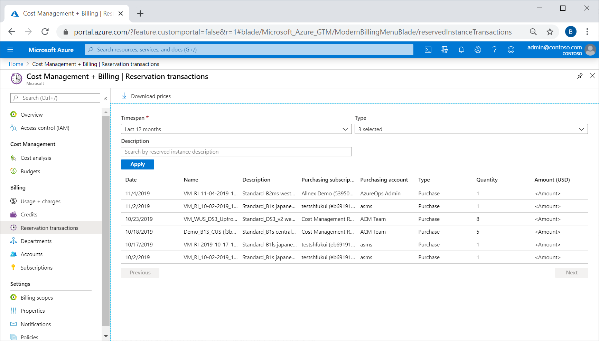
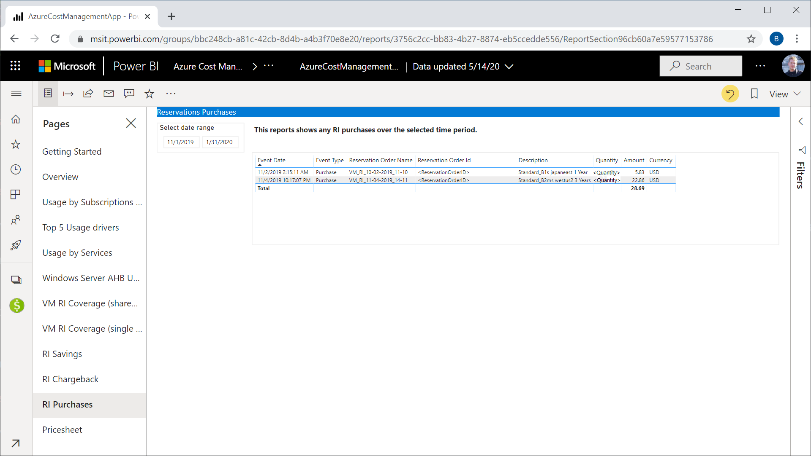

# View reservation purchase and refund transactions

There are a few different ways to view reservation purchase and refund transactions. You can use the Azure portal, Power BI, and REST APIs.

## View reservation transactions in the Azure portal

An Enterprise enrollment or Microsoft Customer Agreement billing administrator can view reservation transactions in Cost Management and Billing.

1. Sign in to the [Azure portal](https://portal.azure.com).
1. Search for **Cost Management + Billing**.
1. Select **Reservation transactions**.
1. To filter the results, select **Timespan**, **Type**, or **Description**.
1. Select **Apply**.

## View reservation transactions in Power BI

An Enterprise enrollment or Microsoft Customer Agreement billing administrator can view reservation transactions with the Cost Management Power BI app.

1. Get the [Cost Management Power BI App](https://appsource.microsoft.com/product/power-bi/costmanagement.azurecostmanagementapp).
1. Navigate to the RI Purchases report.

To learn more, see [Azure Cost Management Power BI App for Enterprise Agreements](https://docs.microsoft.com/azure/cost-management-billing/costs/analyze-cost-data-azure-cost-management-power-bi-template-app).

## Use APIs to get reservation transactions

Enterprise Agreement (EA) and Microsoft Customer Agreement users can get reservation transactions data using [Reservation Transactions - List API](https://docs.microsoft.com/rest/api/consumption/reservationtransactions/list).

## Need help? Contact us.

If you have questions or need help, [create a support request](https://portal.azure.com/#blade/Microsoft_Azure_Support/HelpAndSupportBlade/newsupportrequest).

## Next steps

- To learn how to manage a reservation, see [Manage Azure Reservations](manage-reserved-vm-instance.md).
- To learn more about Azure Reservations, see the following articles:
  - [What are Azure Reservations?](save-compute-costs-reservations.md)
  - [Manage Reservations in Azure](manage-reserved-vm-instance.md)
