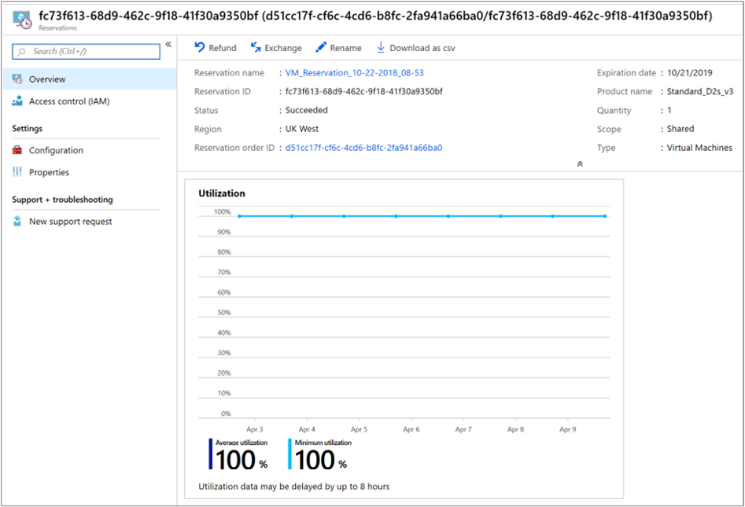

# View Azure reservations in the Azure portal

Depending on your subscription type and permissions, there are a couple of ways to view reservations for Azure.

## View purchased reservations

By default, when you buy a reservation, you and the account administrator can view the reservation. You and the account administrator automatically get the Owner role on the reservation order and reservation. To allow other people to view the reservation, you must add them as an **Owner** or **Reader** on the Reservation order or reservation.

For more information, see [Add or change users who can manage a reservation](manage-reserved-vm-instance.md#add-or-change-users-who-can-manage-a-reservation).

To view a reservation as an Owner or Reader,

1. Sign in to the [Azure portal](https://portal.azure.com).
2. Search for **Reservations**.
      
3. The list shows all the reservations where you have the Owner or Reader role. Each reservation shows the last known utilization percentage.  
    
4. Select a reservation and see the utilization trend for last five days.  
    
5. You can also get the [reservation utilization](/rest/api/billing/enterprise/billing-enterprise-api-reserved-instance-usage) using the Reserved Instance usage API and with the [Microsoft Azure Consumption Insights Power BI content pack](/power-bi/service-connect-to-azure-consumption-insights).

If you need to change the scope of a reservation, split a reservation, or change who can manage a reservation, see [Manage Azure Reservations](manage-reserved-vm-instance.md).

## View reservation transactions for Enterprise enrollments

 If you have a partner led Enterprise enrollment, view reservations by going to **Reports** in the EA portal. For other Enterprise enrollments, you can view reservations in the EA portal and in the Azure portal. You must be an EA administrator to view reservation transactions.

To view reservation transactions in Azure portal,

1. Sign in to the [Azure portal](https://portal.azure.com).
1. Search for **Cost Management + Billing**.

    

1. Select **Reservation transactions**.
1. To filter the results, select  **Timespan**, **Type**, or **Description**.
1. Select **Apply**.

    

To get the data by using an API, see [Get Reserved Instance transaction charges for enterprise customers](/rest/api/billing/enterprise/billing-enterprise-api-reserved-instance-charges).

## Next steps

To learn more about Azure reservations, see the following articles:

- [What are reservations for Azure?](save-compute-costs-reservations.md)
- [Manage reservations for Azure](manage-reserved-vm-instance.md)

Buy a service plan:

- [Prepay for Cosmos DB reserved capacity](../../cosmos-db/cosmos-db-reserved-capacity.md)
- [Prepay for SQL Database compute resources with Azure SQL Database reserved capacity](../../sql-database/sql-database-reserved-capacity.md)
- [Prepay for Virtual Machines with Azure Reserved VM Instances](../../virtual-machines/windows/prepay-reserved-vm-instances.md)

Buy a software plan:

- [Prepay for Red Hat software plans from Azure Reservations](../../virtual-machines/linux/prepay-rhel-software-charges.md)
- [Prepay for SUSE software plans from Azure Reservations](../../virtual-machines/linux/prepay-suse-software-charges.md)

Understand usage:

- [Understand reservation usage for your Pay-As-You-Go subscription](understand-reserved-instance-usage.md)
- [Understand reservation usage for your Enterprise enrollment](understand-reserved-instance-usage-ea.md)
- [Understand reservation usage for CSP subscriptions](https://docs.microsoft.com/partner-center/azure-reservations)

## Need help? Contact us

If you have questions or need help,  [create a support request](https://go.microsoft.com/fwlink/?linkid=2083458).
