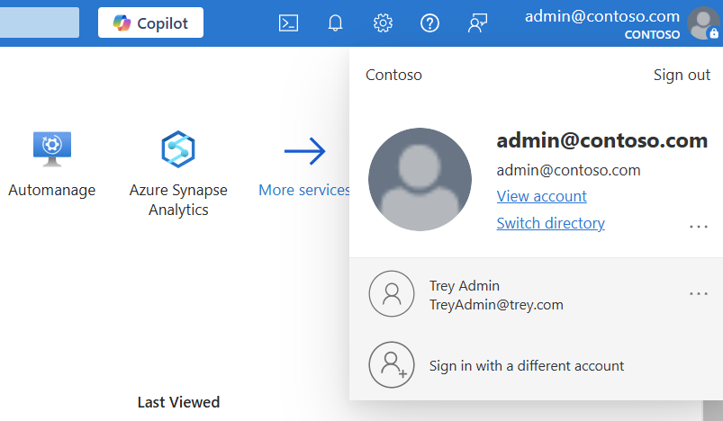

# No subscriptions found sign in error for Azure portal

You might receive a "No subscriptions found" error message when you try to sign in to the [Azure portal](https://portal.azure.com/). This article provides a solution for this problem.

## Symptom

When you try to sign in to the [Azure portal](https://portal.azure.com/), you receive the following error message: "No subscriptions found".

## Cause

This problem occurs if you selected at the wrong directory, or if your account doesn’t have sufficient permissions.

## Solution

### Scenario: Error message is received in the [Azure portal](https://portal.azure.com)

To fix this issue:

* Make sure that the correct Azure directory is selected by selecting your account at the top right.

  
* If the right Azure directory is selected but you still receive the error message, [assign the Owner role to your account](../../role-based-access-control/role-assignments-portal.md).

## Need help? Contact us.

If you have questions or need help,  [create a support request](https://go.microsoft.com/fwlink/?linkid=2083458).
