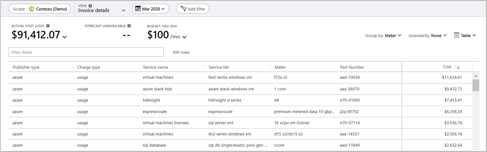
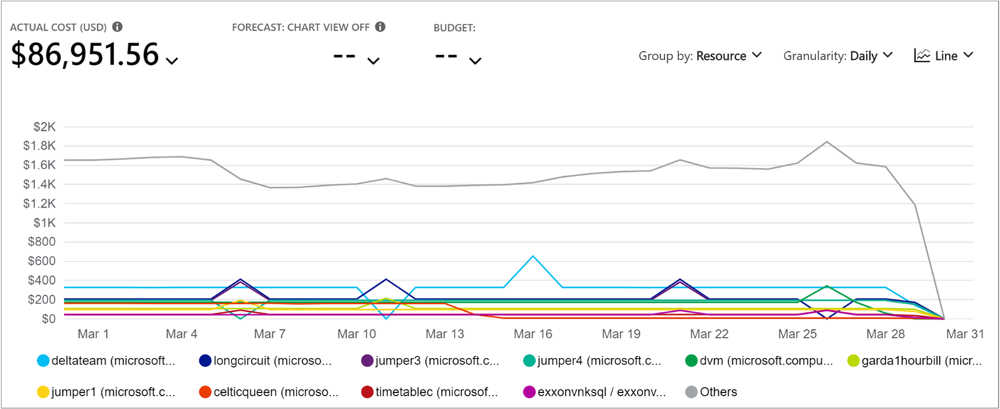

# Analyze unexpected charges

The cloud resource infrastructure that you've built for your organization is likely complex. Many Azure resource types can have different types of charges. Azure resources might be owned by different teams in your organization and they might have different billing model types that apply to various resources. To gain a better understanding of the charges, begin your analysis using one or more of the strategies in the following sections.

## Review invoice for resource responsible for charge

How you purchase your Azure services helps you determine the methodology and tools that are available to you as you identify the resource associated with a charge. To determine which methodology applies to you, first [determine your Azure offer type](../costs/understand-cost-mgt-data.md#determine-your-offer-type). Then, identify your customer category in the list of [supported Azure offers](../costs/understand-cost-mgt-data.md#supported-microsoft-azure-offers).

The following articles provide detailed steps that explain how to review your bill based on your customer type. In each article there are instructions about how to download a CSV file containing usage and cost details for a given billing period.

- [Pay-As-You-Go bill review process](review-individual-bill.md#charges)
- [Enterprise Agreement bill review process](review-enterprise-agreement-bill.md)
- [Microsoft Customer Agreement review process](review-customer-agreement-bill.md#analyze-your-azure-usage-charges)
- [Microsoft Partner Agreement review process](review-partner-agreement-bill.md#analyze-your-azure-usage-charges)

Your Azure bill aggregates charges for the month on a per-_meter_ basis. Meters are used to track a resource's usage over time and are used to calculate your bill. When you create a single Azure resource, like a virtual machine, one or more-meter instances are created for the resource.

Filter the usage CSV file based on the _MeterName_ as shown on the bill that you want to analyze to see all line items that apply to the meter. The _InstanceID_ for the line item corresponds to the actual Azure resource that generated the charge.

When you've identified the resource in question, you can use Cost analysis in Azure Cost Management to further analyze the costs related to the resource. To learn more about using cost analysis, see [Start analyzing costs](../costs/quick-acm-cost-analysis.md).

## Review invoiced charges in Cost analysis

To view your invoice details in the Azure portal, navigate to Cost analysis for the scope associated with the invoice that you're analyzing. Select the **Invoice details** view. Invoice details show you the charges as seen on the invoice.

Viewing invoice details, you can identify the service that has unexpected costs and determine which resources are directly associated with the resource in Cost analysis. For example, if you want to analyze charges for the Virtual Machines service, navigate to the **Accumulated cost** view. Then, set the granularity to **Daily** and filter charges **Service name: Virtual machines** and group charges by **Resource**.

## Identify spikes in cost over time

Sometimes you might not know what recent costs resulted in changes to your billed charges. To understand what changed, you can use Cost analysis to [see a daily or monthly breakdown of costs over time](../costs/cost-analysis-common-uses.md#view-costs-per-day-or-by-month). After you create the view, group your charges by either **Service** or **Resource** to identify the changes. You can also change your view to a **Line** chart to better visualize the data.

## Determine resource pricing and billing model

A single resource can accrue charges across multiple Azure products and services. View the [Azure pricing by product](https://azure.microsoft.com/pricing/#product-pricing) page to learn more about the pricing for each Azure service. For example, a single virtual machine (VM) created in Azure can have the following meters created to track its usage. Each might have different pricing.

- Compute Hours
- IP Address Hours
- Data Transfer In
- Data Transfer Out
- Standard Managed Disk
- Standard Managed Disk Operations
- Standard IO-Disk
- Standard IO-Block Blob Read
- Standard IO-Block Blob Write
- Standard IO-Block Blob Delete

When the VM is created, each meter begins emitting usage records. The usage and the meter's price are tracked in the Azure metering system. You can see the meters that were used to calculate your bill in the usage CSV file.

## Find people responsible for the resource and engage

Often, the team responsible for a given resource will know about changes that were made for a resource. Engaging them is useful as you identify why charges might appear. For example, the owning team may have recently created the resource, updated its SKU (thereby changing the resource rate) or increased the load on the resource due to code changes. Continue reading the following sections for more techniques to determine who owns a resource.

### Analyze the audit logs for the resource

If you have permissions to view a resource, you should be able to access its audit logs. Review the logs to find the user who was responsible for the most recent changes to a resource. To learn more, see [View and retrieve Azure Activity log events](../../azure-monitor/platform/activity-log-view.md).

### Analyze user permissions to the resource's parent scope

People that have write access to a subscription or resource group typically have information about the resources were created. They should be able to explain the purpose of a resource or point you to the person who knows. To identify the people with permissions for a Subscription scope, see [View role assignments](../../role-based-access-control/check-access.md#view-role-assignments). You can use a similar process for resource groups.

## Get help to identify charges

If you've used the preceding strategies and you still don't understand why you received a charge or if you need other help with billing issues, please [create a support request](https://go.microsoft.com/fwlink/?linkid=2083458).

## Next steps

- Learn about how to [Optimize your cloud investment with Azure Cost Management](../costs/cost-mgt-best-practices.md).