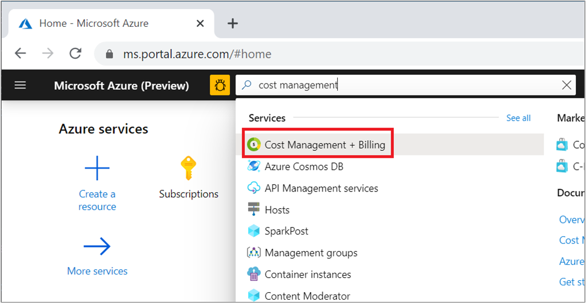
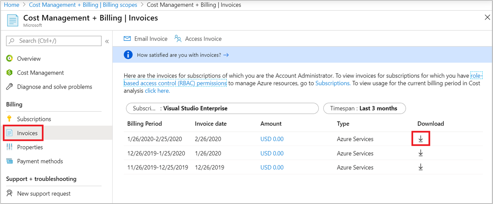
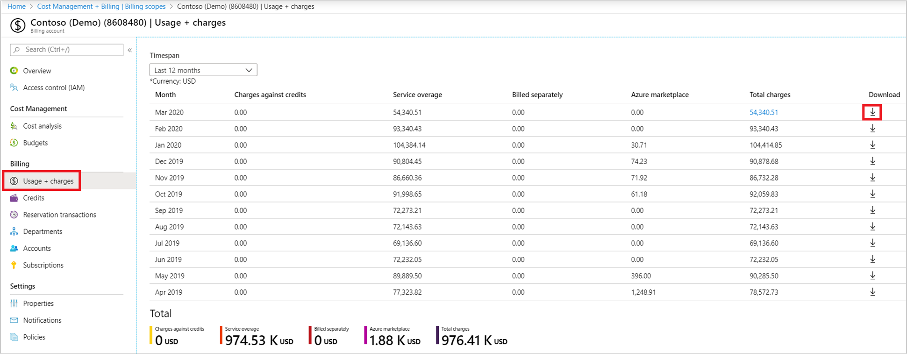

# View and download your Azure usage and charges

You can download a daily breakdown of your Azure usage and charges in the Azure portal. Only certain roles have permission to get Azure usage information, like the Account Administrator or Enterprise Administrator. To learn more about getting access to billing information, see [Manage access to Azure billing using roles](../manage/manage-billing-access.md).

If you have a Microsoft Customer Agreement (MCA), you must be a billing profile Owner, Contributor, Reader, or Invoice manager to view your Azure usage and charges. If you have a Microsoft Partner Agreement (MPA), only the Global Admin and Admin Agent role in the partner organization Microsoft can view and download Azure usage and charges.

Based on the type of subscription that you use, options to download your usage and charges vary.

If you want to get cost and usage data using the Azure CLI, see [Get usage data with the Azure CLI](../automate/get-usage-data-azure-cli.md).

## Download usage for MOSP billing accounts

1. Sign in to the [Azure portal](https://portal.azure.com).
1. Search for *Cost Management + Billing*.  
    
1. Depending on your access, you might need to select a Billing account or Billing profile.
1. In the left menu, select **Invoices** under **Billing**.
1. In the invoice grid, find the row of the billing period corresponding to the usage you want to download.
1. Select the **download icon** or the ellipsis (`...`) on the right.  
    
1. The Download pane opens on the right. Select **Download** from the **Usage Details** section.  

## Download usage for EA customers

To view and download usage data as a EA customer, you must be an Enterprise Administrator, Account Owner, or Department Admin with the view charges policy enabled.

> [!NOTE]
> We recommend that both direct and indirect EA Azure customers use Cost Management + Billing in the Azure portal to manage their enrollment and billing instead of using the EA portal. For more information about enrollment management in the Azure portal, see [Get started with EA billing in the Azure portal](../manage/ea-direct-portal-get-started.md).
>
> As of February 20, 2023 indirect EA customers won’t be able to manage their billing account in the EA portal. Instead, they must use the Azure portal. 
> 
> This change doesn’t affect Azure Government EA enrollments. They continue using the EA portal to manage their enrollment.

1. Sign in to the [Azure portal](https://portal.azure.com).
1. Search for *Cost Management + Billing*.  
    
1. If you have access to multiple billing accounts, select the billing scope for your EA billing account.
1. Select **Usage + charges**.
1. For the month you want to download, select **Download**.  
    
1. On the Download Usage + Charges page, under Usage Details, select the type of charges that you want to download from the list. Depending on your selection, the CSV file provides all charges (usage and purchases) including RI (reservation) purchases. Or, amortized charges (usage and purchases) including reservation purchases. 
    :::image type="content" source="./media/download-azure-daily-usage/select-usage-detail-charge-type.png" alt-text="Screenshot showing the Usage Details charge type selection to download." :::
1. Select **Prepare document**.
1.  It could take a while for Azure to prepare your download, depending on your monthly usage. When it's ready for download, select **Download csv**.

## Download usage for your Microsoft Customer Agreement

To view and download usage data for a billing profile, you must be a billing profile Owner, Contributor, Reader, or Invoice manager.

Use the following information to download usage for billed charges. The same steps are used to download open and pending charges, which is the month-to-date usage for the current billing period. Open and pending charges haven't been billed yet.

### Download usage file

1. Sign in to the [Azure portal](https://portal.azure.com).
1. Search for *Cost Management + Billing*.
1. Select a billing profile. Depending on your access, you might need to select a billing account first.
1. In the left menu, select **Invoices**.
1. In the invoice grid, find the row of the invoice corresponding to the usage file that you want to download.
1. Select the ellipsis symbol (`...`) at the end of the row.
1. In the context menu, select **Prepare Azure usage file**. A notification message appears stating that the usage file is being prepared.
1. When the file is ready to download, select **Download**. If you missed the notification, you can view it from **Notifications** area in top right of the Azure portal (the bell symbol).

#### Calculate discount in the usage file

The usage file shows the following per-consumption line items:

- `costInBillingCurrency` (Column AU)
- `paygCostInBillingCurrency` (Column AX).

Use the information from the two columns to calculate your discount amount and discount percentage, as follows:

Discount amount = (AX – AU)

Discount percentage = (Discount amount / AX) * 100

## Get usage data with Azure CLI

Start by preparing your environment for the Azure CLI:

[!INCLUDE [azure-cli-prepare-your-environment-no-header.md](~/articles/reusable-content/azure-cli/azure-cli-prepare-your-environment-no-header.md)]

Then use the [az costmanagement export](/cli/azure/costmanagement/export) commands to export usage data to an Azure storage account. You can download the data from there.

1. Create a resource group or use an existing resource group. To create a resource group, run the [az group create](/cli/azure/group#az-group-create) command:

   ```azurecli
   az group create --name TreyNetwork --location "East US"
   ```

1. Create a storage account to receive the exports or use an existing storage account. To create an account, use the [az storage account create](/cli/azure/storage/account#az-storage-account-create) command:

   ```azurecli
   az storage account create --resource-group TreyNetwork --name cmdemo
   ```

1. Run the [az costmanagement export create](/cli/azure/costmanagement/export#az-costmanagement-export-create) command to create the export:

   ```azurecli
   az costmanagement export create --name DemoExport --type Usage \
   --scope "subscriptions/00000000-0000-0000-0000-000000000000" --storage-account-id cmdemo \
   --storage-container democontainer --timeframe MonthToDate --storage-directory demodirectory
   ```

## Need help? Contact us.

If you have questions or need help, [create a support request](https://go.microsoft.com/fwlink/?linkid=2083458).

## Next steps

To learn more about your invoice and usage charges, see:

- [Understand terms on your Microsoft Azure detailed usage](understand-usage.md)
- [Understand your bill for Microsoft Azure](review-individual-bill.md)
- [View and download your Microsoft Azure invoice](download-azure-invoice.md)
- [View and download your organization's Azure pricing](../manage/ea-pricing.md)

If you have a Microsoft Customer Agreement, see:

- [Understand terms on your Microsoft Customer Agreement Azure detailed usage](mca-understand-your-usage.md)
- [Understand the charges on your Microsoft Customer Agreement invoice](review-customer-agreement-bill.md)
- [View and download your Microsoft Azure invoice](download-azure-invoice.md)
- [View and download tax documents for your Microsoft Customer Agreement](mca-download-tax-document.md)
- [View and download your organization's Azure pricing](../manage/ea-pricing.md)
