# View and download your Microsoft Azure invoice

You can download your invoice in the [Azure portal](https://portal.azure.com/) or have it sent in email. If you're an Azure customer with an Enterprise Agreement (EA customer), you can't download your organization's invoice. Invoice is sent to whoever is set up to receive invoice for the enrollment.

[!INCLUDE [GDPR-related guidance](../../../includes/gdpr-intro-sentence.md)]

## Understand when invoices are generated for your Azure account

An invoice is generated based on the type of your billing account. To learn more about billing accounts and identify the type of your billing account, see [View billing accounts in Azure portal](../manage/view-all-accounts.md).

### Invoices for Microsoft Online Service Program (MOSP) billing accounts:

A billing account for a Microsoft Online Services Program is created when you sign up for Azure through the Azure website. For example, when you sign up for an [Azure Free Account](https://azure.microsoft.com/offers/ms-azr-0044p/), [account with pay-as-you-go rates](https://azure.microsoft.com/offers/ms-azr-0003p/) or as a [Visual studio subscriber](https://azure.microsoft.com/pricing/member-offers/credit-for-visual-studio-subscribers/).

Customers in select regions, who sign up through the Azure website for an [account with pay-as-you-go rates](https://azure.microsoft.com/offers/ms-azr-0003p/) or an [Azure Free Account](https://azure.microsoft.com/offers/ms-azr-0044p/) can have a billing account for a Microsoft Customer Agreement. [Check your billing account type](../manage/view-all-accounts.md#check-the-type-of-your-account) before following the instructions in this article. 

Your billing account for a Microsoft Online Service Program (MOSP) can have these invoices:

*Azure service charges*: An invoice is generated for each Azure subscription that contains Azure resources used within that subscription. The invoice contains charges for a billing period, which depends on the day the subscription was created. For example, John creates *Azure sub 1* on 5 March and *Azure sub 2* on 10 March, the invoice for *Azure sub 1* will have charges from fifth day of a month to fourth day of next month and invoice for Azure sub 2* will have charges from tenth day of a month to ninth day of next month. The invoices for all Azure subscriptions are generated on the day the account was created. In the scenario above, if John created his account on 2 February, the invoices for both *Azure sub 1* and *Azure sub 2* will be generated on second day of each month.   

*Azure marketplace, reservations, and spot VMs*: An invoice is generated for reservations, marketplace products, and spot VMs purchased using a subscription. The invoice respective charges from the previous month. For example, John purchased a reservation on 1 March and another reservation on 30 March, a single invoice will be generated for both the reservations in April. The invoice for Azure marketplace, reservations, and spot VMs are always generated around ninth day of the month. 

*Azure support plan*:  An invoice is generated each month for your support plan subscription. The invoice is generated 1 to 2 days from the day the support plan is purchased. For example, John purchased a developer support plan subscription on 2 March, he'll get an invoice on either third or fourth day of each month until the support plan is active.

### Invoices for Microsoft Customer Agreement (MCA) and Microsoft Partner Agreement (MPA) billing accounts:

A billing account for a Microsoft Customer Agreement is created when your organization works with a Microsoft representative to sign a Microsoft Customer Agreement. Some customers in select regions, who sign up through the Azure website for an [account with pay-as-you-go rates](https://azure.microsoft.com/offers/ms-azr-0003p/) or an [Azure Free Account](https://azure.microsoft.com/offers/ms-azr-0044p/) may have a billing account for a Microsoft Customer Agreement as well. For more information, see [Get started with your billing account for Microsoft Customer Agreement](../understand/mca-overview.md).

A billing account for a Microsoft Partner Agreement is created for Cloud Solution Provider (CSP) partners to manage their customers in the new commerce experience. Partners need to have at least one customer with an [Azure plan](https://docs.microsoft.com/partner-center/purchase-azure-plan) to manage their billing account in the Azure portal. For more information, see [Get started with your billing account for Microsoft Partner Agreement](../understand/mpa-overview.md).

A monthly invoice is generated at the beginning of the month for each billing profile in your account. The invoice contains respective charges for all Azure subscriptions and other purchases from the previous month. For example, John created *Azure sub 1* on 5 March, *Azure sub 2* on 10 March, and purchased *Azure support 1* subscription on 28 March using *Billing profile 1*. John will get a single invoice in the beginning of April that will contains charges for both Azure subscriptions and support plan.

## Download an invoice for your Azure subscription

An Invoice is only generated for a subscription that belongs to a billing account for a Microsoft Online Services Program (MOSP). [Check your access to a Microsoft Online Services Program (MOSP) account](view-all-accounts.md#check-the-type-of-your-account). If you have a billing account for a Microsoft Customer Agreement or a Microsoft Partner Agreement, an invoice is generated for each billing profile and contains charges for all subscriptions that are billed to it. For more information, see [Download invoice for your billing profile](#download-invoice-for-your-billing-profile).

You must have an account admin role on the subscription to download its invoice. Users with an owner, contributor, or reader roles can download its invoice, provided account admin has given them permission. For more information, see [Allow users to download invoices](manage-billing-access.md#opt-in).

1. Select your subscription from the [Subscriptions page](https://portal.azure.com/#blade/Microsoft_Azure_Billing/SubscriptionsBlade) in the Azure portal.

2. Select **Invoices** from the billing section.

    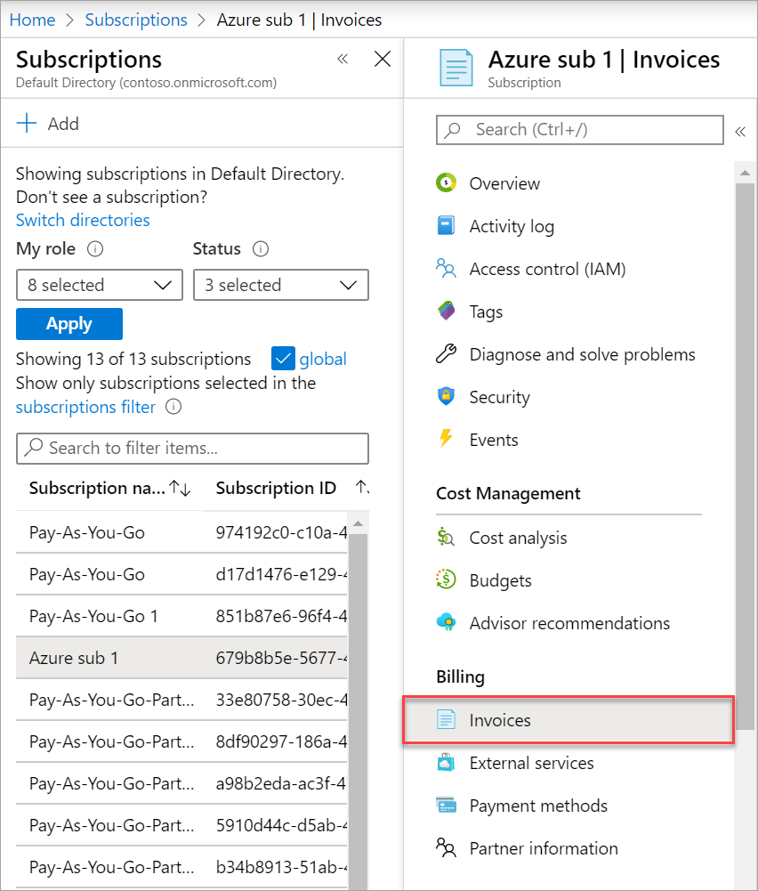

3. Click the download button to download a PDF version of your invoice and then click **Download** under the invoice section.  

    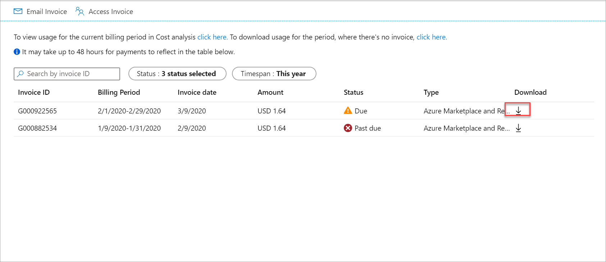

4. You can also download daily breakdown of consumed quantities and charges by clicking **Download** under the usage details section. It may take a few minutes to prepare the csv file.

    

For more information about your invoice, see [Understand your bill for Microsoft Azure](../understand/review-individual-bill.md). For help with managing your costs, see [Prevent unexpected costs with Azure billing and cost management](getting-started.md).

##  Download an invoice for your support plan subscription

An Invoice is only generated for a support plan subscription that belongs to a billing account for a Microsoft Online Services Program (MOSP). [Check your access to a Microsoft Online Services Program (MOSP) account](view-all-accounts.md#check-the-type-of-your-account). If you have a billing account for a Microsoft Customer Agreement or a Microsoft Partner Agreement, an invoice is generated for each billing profile and contains charges for the support plan subscription that is billed to it. For more information, see [Download invoice for your billing profile](#download-invoice-for-your-billing-profile).

You must have an account admin role on the support plan subscription to download its invoice.

1.  Sign in to the [Azure portal](https://portal.azure.com).

2.  Search for **Cost Management + Billing**.

    

3.  Select **Invoices** from the left-hand side.

4.  Select your support plan subscription and then click the download button.

    [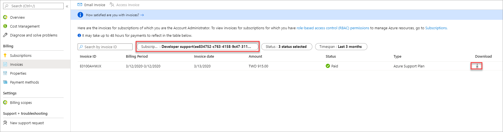](./media/download-azure-invoice/cmb-invoices-zoomed-in.png#lightbox)

4.  Click **Download** to download a PDF version of your invoice.

    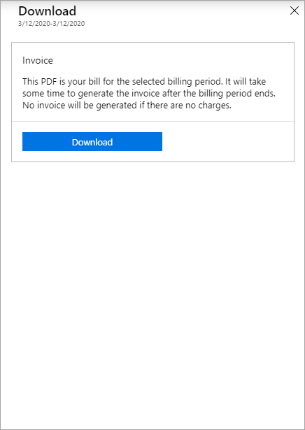

## Allow users with permission on the subscription to download its invoice

The instructions below are for a subscription that belongs to a billing account for a Microsoft Online Services Program (MOSP). [Check your access to a Microsoft Online Services Program (MOSP) account](view-all-accounts.md#check-the-type-of-your-account). If you have a billing account for a Microsoft Customer Agreement, see [Give others access to your Microsoft Customer Agreement invoices](#give-others-access-to-your-microsoft-customer-agreement-invoices).

The PDF version of the invoice contains personal information about the account admin, so the account administrator for this subscription must grant other users permission to download the invoice. Once the permission is given, users, groups, service principals with an owner, a contributor, a reader, a user access administrator, a billing reader, a co-Administrator, or a service Administrator role will be able to download invoices for the subscription.

1.  Sign in to the [Azure portal](https://portal.azure.com) as an account admin for the subscription.

2.  Search for **Cost Management + Billing**.

    

3.  Select **Invoices** from the left-hand side.

4.  Select your Azure subscription and then click **Access to invoice**.

    [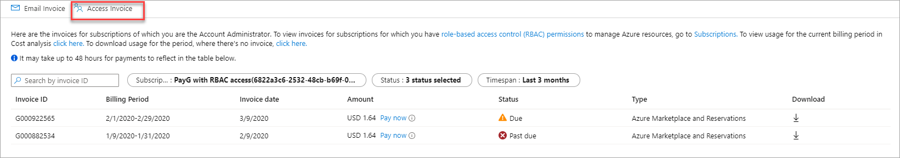](./media/download-azure-invoice/cmb-select-access-to-invoice-zoomed-in.png#lightbox)

4.  Select **On** and then **Save** from the top of the page.

    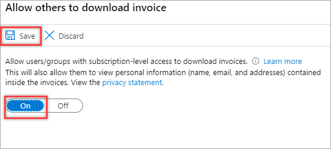

## Get your subscription's and support plan's invoices in email

The instructions below are for a subscription that belongs to a billing account for a Microsoft Online Services Program (MOSP). [Check your access to a Microsoft Online Services Program (MOSP) account](view-all-accounts.md#check-the-type-of-your-account). If you have a billing account for a Microsoft Customer Agreement or a Microsoft Partner Agreement, see [Get your billing profile's invoice in email](#get-your-billing-profiles-invoice-in-email).

You must have an account admin role on a subscription or a support plan to opt in to receive its invoice by email. Email invoices are available only for subscriptions and support plans, not for reservations or Azure Marketplace purchases. Once you've opted-in you can add additional recipients, who receive the invoice by email as well.

1.  Sign in to the [Azure portal](https://portal.azure.com).

2.  Search for **Cost Management + Billing**.

    

3.  Select **Invoices** from the left-hand side.

4.  Select your Azure subscription or support plan subscription and then select **Email invoice**.

    

5. Click **Opt in** and accept the terms.

    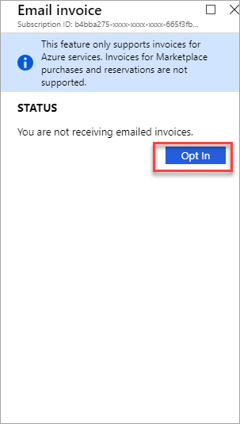

6. The invoice is sent to your preferred communication email. You can update the email in the [contact info of your billing account](https://https://portal.azure.com/#blade/Microsoft_Azure_GTM/ModernBillingMenuBlade/Properties).

    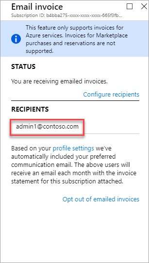

## Share your subscription's and support plan's invoices with others in email

You may want to share the invoices for your subscription and support plan every month with your accounting team or send them to one of your other email addresses.

1. Follow the steps in [Get your subscription's and support plan's invoices in email](#get-your-subscriptions-and-support-plans-invoices-in-email) and click **Configure recipients**. 

    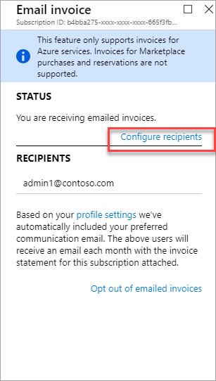

2. Enter an email address, and then click on **Add recipient**. You can add multiple email addresses.

    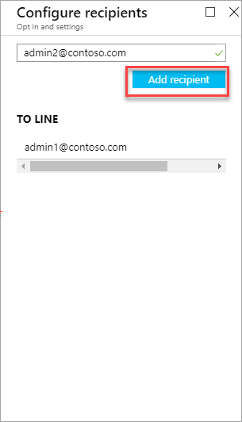

3. Once you've added all the email addresses, click on **Done** from the bottom of the screen.

##  Download invoice for your billing profile

The instructions below are for a billing account for a  Microsoft Customer Agreement or a Microsoft Partner Agreement. If you have a billing account for a Microsoft Online Services Program (MOSP), see [Download an invoice for your Azure subscription](#download-an-invoice-for-your-azure-subscription) or [Download an invoice for your support plan subscription](#download-an-invoice-for-your-support-plan-subscription).

You must have an owner, contributor, reader, or an invoice manager role on a billing profile to download its invoice in the Azure portal. Users with an owner, contributor, or a reader role on a billing account can download invoices for all the billing profiles in the account.

1.  Sign in to the [Azure portal](https://portal.azure.com).

2.  Search for **Cost Management + Billing**.

    

3. Select **Invoices** from the left-hand side.

    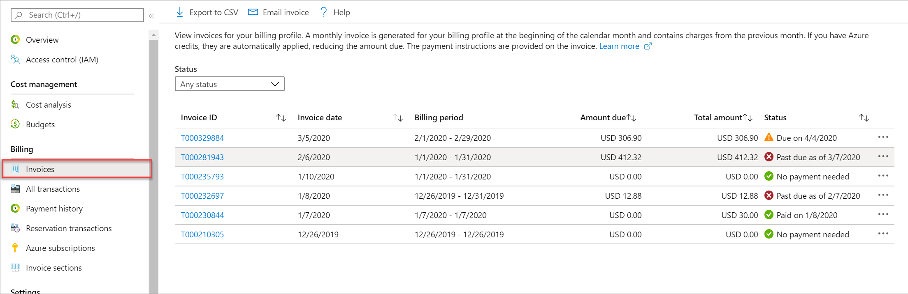

4. In the invoices table, select the invoice that you want to download.

5. Click on the **Download invoice pdf** button at the top of the page.

    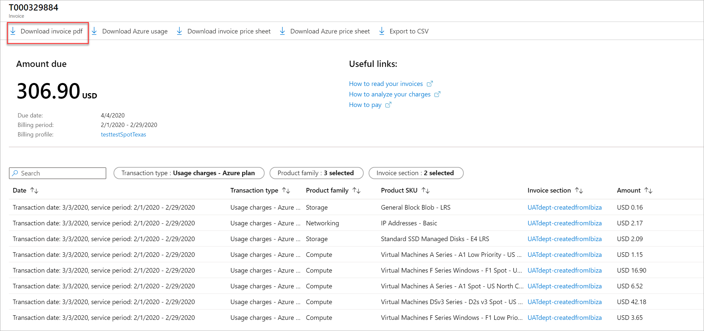

6. You can also download your daily breakdown of consumed quantities and estimated charges by clicking **Download Azure usage**. It may take a few minutes to prepare the csv file.

## Get your billing profile's invoice in email

The instructions below are for a billing account for a  Microsoft Customer Agreement or a Microsoft Partner Agreement. If you have a billing account for a Microsoft Online Services Program (MOSP), see [Get your subscription's and support plan's invoices in email](#get-your-subscriptions-and-support-plans-invoices-in-email).

You must have an owner or a contributor role on the billing profile or its billing account to update its email invoice preference. Once you have opted-in, all users with an owner, contributor, readers, and invoice manager roles on a billing profile will get its invoice in email. 

1.  Sign in to the [Azure portal](https://portal.azure.com).

2.  Search for **Cost Management + Billing**.

    

3.  Select **Invoices** from the left-hand side and then select **Email Invoice** from the top of the page.

    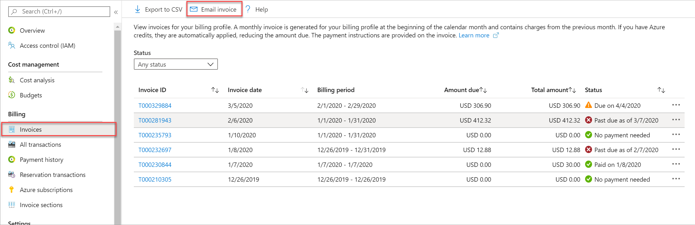

4.  If you have multiple billing profiles, select a billing profile and then select **Opt in**.

    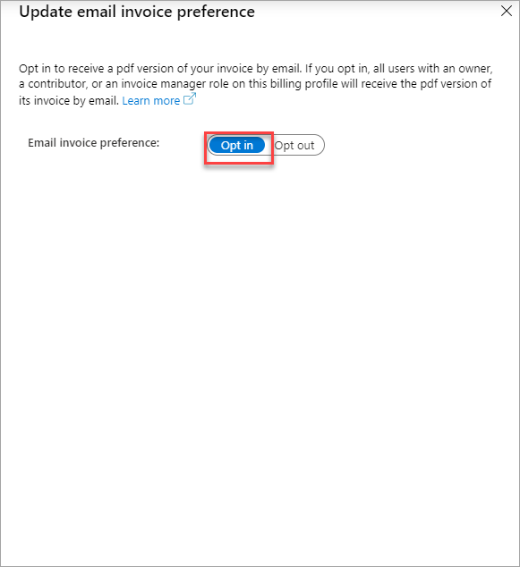

5.  Click **Update**.

## Give others access to your Microsoft Customer Agreement invoices

The instructions below are for a billing account for a  Microsoft Customer Agreement or a Microsoft Partner Agreement. If you have a billing account for a Microsoft Online Services Program (MOSP), see 

Give others access to view, download, and pay invoices by assigning them invoice manager role for a billing profile. If you have opted in for getting your invoice in email, these users also get the invoices in email.

1. Sign in to the [Azure portal](https://portal.azure.com).

1. Search for **Cost Management + Billing**.

   

1. Select **Billing profiles** from the left-hand side. From the billing profiles list, select a billing profile for which you want to assign an invoice manager role.

   

1. Select **Access Control (IAM)** from the left-hand side and then select **Add** from the top of the page.

   [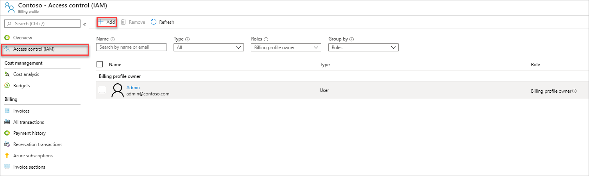](./media/download-azure-invoice/mca-select-access-control-zoomed-in.png#lightbox)

1. In the Role drop-down list, select **Invoice Manager**. Enter the email address of the user to give access. Select **Save** to assign the role.

   [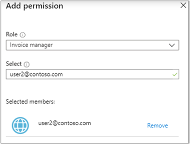](./media/download-azure-invoice/mca-added-invoice-manager.png#lightbox)
   
   
##  Why you might not see an invoice

There could be several reasons that you don't see an invoice:

- It's less than 30 days from the day you subscribed to Azure. 

- Azure bills you a few days after the end of your billing period. So, an invoice might not have been generated yet.

- You don't have permission to view invoices. If you have an MCA or MPA billing account, you must have an Owner, Contributor, Reader, or Invoice manager role on a billing profile or an Owner, Contributor, or Reader role on the billing account to view invoices. For other subscriptions, you might not see the invoices if you aren't the Account Administrator. To learn more about getting access to billing information, see [Manage access to Azure billing using roles](../manage/manage-billing-access.md).

- If you have a billing account for Microsoft Online Services Program (MOSP) and you signed up for an Azure Free Account or a subscription with a monthly credit amount, you only get an invoice when you exceed the monthly credit amount. If you have a billing account for a Microsoft Customer Agreement (MCA) or a Microsoft Partner Agreement (MPA), you always receive an invoice.

## Need help? Contact us.

If you have questions or need help, [create a support request](https://go.microsoft.com/fwlink/?linkid=2083458).

## Next steps

To learn more about your invoice and charges, see:

- [View and download your Microsoft Azure usage and charges](download-azure-daily-usage.md)
- [Understand your bill for Microsoft Azure](review-individual-bill.md)
- [Understand terms on your Azure invoice](understand-invoice.md)
- [Understand terms on your Microsoft Azure detailed usage](understand-usage.md)
- [View your organization's Azure pricing](../manage/ea-pricing.md)

If you have a Microsoft Customer Agreement, see:

- [Understand the charges on the invoice for your billing profile](review-customer-agreement-bill.md)
- [Understand terms on the invoice for your billing profile](mca-understand-your-invoice.md)
- [Understand the Azure usage and charges file for your billing profile](mca-understand-your-usage.md)
- [View and download tax documents for your billing profile](mca-download-tax-document.md)
- [View your organization's Azure pricing](../manage/ea-pricing.md)
