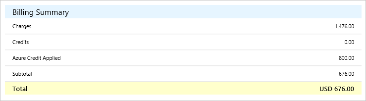
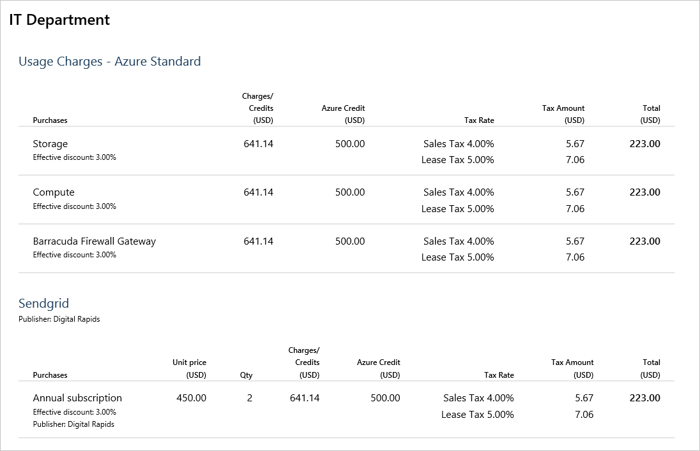

# Terms in your Microsoft Customer Agreement invoice

This article applies to an Azure billing account for a Microsoft Customer Agreement. [Check if you have access to a Microsoft Customer Agreement](#check-access-to-a-microsoft-customer-agreement).

Your invoice provides a summary of your charges and instructions for payment. It’s available for download in the Portable Document Format (.pdf) from the [Azure portal](https://portal.azure.com/) or can be sent via email. For more information, see [View and download your Microsoft Azure invoice](download-azure-invoice.md).

## Billing period

You are invoiced on a monthly basis. You can find out which day of the month you receive invoices by checking *invoice date* under billing profile properties in the [Azure portal](https://portal.azure.com/). Charges that occur between the end of the billing period and the invoice date are included in the next month's invoice, since they are in the next billing period. The billing period start and end dates for each invoice are listed in the invoice PDF above **Billing Summary**.

## Invoice terms and descriptions

The following sections list important terms that you see on your invoice and provide descriptions for each term.

### Invoice summary

The **Invoice Summary** is at the top of the first page and shows information about your billing profile and how you pay.

| Term | Description |
| --- | --- |
| Sold to |Address of your legal entity, found in billing account properties|
| Bill to |Billing address of the billing profile receiving the invoice, found in billing profile properties|
| Billing Profile |The name of the billing profile receiving the invoice |
| P.O. number |An optional purchase order number, assigned by you for tracking |
| Invoice number |A unique, Microsoft-generated invoice number used for tracking purposes |
| Invoice date |Date that the invoice is generated, typically five to 12 days after end of the Billing cycle. You can check your invoice date in billing profile properties.|
| Payment terms |How you pay for your Microsoft bill. *Net 30 days* means you pay within 30 days of the invoice date. |

### Billing summary

The **Billing Summary**  shows the charges against the billing profile since the previous billing period, any credits that were applied, tax, and the total amount due.

| Term | Description |
| --- | --- |
| Charges|Total number of Microsoft charges for this billing profile since the last billing period |
| Credits |Credits you received from returns |
| Azure credits applied | Azure credits that are automatically applied to Azure charges each billing period |
| Subtotal |The pre-tax amount due |
| Tax |The type and amount of tax that you pay, depending on the country/region of your billing profile. If you don't have to pay tax, then you won't see tax on your invoice. |
| Estimated total savings |The estimated total amount you saved from effective discounts. If applicable, effective discount rates are listed beneath the purchase line items in Details by Invoice Section. |

### Invoice sections

For each invoice section under your billing profile, you'll see the charges, the amount of Azure credits applied, tax, and the total amount due.

`Total = Charges - Azure Credit + Tax`

### Details by invoice section

The details show the cost for each invoice section broken down by product order. Within each product order, cost is broken down by the type of service. You can find daily charges for your products and services in the Azure portal and Azure usage and charges CSV. To learn more see [Understand the charges on your invoice for a Microsoft Customer Agreement](review-customer-agreement-bill.md).

The total amount due for each service family is calculated by subtracting *Azure credits* from *Credits/charges* and adding *Tax*:

| Term |Description |
| --- | --- |
| Unit price | The effective unit price of the service (in pricing currency) that is used to the rate the usage. This is unique for a product, service family, meter, and offer. |
| Qty | Quantity purchased or consumed during the billing period |
| Charges/Credits | Net amount of charges after credits/refunds are applied |
| Azure Credit | The amount of Azure credits applied to the Charges/Credits|
| Tax rate | Tax rate(s) depending on country/region |
| Tax amount | Amount of tax applied to purchase based on tax rate |
| Total | The total amount due for the purchase |

### How to pay

At the bottom of the invoice, there are instructions for paying your bill. You can pay by check, wire, or online. If you pay online, you can use a credit card or Azure credits, if applicable.

### Publisher information

If you have third-party services in your bill, the name and address of each publisher is listed at the bottom of your invoice.

## Check access to a Microsoft Customer Agreement
[!INCLUDE [billing-check-mca](../../../includes/billing-check-mca.md)]

## Need help? Contact us.

If you have questions or need help, [create a support request](https://go.microsoft.com/fwlink/?linkid=2083458).

## Next steps

- [Understand the charges on your billing profile's invoice](review-customer-agreement-bill.md)
- [How to get your Azure billing invoice and daily usage data](../manage/download-azure-invoice-daily-usage-date.md)
- [View your organization's Azure pricing](../manage/ea-pricing.md)
- [View tax documents for your billing profile](mca-download-tax-document.md)
