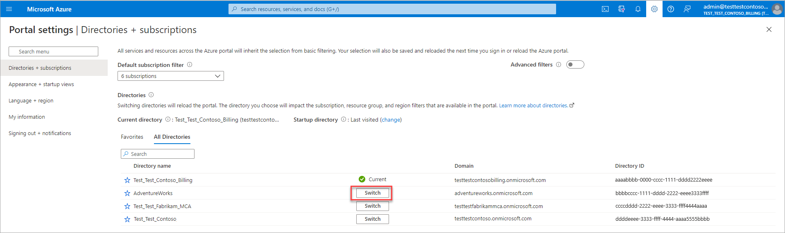

# Get started with your updated Azure billing account

Managing costs and invoices is one of the key components of your cloud experience. It helps you control and understand your spending on cloud. To make it easier for you to manage your costs and invoices, Microsoft is updating your Azure billing account to include enhanced cost management and billing capabilities. This article describes the updates to your billing account and walks you through the new capabilities.

> [!IMPORTANT]
> Your account will get updated when you receive an email from Microsoft notifying you about the updates to your account. The notification is sent 60 days before your account is updated.

## More flexibility with your new billing account

The following diagram compares your old and the new billing account:

:::image type="content" source="./media/mosp-new-customer-experience/comparison-old-new-account.png" alt-text="Diagram showing the comparison between billing hierarchy in the old and the new account." border="false" lightbox="./media/mosp-new-customer-experience/comparison-old-new-account.png":::

Your new billing account contains one or more billing profiles that let you manage your invoices and payment methods. Each billing profile contains one or more invoice sections that let you organize costs on the billing profile's invoice.

:::image type="content" source="./media/mosp-new-customer-experience/new-billing-account-hierarchy.png" alt-text="Diagram showing the new billing hierarchy." border="false" lightbox="./media/mosp-new-customer-experience/new-billing-account-hierarchy.png":::

Roles on the billing account have the highest level of permissions. These roles should be assigned to users that need to view invoices, and track costs for your entire account like finance or IT managers in an organization or the individual who signed up for an account. For more information, see [billing account roles and tasks](../manage/understand-mca-roles.md#billing-account-roles-and-tasks). When your account is updated, the user who has an account administrator role in the old billing account is given an owner role on the new account.

## Billing profiles

A billing profile is used to manage your invoice and payment methods. A monthly invoice is generated at the beginning of the month for each billing profile in your account. The invoice contains respective charges from the previous month for all subscriptions associated with the billing profile.

When your account is updated, a billing profile is automatically created for each subscription. Subscription's charges are billed to its respective billing profile and displayed on its invoice.

Roles on the billing profiles have permissions to view and manage invoices and payment methods. These roles should be assigned to users who pay invoices like members of the accounting team in an organization. For more information, see [billing profile roles and tasks](../manage/understand-mca-roles.md#billing-profile-roles-and-tasks).

When your account is updated, for each subscription on which you've given others permission to [view invoices](download-azure-invoice.md#allow-others-to-download-your-subscription-invoice), users who have an owner, a contributor, a reader, or a billing reader Azure role are given the reader role on the respective billing profile.

## Invoice sections

An invoice section is used to organize the costs on your invoice. For example, you might need a single invoice but want to organize costs by department, team, or project. For this scenario, you have a single billing profile where you create an invoice section for each department, team, or project.

When your account is updated, an invoice section is created for each billing profile and the related subscription is assigned to the invoice section. When you add more subscriptions, you can create more sections and assign the subscriptions to the invoice sections. You'll see the sections on the billing profile's invoice reflecting the usage of each subscription you've assigned to them.

Roles on the invoice section have permissions to control who creates Azure subscriptions. The roles should be assigned to users who set up the Azure environment for teams in an organization like engineering leads and technical architects. For more information, see [invoice section roles and tasks](../manage/understand-mca-roles.md#invoice-section-roles-and-tasks).

## Enhanced features in your new experience

Your new experience includes the following cost management and billing capabilities that make it easy for you to manage your costs and invoices:

#### Invoice management

**More predictable monthly billing period** - In your new account, the billing period begins from the first day of the month and ends at the last day of the month, no matter when you sign up to use Azure. An invoice will be generated at the beginning of each month, and will contain all charges from the previous month.

**Get a single monthly invoice for multiple subscriptions** - In your existing account, you get an invoice for each Azure subscription. When your account is updated, the existing behavior is maintained but you have the flexibility to consolidate the charges of your subscriptions on a single invoice. After you account is updated, follow the steps below to consolidate your charges on a single invoice:

1. Sign in to the [Azure portal](https://portal.azure.com).
2. Search for **Cost Management + Billing**.  
   
3. Select **Azure subscriptions** from the left-side of the screen. 
4. The table lists Azure subscriptions that you're paying for. In the billing profile column, you would find the billing profile that is billed for the subscription. The subscription charges are displayed on the invoice for the billing profile. To consolidate the charges for all your subscriptions on a single invoice, you need to link all your subscriptions to a single billing profile.  
    :::image type="content" source="./media/mosp-new-customer-experience/list-azure-subscriptions.png" alt-text="Screenshot that shows the list of Azure subscriptions." lightbox="./media/mosp-new-customer-experience/list-azure-subscriptions.png" :::
5. Pick a billing profile that you want to use. 
6. Select a subscription that is not linked to the billing profile that you chose in step 5. Select the ellipsis (three dots) for the subscription. Select **Change invoice section**.  
    :::image type="content" source="./media/mosp-new-customer-experience/select-change-invoice-section.png" alt-text="Screenshot that shows where to find the option to change invoice section." lightbox="./media/mosp-new-customer-experience/select-change-invoice-section-zoomed-in.png" :::
7. Select the billing profile that you chose in step #5.  
    :::image type="content" source="./media/mosp-new-customer-experience/change-invoice-section.png" alt-text="Screenshot that shows how to change invoice section." lightbox="./media/mosp-new-customer-experience/change-invoice-section-zoomed-in.png" :::
8. Select **Change**.
9. Repeat steps 6-8 for all other subscriptions. 

**Receive a single monthly invoice for Azure subscriptions, support plans, and Azure Marketplace products** - You'll get one monthly invoice for all charges including usage charges for Azure subscriptions, and support plans and Azure Marketplace purchases.

**Group costs on the invoice based on your needs** - You can group costs on your invoice based on your needs - by departments, projects, or teams.

**Set an optional purchase order number on the invoice** - To associate your invoice with your internal financial systems, set a purchase order number. Manage and update it at any point of time in the Azure portal.

#### Payment management

**Pay invoices immediately using a credit card** - There's no need to wait for the autopayment to be charged to your credit card. You can use any credit card to pay a due or a past due invoice in the Azure portal.

**Keep track of all payments applied to the account** - View all payments applied to your account, including the payment method used, amount paid, and date of payment in the Azure portal.

#### Cost management

**Schedule monthly exports of usage data to a storage account** - Automatically publish your cost and usage data to a storage account on a daily, weekly, or monthly basis.

#### Account and subscription management

**Assign multiple administrators to perform billing operations** - Assign billing permissions to multiple users to manage billing for your account. Get flexibility by giving read, write, or both permissions to others.

**Create more subscriptions directly in the Azure portal** - Create all your subscriptions with a single selection in the Azure portal.

#### API support

**Do billing and cost management operations through APIs, SDK, and PowerShell** - Use cost management, billing, and consumption APIs to pull billing and cost data into your preferred data analysis tools.

**Do all subscription operations through APIs, SDK, and PowerShell** - Use Azure subscription APIs to automate the management of your Azure subscriptions, including creating, renaming, and canceling a subscription.

## Get prepared for your new experience

We recommend the following to get prepared for your new experience:

**Monthly billing period and different invoice date**

In the new experience, your invoice will be generated around the ninth day of each month and it contains all charges from previous month. This date might differ from the date when your invoice is generated in the old account. If you share your invoices with others, notify them of the change in the date.

**Invoices in the first month after migration**

The day your account is updated, your existing unbilled charges are finalized and you'll receive the invoices for these charges on the day when you typically receive your invoices. For example, John has two Azure subscriptions - Azure sub 01 with billing cycle from the fifth day of the month to the fourth day of the next month and Azure sub 02 with billing cycle from the tenth day of a month to the ninth day of next month. John gets invoices for both Azure subscriptions typically on fifth of the month. Now if John's account is updated on April 4th, the charges for Azure sub 01 from March 5th to April 4th and charges for Azure sub 02 from March 10th to April 4th will be finalized. John will receive two invoices, one for each sub on April 5th. After the account is updated, John's billing cycle will be based on calendar month and will cover all charges incurred from the beginning of a calendar month to the end of that calendar month. The invoice for the previous calendar month’s charges are available in the first few days of each month. So in the example above, John will receive another invoice in the beginning of May for the billing period of April 5th to April 30th.

**New billing and cost management APIs**

If you're using Cost Management or Billing APIs to query and update your billing or cost data, then you must use new APIs. The table below lists the APIs that won't work with the new billing account and the changes that you need to make in your new billing account.

|API | Changes  |
|---------|---------|
|[Billing Accounts - List](/rest/api/billing/2019-10-01-preview/billingaccounts/list) | In the Billing Accounts - List API, your old billing account has agreementType **MicrosoftOnlineServiceProgram**, your new billing account would have agreementType **MicrosoftCustomerAgreement**. If you take a dependency on agreementType, update it. |
|[Invoices - List By Billing Subscription](/rest/api/billing/2019-10-01-preview/invoices/listbybillingsubscription)     | This API will only return invoices that were generated before your account was updated. You would have to use [Invoices - List By Billing Account](/rest/api/billing/2019-10-01-preview/invoices/listbybillingaccount) API to get invoices that are generated in your new billing account. |

## Cost Management updates after account update

Your updated Azure billing account for your Microsoft Customer Agreement gives you access to new and expanded Cost Management experiences in the Azure portal that you didn't have with your pay-as-you-go account.

### New capabilities

The following new capabilities are available with your Azure billing account.

#### New billing scopes

As part of your updated account, you have new scopes in Cost Management + Billing. Besides aiding with hierarchical organization and invoicing, they are also a way to view combined charges from multiple underlying subscriptions. For more information about billing scopes, see [Microsoft Customer Agreement scopes](../costs/understand-work-scopes.md#microsoft-customer-agreement-scopes).

You can also access Cost Management APIs to get combined cost views at higher scopes. All Cost Management APIs that use the subscription scope are still available with some minor changes in the schema. For more information about the APIs, see [Cost Management APIs](/rest/api/cost-management/) and [Azure Consumption APIs](/rest/api/consumption/).

#### Cost allocation

With your updated account, you can use cost allocation capabilities to distribute costs from shared services in your organization. For more information about allocating costs, see [Create and manage Azure cost allocation rules](../costs/allocate-costs.md).

#### Power BI

The Cost Management connector for Power BI Desktop helps you build custom visualizations and reports of your Azure usage and spending. You access your cost and usage data after you connect to your updated account. For more information about the Cost Management connector for Power BI Desktop, see [Create visuals and reports with the Cost Management connector in Power BI Desktop](/power-bi/connect-data/desktop-connect-azure-cost-management).

### Updated capabilities

The following updated capabilities are available with your Azure billing account.

#### Cost analysis

You can continue to view and trace your month-over-month consumption costs and now you can view reservation and Marketplace purchase costs in Cost analysis.

With your updated account, you receive a single invoice for all Azure charges. You also now have a simplified single monthly calendar view to replace the billing periods view you had earlier.

For example, if your billing period was November 24 to December 23 for your old account, then after the upgrade the period becomes November 1 to November 30, December 1 to December 31 and so on.

:::image type="content" source="./media/mosp-new-customer-experience/billing-periods.png" alt-text="Screenshot showing a comparison between old and new billing periods." lightbox="./media/mosp-new-customer-experience/billing-periods.png" :::

#### Budgets

You can now create budgets for the billing account, allowing you to track costs across subscriptions. You can also stay on top of your purchase charges using budgets. For more information about budgets, see [Create and manage budgets](../costs/tutorial-acm-create-budgets.md).

#### Exports

Your new billing account provides improved export functionality. For example, you can create exports for actual costs that include purchases or amortized costs (reservation purchase costs spread across the purchase term). You can also create an export for the billing account to get usage and charges data across all subscriptions in the billing account. For more information about exports, see [Create and manage exported data](../costs/tutorial-export-acm-data.md).

> [!NOTE]
> Exports created before your account update with the **Monthly export of last month's costs** type will export data for the last calendar month, not the last billing period.

For example, for a billing period from December 23 to January 22, the exported CSV file would have cost and usage data for that period. After the update, the export will contain data for the calendar month. For example, January 1 to January 31 and so on.

:::image type="content" source="./media/mosp-new-customer-experience/export-amortized-costs.png" alt-text="Screenshots showing a comparison between old and new export details." lightbox="./media/mosp-new-customer-experience/export-amortized-costs.png" :::

## Additional information

The following sections provide additional information about your new experience.

**No service downtime**
Azure services in your subscription will keep running without any interruption. The only update is to your billing experience. There's no impact to existing resources, resource groups, or management groups.

**No changes to Azure resources**
Access to Azure resources that were set using Azure role-based access control (Azure RBAC) isn't affected by the update.

**Past invoices are available in the new experience**
Invoices generated before your account was updated are still available in the Azure portal.

**Invoices for account updated in the middle of the month**
If your account is updated in the middle of the month, you'll get one invoice for charges accumulated until the day your account is updated. You'll get another invoice for the rest of the month. For example, your account has one subscription and it's updated on 15 September. You'll get one invoice for charges accumulated until 15 September. You'll get another invoice for the period between 15 September through 30 September. After September, you'll get one invoice per month.

## Troubleshooting

### You get an email to accept the terms of the Microsoft Customer Agreement but the link in the email doesn't work

After your Azure billing account is updated, you'll get an email from Microsoft to accept the terms of the Microsoft Customer Agreement. The link in the email might not work due to the following reasons:

- You have access to perform billing administration through one of your other emails. 

    This typically happens when you get an email asking you to accept the terms of the Microsoft Customer Agreement. You select the link and you see an error message - `You don't have permission to accept the agreement. This typically happens when you sign in with an email, which doesn’t have permission to accept the agreement. Check you’ve signed in with the correct email address. If you are still seeing the error, see Why I can't accept an agreement`. Verify that you're signed in with the email address that has permission to perform billing administration.

- You have access to the invoice through a different identity. 

    Some customers have two identities with the same email address - a work account and a Microsoft account. Typically, only one of their identities has permissions to perform billing administration. If they sign in with the identity that doesn't have permission, they would not be able to accept the terms. Verify that you're using the correct identity to sign in.

- You have signed in to the incorrect Azure Active Directory (Azure AD) tenant. 

    Your billing account is associated with an Azure AD tenant. If you're signed in to an incorrect tenant, you won't be able to accept the terms. Verify that you're signed in to the correct Azure AD tenant. If you aren't signed in to the correct tenant, use the following to switch the tenant in the Azure portal:

    1. Select your email from the top right of the page.

    2. Select **Switch directory**.

        

    3. Select **Switch** for a directory from the **All directories** section.

        

## Need help? Contact support.

If you need help, [contact support](https://portal.azure.com/?#blade/Microsoft_Azure_Support/HelpAndSupportBlade) to get your issue resolved quickly.

## Next steps

See the following articles to learn more about your billing account.

- [Understand administrative roles for your new billing account](../manage/understand-mca-roles.md)
- [Create an additional Azure subscription for your new billing account](../manage/create-subscription.md)
- [Create sections on your invoice to organize your costs](../manage/mca-section-invoice.md)