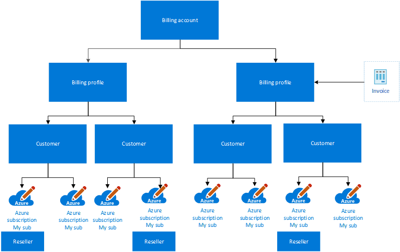
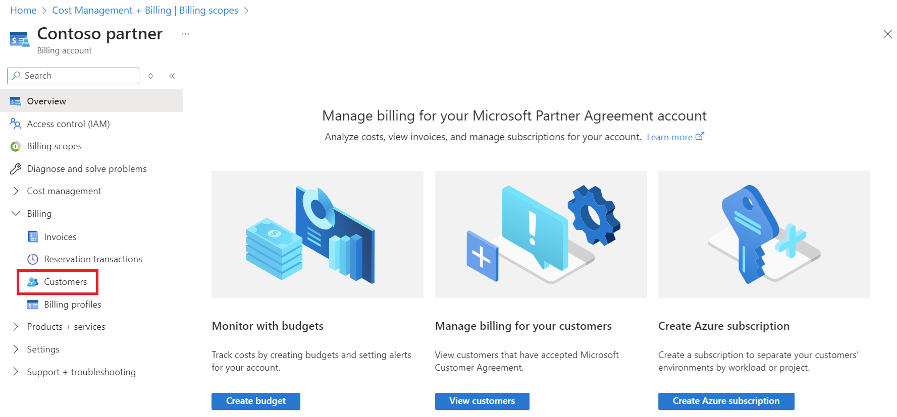
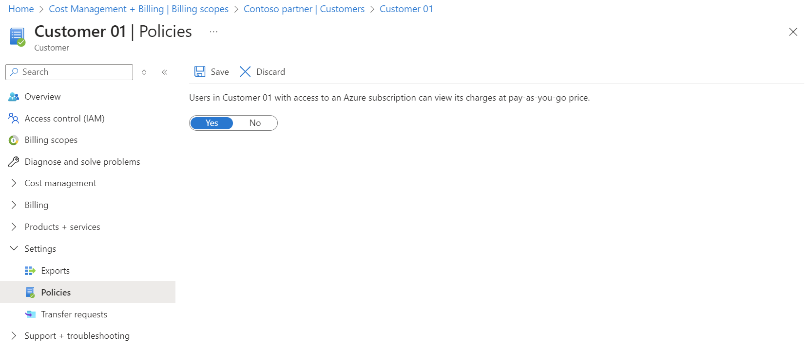

# Get started with your Microsoft Partner Agreement billing account

A billing account is created when you sign up to use Azure. You use your billing account to manage invoices, payments, and track costs. You can have access to multiple billing accounts. For example, you might have signed up for Azure for your personal projects. You could also have access to Azure through your organization's Enterprise Agreement, Microsoft Customer Agreement or Microsoft Partner Agreement. For each of these scenarios, you would have a separate billing account.

This article applies to billing accounts for Microsoft Partner Agreements. These accounts are created for Cloud Solution Providers (CSPs) to manage billing for their customers in the new commerce experience. The new experience is only available for partners, who have at least one customer that has accepted a Microsoft Customer Agreement and has an Azure Plan. [Check if you have access to a Microsoft Partner Agreement](#check-access-to-a-microsoft-partner-agreement). An [Azure plan](https://azure.microsoft.com/pricing/purchase-options/microsoft-customer-agreement/) gives customers access to Azure services at pay-as-you-go rates under a Microsoft Customer Agreement.

## Your billing account

Your billing account for the Microsoft Partner Agreement contains a billing profile for each currency that you do business in. The billing profile lets you manage your invoices for its currency. When you establish relationships with customers, depending on their currencies, Azure subscriptions and other purchases are billed to the respective billing profiles.

The following diagram shows the relationship between a billing account, billing profiles, customers, and resellers.

Users with  **Global Admin** and **Admin Agents** role in your organization can manage billing accounts, billing profiles and customers. To learn more, see [Partner Center - Assign users roles and permissions](https://docs.microsoft.com/partner-center/permissions-overview).

## Billing profiles

Use a billing profile to manage your invoices for a currency. A monthly invoice is generated at the beginning of the month for each billing profile in your account. The invoice contains charges in the billing profile's currency for all Azure subscriptions and other purchases from the previous month.

You can view the invoice and download the related documents like usage file and price sheet in the Azure portal. For more information, see [Download invoices for a Microsoft Partner Agreement](download-azure-invoice.md).

> [!IMPORTANT]
>
> The invoices for billing profiles contain charges for customers with Azure Plans as well as SaaS, Azure marketplace, and reservation purchases for customers who haven't accepted Microsoft Customer Agreement and don't have Azure plans.

## Customers

You can view and manage customers who have accepted a Microsoft Customer Agreement and have an Azure Plan in the Azure portal. You can view charges and transactions as well as create and manage Azure subscriptions for these customers.

### Enable policy to give visibility into cost

Apply policy to control if users in customers' organization can view and analyze cost at Pay-As-You-Go rates for their Azure consumption. By default, the policy is turned off and users can't view the cost. Once enabled, the users who have appropriate [Azure RBAC](https://docs.microsoft.com/azure/role-based-access-control/overview) access on a subscription can view and analyze the cost for the subscription.

To turn on the policy:

1. Sign in to the [Azure portal](https://portal.azure.com).

1. Search on **Cost Management + Billing**.

   

1. Select **Customers** from the left-hand side and then select a customer from the list.

   

1. Select **Policies** from the left-hand side.

   

1. Select **Yes**.

## Resellers

Indirect providers in the CSP [two-tier model](https://docs.microsoft.com/partner-center) can select a reseller while creating subscriptions for customers in the Azure portal. Post creation, they can view the list of subscriptions, filtered by a reseller and analyze cost for a customer by resellers in the Azure cost analysis.

## Check access to a Microsoft Partner Agreement
[!INCLUDE [billing-check-mpa](../../../includes/billing-check-mpa.md)]

## Need help? Contact support

If you need help, [contact support](https://portal.azure.com/?#blade/Microsoft_Azure_Support/HelpAndSupportBlade) to get your issue resolved quickly.

## Next steps

See the following articles to learn about your billing account:

- [Create an additional Azure subscription for Microsoft Partner Agreement](../manage/create-subscription.md)
- Integrate billing data with your own reporting system using the [Azure Billing APIs](https://docs.microsoft.com/rest/api/billing/)
- [Azure Cost Management quickstart guide for partners](https://go.microsoft.com/fwlink/?linkid=2106482)
