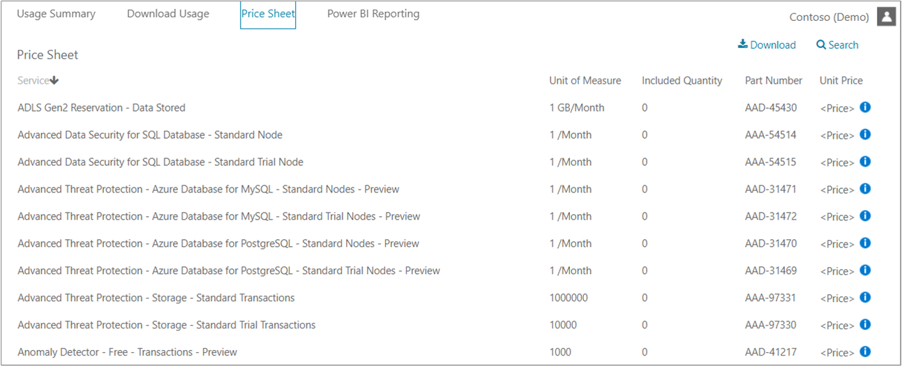
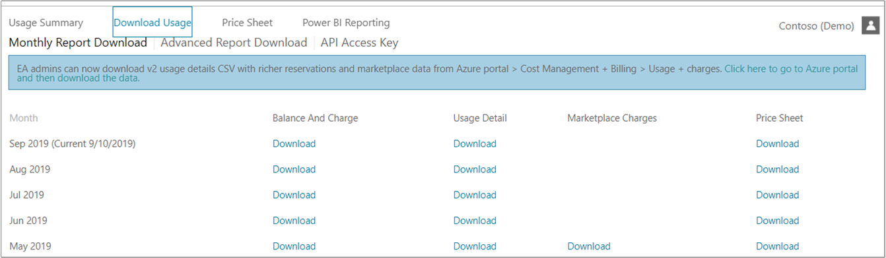

# Understand your Azure Enterprise Agreement bill

Azure customers with an Enterprise Agreement receive an invoice when they exceed the organization's credit or use services that aren't covered by the credit.

Your organization's credit includes your Azure Prepayment (previously called monetary commitment). Azure Prepayment is the amount your organization paid upfront for usage of Azure services. You can add Azure Prepayment funds to your Enterprise Agreement by contacting your Microsoft account manager or reseller.

This tutorial applies only to Azure customers with an Azure Enterprise Agreement.

In this tutorial, you learn how to:

> [!div class="checklist"]
> * Review invoiced charges
> * Review service overage charges
> * Review Marketplace invoice

## Prerequisites

To review and verify the charges on your invoice, you must be an Enterprise Administrator. For more information, see [Understand Azure Enterprise Agreement administrative roles in Azure](../manage/understand-ea-roles.md). If you don't know who the Enterprise Administrator is for your organization, [contact support](https://portal.azure.com/?#blade/Microsoft_Azure_Support/HelpAndSupportBlade).

## Review invoiced charges for most customers

This section doesn't apply to Azure customers in Australia, Japan, or Singapore.

You receive an Azure invoice when any of the following events occur during your billing cycle:

- **Service overage**: Your organization's usage charges exceed your credit balance.
- **Charges billed separately**: The services your organization used aren't covered by the credit. You're invoiced for the following services despite your credit balance:
    - Canonical
    - Citrix XenApp Essentials
    - Citrix XenDesktop
    - Registered User
    - Openlogic
    - Remote Access Rights XenApp Essentials Registered User
    - Ubuntu Advantage
    - Visual Studio Enterprise (Monthly)
    - Visual Studio Enterprise (Annual)
    - Visual Studio Professional (Monthly)
    - Visual Studio Professional (Annual)
- **Marketplace charges**: Azure Marketplace purchases and usage aren't covered by your organization's credit. So, you're invoiced for Marketplace charges despite your credit balance. In the Enterprise Portal, an Enterprise Administrator can enable and disable Marketplace purchases.

Your invoice will display Azure usage charges with costs associated to them first, followed by any marketplace charges. If you have a credit balance, it's applied to Azure usage and your invoice will display Azure usage and marketplace usage without any cost last.

Compare your combined total amount shown in the Enterprise portal in **Reports** > **Usage Summary** with your Azure invoice. The amounts in the **Usage Summary** don't include tax.

Sign in to the [Azure EA portal](https://ea.azure.com). Then, select **Reports**. On the top-right corner of the tab, switch the view from **M** to **C** and match the period on the invoice.  

The combined amount of **Total Usage** and **Azure Marketplace** should match the **Total Extended Amount** on your invoice. To get more details about your charges, go to **Download Usage**.  

## Review invoiced charges for other customers

This section only applies to Azure customers in Australia, Japan, or Singapore.

You receive one or more Azure invoices when any of the following events occur:

- **Service overage**: Your organization's usage charges exceed your credit balance.
- **Charges billed separately**: The services your organization used aren't covered by the credit. You're invoiced for the following services:
    - Canonical
    - Citrix XenApp Essentials
    - Citrix XenDesktop
    - Registered User
    - Openlogic
    - Remote Access Rights XenApp Essentials Registered User
    - Ubuntu Advantage
    - Visual Studio Enterprise (Monthly)
    - Visual Studio Enterprise (Annual)
    - Visual Studio Professional (Monthly)
    - Visual Studio Professional (Annual)
- **Marketplace charges**: Azure Marketplace purchases and usage aren't covered by your organization's credit and are billed separately. In the Enterprise Portal, an Enterprise Administrator can enable and disable Marketplace purchases.

When you have charges due for service overages and charges that are billed separately during the billing period, you get one invoice. It includes both types of charges. Marketplaces charges are always invoiced separately.

## Review service overage charges for other customers

This section only applies if you are in Australia, Japan, or Singapore.

Compare your total usage amount in the Enterprise portal in **Reports** > **Usage Summary** with your service overage invoice. The service overage invoice includes usage that exceeds your organization's credit, and/or services that aren't covered by the credit. The amounts on the **Usage Summary** don't include tax.

Sign in to the [Azure EA portal](https://ea.azure.com) then select **Reports**. On the top-right corner of the tab, switch the view from **M** to **C** and match the period on the invoice.  

The **Total Usage** amount should match the **Total Extended Amount** on your service overage invoice. To get more information about your charges, go to **Download Usage** > **Advanced Report Download**. The report doesn't include taxes or charges for reservations or marketplace charges.  

The following table lists the terms and descriptions shown on the invoice and on the **Usage Summary** in the Enterprise portal:

|Invoice term|Usage Summary term|Description|
|---|---|---|
|Total Extended Amount|Total Usage|The total pre-tax usage charge for the specific period before the credit is applied.|
|Commitment Usage|Commitment Usage|The credit applied during that specific period.|
|Total Sale|Total Overage|The total usage charge that exceeds your credit amount. This amount doesn't include tax.|
|Tax Amount|Not applicable|Tax that applies to the total sale amount for the specific period.|
|Total Amount|Not applicable|The amount due for the invoice after the credit is applied and tax is added.|

### Review Marketplace invoice

This section only applies if you are in Australia, Japan, or Singapore.

Compare your Azure Marketplace total on **Reports** > **Usage Summary** in the Enterprise portal with your marketplace invoice. The marketplace invoice is only for Azure Marketplace purchases and usage. The amounts on the **Usage Summary** already include a tax which is determined by the publisher.

Sign in to the [Enterprise portal](https://ea.azure.com) and then select **Reports**. On the top-right corner of the tab, switch the view from **M** to **C** and match the period on the invoice.  

  

The **Azure Marketplace** total should match the **Total Sale** on your marketplace invoice. To get more information about your usage-based charges, go to **Download Usage**. Under **Marketplace Charges**, select **Download**. The marketplace price includes a tax as determined by the publisher. Customers won't receive a separate invoice from the publisher to collect tax on the transaction.

## View price sheet information

Enterprise administrators can view the price list associated with their enrollment for Azure services.

To view the current price sheet:

1. In the Azure Enterprise portal, select **Reports** and then select **Price Sheet**.
2. View the price sheet or select **Download**.

To download a historical price list:

1. In the Azure Enterprise portal, select **Reports** and then select **Download Usage**.
2. Download the price sheet.

Some reasons for differences in pricing:

- Pricing might have changed between the previous enrollment and the new enrollment. Price changes can occur because pricing is contractual for specific enrollment from the start date to end date of an agreement.
- When you transfer to new enrollment, the pricing changes to the new agreement. The pricing is defined by your price sheet, which might be higher in the new enrollment.
- If an enrollment goes into an extended term, the pricing also changes. Prices change to pay-as-you-go rates.

## Request detailed usage information

Enterprise administrators can view a summary of their usage data, Azure Prepayment consumed, and charges associated with additional usage in the Azure Enterprise portal. The charges are presented at the summary level across all accounts and subscriptions.

To view detailed usage in specific accounts, download the usage detail report by going to **Reports** > **Download Usage**.

> [!NOTE]
> The usage detail report doesn't include any applicable taxes. There might be a latency of up to eight hours from the time usage was incurred to when it's reflected on the report.

For indirect enrollments, your partner needs to enable the markup function before you can see any cost-related information.

## Reports

Enterprise administrators can view a summary of their usage data, Azure Prepayment consumed, and charges associated with additional usage in the Azure Enterprise portal. The charges are presented at the summary level across all accounts and subscriptions.

### Azure Enterprise reports

- Usage summary and graphs
- Service usage report
- Balance and charge report
- Usage detail report
- Azure Marketplace charges report
- Price sheet
- Advanced report download
- CSV report formatting

### To view the usage summary reports and graphs:

1. Go to the Azure Enterprise portal.
1. Select **Reports** on the left pane.
1. Select the **Usage Summary** tab.
1. Select the commitment term from the date ranges menu on the top left.
1. Select the period or month on the graph to view additional detail.
1. On this tab, you can:
   - View a graph of month-over-month usage with a breakdown of usage, service overcharge, charges billed separately, and Azure Marketplace charges.
   - Filter by departments, accounts, and subscriptions below the graph.
   - Toggle between **Charge-by-Services** breakdown and **Charge-by-Hierarchy** breakdown.
   - View the details of Azure services, charges billed separately, and Azure Marketplace charges.

## Service usage report

The service usage report page allows enterprise administrators to view a summary of their service usage data. Usage is presented at the summary level across all accounts and subscriptions. To view detailed usage, you can filter the report by accounts or subscriptions.

> [!NOTE]
> There may be a latency of up to five days between the incurred usage date and when that usage is reflected on this report.

### To view the report:

1. Sign in to the Azure Enterprise portal.
1. Select **Reports** on the left navigation.
1. Select the **Usage Summary** tab.
1. Select the date range.
1. Choose which accounts or subscriptions to view.
1. Optionally, you can:
   - Change the view between **Charge by Services** and **Charge by Hierarchy** to display different breakdowns.
   - View details of Service Name, Unit of Measure, Consumed Units, Effective Rate, and Extended Cost.

## Download CSV reports

The monthly report download page allows enterprise administrators to download several reports as CSV files. Downloadable reports include:

- Balance and charge report
- Usage detail report
- Azure Marketplace charges report
- Price sheet

### To download reports:

1. From the Azure Enterprise portal, select **Report**.
1. Select **Usage Download** from the top ribbon.
1. Select **Download** next to the appropriate month's report.

### CSV report formatting issues

Customers viewing the Azure Enterprise portal's CSV reports in euros might encounter formatting issues that involve commas and periods.

For example, you may see:

| **ServiceResource** | **ResourceQtyConsumed** | **ResourceRate** | **ExtendedCost** |
| --- | --- | --- | --- |
| Hours | 24 | 0,0535960591133005 | 12,863,054,187,192,100,000,000 |

You should see:

| ServiceResource | ResourceQtyConsumed | ResourceRate | ExtendedCost |
| --- | --- | --- | --- |
| Hours | 24 | 0,0535960591133005 | 1,2863054187192120000000 |

This formatting issue occurs because of default settings in Excel's import functionality. Excel imports all fields as 'General' text and assumes that a number is separated in the mathematical standard. For example: "1,000.00".

If a European currency uses a period (.) for the thousandth place separator and a comma for the decimal place separator (,), it will display incorrectly. For example: "1.000,00". The import results may vary depending on your regional language setting.

### To import the CSV file without formatting issues:

1. In Microsoft Excel, go to **File** > **Open**.
   The Text Import Wizard will appear.
1. Under **Original Data Type**, choose **delimited**.  Default is **Fixed Width**.
1. Select **Next**.
1. Under Delimiters, select the check box for **Comma**. Clear **Tab** if it's selected.
1. Select **Next**.
1. Scroll over to the **ResourceRate** and **ExtendedCost** columns.
1. Select the **ResourceRate** column. It appears  highlighted in black.
1. Under the **Column Data Format** section, select **Text** instead of **General**. The column header will change from **General** to **Text.**
1. Repeat steps 8 and 9 for the **Extended Cost** column, and then select **Finish**.

> [!TIP]
> If you have set CSV files to automatically open in Excel, you must use the **Open** function in Excel instead. In Excel, go to **File** > **Open**.

## Balance and charge report

The balance and charge report offers a monthly summary of information on balances, new purchases, Azure Marketplace service charges, adjustments, and overage charges.

All rows in the Azure Service Commitment summary table remain static month-over-month. You'll find  details for all purchases and adjustments under the **New Purchase Details** and **Adjustment Details** sections.

### Download the balance and charge report

1. Sign in to the Azure Enterprise portal as an enterprise administrator.
1. Select **Reports** on the left pane.
1. Select the **Report Download** tab.
1. Select the appropriate month under the **Balance and Charge** column and select to download the report.

## Usage detail report

The usage detail report offers a monthly summary of an enrollments consumption of services and quantities. It includes information on meter names, meter types, and consumed quantities.

### Download the usage detail report

1. Sign in to the Azure Enterprise portal as an enterprise administrator.
1. Select **Reports** on the left navigation.
1. Select the **Download Usage** tab.
1. Select the appropriate month under the **Usage Detail** column and select to download the report.

## Azure Marketplace charges in Azure Enterprise portal reports

There are two types of Azure Marketplace charges:

- **Usage-based:** Products measured in transactional units.  For example, virtual machines are charged hourly, Bing API searches are charged by number of searches.
- **Monthly fee:** Billed monthly based on usage or access.

For more information on Azure Marketplace charges, see the [Azure Marketplace FAQs](https://azure.microsoft.com/marketplace/faq/).

To view the different charges in the Azure Enterprise portal:

- **Usage summary report**: Shows **both** usage based and monthly fee Azure Marketplace charges.
- **Marketplace charges report**: Shows **only** the usage-based Azure Marketplace charges.  One-time fees aren't shown.

> [!NOTE]
> Azure Marketplace is not available for MPSA enrollments.

## Advanced report download

For reporting on specific date ranges or accounts, you can use the advanced report download. As of August 30, 2016, the format of the output file is CSV to accommodate larger record sets.

1. In the Azure Enterprise portal, select **Advanced Report Download**.
1. Select **Appropriate Date Range**.
1. Select **Appropriate Accounts**.
1. Select **Request Usage Data**.
1. Select **Refresh** button until the report status updates to **Download**.
1. Download the report.

## Reporting for non-enterprise administrators

Enterprise administrators can give department administrators (DA) and account owners (AO) permissions to view charges on an enrollment. Account owners with access are able to download CSV reports specific to their account and subscriptions. They can also view the information visually under the reporting section of the Azure Enterprise portal.

### To enable access:

 1. Sign in to the Azure Enterprise portal as an enterprise administrator.
 1. Select **Manage** on the left navigation.
 1. Select the **Enrollment** tab.
 1. Under the **Enrollment Detail** section, select the pencil icon next to **DA View Charges** or **AO View Charges**.
 1. Select **Enabled**.
 1. Select **Save**.

### To view reports:

1. Sign in to the Azure Enterprise portal as a department administrator or an account owner.
1. Select **Reports** on the left navigation.
1. Select the **Usage Summary** tab to view information on the account and subscription visually.
1. Select **Usage Download** to view the CSV reports.

Department administrators and account owners are unable to view charges when using the **Advanced Report Download** function. Costs display as $0.

Account owner permissions to view charges extend to account owners and all users who have permissions on associated subscriptions. If you're an indirect customer, cost features must be enabled by your channel partner.

## Power BI reporting

Power BI reporting is available for EA direct, partner, and indirect customers who have access to view billing information.

### Power BI Pro

Power BI Pro is available for EA customers. With Power BI Pro, you can generate and share reports to effectively manage your cost data. It also has additional collaboration and data refresh features. Power BI Pro offers higher data capacity and data streaming limits.

<!--We plan to add new cost management features for Azure Enterprise customers.

Current Power BI (free) users who use the Microsoft Azure Consumption Insights content pack can get a 60-day free trial of Power BI Pro. After the trial is over, you can continue using Power BI Pro by adding a license.

To sign up for the free Power BI Pro trial:

1. From the gear icon in Power BI, select **Manage personal storage**.
1. Select **Try Pro for free** on the right.

See [Power BI self-service sign up](https://powerbi.microsoft.com/documentation/powerbi-service-self-service-signup-for-power-bi/#power-bi-pro-60-day-trial) for more information on the Power BI Pro free trial.

### Azure EA Power BI Pro trial terms

- **General purpose**: The extended Power BI Pro for the "Microsoft Azure Enterprise" content pack trial offer (the "Offer") is available to existing qualified users during the term of the Offer, to allow them to access certain insights related to their Azure consumption through the use of a specific Power BI content pack.
- **Eligibility**: Users under an Enterprise Agreement (EA) can participate in the Offer if they have a function related to their organization's Azure billing, service, or cost management.
- **Exclusions**:
  - Users already participating in the Extended Power BI Pro trial will continue to qualify under the pre-existing offer and can't enter into the Azure EA Power BI Pro trial offer.
  - Users participating in the Offer can only use Power BI Pro with the Microsoft Azure Enterprise content pack. Any other use of Power BI Pro is prohibited.
  - Term: The Offer began on June 1, 2017 and ended on May 31, 2018.  Acceptance can occur at any time during the 12-month period, though the offer will terminate on May 31, 2018 for all users regardless of when they accepted the Offer.
  -->

### To access Microsoft Azure Consumption Insights:

1. Go to [Microsoft Azure Consumption Insights](https://app.powerbi.com/getdata/services/azureconsumption?cpcode=MicrosoftAzureConsumptionInsights&amp;getDataForceConnect=true&amp;WT.mc_id=azurebg_email_Trans_33675_1378_Service_Notice_EA_Customer_Power_BI_EA_Content_Pack_Apr26).
1. Select **Get It Now**.
1. Provide an enrollment number and the number of months, and then select **Next**.
1. Provide your API access key to connect. You can find the key for your enrollment in the [Enterprise portal](https://ea.azure.com/?WT.mc_id=azurebg_email_Trans_33675_1378_Service_Notice_EA_Customer_Power_BI_EA_Content_Pack_Apr26).
1. Select **Sign In** to automatically start the import process.
1. When complete, a new dashboard, report, and model appear in the navigation pane. Select the dashboard to view your imported data.

> [!TIP]
>
> - To learn how to generate the API key for your enrollment, see the API Reports help file on the [Enterprise portal](https://ea.azure.com/?WT.mc_id=azurebg_email_Trans_33675_1378_Service_Notice_EA_Customer_Power_BI_EA_Content_Pack_Apr26).
> - For more information about connecting Power BI to your Azure consumption, see [Microsoft Azure Consumption Insights](/power-bi/desktop-connect-azure-cost-management).

### To access the legacy Power BI EA content pack:

1. Go to the [Power BI website](https://app.powerbi.com/getdata/services/azure-enterprise).
1. Sign in with a valid work or school account.

   The work or school account can be the same or different than what you use to access the enrollment through the Azure Enterprise portal.
1. On the dashboard of services, select **Microsoft Azure Enterprise** and select **Connect**.
1. On the **Connect to Azure Enterprise** screen, fill in the fields:
    - Azure Environment URL: [https://ea.azure.com](https://ea.azure.com/)
    - Number of Months: from 1 to 36
    - Enrollment Number: your enrollment number
1. Select **Next**.
1. In **Authentication Key Box**, enter the API key.

    You can get the API key in the Azure Enterprise portal under the **Download Usage** tab. Select **API Access Key**, and then paste the key into the **Account Key** box.
1. Data takes approximately 5-30 minutes to load in Power BI, depending on the size of the data sets.

### Glossary of processes for calculating the resource rate

- **Total RAW Units:** Consumed quantity in the detailed usage report.
- **MOCP Resource Per Unit:** The upstream usage system emits the usages for each service in different units. (Preset)
- **Consumption Per Unit:** Azure Enterprise unit of measure. (Preset)
- **Price:** Unit price from the Azure Enterprise portal.
- **Total Cost:** Extended cost from the detailed usage report, or the commitment usage plus overage from the Azure Enterprise portal.

### Charges calculations

- **Convert to consumed MOCP resources** = `ROUND(Total RAW Units * MOCP Resource Per Unit,4)`
- **Convert to consumed units** = `Consumed MOCP Resources / Consumption per Unit`
- **Calculate total cost** = `Consumed Units * Price`

### Logic in the Usage Calculation Logic

**Resource Rate** = `Total Cost /(Total RAW Units / MOCP Resource Per Unit)`

The resource rate is derived based on your charges. It might not match the actual unit price in the price sheet.

In the download usage data report, you can see raw resource usage up to six decimal places. This data is used for overage charge calculations. However, usage data shown in the Azure Enterprise portal is rounded to four decimal places for commitment units and truncated to zero decimals for overage units. Under the Azure Enterprise portal, all overage usage is charged for full units only. You might see a large difference between the unit price and the resource rate for usage that is charged as overage or in mixed months.

## Next steps

In this tutorial, you learned how to:

> [!div class="checklist"]
> * Review invoiced charges
> * Review service overage charges
> * Review Marketplace invoice

Continue to the next article to learn more using the Azure EA portal.

> [!div class="nextstepaction"]
> [Get started with the Azure EA portal](../manage/ea-portal-get-started.md)