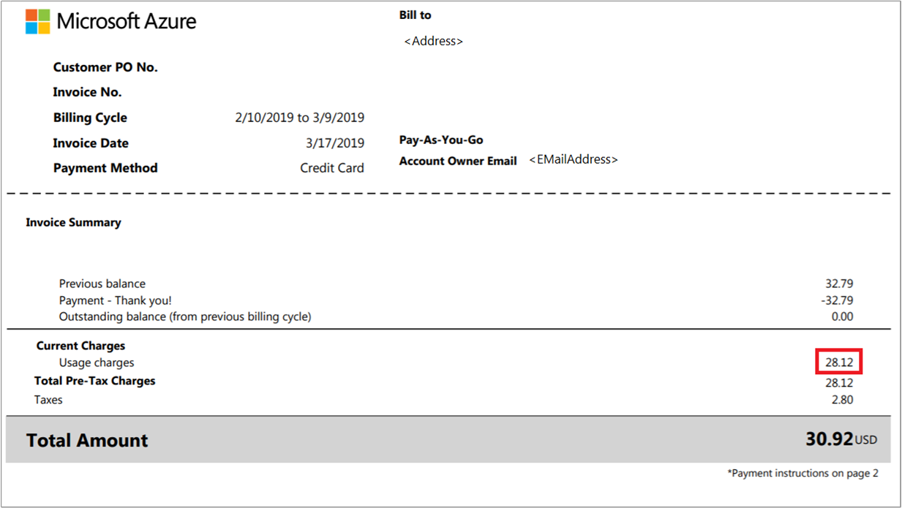
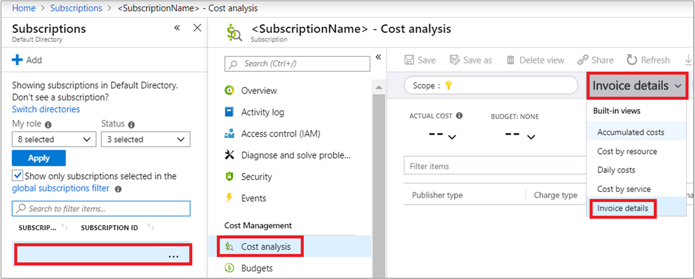

# Tutorial: Review your individual Azure bill

This article helps you understand and review your Azure bill. For each billing period, you normally receive an invoice in email. The invoice is a representation of your Azure bill. The same cost information on the invoice is available in the Azure portal. In this tutorial you will compare your invoice with the detailed daily usage file and with cost analysis in the Azure portal.

This tutorial applies only to Azure customers with an individual subscription. Common individual subscriptions are those with pay-as-you-go rates purchased directly from the Azure website.

In this tutorial, you learn how to:

> [!div class="checklist"]
> * Compare invoiced charges with usage file
> * Compare charges and usage in cost analysis

## Prerequisites

You must have a paid *Microsoft Online Services Program* billing account. The account is created when you sign up for Azure through the Azure website. For example, if you have an [account with pay-as-you-go rates](https://azure.microsoft.com/offers/ms-azr-0003p/) or if you are a [Visual Studio subscriber](https://azure.microsoft.com/pricing/member-offers/credit-for-visual-studio-subscribers/).

Invoices for [Azure Free Accounts](https://azure.microsoft.com/offers/ms-azr-0044p/) are created only when the monthly credit amount is exceeded.

It must be more than 30 days from the day that you subscribed to Azure. Azure bills you at the end of your invoice period.

## Sign in to Azure

- Sign in to the Azure portal at https://portal.azure.com.

## Compare invoiced charges with usage file

The first step to compare usage and costs is to download your invoice and usage files. The detailed usage CSV file shows your charges by billing period and daily usage. It doesn't include any tax information. In order to download the files, you must be an account administrator or have the Owner role.

In the Azure portal, type *subscriptions* in the search box and then click [Subscriptions](https://portal.azure.com/#blade/Microsoft_Azure_Billing/SubscriptionsBlade).

In the list of subscriptions, click the subscription.

Under **Billing**, click **Invoices**.

In the list of invoices, look for the one that you want to download then click the download symbol. You might need to change the timespan to view older invoices. It might take a few minutes to generate the usage details file and invoice.

In the Download Usage + Charges window, click **Download csv** and **Download invoice**.

If it says **Not available** there are several reasons that you don't see usage details or an invoice:

- It's less than 30 days from the day you subscribed to Azure.
- There's no usage for the billing period.
- An invoice isn't generated yet. Wait until the end of the billing period.
- You don't have permission to view invoices. You might not see old invoices unless you're the Account Administrator. To learn more about getting access to billing information, see [Manage access to Azure billing using roles](../manage/manage-billing-access.md).
- If you have a Free Trial or a monthly credit amount with your subscription that you didn't exceed, you won't get an invoice unless you have a Microsoft Customer Agreement.

Next, you review the charges. Your invoice shows values for taxes and your usage charges.

Open the CSV usage file that you downloaded. At the end of the file, sum the value for all items in the *Cost* column.

 The summed *Cost* value should match precisely to the *usage charges* cost on your invoice.

Your usage charges are displayed at the meter level. The following terms mean the same thing in both the invoice and the detailed usage file. For example, the billing cycle on the invoice is the same as the billing period shown in the detailed usage file.

| Invoice (PDF) | Detailed usage (CSV)|
| --- | --- |
|Billing cycle | BillingPeriodStartDate BillingPeriodEndDate |
|Name |Meter Category |
|Type |Meter Subcategory |
|Resource |MeterName |
|Region |MeterRegion |
|Consumed | Quantity |
|Included |Included Quantity |
|Billable |Overage Quantity |
|Rate | EffectivePrice|
| Value | Cost |

The **Usage Charges** section of your invoice shows the total value (cost) for each meter that was consumed during your billing period. For example, the following image shows a usage charge for the Azure Storage service for the *P10 Disks* resource.

In your CSV usage file, filter by *MeterName* for the corresponding Resource shown on you invoice. Then, sum the *Cost* value for items in the column. Here's an example.

The summed *Cost* value should match precisely to the *usage charges* cost for the individual resource charged on your invoice.

For more information, see [Understand your Azure invoice](understand-invoice.md) and [Understand your Azure detailed usage](understand-usage.md).

## Compare charges and usage in cost analysis

Cost analysis in the Azure portal can also help you verify your charges. To get a quick overview of your invoiced usage and charges, select your subscription from the [Subscriptions page](https://portal.azure.com/#blade/Microsoft_Azure_Billing/SubscriptionsBlade) in the Azure portal. Next, click **Cost analysis** and then in the views list, click **Invoice details**.

Next, in the date range list, select a time period for you invoice. Add a filter for invoice number and then select the InvoiceNumber that matches the one on your invoice. Cost analysis shows cost details for your invoiced items.

Costs shown in cost analysis should match precisely to the *usage charges* cost for the individual resource charged on your invoice.

## External services billed separately

External services or marketplace charges are for resources that have been created by third-party software vendors. Those resources are available for use from the Azure Marketplace. For example, a Barracuda Firewall is an Azure Marketplace resource offered by a third-party. All charges for the firewall and its corresponding meters appear as external service charges.

External service charges are billed separately. The charges don't show up on your Azure invoice. To learn more, see [Understand your Azure external service charges](understand-azure-marketplace-charges.md).

### Resources billed by usage meters

Azure doesn't directly bill based on the resource cost. Charges for a resource are calculated by using one or more meters. Meters are used to track a resource’s usage throughout its lifetime. These meters are then used to calculate the bill.

When you create a single Azure resource, like a virtual machine, it has one or more meter instances created. Meters are used to track the usage of the resource over time. Each meter emits usage records that are used by Azure to calculate the bill.

For example, a single virtual machine (VM) created in Azure may have the following meters created to track its usage:

- Compute Hours
- IP Address Hours
- Data Transfer In
- Data Transfer Out
- Standard Managed Disk
- Standard Managed Disk Operations
- Standard IO-Disk
- Standard IO-Block Blob Read
- Standard IO-Block Blob Write
- Standard IO-Block Blob Delete

When the VM is created, each meter begins emitting usage records. This usage and the meter's price is tracked in the Azure metering system.

You can see the meters that were used to calculate your bill in the usage CSV file.

## Pay your bill

If you set up a credit card as your payment method, the payment is charged automatically within 10 days after the billing period ends. On your credit card statement, the line item would say **MSFT Azure**.

To change the credit card that's charged, see [Add, update, or remove a credit card for Azure](../manage/change-credit-card.md).

If you [pay by invoice](../manage/pay-by-invoice.md), send your payment to the location listed at the bottom of your invoice.

To check the status of your payment, [create a support ticket](https://portal.azure.com/?#blade/Microsoft_Azure_Support/HelpAndSupportBlade).

## Next steps

In this tutorial, you learned how to:

> [!div class="checklist"]
> * Compare invoiced charges with usage file
> * Compare charges and usage in cost analysis

Complete the quickstart to start using cost analysis.

> [!div class="nextstepaction"]
> [Start analyzing costs](../costs/quick-acm-cost-analysis.md)
