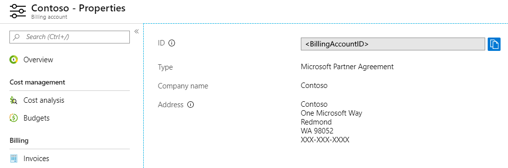
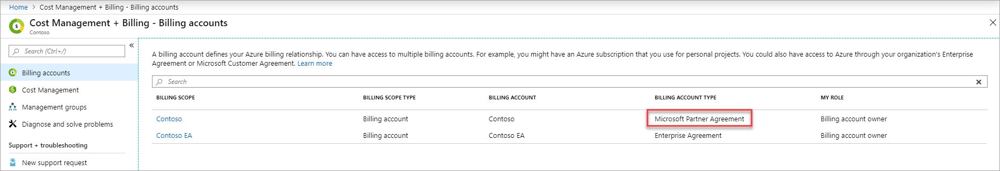
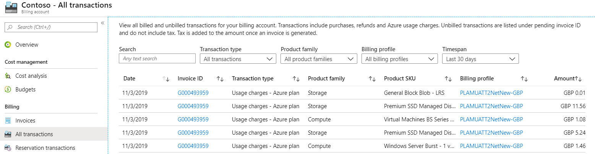

# Tutorial: Review your Microsoft Partner Agreement invoice

 In the billing account for a Microsoft Partner Agreement, an invoice is generated every month for each billing profile. The invoice includes all customer charges from the previous month. You can understand the charges on your invoice by analyzing the individual transactions in the Azure portal. You can also view your invoices in the Azure portal and compare the charges to the usage detail file.

For more information, see [how to download invoices from the Azure portal](download-azure-invoice.md).

This tutorial applies only to Azure partners with an Microsoft Partner Agreement.

In this tutorial, you learn how to:

> [!div class="checklist"]
> * Review invoiced transactions in the Azure portal
> * Review pending charges to estimate your next invoice
> * Analyze your Azure usage charges

## Prerequisites

You must have access to a billing account for a Microsoft Partner Agreement.

It must be more than 30 days from the day that you subscribed to Azure. Azure bills you at the end of your invoice period.

## Sign in to Azure

- Sign in to the Azure portal at https://portal.azure.com.

## Check access to a Microsoft Customer Agreement

Check the agreement type to determine whether you have access to a billing account for a Microsoft Partner Agreement.

In the Azure portal, type *cost management + billing* in the search box and then select **Cost Management + Billing**.

If you have access to just one billing scope, select **Properties** from the left-hand side. You have access to a billing account for a Microsoft Partner Agreement if the billing account type is **Microsoft Partner Agreement**.

If you have access to multiple billing scopes, check the type in the billing account column. You have access to a billing account for a Microsoft Partner Agreement if the billing account type for any of the scopes is **Microsoft Partner Agreement**.

## Review invoiced transactions in the Azure portal

In Cost Management + Billing, select **All transactions** from the left side of the page. Depending on your access, you might have to select a billing account, billing profile, or a customer and then select **All transactions**.

The All transactions page displays the following information:

|Column  |Definition  |
|---------|---------|
|Date     | The date of transaction  |
|Invoice ID     | The identifier for the invoice on which the transaction got billed. If you submit a support request, share the ID with Azure support to expedite your support request |
|Transaction type     |  The type of transaction like purchase, cancel, and usage charges  |
|Product family     | The category of product like compute for Virtual machines or database for Azure SQL database|
|Product SDKU     | A unique code identifying the instance of your product |
|Amount     |  The amount of transaction      |
|Billing profile     | The transaction shows up on this billing profile's invoice |

Search for an invoice ID to filter the transactions for the invoice.

## Review pending charges to estimate your next invoice

Charges are estimated and considered pending until they are invoiced. You can view pending charges for your Microsoft Partner Agreement billing profile in the Azure portal to estimate your next invoice. Pending charges are estimated and they don't include tax. The actual charges on your next invoice will vary from the pending charges.

### View pending transactions

When you identify pending charges, you can understand the charges by analyzing the individual transactions that contributed to the charges. At this point, pending usage charges aren't displayed on the All transaction page. You can view the pending usage charges on the Azure subscriptions page.

In Cost Management + Billing, select a billing profile. Depending on your access, you may have to select a billing account. From the billing account, select **Billing profiles** then select a billing profile.

Select **All transactions** from the left side of the page.

Search for *pending*. Use the **Timespan** filter to view pending charges for current or last month.

<!--  -->

### View pending charges by customer

In Cost Management + Billing, select a billing profile. Depending on your access, you may have to select a billing account. From the billing account, select **Billing profiles** then select a billing profile.

Select **Customers** on the left side of the page.

<!--  -->

The Customers page displays the current and last month's charges for each customer associated with the billing profile. The month-to-date charges are the pending charges for the current month and are billed when the invoice is generated for the month. If the invoice for last month is still not generated, then last month's charges are also pending.

### View pending usage charges

In Cost Management + Billing, select a billing profile. Depending on your access, you may have to select a billing account. From the billing account, select **Billing profiles** then select a billing profile.

Select **Azure subscriptions** on the left side of the page. The Azure subscriptions page displays the current and last month's charges for each subscription in the billing profile. The month-to-date charges are the pending charges for the current month and are billed when the invoice is generated for the month. If the invoice for last month is still not generated, then last month's charges are also pending.

<!--      -->

## Analyze your Azure usage charges

Use the Azure usage and charges CSV file to analyze your usage-based charges. You can filter the Azure usage and charges file to reconcile the usage charges for each product listed in the invoice pdf. To view detailed usage charges for a particular product, filter **product** column in the Azure usage and charges CSV file to only include the name of that product.

You can also filter the **customerName** column in the Azure usage and charges CSV file to view the daily usage charges for each of your customers. If you want to view the daily usage charges by Azure subscription, filter the **subscriptionName** column.

## Pay your bill

Instructions for paying your bill are shown at the bottom of the invoice. You can pay by wire or by check within 60 days of your invoice date.

If you've already paid your bill, you can check the status of the payment on the Invoices page in the Azure portal.

## Next steps

In this tutorial, you learned how to:

> [!div class="checklist"]
> * Review invoiced transactions in the Azure portal
> * Review pending charges to estimate your next invoice
> * Analyze your Azure usage charges

Learn about using Azure Cost Management for partners.

> [!div class="nextstepaction"]
> [Get started with Azure Cost Management for partners](../costs/get-started-partners.md)
