# Understand your Azure external services charges
External services are published by third-party software vendors in the Azure Marketplace. For example, SendGrid is an external service that you can purchase in Azure, but is not published by Microsoft. Some Microsoft products are sold through Azure marketplace, too.

## How external services are billed

- If you have a Microsoft Customer Agreement (MCA) or Microsoft Partner Agreement (MPA), your third-party services are billed with the rest of your Azure services. [Check your billing account type](#check-billing-account-type) to see if you have access to an MCA or MPA.
- If you don't have an MCA or MPA, your external services are billed separately from your Azure services. You'll receive two invoices each billing period: one invoice for Azure services and another for Marketplaces purchases.
- Each external service has a different billing model. Some services are billed in a pay-as-you-go fashion while others have fixed monthly charges.
- You can't use monthly free credits for external services. If you're using an Azure subscription that includes [free credits](https://azure.microsoft.com/pricing/spending-limits/), they can't be applied to charges from external services. When you provision a new external service or resource, a warning is shown:

    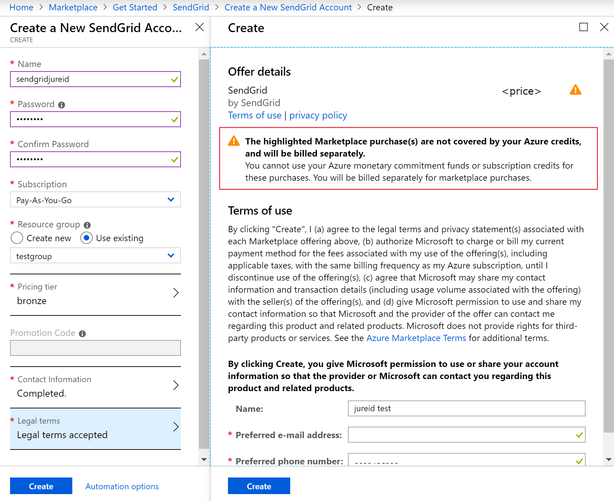

<!-- ## View external service spending and history in the Azure portal
You can view a list of the external services that are on each subscription within the [Azure portal](https://portal.azure.com/):

1. Sign in to the [Azure portal](https://portal.azure.com/) as the account administrator.
2. In the Hub menu, select **Subscriptions**.

    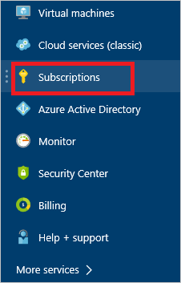
3. In the **Subscriptions** blade, select the subscription that you want to view, and then select **External services**.

    
4. You should see each of your external service orders, the publisher name, service tier you bought, name you gave the resource, and the current order status. To see past bills, select an external service.

    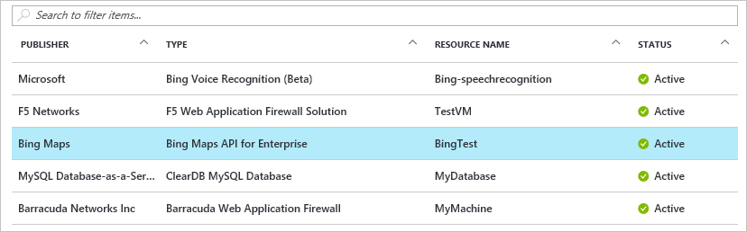
5. From here, you can view past bill amounts including the tax breakdown.

     -->

## External spending for EA customers

EA customers can see external service spending and download reports in the EA portal. See [Azure Marketplace for EA Customers](https://ea.azure.com/helpdocs/azureMarketplace) to get started.

## View and download invoices for external services

If you have a Microsoft Customer Agreement (MCA) or Microsoft Partner Agreement (MPA), your third-party services are billed with the rest of your Azure services on a single invoice. [Check your billing account type](#check-billing-account-type) to see if you have access to an MCA or MPA. If you do, see [View and download invoices in the Azure portal](download-azure-invoice.md) to see your third-party charges.

If you don't have an MCA or MPA, you have separate invoices for third-party charges. 

Azure Marketplace charges are shown in your local currency.

You can view and download your Azure Marketplace invoices from the Azure portal by following these steps:

1. Sign in to the [Azure portal](https://portal.azure.com).
1. Search for **Cost Management + Billing**.
1. In the left menu, select **Invoices**.
1. In the subscription drop-down, select the subscription associated with your Marketplace services.
1. Review the **Type** column in the list of invoices. If an invoice is for a Marketplace service, the type will be **Azure Marketplace and Reservations**. 

    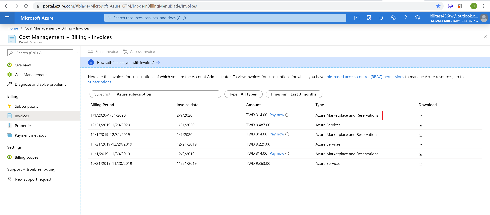

1. To filter by type so that you are only looking at invoices for Azure Marketplace and Reservations, select the **Type** filter. Then select **Azure Marketplace and Reservations** in the drop-down.

    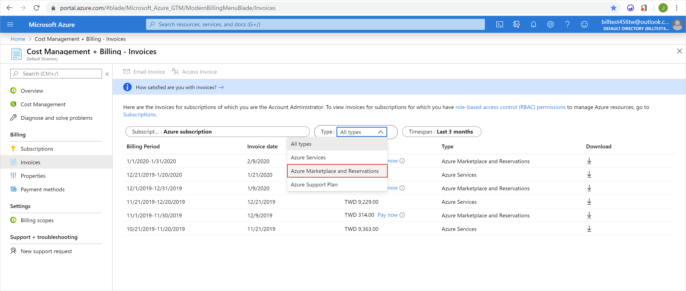

1. Select the download icon on the right for the invoice you want to download.

    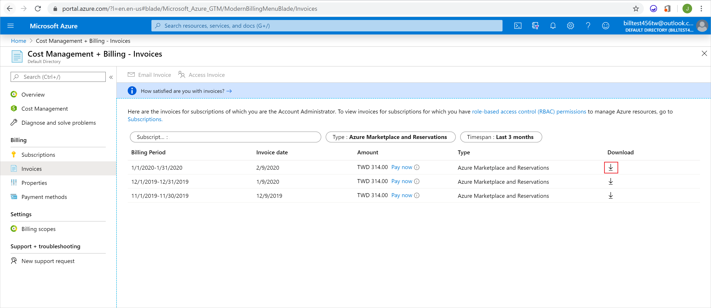

1. Under **Invoice**, select the blue **Download** button.

    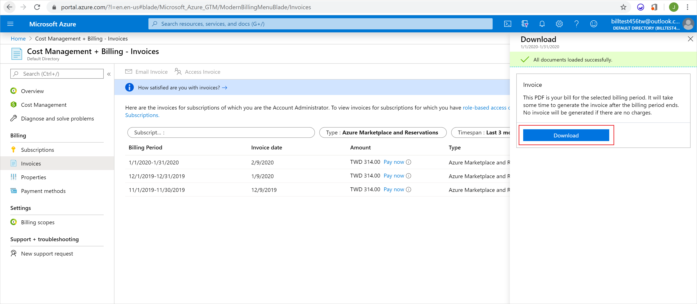

## Pay for external services in the Azure portal

If you have a Microsoft Customer Agreement (MCA) or Microsoft Partner Agreement (MPA), your third-party services are billed with the rest of your Azure services. [Check your billing account type](#check-billing-account-type) to see if you have access to an MCA or MPA. If you do, you can pay for your entire invoice in the Azure portal by following the steps in [Pay your bill for Microsoft Azure](pay-bill.md).

If you don't have an MCA or MPA, you can pay for your Marketplace invoices in the Azure portal by following these steps:

1. Follow the steps in the previous section, [View and download invoices for external services](#view-and-download-invoices-for-external-services), to find your Marketplace invoices.
1. Select the blue **Pay now** link for the invoice you want to pay.

    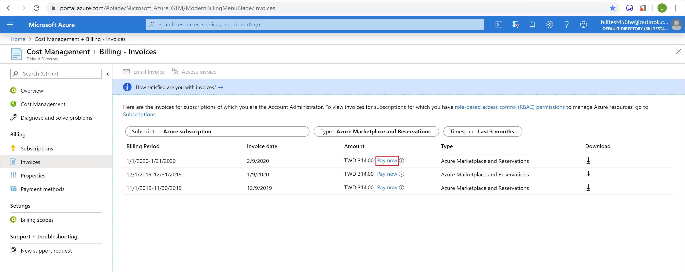

    >[!NOTE]
    > You will only see the **Pay now** link if the type of your invoice is **Azure Marketplace and Reservations** and the invoice payment status is due or past due.

1. In the new page, click the blue **Select payment method** link.

    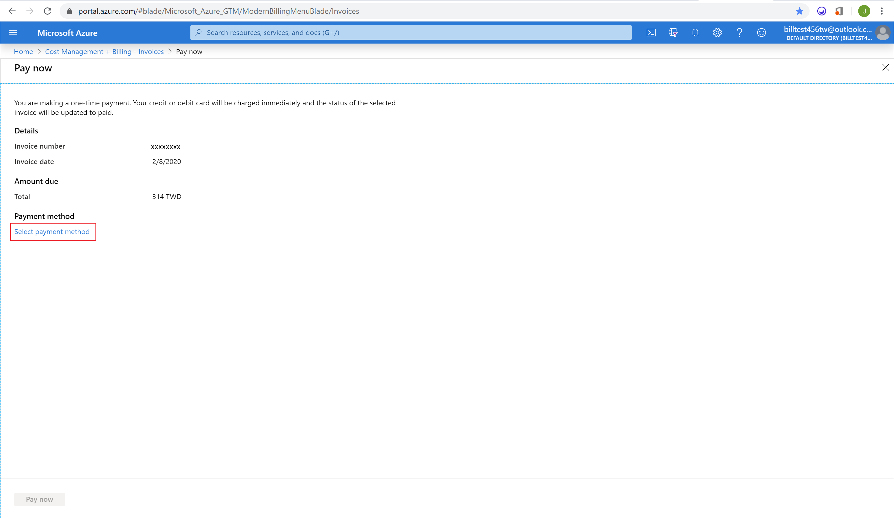

1. After selecting a payment method, click the blue **Pay now** button in the bottom left of the page.
    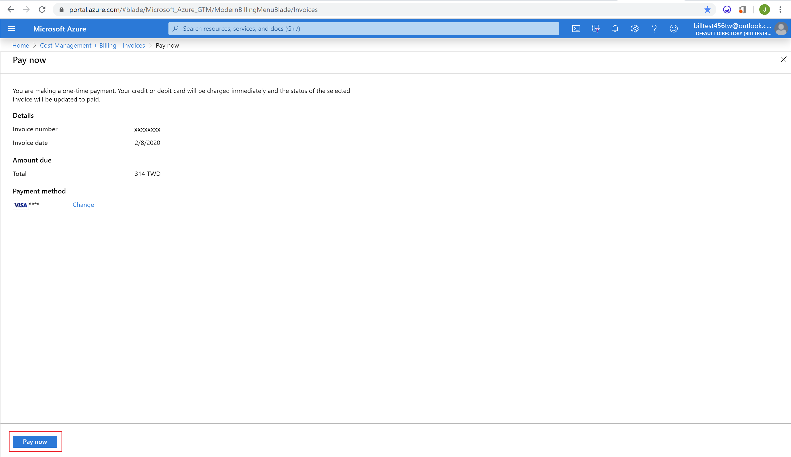

## Change default payment for external services

When purchasing an external service, you choose an Azure subscription for the resource. The payment method of the selected Azure subscription becomes the payment method for the external service. To change the payment method for an external service, you must [change the payment method of the Azure subscription](../manage/change-credit-card.md) tied to that external service. You can figure out which subscription your external service order is tied to by following these steps:

1. Sign in to the [Azure portal](https://portal.azure.com).
1. Click on **All Resources** in the left navigation menu.
     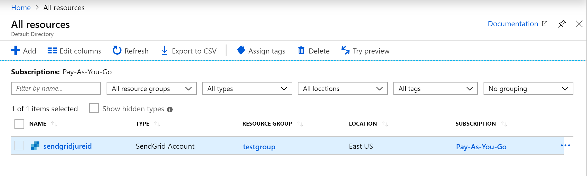
1. Search for your external service.
1. Look for the name of the subscription in the **Subscription** column.
    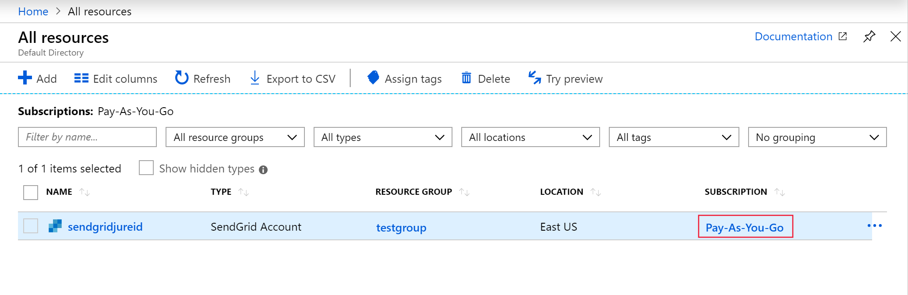
1. Click on the subscription name and [update the active payment method](../manage/change-credit-card.md).

## Cancel an external service order

If you want to cancel your external service order, delete the resource in the [Azure portal](https://portal.azure.com).

1. Sign in to the [Azure portal](https://portal.azure.com).
1. Click on **All Resources** in the left navigation menu.
    
1. Search for your external service.
1. Check the box next to the resource you want to delete.
1. Select **Delete** in the command bar.
    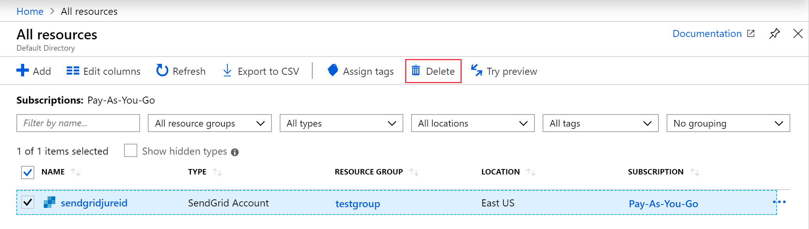
1. Type *'Yes'* in the confirmation blade.
    
1. Click **Delete**.

## Check billing account type
[!INCLUDE [billing-check-account-type](../../../includes/billing-check-mca.md)]

## Need help? Contact us.

If you have questions or need help,  [create a support request](https://go.microsoft.com/fwlink/?linkid=2083458).

## Next steps
- [Start analyzing costs](../costs/quick-acm-cost-analysis.md)
