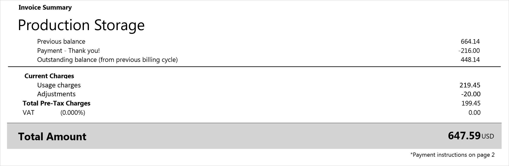

# Understand terms on your Microsoft Azure invoice

The invoice provides a summary of your charges and provides instructions for payment. It’s available for
download in the Portable Document Format (.pdf) from the [Azure portal](https://portal.azure.com/) or can be sent via email. For more
information, see [How to get your Azure billing invoice and daily usage data](../manage/download-azure-invoice-daily-usage-date.md).

A few things to note:

-   If you're using a free trial subscription, you can get your detailed
    usage information from the Azure portal but you don't have an
    invoice.

-   Up to 24 hours of usage at the end of the previous billing period
    may show up in your current invoice.

-   Charges listed on billing statements for international customers are
    for estimation purposes only. Banks may have different costs for the
    conversion rates.

>[!VIDEO https://www.youtube.com/embed/jWG1lyJe3Mg]

## Detailed terms and descriptions of your invoice
The following sections list the important terms that you see on your
invoice and descriptions for each term.

### Account information

The account information section of the invoice is on the top of the
first page and shows information about your profile and subscription.

| Term | Description |
| --- | --- |
| Customer PO No. |An optional purchase order number, assigned by you for tracking |
| Invoice No. |A unique, Microsoft generated invoice number used for tracking purposes |
| Billing cycle |Date range that this invoice covers |
| Invoice date |Date that the invoice was generated, typically a day after end of the Billing cycle |
| Payment method |Type of payment used on the account (invoice or credit card) |
| Bill to |Billing address that is listed for the account |
| Subscription offer (“Pay-As-You-Go”) |Type of subscription offer that was purchased (Pay-As-You-Go, BizSpark Plus, Azure Pass, etc.). For more information, see [Azure offer types](https://azure.microsoft.com/support/legal/offer-details/). |
| Account owner email | The account email address that the Microsoft Azure account is registered under.   To change the email address, see [How to change profile information of your Azure account such as contact email, address, and phone number](../manage/change-azure-account-profile.md). |

### Understand the invoice summary
The **Invoice Summary** section of the invoice lists the total
transaction amounts since your last billing period, and your current
usage charges.

The Subscription name (“Production Storage”) is the name of the
subscription for this invoice.

#### Understand the previous charges
The previous balance, payments, and outstanding balance section of the
invoice summarizes transactions since your last billing period.

| Term | Description |
| --- | --- |
| Previous balance |The total amount due from your last billing period |
| Payments |Total payments and credits applied to your last billing period |
| Outstanding balance (from previous billing cycle) |Any credits or remaining balance in your account since your last billing period |

#### Understand the current charges
The Current Charges section of the invoice shows details about your
monthly charges for the current billing period.

| Term | Description |
| --- | --- |
| Usage charges |Usage charges are the total monthly charges on a subscription for the current billing period|
| Discounts |Service discounts applied to your current billing period|
| Adjustments |Miscellaneous credits (Free Usage, Credits, etc.) or outstanding charges applied to your current billing period.  For example, if you have the Visual Studio Enterprise with MSDN offer, you see a monthly credit. If you cancel your subscription, you see any monthly usage charges that exceed the monthly credit that you get with your subscription offer. The charges incur at the start of your current billing period until the subscription cancellation date. |

#### Sold to and payment instructions

The following table describes the sold to and payment instructions shown
on the second page of your Invoice.

| Term |Description |
| --- | --- |
| Sold to |Profile address that's on the account.   If you need to change the address, see [How to change profile information of your Azure account such as contact email, address, and phone number](../manage/change-azure-account-profile.md).|
| Payment instructions |Instructions on how to pay depending on payment method (such as by credit card or by invoice). |

#### Usage Charges

The Usage charges section of the invoice displays meter level
information on your charges.

The following table describes the usage charges column headers shown on
your Invoice.

| Term |Description |
| --- | --- |
| Name |Identifies the top-level service for the usage |
| Type |Defines the Azure service type that can affect the rate |
| Resource |Identifies the unit of measure for the meter being consumed |
| Region |Identifies the location of the datacenter for certain services that are priced based on datacenter location |
| Consumed |The amount of the meter used during the billing period |
| Included |The amount of the meter that is included at no charge in your current billing period |
| Billable |Shows the difference between the Consumed Quantity and the Included Quantity. You're billed for this amount. For Pay-As-You-Go offers with no amount included with the offer, this total is the same as the Consumed Quantity |
| Rate |The rate you're charged per billable unit |
| Value |Shows the result of multiplying the Overage Quantity column by the Rate column. If the Consumed Quantity doesn't exceed the Included Quantity, there is no charge in this column. |
| Sub-Total |The sum of all your charges pre-tax for this billing period |
| Grand Total |The sum of all your charges after tax for this billing period |

## How do I make sure that the charges in my invoice are correct?
If there is a charge on your invoice that you would like more details
on, see [Understand your bill for Microsoft Azure.](review-individual-bill.md)

## Need help? Contact us.

If you have questions or need help,  [create a support request](https://go.microsoft.com/fwlink/?linkid=2083458).
