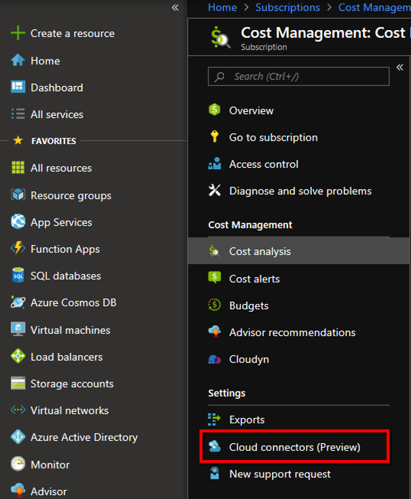

# Set up and configure AWS Cost and Usage report integration

With Amazon Web Services Cost and Usage report integration, you can monitor and control your AWS spending in Azure Cost Management. The integration allows a single location in the Azure portal where you can monitor and control spending for both Azure and AWS. This article explains how to set up the integration and configure it so that you use Cost Management features to analyze costs and review budgets.

Cost Management reads the AWS Cost and Usage report stored in an S3 bucket by using your AWS access credentials to get report definitions and download report GZIP CSV files.

## Create a Cost and Usage report in AWS

Using a Cost and Usage report is AWS recommended way to collect and process AWS costs. For more information, see the [AWS Cost and Usage Report](https://docs.aws.amazon.com/awsaccountbilling/latest/aboutv2/billing-reports-costusage.html) documentation article.

Use the **Reports**  page of the Billing and Cost Management console in AWS to create a Cost and Usage report with the following steps.

1. Sign in to the AWS Management Console and open the Billing and Cost Management console at https://console.aws.amazon.com/billing.
2. In the navigation pane, click **Reports**.
3. Click **Create report**.
4. For **Report name**, type a name for your report.
5. For **Time unit**, choose  **Hourly**.
6. For **Include**, add the IDs of each resource in the report and select  **Resource IDs**.
7. For **Enable support for**, no selection is required.
8. For **Data refresh settings**, select **Automatically refresh your Cost &amp; Usage Report when charges are detected for previous months with closed bills**.
9. Click **Next**.
10. For **Amazon S3 bucket**, type the name of the Amazon S3 bucket where you want reports delivered to and click **Verify**. The bucket must have appropriate permissions to be valid. For more information about adding permissions to the bucket, see [Setting Bucket and Object Access Permissions](http://docs.aws.amazon.com/AmazonS3/latest/user-guide/set-permissions.html).
11. For **Report path prefix**, type the report path prefix that you want to be added to the name of your report.
12. For **Compression**, select **GZIP**.
13. Click **Next**.
14. After you've reviewed the settings for your report, Click **Review and Complete**.
    Note the **Report name**. You will use it in later steps.

It can take up to 24 hours for AWS to start delivering reports to your Amazon S3 bucket. After delivery starts, AWS updates the AWS Cost and Usage report files at least once a day.

## Create a role and policy in AWS

Azure Cost Management accesses the S3 bucket where the Cost and Usage report is located several times a day. Cost Management needs access to credentials to check for new data. You create a Role and Policy in AWS to allow access by Cost Management.

To enable role-based access to an AWS account in Azure Cost Management, the role is created in the AWS console. You need to have the _Role ARN_ and _External ID_ from the AWS console. Later, you use them in the Create an AWS connector page in Azure Cost Management.

1. Sign-in to your AWS console and select **Services**.
2. In the list of services, select **IAM**.
3. Select **Roles** and then click **Create Role**.
4. In the next page, select **Another AWS account**.
5. In **Account ID** , enter _432263259397_.
6. In **Options**, select **Require external ID (Best practice when a third party will assume this role)**.
7. In **External ID**, enter the External ID. The External ID is a shared passcode between the AWS Role and Azure Cost Management. The same External ID is also used in the New Connector page in Cost Management. For example, an External ID resembles _Companyname1234567890123_.
    Do not change the selection for **Require MFA**. It should remain cleared.
8. Click **Next: Permissions**.
9. Click **Create policy**. A new browser tab is opened where you create a new policy.
10. Click **Choose a service**.
11. Type **Cost and Usage Report**.
12. Select **Access level**, **Read** > **DescribeReportDefinitions**. This allows Cost Management read what CUR reports are defined and determine if they match the report definition prerequisite.
13. Click **Add additional permissions**.
14. Click **Choose a service**.
15. Type _S3_.
16. Select **Access level**, **List** > **ListBucket**. This action gets the list of objects in the S3 Bucket.
17. Select **Access level**, **Read** > **GetObject**. This action allows billing files download.
18. Select **Resources**.
19. Select **bucket – Add ARN**.
20. In **Bucket name**, enter the bucket used to store the CUR files.
21. Select **object – Add ARN**.
22. In **Bucket name**, enter the bucket used to store the CUR files.
23. In **Object name**, select **Any**.
24. Click **Add additional permissions**.
25. Click **Choose a service**.
26. Type _Cost Explorer Service_.
27. Select **All Cost Explorer Service actions (ce:\*)**. This action validates that the collection is correct.
28. Click **Add additional permissions**.
29. Type **Organizations**.
30. Select **Access level, List** > **ListAccounts**. This action gets the names of the accounts.
31. In **Review Policy**, enter a name for the new policy. Check to make sure you entered the correct information and then click **Create Policy**.
32. Go back to the previous tab and refresh your browser's web page. In the search bar, search for your new policy.
33. Select **Next:Review**.
34. Enter a name for the new role. Check to make sure you entered the correct information and then click **Create Role**.
    Note the **Role ARN** and the **External ID** used in the preceding steps when you created the Role. You will use them later when you set up the Azure Cost Management connector.

The policy JSON should resemble the following example. Replace _bucketname_ with the name of your S3 bucket.

```JSON
{
    "Version": "2012-10-17",
    "Statement": [
        {
            "Sid": "VisualEditor0",
            "Effect": "Allow",
            "Action": [
"organizations:ListAccounts",
         	"ce:*",
         	"cur:DescribeReportDefinitions"
            ],
            "Resource": "*"
        },
        {
            "Sid": "VisualEditor1",
            "Effect": "Allow",
            "Action": [
                "s3:GetObject",
                "s3:ListBucket"
            ],
            "Resource": [
                "arn:aws:s3:::bucketname",
                "arn:aws:s3:::bucketname/*"
            ]
        }
    ]
}
```

## Set up a new AWS connector in Azure

Use the following information to create a new AWS connector and start monitoring your AWS costs.

1. Sign-in to the Azure portal at https://portal.azure.com.
2. Navigate to **Cost Management + Billing** > **Cost Management**.
3. Under **Settings**, click **Cloud connectors (Preview)**.  
    .
4. Click **+Add** at the top of the page to create a new connector.
5. On the Create an AWS connector page, type a **Display Name** to name your connector.  
    
6. Optionally, select the default management group. It will store all discovered linked accounts. You can set it up later.
7. Under the **Billing** section, select **Automatically charge the 1% at general availability** if you want to ensure continuous operation when the preview expires. If you select the automatic option, you must select a billing **Subscription**.
8. Enter the **Role ARN**. It's the value that you used when you set up the role in AWS.
9. Enter the **External ID**. It's the value that you used when you set up the role in AWS.
10. Enter the **Report Name** that you created in AWS.
11. Click **Next** and then click **Create**.

It might take a few hours for the new AWS scopes, the AWS Consolidated Account and AWS Linked Accounts, and their cost data to appear.

After creating the connector, we recommend that you assign access control to the connector. Users are assigned permissions to the newly discovered scopes: AWS Consolidated Account and AWS Linked Accounts. The user that creates the connector is the owner of the connector, consolidated account, and all linked accounts.

Assigning connector permissions to users after discovery occurs doesn't assign permissions to the existing AWS scopes. Instead, only new linked accounts are assigned permissions.

## Additional steps

- [Set up management groups](../governance/management-groups/index.md#initial-setup-of-management-groups), if you haven't already.
- Check that new scopes are added to your scope picker. Don't forget to click **Refresh** to view the latest data.
- In the Cloud connector page, select your connector and click **Go to billing account** to assign the linked account to management groups.

## Manage cloud connectors

When you select a connector on the Cloud connectors page, you can:

- Click **Go to Billing Account** to view AWS Consolidated Account information.
- Click **Access Control** to manage the role assignment for the connector.
- Click **Edit** to update the connector. You can't change the AWS Account number, as it appears in the Role ARN. However, you can create a new connector.
- Click **Verify** to rerun the verification test to make sure that Cost Management can collect data using the connector settings.


## Role of Azure management groups

To create a single place to view cross-cloud provider information, you need to place your Azure subscriptions and AWS linked accounts in the same management group. If you haven't already configured your Azure environment with management groups, see [Initial setup of management groups](../governance/management-groups/index.md#initial-setup-of-management-groups).

If you want to separate costs, you can create a management group that holds just AWS linked accounts.

## AWS Consolidated account

The AWS Consolidated account is used to consolidate billing and payment for multiple AWS accounts. Your AWS Consolidated account also acts as an AWS Linked account.


From the page you can:

- Click **Update** to bulk update the AWS Linked accounts association with a management group.
- Click **Access Control** to set the role assignment for the scope.

### AWS Consolidated account permissions

By default, the AWS consolidated account permissions are set upon creation, based on the AWS connector permissions. The connector creator is the owner.

You manage the access level by using the Access Level page of the AWS consolidated account. However, permissions to the AWS consolidated Account are not inherited by AWS Linked accounts.

## AWS Linked account

The AWS Linked account is where AWS resources are created and managed. A linked account also acts as a security boundary.

From this page you can:

- Click **Update** to update the AWS Linked account association with a management group.
- Click **Access Control** to set a role assignment for the scope.


### AWS Linked account permissions

By default, the AWS Linked account permissions are set upon creation, based on the AWS connector permissions. The connector creator is the owner. You manage the access level by using the Access Level page of the AWS Linked account. Permissions for the AWS Consolidated account are not inherited by AWS Linked accounts.

AWS Linked accounts always inherit permissions from the management group they belong to.

## Next steps

- Now that you've set up and configured AWS Cost and Usage report integration, proceed to [Manage AWS costs and usage](aws-integration-manage.md).
- If you're unfamiliar with cost analysis, see [Explore and analyze costs with Cost analysis](quick-acm-cost-analysis.md) quickstart.
- If you're unfamiliar with budgets in Azure, see [Create and manage Azure budgets](tutorial-acm-create-budgets.md) tutorial.
