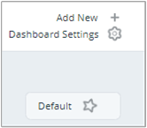
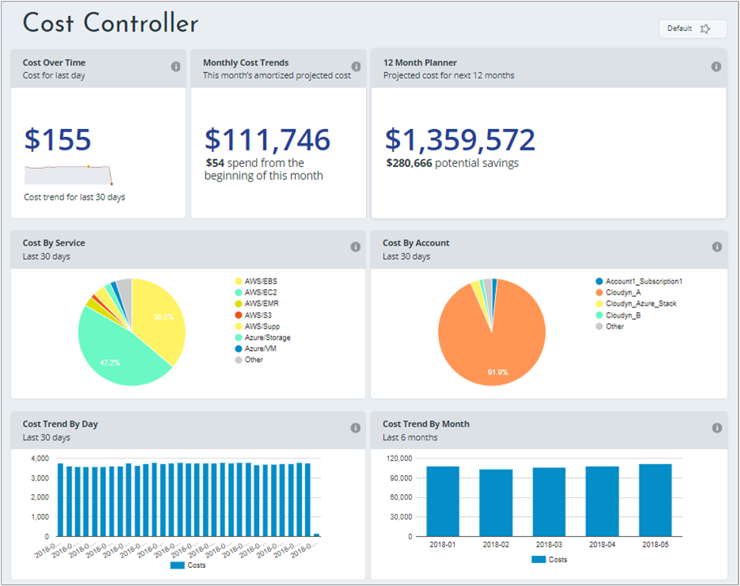
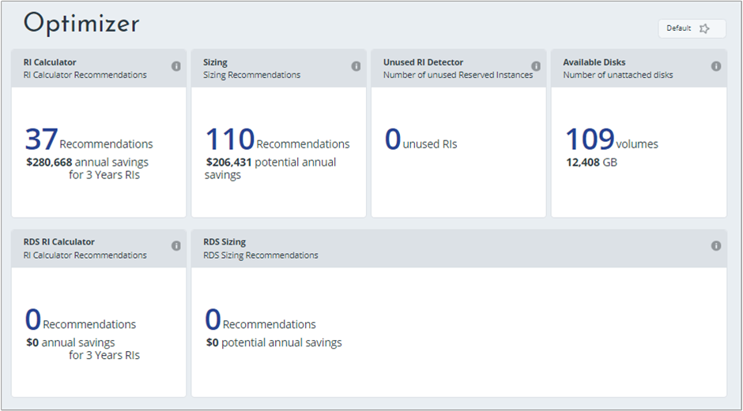

# View key cost metrics with dashboards

Dashboards in Cloudyn provide a high-level view of reports. Dashboards allow you to view key cost metrics in a single view. They also provide business trend highlights to help you make important business decisions.

Dashboards are also used to create views for people with different responsibilities in your organization, which might include:

- Financial controller
- Application or project owner
- DevOps engineer
- Executives

Dashboards are made up of widgets and each widget is essentially a report thumbnail. Click a widget to open its report. When you customize reports, you save them to My Reports and they're added to the dashboard.

Dashboard versions differ for Management (MSP), Enterprise, and Premium Cloudyn users. The differences are determined by entity access levels. For more information about access levels, see [Entity access levels](tutorial-user-access.md#entity-access-levels).

Dashboard availability depends on the type of cloud service provider account that is used when viewing dashboards. The type of information available and collected by Cloudyn affects reports in dashboards. For example, if you don't have an AWS account then you won't see the S3 Tracker dashboard. Similarly, if you don't enable Azure Resource Manager access to Cloudyn then you won't see any Azure-specific information in Optimizer dashboard widgets.

You can use any of the premade dashboards or you can create your own dashboard with customized reports. If you're unfamiliar with Cloudyn reports, see [Use Cloudyn reports](use-reports.md).

## Create a custom dashboard

To quickly get started with a custom dashboard, you can duplicate an existing one to use its properties. Then you can modify it to suit your needs. On the dashboard you want to copy, click **Save As**. You can only duplicate customized dashboards — you can't duplicate the dashboards that are included with Cloudyn.

To create a custom dashboard:

1. On the homepage, click **Add New +**. The My Dashboard page is displayed.  
    
2. Click **Add New Report**. The Add Report box is displayed.
3. Select the report that you want to add to the dashboard widget. The widget is added to the dashboard.
4. Repeat the preceding steps until the dashboard is complete.
5. To change the name of the dashboard, click the name of the dashboard on the Dashboard home page and type the new name.

## Modify a custom dashboard

Like creating a custom dashboard, you can't modify the dashboards included with Cloudyn. To modify a custom dashboard report:

1. In the dashboard, find the report you want to modify and click **Edit**. The report is displayed.
2. Make any changes that you want to the report and click **Save**. The report is updated and displays your changes.

## Share a custom dashboard

You can share a custom dashboard with others to _Public_ or _My Entity_. When you share to Public, all users can view the dashboard. Only users with access to the current entity can view the dashboard when you share to My Entity. The steps to share a custom dashboard with Public and My Entity are similar.

To share a custom dashboard to Public:

1. In a dashboard, click **Dashboard Settings**. The Dashboard Settings box is displayed.  
    
2. In the Dashboard Settings box, click the arrow symbol and then click **Public**. The Public Dashboard confirmation dialog box is displayed.
3. Click  **Yes**. The dashboard is now available to others.

## Delete a custom dashboard report

You can delete a custom report component from the dashboard. Deleting the report from the dashboard doesn't delete the report from the reports list. Instead, deleting the report removes it from the dashboard only.

To delete a dashboard component, on the dashboard component, click **Delete**. Clicking **Delete**  immediately deletes the dashboard component.

## Share a dashboard (Enterprise)

You can share custom dashboards to all users in your organization or with the users of the current entity. Sharing a dashboard can give others a quick high-level view of your KPI. When you share a dashboard, it automatically replicates the dashboard to all your Cloudyn entities/customers. Changes to the shared dashboard are automatically updated.

To share a dashboard with all users including subentities:

1. On the dashboard home page, click **Edit**.
2. Click **Share** and then select **Public**.
3. The Global Public Dashboard confirmation box is displayed.
4. Click **Yes** to set the dashboard as a global public dashboard.

To share a dashboard with all users of a current entity:

1. From the Dashboard home page, click **Edit**.
2. Click **Share** and then select **My Entity**.
3. Click **Yes** to set the dashboard as a public dashboard.

## Duplicate a custom dashboard

When you create a new dashboard, you might want to use similar properties from an existing dashboard. You can duplicate the dashboard to create a new one.

You can only duplicate custom dashboards. You can't duplicate standard dashboards.

To duplicate (clone) a custom dashboard:

1. On the Dashboard that you want to duplicate, click **Save As**. A new dashboard opens with the same name and a number.
2. Rename the duplicated dashboard and modify it as you like.

-Or-

1. In Dashboard Settings, click **Save As**  on the line of the dashboard that you want to duplicate.
2. The duplicated dashboard opens.
3. Rename the dashboard and modify it as you like.

## Set a default dashboard

You can set any dashboard as your default. Setting it to your default makes it appear as the left-most tab in the dashboard tab list. The default dashboard displays when open the Cloudyn portal.

- Click the dashboard tab you would like to set as default, then click **Default** on the right.

-Or-

1. Click **Dashboard Settings** to see the list of available dashboards and select the dashboard that you want to set as the default.  
    
2. Click **Default** in the line of the dashboard. The Default Dashboard confirmation box is displayed.
3. Click **Yes**. The dashboard is set to default.

## Management dashboard
The Management (or MSP dashboard for MSP users) dashboard includes highlights of the main report types.  

### Cost Entity Summary (Enterprise only)
This widget summarizes the managed cost entities, including the number of entities and number of accounts.
- Click the widget to open the Enterprise Details report.

### Cost Over Time
This widget can help you spot cost trends. It highlights the cost for the last day, based on the trend of the last 30 days.
- Click the widget to open the Actual Cost Over Time report to view and filter additional details.

### Asset Controller
This widget highlights the number of running instances from the previous day, above the usage trend over the last 30 days.
- Click the widget to open the Asset Controller dashboard.

### Unused RI Detector
This widget highlights the number of Amazon EC2 unused reservations.
- Click the widget to open the Currently Unused Reservations report where you can view the unused reservations you can modify.

### Cost by Service
This widget highlights amortized costs by service for the last 30 days. Hover over the pie chart to see the costs per service.
- Click the widget to open the Actual Cost Analysis report.

### Potential savings
This widget shows instance type pricing recommendations for Amazon EC2 and Amazon RDS.
- Click the widget open the Savings Analysis report. It lists your costs by instance types with potential savings.

### Compute Instances - Daily Trend
This widget displays the active instances by type, for the last 30 days.
- Click the widget to open the Instances Over Time report, where you can view a breakdown of all instances running during the last 30 days.

### Storage by department
This widget displays the storage services used by departments. Hover over the pie chart to see your storage consumption by department.
- Click the widget to open the S3 Tracker dashboard.

## Cost Controller dashboard
The Cost Controller dashboard shows pre-set cost allocation highlights.  

### Cost Over Time
This widget helps you spot cost trends. It highlights the cost for the last day, based on the trend of the last 30 days.
- Click the widget to open the Actual Cost Over Time report to view and filter additional details.

### Monthly Cost Trends
This widget highlights projected amortized spending and your actual spend since the beginning of the month.
- Click the widget to open the Current Month Projected Cost report, which provides a month-to-date cost summary.

This report shows the cost from the beginning of month, the cost of previous month, and the current month projected cost. The current month projected cost is calculated by adding the up-to-date monthly cost and projection. The projection is based on the cost monitored over the last 30 days.

### 12 Month Planner
This widget highlights the projected costs over the next 12 months and the potential savings.
- Click the widget to open the Annual Projected Cost report.

### Cost by Service
This widget highlights amortized costs by service for the last 30 days.
- Hover over the pie chart to see the costs per service.
- Click the widget to open the Actual Cost Analysis report.

### Cost by Account
This widget highlights amortized costs by account for the last 30 days.
- Hover over the pie chart to see the costs per account.
- Click the widget to open the Actual Cost Analysis report.

### Cost Trend by Day
This widget highlights spend over the last 30 days.
- Hover over the bar graph to see costs per day.
- Click the widget to open the Actual Cost Over Time report.

### Cost Trend by Month - Last 6 months

This widget highlights spend over the last six months.
- Hover over the bar graph to see costs per month.
- Click the widget to open the Actual Cost Over Time report.

## Asset Controller dashboard

This dashboard displays the number of running instances, available and in-use disks, distribution of instance types, and storage information.  

### Compute Instances
This widget displays the number of running instances based on the usage trend over the last 30 days.
- Click the widget to open the Instances Over Time report.

### Disks
This widget highlights the total number and volume of disks, that are in-use and available.
- Click the widget to open the Active Disks report.

### Instance Type Distribution
This widget highlights the instance types in a pie chart.
- Click on the widget to open the Instance Distribution report, which provides a breakdown of your active instances by the selected aggregation.

### Compute Instances - Daily Trend
This widget highlights the compute instances (spot, reserved, and on-demand) per day for the last 30 days.
- Hover over the graph to view the number of compute instances, per type per day.
- Click the widget to open the Instances Over Time report.

### All Buckets (S3)
This widget highlights the total S3 storage and number of objects stored.
- Click the widget to open the S3 Tracker Dashboard. The dashboard helps you find, analyze, and display your current storage usage and trends.

### SQL DB Instances (RDS)
This widget highlights the number of running Amazon RDS instances based on the trend of the last 30 days.
- Click the widget to open the RDS Instance Over Time report.

## Optimizer Dashboard
This dashboard displays downsizing recommendations, unused resources, and potential savings.  

### RI Calculator
This widget displays the number of RI buying recommendations and highlights the potential annual savings.
- Click the widget to open the Reserved Instance Calculator where you can determine when to use on-demand vs. reserved pricing plans.

### Sizing
This widget highlights the sizing recommended and potential savings, if implemented.
- Click the widget to open the EC2 Cost Effective Sizing Recommendations report.

### Unused RI Detector
This widget highlights the number of Amazon EC2 unused reservations.
- Click the widget to open the Currently Unused Reservations report where you can view the unused reservations that you can modify.

###  Available Disks
This widget highlights the number of unattached disks in your deployment.
- Click the widget to open the Unattached Disks report.

### RDS RI Calculator
This widget highlights the number of reservation recommendations for your Amazon RDS instances and the potential savings.
- Click the widget to open the RDS RI Buying Recommendations report where you can see Cloudyn recommendations to use reserved instances instead of on-demand Instances.

### RDS Sizing
This widget shows the number of sizing recommendations and the potential savings.
- Click the widget to open the RDS Sizing Recommendations report, which displays detailed Amazon RDS sizing recommendations.

The optimization recommendations are based on the usage and performance data monitored in the last month.

## S3 Tracker dashboard
The S3 Tracker dashboard helps you find, analyze, and display your current storage usage and trends.  

### All Buckets
This widget highlights the total size of all your buckets, in GB, and the total number of objects in your buckets.
- Click the widget to open the Distribution of S3 Size report. The report helps you analyze your S3 size by bucket, top-level folder, storage class, and versioning state.

### Bucket Properties
This widget highlights the total number of storage buckets.
- Click the widget to view the S3 Bucket Properties report.

### Scan Status
This widget highlights when the last S3 scan was done and when the next one will start.
- Click the widget to open the S3 Scan Status report.

### Storage by Bucket
This widget highlights the percentage that each bucket storage class is using.
- Click the widget to open the Distribution of S3 Size report. The report helps you analyze your S3 size by bucket, top-level folder, storage class, and versioning state.

### Number of Objects by Bucket
This widget highlights the number of objects per bucket in actual number and percentage. Hover over the bucket to see the total objects.
- Click the widget to open the Distribution of S3 Size report (Scan based).

## Cloud Comparison Dashboard
The Cloud Comparison dashboard helps you compare costs from different cloud providers based on pricing, CPU type, and RAM size.  

### EC2 Cost in Azure by Instance Type
This widget highlights the last 30 days of usage in on-demand rates. It compares the cost with the current Amazon EC2 cost vs the potential cost in Azure.
- Hover over the bars to compare costs per instance type.
- Click the widget to open the Porting Your Deployment – Cost Analysis report.

### EC2 Cost in Azure
This widget shows your current Amazon EC2 costs and compares them to Azure. The comparison is based on the last 30 days of usage in on-demand rates.
- Click the widget to open the Porting Your Deployment - Cost Analysis report.

### EC2/Azure Instance Type Mapping
This widget highlights the best mapping of elastic compute units between Amazon EC2 and Azure.
- Click the widget to open the Instances Type Mapping report.

## Next steps
- Read the [Use Cloudyn reports](use-reports.md) article to learn more about reports.
