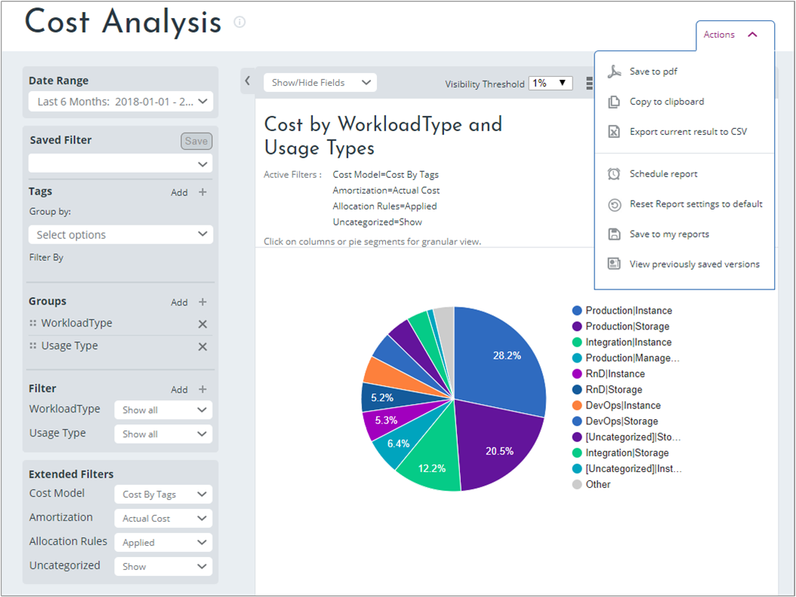
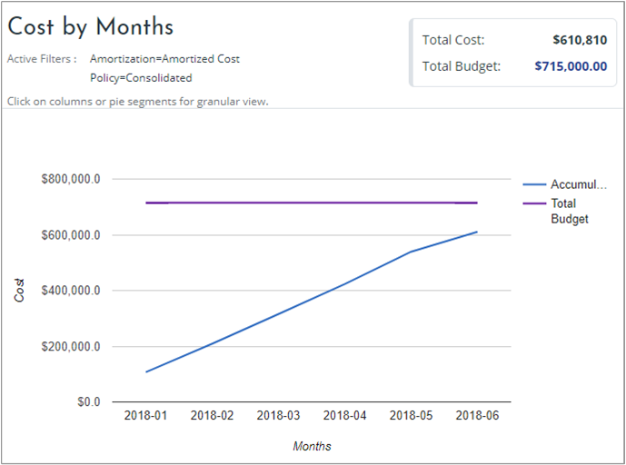

# Manage budgets

Setting up budgets and budget-based alerts help to improve your cloud governance and accountability. This article helps you quickly create budgets and start managing them in Cloudyn.

When you have an Enterprise or MSP account, you can use your hierarchical cost entity structure to assign monthly budget quotas to different business units, departments, or any other cost entity. When you have a Premium account, you can use the budget management functionality, which is then applied to your entire cloud expenditure. All budgets are manually assigned.

Based on assigned budgets, you can set threshold alerts based on the percentage of your budget that's consumed and define the severity of each threshold.

Budget reports show the assigned budget. Users can view when their spending is over, under, or at par with their consumption over time. When you select **Show/Hide Fields** at the top of a budget report, you can view cost, budget, accumulated cost, or total budget.

Azure Cost Management offers similar functionality to Cloudyn. Azure Cost Management is a native Azure cost management solution. It helps you analyze costs, create and manage budgets, export data, and review and act on optimization recommendations to save money. For more information about budgets in Cost Management, see [Create and manage budgets](tutorial-acm-create-budgets.md).

## Create budgets

When you create a budget, you set it for your fiscal year and it applies to a specific entity.

To create a budget and assign it to an entity:

1. Navigate to **Costs** &gt; **Cost Management** &gt; **Budget**.
2. On the Budget Management page, under **Entities**, select the entity where you want to create the budget.
3. In the budget year, select the year where you want to create the budget.
4. For each month, set a budget value. When you're done, click  **Save**.
In this example, the monthly budget for June 2018 is set to $135,000. The total budget for the year is $1,615,000.00.

To import a file for the annual budget:

1. Under **Actions**, select **Export** to download an empty CSV template to use as your basis for the budget.
2. Fill in the CSV file with your budget entries and save it locally.
3. Under **Actions**, select **Import**.
4. Select your saved file and then click **OK**.

To export your completed budget as a CSV file, under **Actions**, select **Export** to download the file.

## View budget in reports

When completed, your budget is shown in most Cost reports under **Costs** &gt; **Cost Analysis** and in the Cost vs. Budget Over Time report. You can also schedule reports based on budget thresholds using **Actions**.

Here's an example of the Cost Analysis report. It shows the total budget and cost by workload and usage types since the beginning of the year.

In this example, assume the current date is June 22. The cost for June 2018 is $71,611.28 compared to the monthly budget of $135,000. The cost is much lower than the monthly budget because there are still eight days of spending before the end of the month.

Another way to view the report is to look at accumulated cost vs your budget. To see accumulated costs, under **Show/Hide Fields**, select **Accumulated Cost** and **Total Budget**. Here's an example showing the accumulated cost since the beginning of the year.

Sometime in the future your accumulated cost might exceed your budget. You can more easily see that if you change the chart view to the _line_ type.

## Create budget alerts for a filter

In the previous example, you can see that the accumulated cost approached the budget. You can create automatic budget alerts so that you're notified when spending approaches or exceeds your budget. Basically, the alert is a scheduled report with a threshold. Budget alert threshold metrics include:

- Remaining cost vs. budget – to specify a currency value threshold
- Cost percentage vs. budget – to specify a percentage value threshold

Let's look at an example.

In the Cost vs. Budget Over Time report, click **Actions** and then select **Schedule report**. On the Threshold tab, select a threshold metric. For example, **Cost percentage vs budget**. Select an alert type and enter a percentage value of the budget. If you want to get notified only once, select **Number of consecutive alerts** and then type _1_. Click **Save**.

## Next steps

- If you haven't already completed the first tutorial for Cloudyn, read it at  [Review usage and costs](tutorial-review-usage.md).
- Learn more about the [reports available in Cloudyn](use-reports.md).
