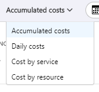
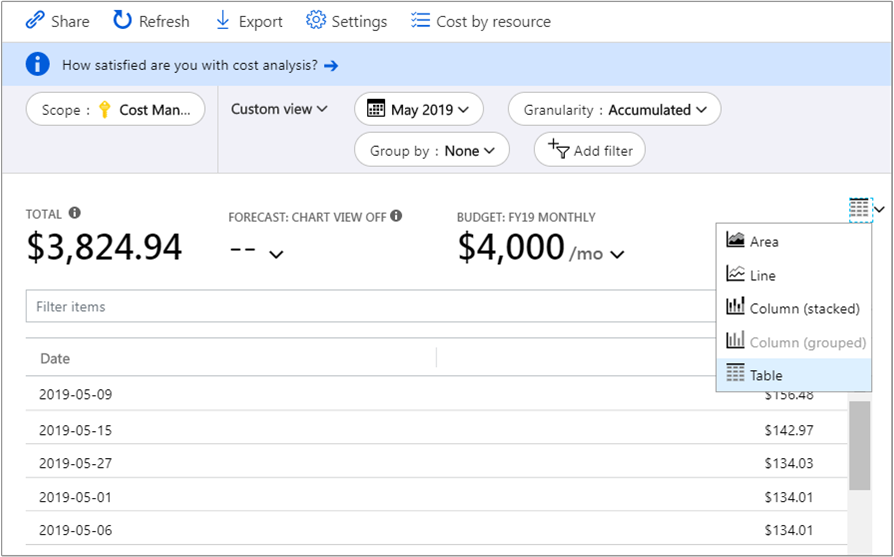

# Quickstart: Explore and analyze costs with the cost analysis feature in Azure

Before you can control and optimize your Azure costs, you must understand where costs originate within your organization. It's also useful to know how much your services cost and which environments and systems they support. Visibility into the full spectrum of costs is critical to accurately understand organizational spending patterns. You can use spending patterns to enforce cost control mechanisms, like budgets.

This quickstart shows you how to use cost analysis to explore and analyze your organizational costs. You can view aggregated costs by organization to understand where costs occur over time and identify spending trends. You can view accumulated costs over time to estimate monthly, quarterly, or even yearly cost trends against a budget. A budget helps to provide adherence to financial constraints. And a budget is used to view daily or monthly costs to isolate spending irregularities. You can also download the current report's data for further analysis or use in an external system.

This quickstart teaches you how to:

- Review costs in cost analysis
- Customize cost views
- Download cost analysis data

## Prerequisites

Cost analysis supports different kinds of Azure account types. To view the full list of supported account types, see [Understand Cost Management data](understand-cost-mgt-data.md). To view cost data, you need at least read access for your Azure account.

To view cost data, [Enterprise Agreement (EA)](https://azure.microsoft.com/pricing/enterprise-agreement/) customers must at least have read access to one or more of the following scopes:

- Billing account
- Department
- Enrollment account
- Management group
- Subscription
- Resource group

For more information about assigning access to data in Azure Cost Management by Cloudyn, see [Assign access to Cost Management data](assign-access-acm-data.md).

## Sign in to Azure

Sign in to the Azure portal at https://portal.azure.com.

## Review costs in cost analysis

To review your costs in cost analysis, open the scope in the Azure portal and select **Cost analysis** in the menu. For example, navigate to **Subscriptions**, select a subscription from the list, and then select **Cost analysis** in the menu. Use the **Scope** pill to switch to a different scope in cost analysis. For more information about scopes, see [Understand and work with scopes](understand-work-scopes.md).

The scope you select is used throughout  Azure Cost Management by Cloudyn to provide data consolidation and control access to cost information. When you use scopes, you don't multiple-select them. Instead, you select a larger scope, which others roll up to, and then you filter down to the nested scopes you need. This approach is important to understand because some people may not have access to a single parent scope, which covers multiple nested scopes.

The initial cost analysis view includes the following areas:

- **Total**: Shows your total costs for the current month.

- **Budget**: Shows your planned spending limit for the selected scope, if available.

- **Accumulated cost**: Shows your total aggregate daily spending, starting at the beginning of the month. After you [create a budget](tutorial-acm-create-budgets.md) for your billing account or subscription, you can quickly see your spending trend against the budget. Hover over a date to view the accumulated cost for that day.

- **Pivot (donut) charts**: Provides dynamic pivots, breaking down the total cost by a common set of standard properties. They show a expense chart for the current month, from largest to smallest. You can change pivot charts at any time by selecting a different pivot. Costs are categorized by service (meter category), location (region), and child scope by default. For example, enrollment accounts are under billing accounts, resource groups are under subscriptions, and resources are under resource groups.

## Customize cost views

Cost analysis has four built-in views, optimized for the most common goals:

View | Answer questions like...
--- | ---
Accumulated cost | How much have I spent so far this month? Will I stay within my budget?
Daily cost | Have there been any increases in the costs per day for the last 30 days?
Cost by service | How has my monthly usage vary over the past three invoices?
Cost by resource | Which resources cost the most so far this month?

However, there are many cases where you need deeper analysis. Customization starts at the top of the page, with the date selection. Cost analysis shows data for the current month by default. Use the date selector to switch to common date ranges quickly. A few examples include the last seven days, the last month, the current year, or a custom date range. Pay-as-you-go subscriptions also include date ranges based on your billing period, which isn't bound to the calendar month, like the current billing period or last invoice. 

Use the **<PREVIOUS** and **NEXT>** links at the top of the menu to jump to the previous or next period respectively. For example, **<PREVIOUS** will switch from **Last 7 days** to **8–14 days ago** and then to **15–21 days ago**.

Cost analysis shows *accumulated* costs by default. Accumulated costs include all costs for each day plus the previous days, for a constantly growing view of your daily aggregate costs. This view is optimized to show how you're trending against a budget for the selected time range.

There's also the *daily* view, which shows costs for each day. The daily view doesn't show a growth trend. The view is designed to show irregularities as cost spikes or dips from day to day. If you've selected a budget, the daily view also shows an estimate of what your daily budget might look like. When your daily costs are consistently above the estimated daily budget, then you can expect you'll surpass your monthly budget. The estimated daily budget is simply a means to help you visualize your budget at a lower level. When you have fluctuations in daily costs, then the estimated daily budget comparison to your monthly budget is less precise.

Generally, you can expect to see data or notifications for consumed resources within 8 to 12 hours.

Use **Group by** to group common properties, in order to break down costs and identify top contributors. To group by resource tags, for example, select the tag key you want to group by. Costs are broken down by each tag value, with an extra segment for resources that don't have that tag applied.

Most [Azure resources support tagging](../azure-resource-manager/tag-support.md). However, some tags aren't available in billing or Azure Cost Management by Cloudyn. Additionally, resource group tags aren't supported. Azure Cost Management by Cloudyn only supports resource tags from the date that the tags are applied directly to the resource. Watch the [How to review tag policies with Azure Cost Management](https://www.youtube.com/watch?v=nHQYcYGKuyw) video to learn about using Azure's tag policy to improve cost data visibility.

Here's a view of Azure service costs for the last month.

Pivot charts under the main chart show different groupings. These charts give you a broader picture of your overall costs for the selected time period and filters. Select a property or tag to view aggregated costs by any dimension.

The preceding image shows resource group names. Although you can group by tag to view total costs per tag, the option to view all tags per resource or resource group isn't available in any of the cost analysis views.

When you group costs by a specific attribute, the top 10 cost contributors are shown from highest to lowest. If there are more than 10, the top nine cost contributors are shown with an **Others** group, which covers all remaining groups together. When grouping by tags, you may also see an **Untagged** group for costs that don't have the tag key applied. **Untagged** is always last, even if untagged costs are higher than tagged costs. Untagged costs will be part of **Others**, if there are 10 or more tag values.

*Classic* virtual machines, networking, and storage resources don't share detailed billing data. They're merged as **Classic services** when grouping costs.

You can view the full dataset for any view. The selections or filters that you apply affect the data presented. To see the full dataset, select the **chart type** list and then select **Table** view.

## Download cost analysis data

You can **Download** information from cost analysis to generate a CSV file for all data currently shown in the Azure portal. Any filters or grouping that you apply are included in the file. Underlying data for the total chart that isn't actively displayed is included in the CSV file.

## Next steps

Advance to the first tutorial to learn how to create and manage budgets.

> [!div class="nextstepaction"]
> [Create and manage Azure budgets](tutorial-acm-create-budgets.md)
