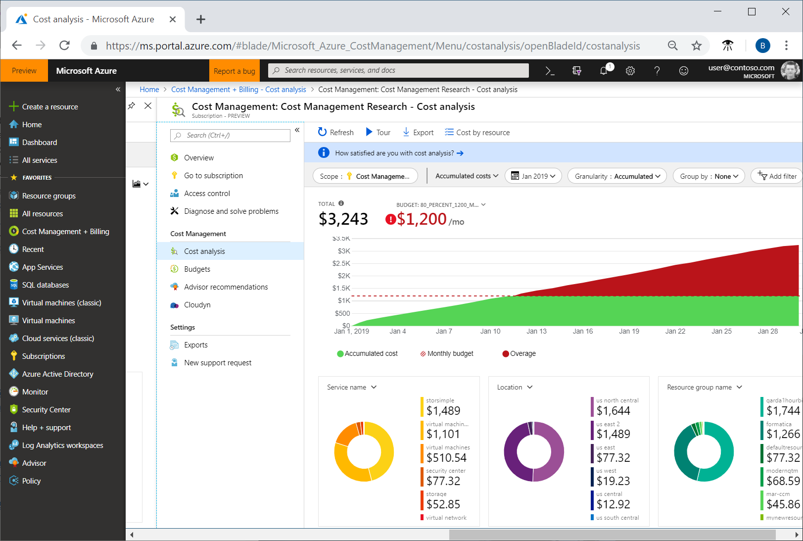
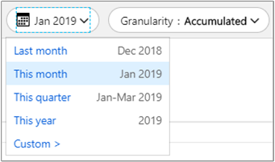
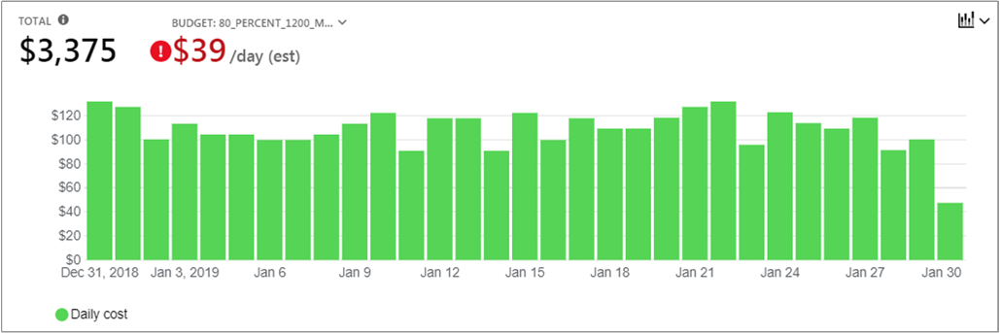
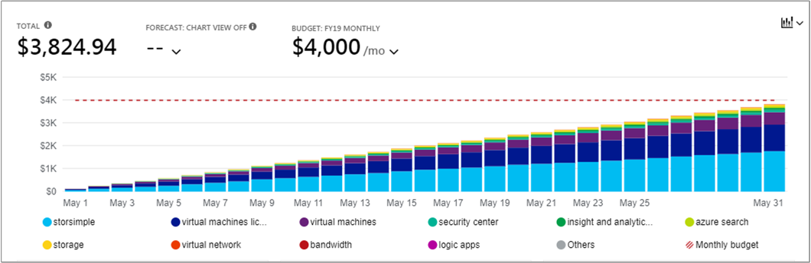
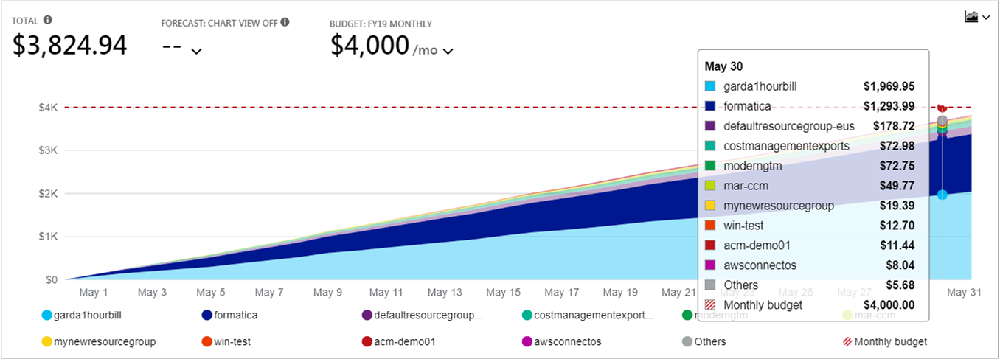

# Quickstart: Explore and analyze costs with Cost analysis

Before you can properly control and optimize your Azure costs, you need to understand where costs originated within your organization. It's also useful to know how much money your services cost, and in support of what environments and systems. Visibility into the full spectrum of costs is critical to accurately understand organizational spending patterns. Spending patterns can be used to enforce cost control mechanisms, like budgets.

In this quickstart, you use cost analysis to explore and analyze your organizational costs. You can view aggregated costs by organization to understand where costs occur over time and identify spending trends. You can view accumulated costs over time to estimate monthly, quarterly, or even yearly cost trends against a budget. A budget helps to provider adherence to financial constraints. And a budget is used to view daily or monthly costs to isolate spending irregularities. And, you can download the current report's data for further analysis or to use in an external system.

In this quickstart, you learn how to

- Review costs in cost analysis
- Customize cost views
- Download cost analysis data

## Prerequisites

Cost analysis is available to all Enterprise Agreement (EA) customers. You must have read access to at least one of the following scopes to view cost data.

- Azure EA billing account (enrollment)
- Azure EA subscription
- Azure EA subscription resource group

## Sign in to Azure

- Sign in to the Azure portal at http://portal.azure.com.

## Review costs in cost analysis

To review your costs with cost analysis, open the Azure portal then navigate to **Cost Management + Billing** &gt; **Billing accounts** &gt; select your EA billing account &gt; under Cost Management, select **Cost analysis**.

The initial cost analysis view includes the following areas:

**Total** – Shows the total costs for the current month.

**Budget** – Shows the planned spending limit for the selected scope, if available.

**Accumulated cost** – Shows the total accrued daily spending, starting from the beginning of the month. After you [create a budget](tutorial-acm-create-budgets.md) for your billing account or subscription, you can quickly see your spending trend against the budget. Hover over a date to view the accumulated cost for that day.

**Pivot (donut) charts** – Provide dynamic pivots, breaking down the total cost by a common set of standard properties. They show the most to least cost accrued for the current month. You can change pivot charts at any time by selecting a different pivot. Costs are categorized by: service (meter category), location (region), and child scope by default. For example, enrollment accounts under billing accounts, resource groups under subscriptions, and resources under resource groups.

## Customize cost views

The default view provides quick answers to common questions like:

- How much did I spend?
- Will I stay within my budget?

However, there are many cases where you need deeper analysis. Customization starts at the top of the page, with the date selection.

Cost analysis shows data for the current month by default. Use the date selector to quickly switch to: the last month, this month, this calendar quarter, this calendar year, or a custom date range of your choice. Selecting the last month is the quickest way to analyze your latest Azure invoice and easily reconcile charges. The current quarter and year options help track costs against longer-term budgets. You can also select a different date range. For example, you can select a single day, the last seven days, or anything as far back as a year before the current month.

Cost analysis shows **accumulated** costs by default. Accumulated costs include all costs for each day plus the previous days, for a constantly growing view of your daily accrued costs. This view is optimized to show how you're trending against a budget for the selected time range.

There's also the **daily** view showing costs for each day. The daily view doesn't show a growth trend. The view is designed to show irregularities as cost spikes or dips from day to day. If you've selected a budget, the daily view also shows an estimate of what your daily budget might look like. When your daily costs are consistently above the estimated daily budget, then you can expect you'll surpass your monthly budget. The estimated daily budget is simply a means to help you visualize your budget at a lower level. When you have fluctuations in daily costs, then the estimated daily budget comparison to your monthly budget is less precise.

You can **Group by** to select a group category to change data displayed in the top total area graph. Grouping lets you quickly see how your spending is categorized by resource type. Here's a view of Azure service costs for a view of the last month.

Pivot charts under the top Total view show views for different grouping and filtering categories. When you select any group category, the full set of data for total view is at the bottom of the view. Here's an example for resource groups.

The preceding image shows resource group names. Viewing tags for resources aren't available in any of the cost analysis views, filters, or groupings.

## Download cost analysis data

You can **Download** information from cost analysis to generate a CSV file for all data currently shown in the Azure portal. Any filters or grouping that you apply are included in the file. Underlying data for the top Total chart that isn't actively displayed is included in the CSV file.

## Next steps

Advance to the first tutorial to learn how to create and manage budgets.

> [!div class="nextstepaction"]
> [Create and manage budgets](tutorial-acm-create-budgets.md)
