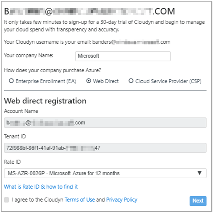
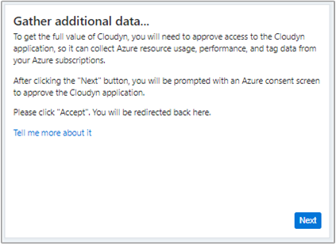
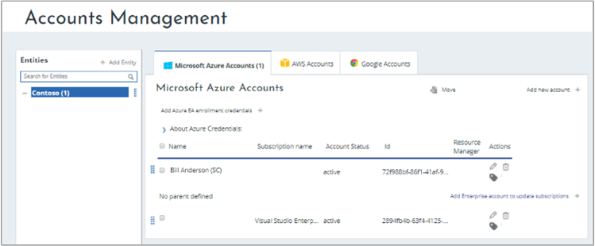

---

title: Register your Azure subscription with Azure Cost Management | Microsoft Docs
description: Use your Azure subscription to register with Azure Cost Management by Cloudyn.
services: cost-management
keywords:
author: bandersmsft
ms.author: banders
ms.date: 09/14/2017
ms.topic: hero-article
ms.custom: mvc
ms.service: cost-management
manager: carmonm
---

# Register an individual Azure subscription and view cost data

You use your Azure subscription to register with Azure Cost Management by Cloudyn. Your registration provides access to the Cloudyn portal. This quickstart details the registration process needed to create a Cloudyn trial subscription and sign in to the Cloudyn portal. It also shows you how to start viewing cost data right away.

## Log in to Azure

- Log in to the Azure portal at http://portal.azure.com.

## Access Cloudyn from the Azure Marketplace

1. In the Azure portal, click on **New** on the left navigation bar.
2. Click **Monitoring + Management** in the Marketplace gallery list and then select **Cost Management by Cloudyn** from the Featured list.  
    
4. On the **Cost Management** details page, click **Create** to open the welcome page.  
5. On the welcome page, click **Go to Cloudyn** to open the Cloudyn registration page in a new window.

## Create a trial registration
1. On the Cloudyn portal trial registration page, type your company name and then select **Web Direct**. Your account name and Tenant ID is automatically added to the form.  
    
2. Select your **Rate ID** associated with your subscription. If you're unsure of what your Rate ID is for your subscription, you can view your Azure bill and look for **Offer ID**. The Offer ID is the same as your **Rate ID**.
3. Agree to the Terms of Use then validate your information and then click **Next**.
4. In the Gather additional data page, click **Next** to authorize Cloudyn to collect Azure resource data. Data collected includes usage, performance, billing, and tag data from your subscriptions.  
    
5. Your browser takes you to the sign in page for Cloudy. Sign in with your Azure subscription credentials.
4. Click **Go to Cloudyn** to open the Cloudyn portal and then on the **Accounts Management** page, you should see your Azure subscription account information.  
    

[!INCLUDE [cost-management-create-account-view-data](../../includes/cost-management-create-account-view-data.md)]

## Next steps

In this quick start, you used your Azure Enterprise Agreement information to register with Cost Management. You also signed into the Cloudyn portal and started viewing cost data. To learn more about Azure Cost Management by Cloudyn, continue to the tutorial for Cost Management.

> [!div class="nextstepaction"]
> [Assign access to cost management data](./tutorial-user-access.md)
