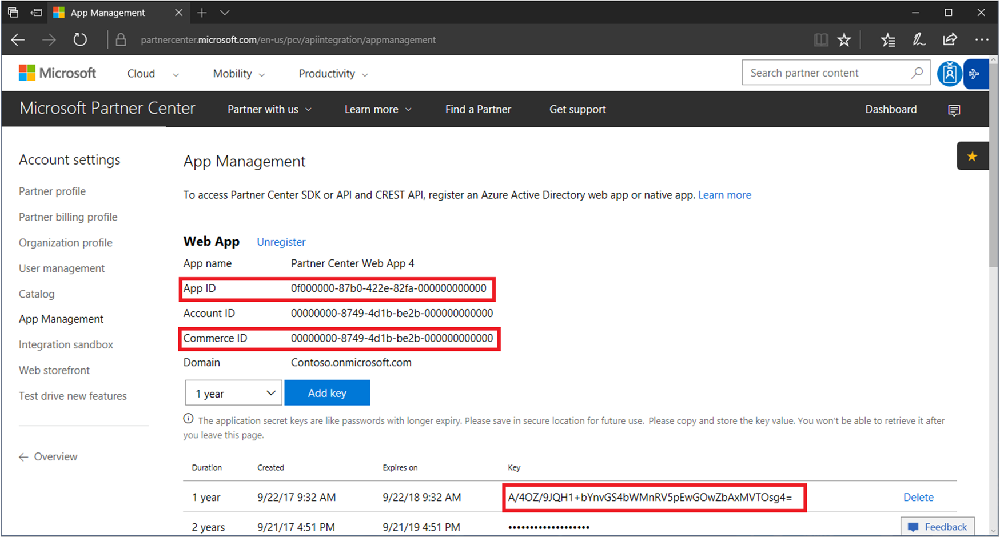
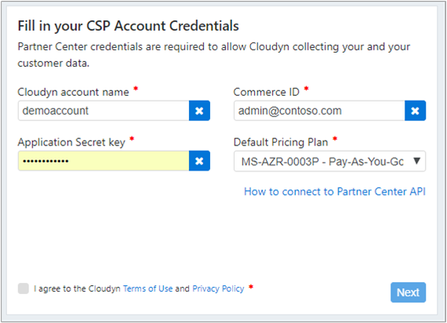

---

title: Register using CSP Partner information with Cloudyn in Azure | Microsoft Docs
description: Use your CSP Partner information to register with Cloudyn.
services: cost-management
keywords:
author: bandersmsft
ms.author: banders
ms.date: 09/18/2018
ms.topic: quickstart
ms.custom:
ms.service: cost-management
manager: dougeby
---

# Register with the CSP Partner program and view cost data

As a CSP partner, you can register with Cloudyn. Your registration provides access to the Cloudyn portal. This quickstart details the registration process needed to create a Cloudyn trial subscription and sign in to the Cloudyn portal. It also shows you how to start viewing cost data right away.

>[!NOTE]

>Only CSP Direct partners and CSP Indirect Providers can complete Cloudyn registration.
>
>Configuring the Partner Center API is required for authentication and data access. A Partner Center Global Administrator account is needed to provision API access.
For more information, see [Connect to the Partner Center API](https://msdn.microsoft.com/library/partnercenter/mt709136.aspx).
>
>Access to Cloudyn can be made available to CSP Indirect Resellers after their CSP Indirect Provider registers with Cloudyn. CSP Indirect Resellers can then provide Cloudyn access to Azure customers and subscriptions.

## Sign in to Azure

- Sign in to the Azure portal at http://portal.azure.com.

## Register with Cloudyn

1. In the Azure portal, click **Cost Management + Billing** in the list of services.
2. Under **Overview**, click **Cloudyn**  
    
3. On the **Cloudyn** page, click **Go to Cloudyn** to open the Cloudyn registration page in a new window.
4. On the Cloudyn portal trial registration page, type your company name, select **Microsoft CSP Partner Program Administrator**, and then click **Next**.  
5. Enter an **Application ID**, **Commerce ID**, **Application Secret key**, and select the **Default Pricing Plan**. If you don't have the information handy, sign in to the Partner Center portal at  [https://partnercenter.microsoft.com](https://partnercenter.microsoft.com) with your primary administrator account and do the following steps:
  1. Go to **Dashboard**, click the **Settings** symbol, click **Partner settings**, and then click **App Management**.
  2. If you have previously created a Web App, skip this step. Otherwise, click **Add new web app** in the **Web App** section.
  3. Copy the **App ID** GUID from your web application.
  4. Copy the **Commerce ID** GUID from your web application.
  5. Select the key validity duration as one or two years, as needed. Select **Add key** and then copy and save the secret key value.  
    
  6. Go back to the Cloudyn registration page and paste the information.  
      
6. Agree to the Terms of Use then validate your information. Click **Next** to authorize Cloudyn to collect Azure resource data. Data collected includes usage, performance, billing, and tag data from your subscriptions.  
7. Under **Invite other stakeholders**, you can add users by typing their email addresses. When complete, click **Next**. It takes about two hours for all your billing data to get added to Cloudyn.
8. Click **Go to Cloudyn** to open the Cloudyn portal and then on the **Cloud Accounts Management** page, you should see your registered CSP account information.

## Configure indirect CSP access in Cloudyn

By default, the Partner Center API is only accessible to direct CSPs. However, a direct CSP provider can configure access for their indirect CSP customers or partners using entity groups in Cloudyn.

To enable access for indirect CSP customers or partners, follow the steps in [Create a trial registration](#create-a-trial-registration) to set up a trial registration. Next, complete the following steps to segment indirect CSP data by using Cloudyn entity groups. Then, assign the appropriate user permissions to the entity groups.

1. Create an entity group with the information at [Create entities](tutorial-user-access.md#create-and-manage-entities).
2. Follow the steps at [Assigning subscriptions to Cost Entities](https://support.cloudyn.com/hc/articles/115005139425-Video-Assigning-subscriptions-to-Cost-Entities). Associate the indirect CSP customer’s account and their Azure subscriptions to the entity that you create previously.
3. Follow the steps at [Create a user with admin access](tutorial-user-access.md#create-a-user-with-admin-access) to create a user account with Admin access. Then, ensure the user account has admin access to the specific entities that you created previously for the indirect account.

Indirect CSP partners sign in to the Cloudyn portal using the accounts that you created for them.

[!INCLUDE [cost-management-create-account-view-data](../../includes/cost-management-create-account-view-data.md)]

## Next steps

In this quickstart, you used your CSP information to register with Cloudyn. You also signed into the Cloudyn portal and started viewing cost data. To learn more about Cloudyn, continue to the tutorial for Cloudyn.

> [!div class="nextstepaction"]
> [Review usage and costs](./tutorial-review-usage.md)
