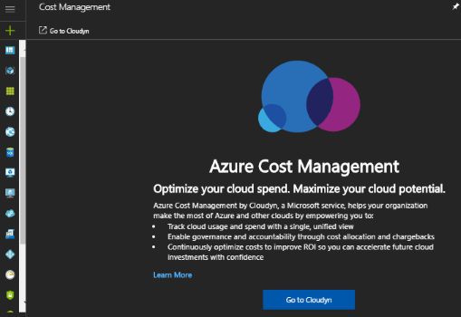

---

title: Register using CSP Partner information with Azure Cost Management | Microsoft Docs
description: Use your CSP Partner information to register with Azure Cost Management by Cloudyn.
services: cost-management
keywords:
author: bandersmsft
ms.author: banders
ms.date: 09/15/2017
ms.topic: hero-article
ms.custom: mvc
ms.service: cost-management
manager: carmonm
---

# Register with the CSP Partner program and view cost data

As a CSP partner, you can register with Azure Cost Management by Cloudyn. This guide details the registration process needed to create a Cloudyn trial subscription and sign in to the Cloudyn portal. It also shows you how to start viewing cost data right away.

To complete registration, you must be a partner program administrator with access to the Partner Center API. Configuration of the Partner Center API is required for authentication and data access. For more information, see Connect to the Partner Center API.

## Access Cloudyn from Cost Management + Billing

1. Sign in to the Azure portal at [http://portal.azure.com](http://portal.azure.com), click **Cost Management + Billing**, and click **Cost Management**.
2. In Cost Management, click **Go to Cloudyn** to open the Cloudyn registration page in a new window.  
    

## Access Cloudyn from the Azure Marketplace

1. In the Azure portal, click on **New** on the left navigation bar.
2. Click **Monitoring + Management** in the Marketplace gallery list and then select **Cost Management by Cloudyn** from the Featured list.  
    
4. On the **Cost Management** details page, click **Create** to open the welcome page.  
5. On the welcome page, click **Go to Cloudyn** to open the Cloudyn registration page in a new window.

## Create a trial registration
1. On the Cloudyn portal trial registration page, type your company name and then select **Cloud Service Provider (CSP)**.  
2. Enter your **Client ID**, **Tenant ID/Microsoft ID**, **Client Secret**, and select **Rate ID**. If you don't have the information handy, sign in to the Partner Center portal at  [https://partnercenter.microsoft.com](https://partnercenter.microsoft.com) with your primary administrator account and do the following:
  1. Go to **Dashboard** > **Account Settings** > **App Management**.
  2. If you have previously created a Web App, skip this step. Otherwise, click **Add new web app** in the **Web App** section.
  3. Copy the **Commerce ID** GUID from your web application, which is the Client ID.
  4. Select the key validity duration as 1 or 2 years, as needed, and then select **Add key** and then copy and save the secret key value.  
    
  5. Go back to the registration page and paste the information.  
      
3. Validate your information and then click **Next** to authorize Cloudyn to collect Azure resource data. Data collected includes usage, performance, billing, and tag data from your subscriptions.  
4. Under **Invite other stakeholders**, you can add users by typing their email addresses. When complete, click **Next**. It takes about two hours for all your billing data to get added to Cloudyn.
5. Click **Go to Cloudyn** to open the Cloudyn portal and then on the **Cloud Accounts Management** page, you should see your registered CSP account information.

[!INCLUDE [cost-management-create-account-view-data](../../includes/cost-management-create-account-view-data.md)]

## Next steps

In this quick start, you used your CSP information to register with Cost Management. You also signed into the Cloudyn portal and started viewing cost data. To learn more about Azure Cost Management by Cloudyn, continue to the tutorial for Cost Management.

> [!div class="nextstepaction"]
> [Assign access to cost management data](./tutorial-user-access.md)
