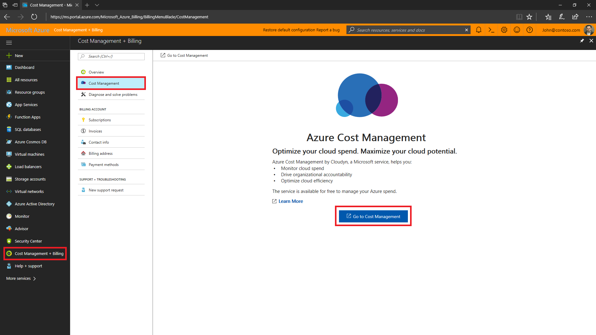
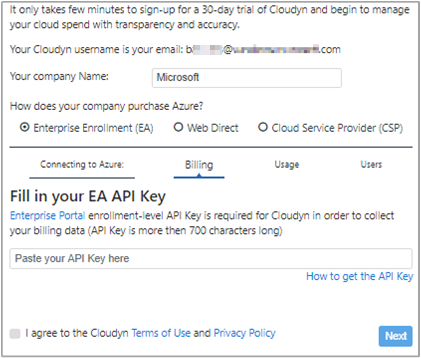
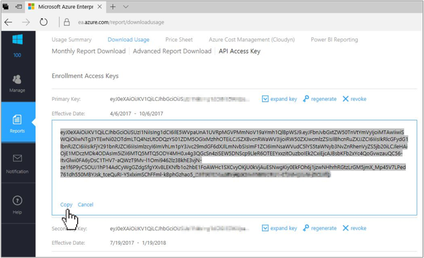

---

title: Register your Azure Enterprise Agreement with Cloudyn | Microsoft Docs
description: This quickstart details the registration process needed to create a Cloudyn trial subscription and sign in to the Cloudyn portal.
services: cost-management
keywords:
author: bandersmsft
ms.author: banders
ms.date: 05/20/2019
ms.topic: quickstart
ms.custom: seodec18
ms.service: cost-management
manager: benshy
---

# Register an Azure Enterprise Agreement and view cost data

You use your Azure Enterprise Agreement to register with Cloudyn. Your registration provides access to the Cloudyn portal. This quickstart details the registration process needed to create a Cloudyn trial subscription and sign in to the Cloudyn portal. It also shows you how to start viewing cost data right away.

Azure Cost Management offers similar functionality to Cloudyn. Azure Cost Management is a native Azure cost management solution. It helps you analyze costs, create and manage budgets, export data, and review and act on optimization recommendations to save money. For more information, see [Azure Cost Management](overview-cost-mgt.md).

## Sign in to Azure

- Sign in to the Azure portal at https://portal.azure.com.

## Register with Cloudyn

1. In the Azure portal, click **Cost Management + Billing** in the list of services.
2. Under **Overview**, click **Cloudyn**  
    
3. On the **Cloudyn** page, **Go to Cloudyn** to open the Cloudyn registration page in a new window.
4. On the Cloudyn portal trial registration page, type your company name and then select **Azure Enterprise Enrollment Administrator**.  
5. Enter your Enterprise Portal enrollment API key. If you don't have your key handy, click the [Enterprise Portal](https://ea.azure.com) link and do the following steps:  
    
   1. Sign in to the Azure Enterprise website and click **Reports**, click **API Access Key** and then copy your primary key.  
    
   3. Go back to the registration page and paste in your API key.
6. Agree to the Terms of Use then validate your key. Click **Next** to authorize Cloudyn to collect Azure resource data. Data collected includes usage, performance, billing, and tag data from your subscriptions.  
    
7. Under **Invite other stakeholders**, you can add users by typing their email addresses. When complete, click **Next**. Depending on the size of your Azure enrollment, it can take up to 24 hours for all of your billing data to get added to Cloudyn.
8. Click **Go to Cloudyn** to open the Cloudyn portal and then on the **Cloud Accounts Management** page, you should see your registered EA account information.

To watch a tutorial video about registering your Enterprise Agreement, see [How to Find Your EA Enrollment ID and API Key for use in Cloudyn](https://youtu.be/u_phLs_udig).

[!INCLUDE [cost-management-create-account-view-data](../../includes/cost-management-create-account-view-data.md)]

## Next steps

In this quickstart, you used your Azure Enterprise Agreement information to register with Cloudyn. You also signed into the Cloudyn portal and started viewing cost data. To learn more about Cloudyn, continue to the tutorial for Cloudyn.

> [!div class="nextstepaction"]
> [Review usage and costs](./tutorial-review-usage.md)
