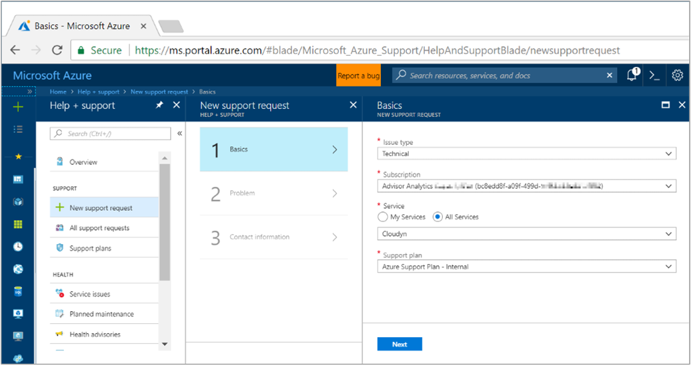
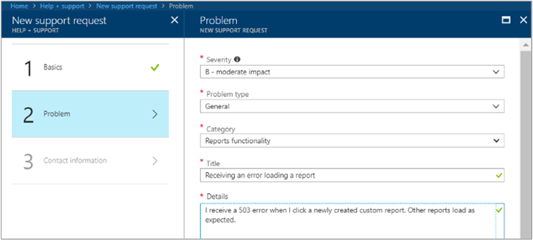
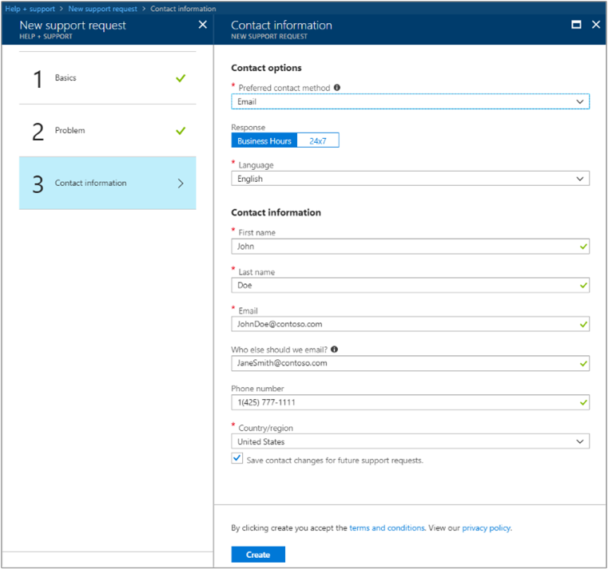

# Create a support request for Cost Management

You can open a support request if you can't find the information you're looking for. Or, if you suspect a problem is a service disruption or bug. When you open a support ticket, make sure that open it for a single problem. Do so helps to quickly route the reported issue.

## Open a support ticket

1. Sign in to the Azure portal (https://portal.azure.com).
2. On the top navigation bar, click **Help**.
3. In the **Help** menu, click **Help + support**.
4. In the Help + support menu under Support, click **New support request**.
5. In the Basics area under Issue type, select **Technical**.
6. Under Subscription, choose any listed subscription. The subscription that you choose isn't used for issue routing.
7. Under Service, select **All Services** and then select **Cloudyn** from the list.
8. Under Support plan, select your Azure Support Plan and then click **Next**.  
    
9. In the Problem area, select a **Severity** level to help determine response time.
10. Select a **Problem type**, and then select a **Category**.
11. In the **Title** box, enter a title that describes your request.
12. In the **Details** box, type additional information.
13. For **When did the problem start**, select an approximate date and time for and then click **Next**.  
    
14. In the **Contact information** area, select your preferred contact method and provide your contact information, then click **Create**.  
    

When the support ticket is created, it is added to the support queue. Response time varies, based on the Support Plan and Severity (business impact) of the issue. For more information, see [Support scope and responsiveness](https://azure.microsoft.com/support/plans/response/).

To check the status of an incident that you've filed, see [All support requests](../azure-supportability/how-to-create-azure-support-request.md#all-support-requests).

## Next steps

- To learn more about Azure Cost Management, continue to the [Review usage and costs](tutorial-review-usage.md) tutorial for Cost Management.
