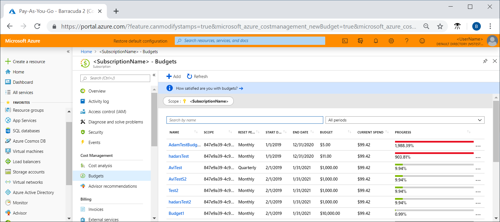
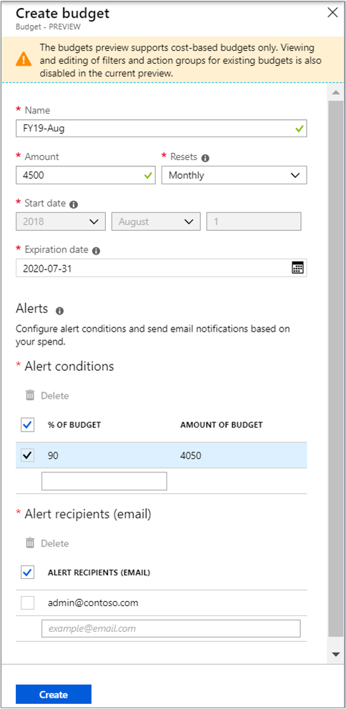
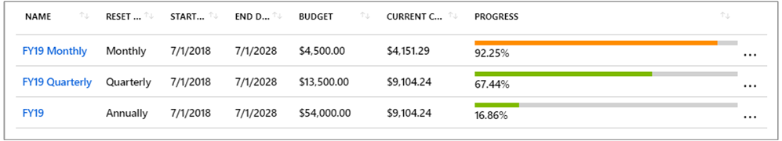
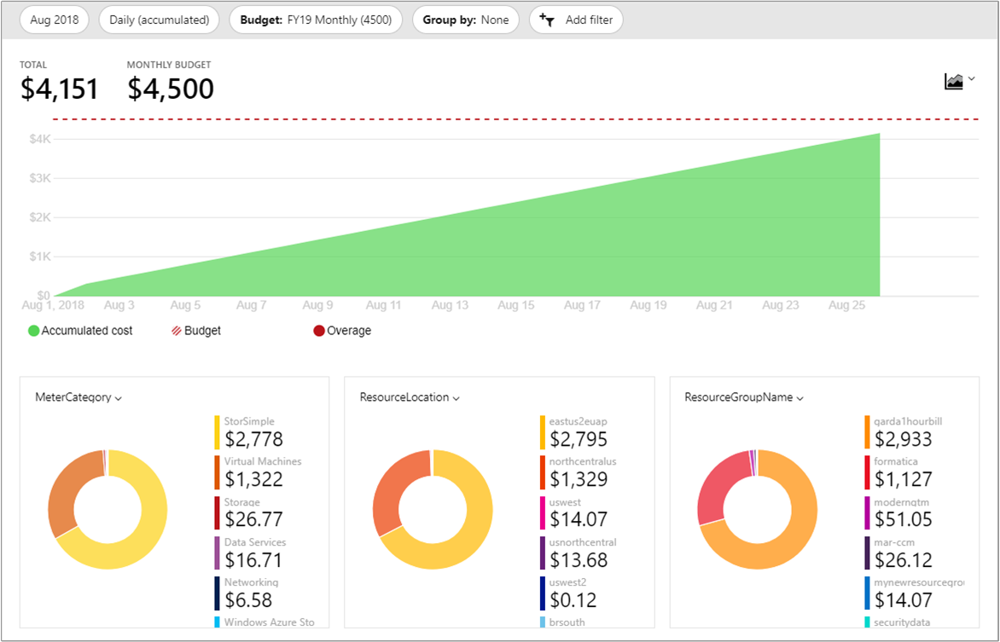
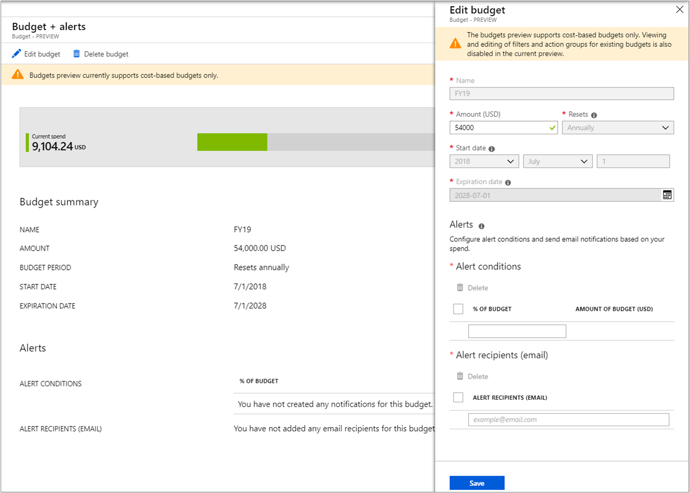

# Tutorial: Create and manage Azure budgets

Budgets in Cost Management help you plan for and drive organizational accountability. With budgets, you can account for the Azure services you consume or subscribe to during a specific period. They help you inform others about their spending to proactively manage costs, and to monitor how spending progresses over time. You can see how spending progresses over time. When the budget thresholds you've created are exceeded, only notifications are triggered. None of your resources are affected and your consumption isn't stopped. You can use budgets to compare and track spending as you analyze costs.

Budgets reset automatically at the end of a period (monthly, quarterly, or annually) for the same budget amount when you select an expiration date in future. Because they reset with the same budget amount, you need to create separate budgets when budgeted currency amounts differ for future periods.

The examples in this tutorial walk you though creating and editing a budget for an Azure Enterprise Agreement (EA) subscription.

In this tutorial, you learn how to:

> [!div class="checklist"]
> * Create a budget in the Azure portal
> * Edit a budget

## Prerequisites

Budgets are available to all Azure EA customers. You must have read access to an Azure EA subscription to create and manage budgets. EA billing accounts are not supported by budgets.

Budgets are created at either the subscription or resource group level, individually. The following Azure permissions are supported per subscription for budgets by user and group:

- Owner – Can create, modify, or delete budgets for a subscription.
- Contributor – Can create, modify, or delete their own budgets. Can modify the budget amount for budgets created by others.
- Reader – Can view budgets that they have permission to.

## Sign in to Azure

- Sign in to the Azure portal at http://portal.azure.com.

## Create a budget in the Azure portal

You can create an Azure subscription budget for a monthly, quarterly, or annual period. Your navigational content in the Azure portal determines whether you create a budget for a subscription or for a resource group.

In the Azure portal, navigate to **Cost Management + Billing** &gt; **Subscriptions** &gt; Select a subscription &gt; **Budgets**. In this example, the budget that you create is for the subscription that you selected.

After you create budgets, they show a simple view of your current spending against them.

Click **Add**.

In the **Create budget** window, enter a budget name and budget amount. Then, choose either a monthly, quarterly, or annual duration period. Next, select an end date. Budgets require at least one cost threshold (% of budget) and a corresponding email address. You can optionally include up to five thresholds and five email addresses in a single budget. When a budget threshold is met, email notifications are normally received in less than eight hours.

Here's an example of creating a monthly budget for $4,500. An email alert gets generated when 90% of the budget is reached.

When you create a quarterly budget, it works in the same way as a monthly budget. The difference is that the budget amount for the quarter is evenly divided among the three months of the quarter. As you might expect, an annual budget amount is evenly divided among all 12 months of the calendar year.

Current spending against budgets is updated whenever Cost Management receives updated billing data. Typically, daily.

After you create a budget, it is shown in cost analysis. Viewing your budget in relation to your spending trend is one of the first steps when you start to [analyze your costs and spending](quick-acm-cost-analysis.md).

In the preceding example, you created a budget for a subscription. However, you can also create a budget for a resource group. If you want to create a budget for a resource group, navigate to **Cost Management + Billing** &gt; **Subscriptions** &gt; select a subscription > **Resource groups** > select a resource group > **Budgets** > and then **Add** a budget.

## Edit a budget

Depending on the level of access that you have, you can edit a budget to change its properties. In the follow example, some of the properties are read-only because the user has only Contributor permission to the subscription. Currently, the **Expiration date** is disabled and can't be modified once set.

## Next steps

In this tutorial, you learned how to:

> [!div class="checklist"]
> * Create a budget in the Azure portal
> * Edit a budget

Advance to the next tutorial to create a recurring export for your cost management data.

> [!div class="nextstepaction"]
> [Create and manage exported data](tutorial-export-acm-data.md)
