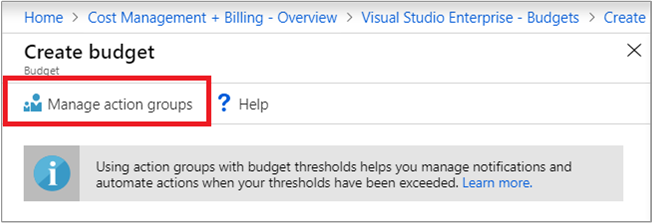
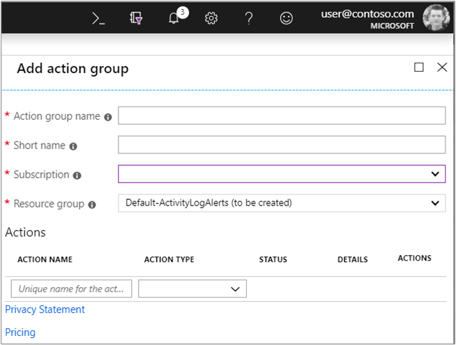
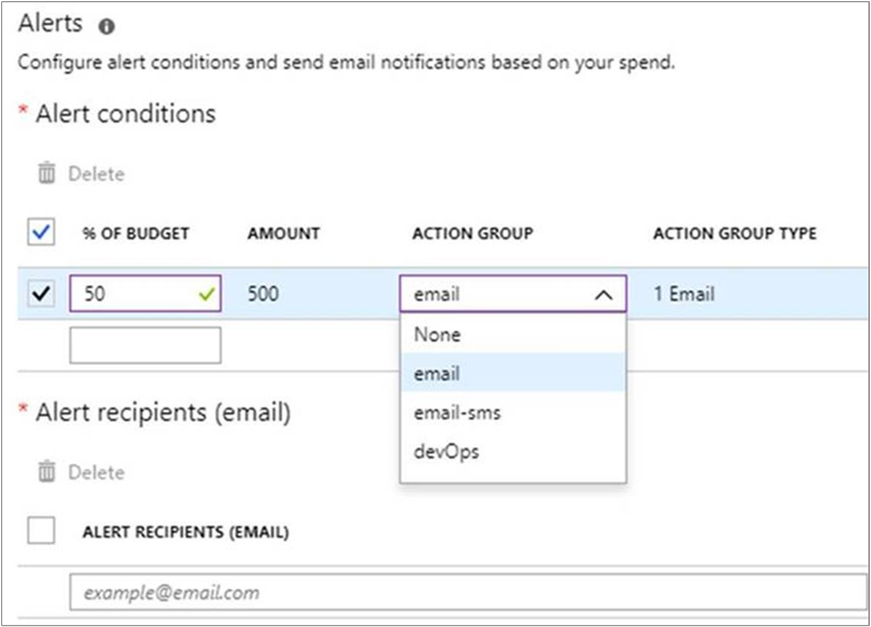
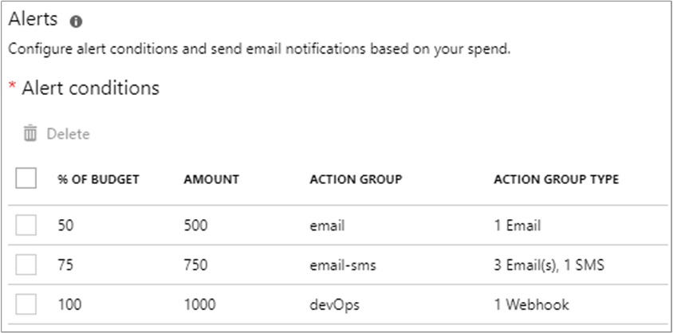

# Tutorial: Create and manage Azure budgets

Budgets in Cost Management help you plan for and drive organizational accountability. With budgets, you can account for the Azure services you consume or subscribe to during a specific period. They help you inform others about their spending to proactively manage costs, and to monitor how spending progresses over time. When the budget thresholds you've created are exceeded, only notifications are triggered. None of your resources are affected and your consumption isn't stopped. You can use budgets to compare and track spending as you analyze costs.

Monthly budgets are evaluated against spending every four hours. However, data and notifications for consumed resources are available within eight hours.  

Budgets reset automatically at the end of a period (monthly, quarterly, or annually) for the same budget amount when you select an expiration date in the future. Because they reset with the same budget amount, you need to create separate budgets when budgeted currency amounts differ for future periods.

The examples in this tutorial walk you through creating and editing a budget for an Azure Enterprise Agreement (EA) subscription.

Watch the [How to create a budget to monitor your spending with Azure Cost Management](https://www.youtube.com/watch?v=ExIVG_Gr45A) video to see how you can create budgets in Azure to monitor spending.

In this tutorial, you learn how to:

> [!div class="checklist"]
> * Create a budget in the Azure portal
> * Edit a budget

## Prerequisites

Budgets are supported for a variety of Azure account types. To view the full list of supported account types, see [Understand Cost Management data](understand-cost-mgt-data.md). To view budgets, you need at least read access for your Azure account.

 For Azure EA subscriptions, you must have read access to view budgets. To create and manage budgets, you must have contributor permission. You can create individual budgets for EA subscriptions and resource groups. However, you cannot create budgets for EA billing accounts.

The following Azure permissions, or scopes, are supported per subscription for budgets by user and group. For more information about scopes, see [Understand and work with scopes](understand-work-scopes.md).

- Owner – Can create, modify, or delete budgets for a subscription.
- Contributor and Cost Management contributor – Can create, modify, or delete their own budgets. Can modify the budget amount for budgets created by others.
- Reader and Cost Management reader – Can view budgets that they have permission to.

For more information about assigning permission to Cost Management data, see [Assign access to Cost Management data](assign-access-acm-data.md).

## Sign in to Azure

- Sign in to the Azure portal at https://portal.azure.com.

## Create a budget in the Azure portal

You can create an Azure subscription budget for a monthly, quarterly, or annual period. Your navigational content in the Azure portal determines whether you create a budget for a subscription or for a management group.

To create or view a budget, open the desired scope in the Azure portal and select **Budgets** in the menu. For example, navigate to **Subscriptions**, select a subscription from the list, and then select **Budgets** in the menu. Use the **Scope** pill to switch to a different scope, like a management group, in Budgets. For more information about scopes, see [Understand and work with scopes](understand-work-scopes.md).

After you create budgets, they show a simple view of your current spending against them.

Click **Add**.

In the **Create budget** window, enter a budget name and budget amount. Then, choose either a monthly, quarterly, or annual duration period. Next, select an end date. Budgets require at least one cost threshold (% of budget) and a corresponding email address. You can optionally include up to five thresholds and five email addresses in a single budget. When a budget threshold is met, email notifications are normally received in less than eight hours. For more information about notifications, see [Use cost alerts](cost-mgt-alerts-monitor-usage-spending.md).

If you have a Pay-As-You-Go, MSDN, or Visual Studio subscription, your invoice billing period might not align to the calendar month. For those types of subscriptions and resource groups, you can create a budget that's aligned to your invoice period or to calendar months. To create a budget aligned to your invoice period, select a reset period of Billing month, Billing quarter or Billing year. To create a budget aligned to the calendar month, select a reset period of Monthly, Quarterly or Annually.

Here's an example of creating a monthly budget for $4,500. An email alert gets generated when 90% of the budget is reached.

When you create a quarterly budget, it works in the same way as a monthly budget. The difference is that the budget amount for the quarter is evenly divided among the three months of the quarter. As you might expect, an annual budget amount is evenly divided among all 12 months of the calendar year.

Current spending against budgets is updated whenever Cost Management receives updated billing data. Typically, daily.

After you create a budget, it is shown in cost analysis. Viewing your budget in relation to your spending trend is one of the first steps when you start to [analyze your costs and spending](quick-acm-cost-analysis.md).

In the preceding example, you created a budget for a subscription. However, you can also create a budget for a resource group. If you want to create a budget for a resource group, navigate to **Cost Management + Billing** &gt; **Subscriptions** &gt; select a subscription > **Resource groups** > select a resource group > **Budgets** > and then **Add** a budget.

## Edit a budget

Depending on the level of access that you have, you can edit a budget to change its properties. In the following example, some of the properties are read-only because the user has only Contributor permission to the subscription. Currently, the **Expiration date** is disabled and can't be modified once set.

## Trigger an action group

When you create or edit a budget for a subscription or resource group scope, you can configure it to call an action group. The action group can perform a variety of different actions when your budget threshold is met. For more information about Action Groups, see [Create and manage action groups in the Azure portal](../azure-monitor/platform/action-groups.md). For more information about using budget-based automation with action groups, see [Manage costs with Azure budgets](../billing/billing-cost-management-budget-scenario.md).

To create or update action groups, click **Manage action groups** while you're creating or editing a budget.

Next, click **Add action group** and create the action group.

After the action group is created, close the box to return to your budget.

Configure your budget to use your action group when an individual threshold is met. Up to five different thresholds are supported.

The following example shows budget thresholds set to 50%, 75% and 100%. Each is configured to trigger the specified actions within the designated action group.

## Next steps

In this tutorial, you learned how to:

> [!div class="checklist"]
> * Create a budget in the Azure portal
> * Edit a budget

Advance to the next tutorial to create a recurring export for your cost management data.

> [!div class="nextstepaction"]
> [Create and manage exported data](tutorial-export-acm-data.md)
