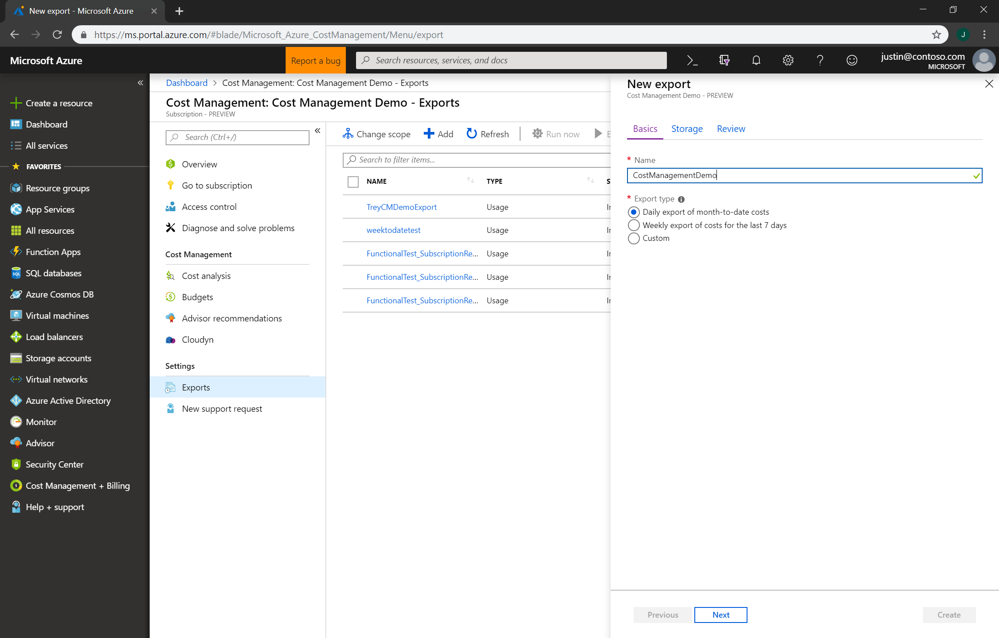
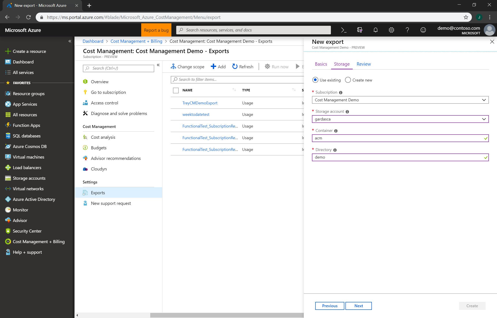
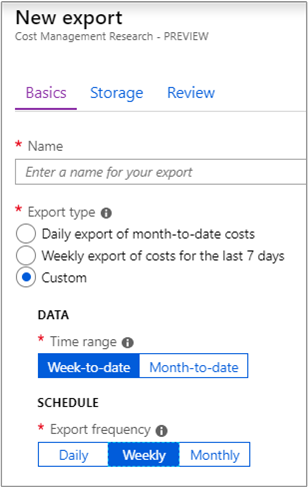
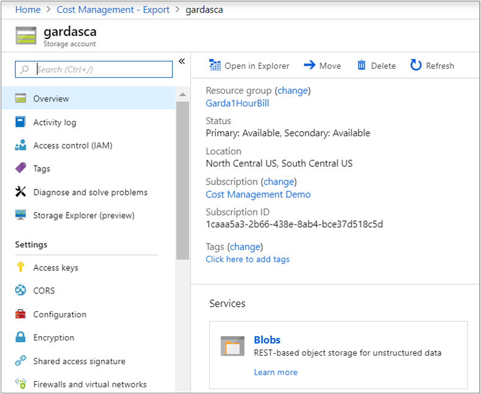
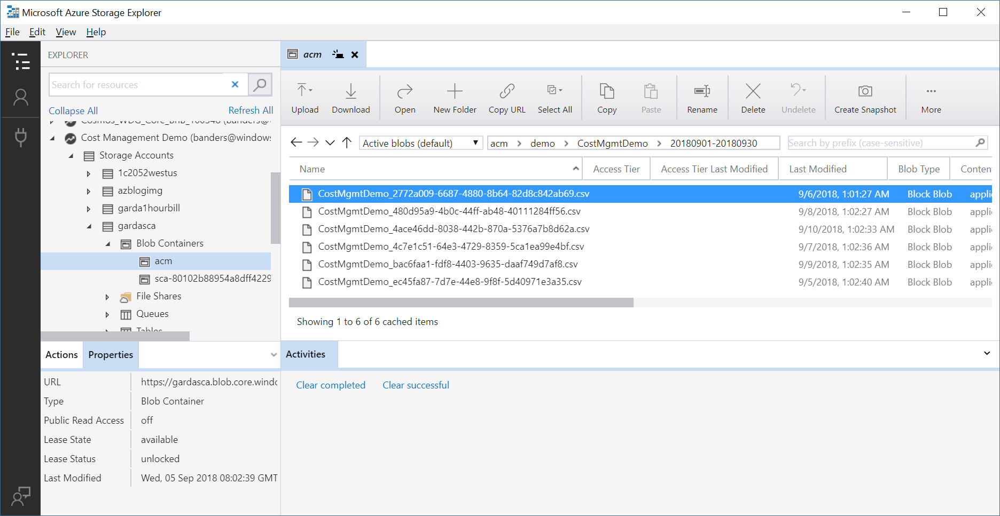

# Tutorial: Create and manage exported data

If you read the Cost Analysis tutorial, then you're familiar with manually downloading your Cost Management data. However, you can create a recurring task that automatically exports your Cost Management data to Azure storage on a daily, weekly, or monthly basis. Exported data is in CSV format and it contains all the information that's collected by Cost Management. You can then use the exported data in Azure storage with external systems and combine it with your own custom data. And you can use your exported data in an external system like a dashboard or other financial system.

Watch the [How to schedule exports to storage with Azure Cost Management](https://www.youtube.com/watch?v=rWa_xI1aRzo) video about creating a scheduled export of your Azure cost data to Azure Storage.

The examples in this tutorial walk you though exporting your cost management data and then verify that the data was successfully exported.

In this tutorial, you learn how to:

> [!div class="checklist"]
> * Create a daily export
> * Verify that data is collected

## Prerequisites
Data export is available for a variety of Azure account types, including [Enterprise Agreement (EA)](https://azure.microsoft.com/pricing/enterprise-agreement/) customers. To view the full list of supported account types, see [Understand Cost Management data](understand-cost-mgt-data.md). The following Azure permissions, or scopes, are supported per subscription for data export by user and group. For more information about scopes, see [Understand and work with scopes](understand-work-scopes.md).

- Owner – Can create, modify, or delete scheduled exports for a subscription.
- Contributor – Can create, modify, or delete their own scheduled exports. Can modify the name of scheduled exports created by others.
- Reader – Can schedule exports that they have permission to.

For Azure Storage accounts:
- Write permissions are required to change the configured storage account, regardless of permissions on the export.
- Your Azure storage account must be configured for blob or file storage.

## Sign in to Azure
Sign in to the Azure portal at [https://portal.azure.com](https://portal.azure.com/).

## Create a daily export

To create or view a data export or to schedule an export, open the desired scope in the Azure portal and select **Cost analysis** in the menu. For example, navigate to **Subscriptions**, select a subscription from the list, and then select **Cost analysis** in the menu. At the top of the Cost analysis page, click **Export** and then choose an export option. For example, click **Schedule export**.  

> [!NOTE]
> Besides subscriptions, you can create exports on resource groups, accounts, departments, and enrollments. For more information about scopes, see [Understand and work with scopes](understand-work-scopes.md).
>
>

Click **Add**, type a name for the export, and then select the **Daily export of month-to-date costs** option. Click **Next**.

Specify the subscription for your Azure storage account, then select your storage account.  Specify the storage container and the directory path that you'd like the export file to go to.  Click **Next**.

Review your export details and click **Create**.

Your new export appears in the list of exports. By default, new exports are enabled. If you want to disable or delete a scheduled export, click any item in the list and then click either **Disable** or **Delete**.

Initially, it can take one to two hours before the export runs. However, it can take up to four hours before data is shown in exported files.

### Export schedule

Scheduled exports are affected by the time and day of week of when you initially create the export. When you create a scheduled export, the export runs at the same time of day for each subsequent export occurrence. For example, you create a daily export at 1:00 PM. The next export runs at 1:00 PM the following day. The current time affects all other export types in the same manner—they always run at the same time of day as when you initially created the export. In a different example, you create a weekly export at 4:00 PM on Monday. The next report runs at 4:00 PM the following Monday. *Exported data is available within four hours of run time.*

Each export creates a new file, so older exports are not overwritten.

There are three types of export options:

**Daily export of month-to-date costs** – The initial export runs immediately. Subsequent exports run the next day at the same time as the initial export. The latest data is aggregated from previous daily exports.

**Weekly export of costs for the last 7 days** – The initial export runs immediately. Subsequent exports run on the day of the week and at the same time as the initial export. Costs are for the last seven days.

**Custom** – Allows you to schedule weekly and monthly exports with week-to-date and month-to-date options. *The initial export will run immediately.*

If you have a Pay-As-You-Go, MSDN, or Visual Studio subscription, your invoice billing period might not align to the calendar month. For those types of subscriptions and resource groups, you can create an export that's aligned to your invoice period or to calendar months. To create an export aligned to your invoice month, navigate to **Custom**, then select **Billing-period-to-date**.  To create an export aligned to the calendar month, select **Month-to-date**.
>
>

## Verify that data is collected

You can easily verify that your Cost Management data is being collected and view the exported CSV file using Azure Storage Explorer.

In the export list, click the storage account name. On the storage account page, click Open in Explorer. If you see a confirmation box, click **Yes** to open the file in Azure Storage Explorer.

In Storage Explorer, navigate to the container that you want to open and select the folder corresponding to the current month. A list of CSV files is shown. Select one and then click **Open**.

The file opens with the program or application that's set to open CSV file extensions. Here's an example in Excel.

## Access exported data from other systems

One of the purposes of exporting your Cost Management data is to access the data from external systems. You might use a dashboard system or other financial system. Such systems vary widely so showing an example wouldn't be practical.  However, you can get started with accessing your data from you applications at [Introduction to Azure Storage](../storage/common/storage-introduction.md).

## Next steps

In this tutorial, you learned how to:

> [!div class="checklist"]
> * Create a daily export
> * Verify that data is collected

Advance to the next tutorial to optimize and improve efficiency by identifying idle and underutilized resources.

> [!div class="nextstepaction"]
> [Review and act on optimization recommendations](tutorial-acm-opt-recommendations.md)
