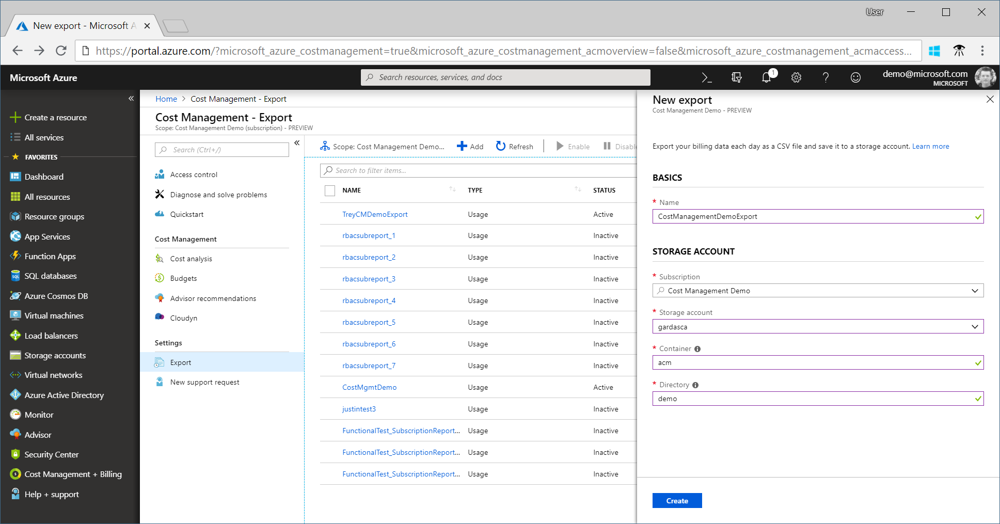

# Tutorial: Create and manage exported data

If you read the Cost Analysis tutorial, then you're familiar with manually downloading your Cost Management data. However, you can create a daily recurring task that automatically exports your Cost Management data daily to Azure storage. Exported data is in CSV format and it contains all the information that's collected by Cost Management. You can then use the exported data in Azure storage with external systems and combine it with your own custom data. And you can use your exported data in an external system like a dashboard or other financial system.

The examples in this tutorial walk you though exporting your cost management data and then verify that the data was successfully exported.

In this tutorial, you learn how to:

> [!div class="checklist"]
> * Create a daily export
> * Verify that data is collected

## Prerequisites

Data export is available to all [Enterprise Agreement (EA)](https://azure.microsoft.com/pricing/enterprise-agreement/) customers. The following Azure permissions are supported per subscription for data export by user and group:

- Owner – Can create, modify, or delete scheduled exports for a subscription.
- Contributor – Can create, modify, or delete their own scheduled exports. Can modify the name of scheduled exports created by others.
- Reader – Can schedule exports that they have permission to.

For Azure Storage accounts:
- Write permissions are required to change the configured storage account, regardless of permissions on the export.
- Your Azure storage account must be configured for blob or file storage.

## Sign in to Azure
Sign in to the Azure portal at [https://portal.azure.com](https://portal.azure.com/).

## Create a daily export

Cost Management + Billing &gt; select a subscription or resource group in a subscription &gt; Export &gt; **Add**.

Type a name for the export and specify the subscription, Azure storage account, container, and the file storage directory or blob container, then click **Create**.

Your new export appears in the list of exports. By default, new exports are enabled, and they run daily. If you want to disable or delete a scheduled export, click any item in the list and then click either **Disable** or **Delete**.

Initially, it can take one to two hours before the export runs. However, it can take up to four hours before data is shown in exported files.

## Verify that data is collected

You can easily verify that your Cost Management data is being collected and view the exported CSV file using Azure Storage Explorer.

In the export list, click the storage account name. On the storage account page, click Open in Explorer. If you see a confirmation box, click **Yes** to open the file in Azure Storage Explorer.

In Storage Explorer, navigate to the container that you want to open and select the folder corresponding to the current month. A list of CSV files is shown. Select one and then click **Open**.

The file opens with the program or application that's set to open CSV file extensions. Here's an example in Excel.

## Access exported data from other systems

One of the purposes of exporting your Cost Management data is to access the data from external systems. You might use a dashboard system or other financial system. Such systems vary widely so showing an example wouldn't be practical.  However, you can get started with accessing your data from you applications at [Introduction to Azure Storage](../storage/common/storage-introduction.md).

## Next steps

In this tutorial, you learned how to:

> [!div class="checklist"]
> * Create a daily export
> * Verify that data is collected

Advance to the next tutorial to optimize and improve efficiency by identifying idle and underutilized resources.

> [!div class="nextstepaction"]
> [Review and act on optimization recommendations](tutorial-acm-opt-recommendations.md)
