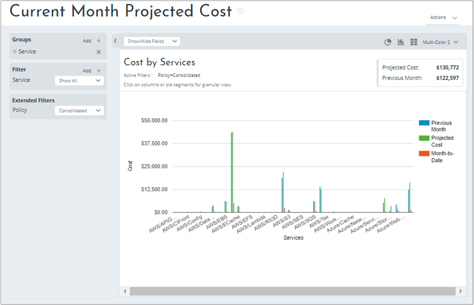
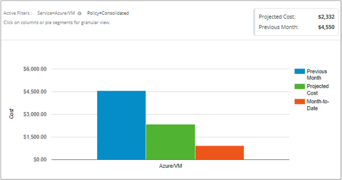
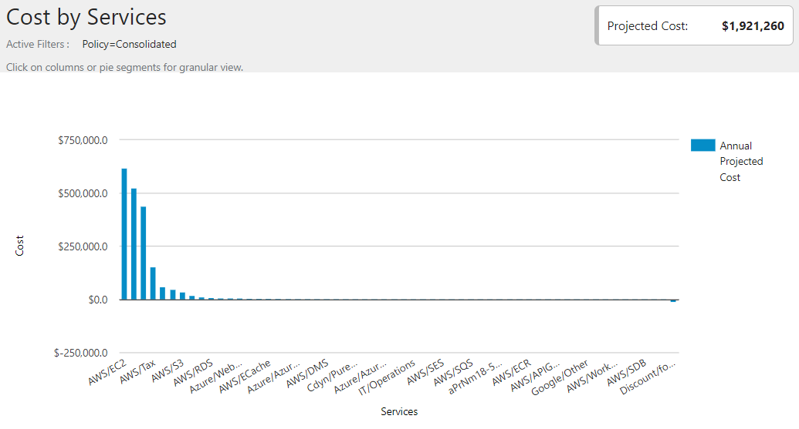

# Tutorial: Forecast future spending

Cloudyn helps you forecast future spending using historical usage and spending data. You use Cloudyn reports to view all cost projection data. The examples in this tutorial walk you through reviewing cost projections using the reports. In this tutorial, you learn how to:

> [!div class="checklist"]
> * Forecast future spending

If you don't have an Azure subscription, create a  [free account](https://azure.microsoft.com/free/?WT.mc_id=A261C142F) before you begin.

## Prerequisites

- You must have an Azure account.
- You must have either a trial registration or paid subscription for Cloudyn.

## Forecast future spending

Cloudyn includes cost projection reports to help you forecast spending based on your usage over time. Their primary purpose is to help you ensure that your cost trends do not exceed your organization's expectations. The reports you use are Current Month Projected Cost and Annual Projected Cost. Both show projected future spending if your usage remains relatively consistent with your last 30 days of usage.

The Current Month Projected Cost report shows the costs of your services. It uses costs from the beginning of the month and the previous month to show the projected cost. On the reports menu at the top of the portal, click **Cost** > **Projection and Budget** > **Current Month Projected Cost**. The following image shows an example.

In the example, you can see which services spent the most. Azure costs were lower than AWS costs. If you want to see cost projection details for Azure VMs, in the **Filter** list, select **Azure/VM**.

Follow the same basic preceding steps to look at monthly cost projections for other services you're interested in.

The Annual Projected Cost report shows the extrapolated cost of your services over the next 12 months.

On the reports menu at the top of the portal, click **Cost** > **Projection and Budget** > **Annual Projected Cost**. The following image shows an example.

In the example, you can see which services spent the most. Like the monthly example, Azure costs were lower than AWS costs. If you want to see cost projection details for Azure VMs, in the **Filter** list, select **Azure/VM**.

In the image above, the annual projected cost of Azure VMs is $28,374.

## Next steps

In this tutorial, you learned how to:

> [!div class="checklist"]
> * Forecast future spending

Advance to the next tutorial to learn how to manage costs with cost allocation and showback reports.

> [!div class="nextstepaction"]
> [Manage costs with cost allocation and showback reports](tutorial-manage-costs.md)
