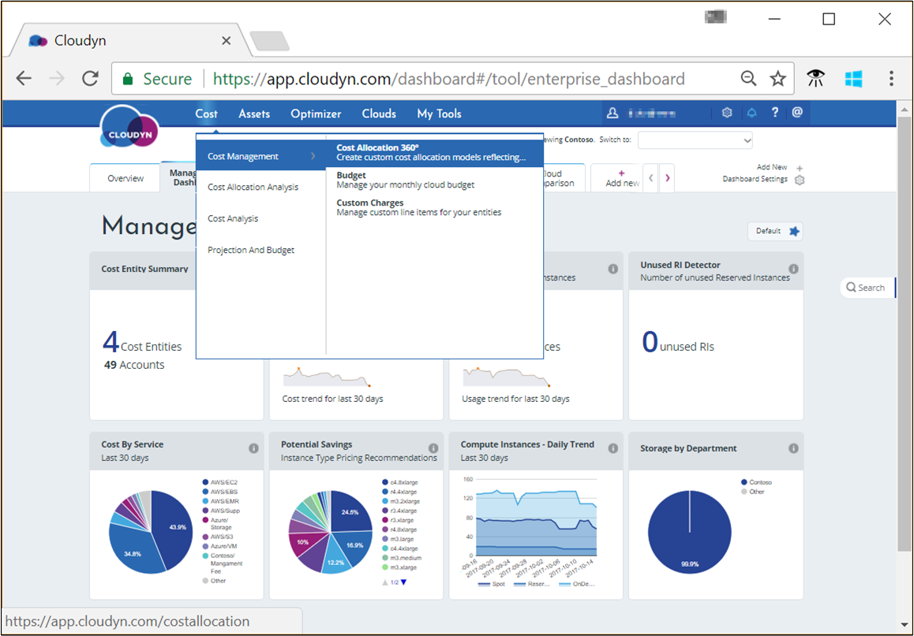
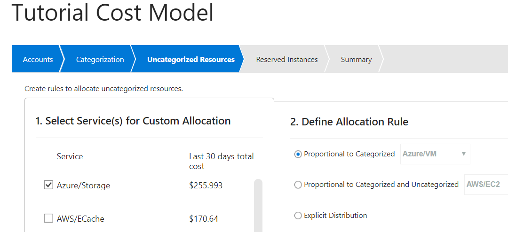
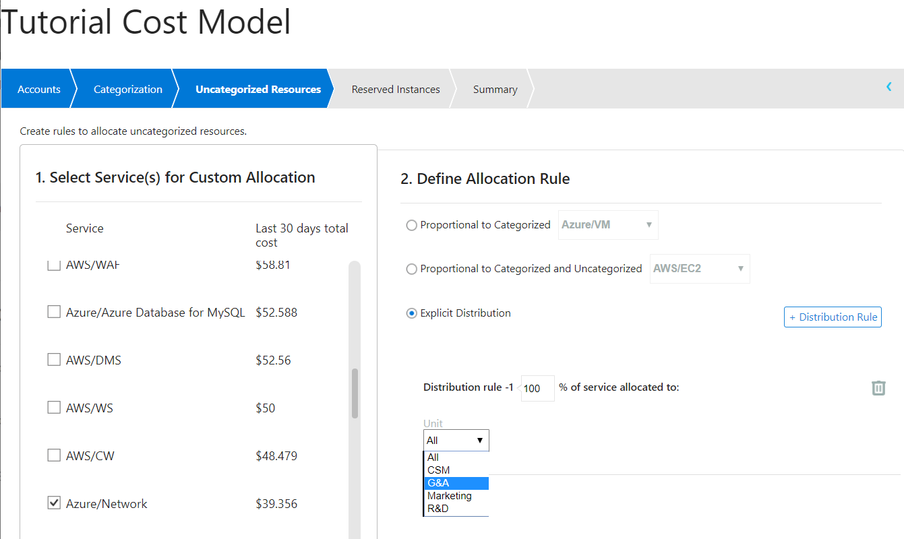
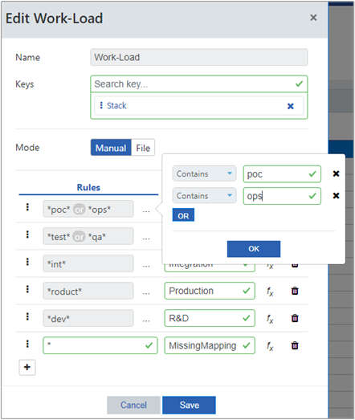

# Manage costs by using Azure Cost Management

You manage costs and produce showback reports in Azure Cost Management by Cloudyn by allocating costs based on tags. The process of cost allocation assigns costs to your consumed cloud resources. Costs are fully allocated when all your resources are categorized with tags. After costs are allocated, you can provide showback or chargeback to your users with dashboards and reports. However, many resources might be untagged or untaggable when you start to use Cost Management.

For example, you might want to get reimbursed for engineering costs. You need to be able to show your engineering team that you need a specific amount, based on resource costs. You can show them a report for all the consumed resources that are tagged *engineering*.

In this tutorial, you learn how to:

> [!div class="checklist"]
> * Use custom tags to allocate costs.
> * Create showback and chargeback reports.

## Use custom tags to allocate costs

When you start cost allocation, the first thing you do is define the scope by using a cost model. The cost model does not change costs, it distributes them. When you create a cost model, you segment your data by cost entity, account, or subscription, and by multiple tags. Common example tags might include a billing code, cost center, or group name. Tags also help you perform showback or chargeback to other parts of your organization.

To create a custom cost allocation model, select **Cost** &gt; **Cost Management** &gt; **Cost Allocation 360°** on the report's menu.

On the **Cost Allocation 360** page, select **Add** and then enter a name and description for your cost model. Select either all accounts or individual accounts. If you want to use individual accounts, you can select multiple accounts from multiple cloud service providers. Next, click **Categorization** to choose the discovered tags that categorize your cost data. Choose tags (categories) that you want to include in your model. In the following example, the **Unit** tag is selected.

The example shows that $14,444 is uncategorized (without tags).

Next, select **Uncategorized Resources** and select services that have unallocated costs. Then, define rules to allocate costs.

For example, you might want to take your Azure storage costs and distribute the costs equally to Azure virtual machines (VMs). To do so, select the **Azure/Storage** service, select **Proportional to Categorized**, and then select **Azure/VM**. Then, select **Create**.

In a different example, you might want to allocate all your Azure network costs to a specific business unit in your organization. To do so, select the **Azure/Network** service and then select **Explicit Distribution**. Then, set the distribution percentage to 100 and select the business unit—**G&amp;A** in the following image:

For all remaining uncategorized resources, create additional allocation rules.

If you have any unallocated Amazon Web Services (AWS) reserved instances, you can assign them to tagged categories with **Reserved Instances**.

To view information about the choices that you made to allocate costs, select **Summary**. To save your information and to continue working on additional rules later, select **Save As Draft**. Or, to save your information and have Cloudyn start processing your cost allocation model, select **Save and Activate**.

The list of cost models shows your new cost model with **Processing status**. It can take some time before the Cloudyn database is updated with your cost model. When processing is done, the status is updated to **Completed**. You can then view data from your cost model in the Cost Analysis report under **Extended Filters** &gt; **Cost Model**.

### Category Manager

Category Manager is a data-cleansing tool that helps you merge the values of multiple categories (tags) to create new ones. It's a simple rule-based tool where you select a category and create rules to merge existing values. For example, you might have existing categories for **R&amp;D** and **dev** where both represent the development group.

In the Cloudyn portal, click the gear symbol in the upper right and select **Category Manager**. To create a new category, select the plus symbol (**+**). Enter a name for the category and then under **Keys**, enter the category keys that you want to include in the new category.

When you define a rule, you can add multiple values with an OR condition. You can also do some basic string operations. For either case, click the ellipsis symbol (**…**) to the right of **Rule**.

To define a new rule, in the **Rules** area, create a new rule. For example, enter **dev** under **Rules** and then enter **R&amp;D** under **Actions**. When you're done, save your new category.

The following image shows an example of rules created for a new category named **Work-Load**:

## Create showback and chargeback reports

The method that organizations use to perform showback and chargeback varies greatly. However, you can use any of the dashboards and reports in the Cloudyn portal as the basis for either purpose. You can provide user access to anyone in your organization so that they can view dashboards and reports on demand. All Cost Analysis reports support showback because they show users the resources that they consumed. And, they allow users to drill into cost or usage data that's specific to their group within your organization.

To view the results of cost allocation, open the Cost Analysis report and select the cost model that you created. Then, add a grouping by one or more of the tags selected in the cost model.

You can easily create and save reports that focus on specific services consumed by specific groups. For example, you might have a department that uses Azure VMs extensively. You can create a report that's filtered on Azure VMs to show consumption and costs.

If you need to provide snapshot data to other teams, you can export any report in PDF or CSV format.

## Next steps

In this tutorial, you learned how to:

> [!div class="checklist"]
> * Use custom tags to allocate costs.
> * Create showback and chargeback reports.

To learn more about getting started with Cloudyn and using its features, advance to the Cloudyn documentation.

> [!div class="nextstepaction"]
> [Cloudyn documentation](https://support.cloudyn.com/hc/)
