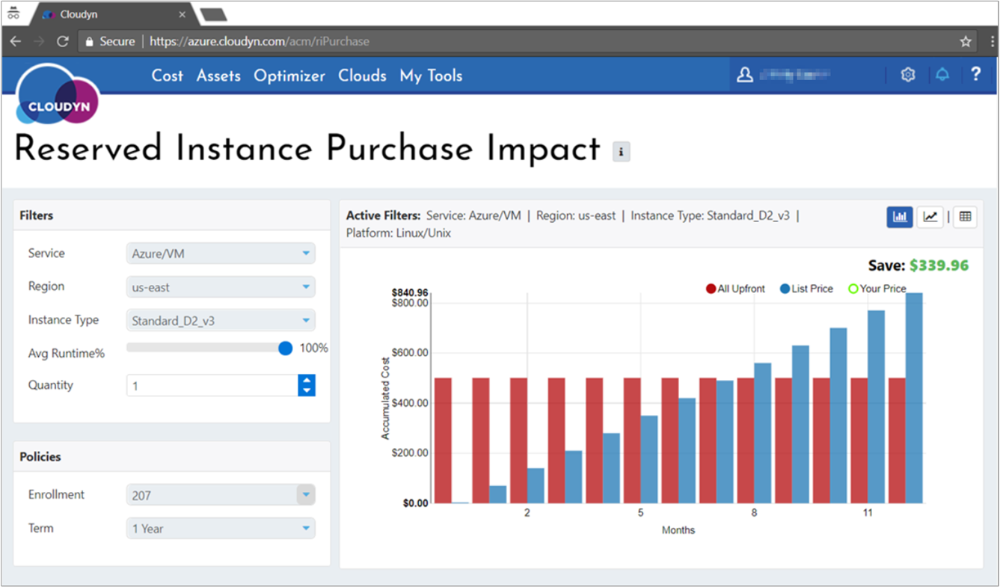
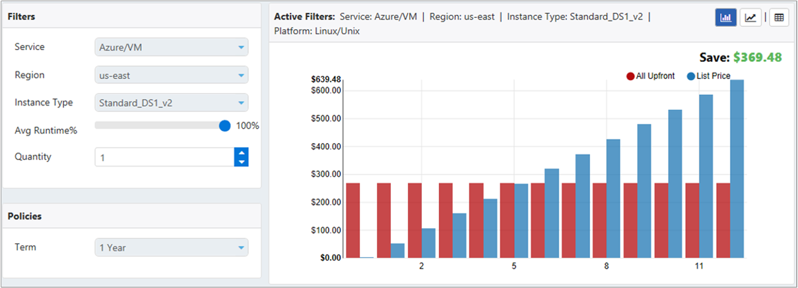
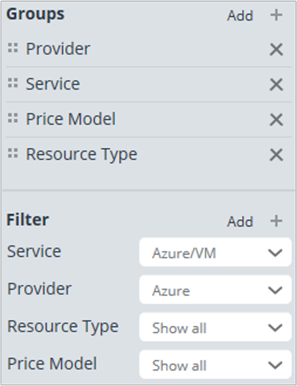
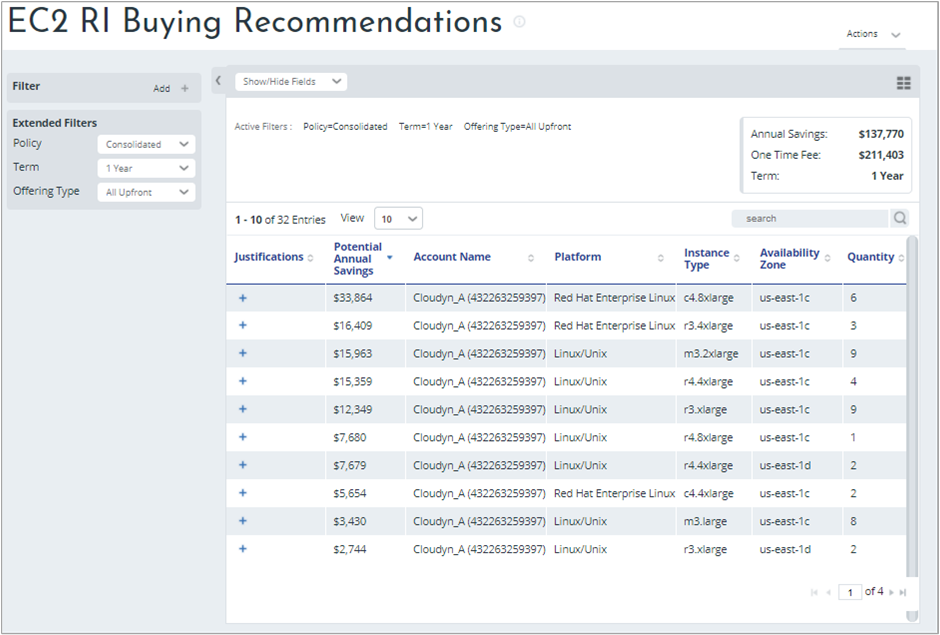
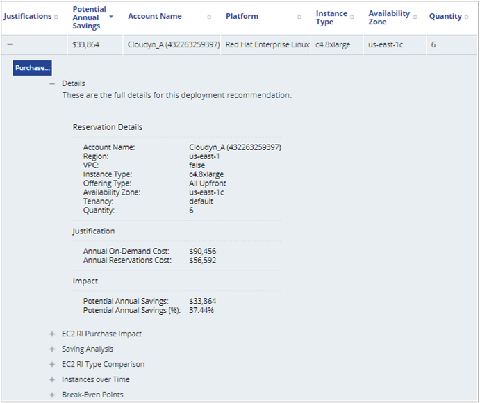
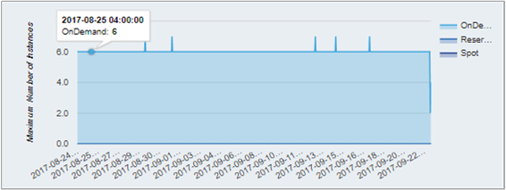
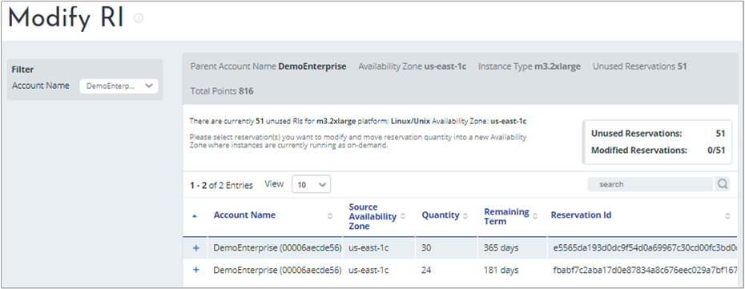
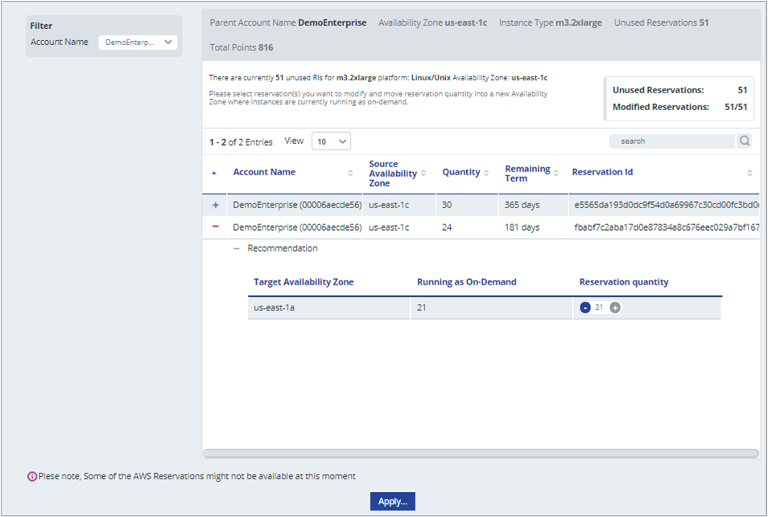

<!-- Intent: As a cloud-consuming administrator, I need to ensure that my reserved instances are optimized for cost and usage
-->

# Tutorial: Optimize reserved instances

In this tutorial, you learn how Cloudyn can help you optimize your reserved instance costs and utilization for Azure and Amazon Web Services (AWS). A reserved instance with either cloud service provider is a commitment to a long-term contract where you commit up-front for future use of the VM. And, it can potentially offer considerable savings versus standard Pay-per-Use VM pricing model. Potential savings are only realized when you fully use the capacity of your reserved instances.

This tutorial explains how Azure and AWS Reserved Instances (RIs) are supported by Cloudyn. It also describes how you can optimize reserved instance costs. Primarily, by ensuring that your reservations are fully utilized. In this tutorial, you will:

> [!div class="checklist"]
> * Understand Azure RI costs
> * Learn about the benefits of RIs
> * Optimize Azure RI costs
> * View RI costs
> * Assess Azure RI cost effectiveness
> * Optimize AWS RI costs
> * Buy recommended RIs
> * Modify unused reservations

If you don't have an Azure subscription, create a  [free account](https://azure.microsoft.com/free/?WT.mc_id=A261C142F) before you begin.

## Prerequisites

- You must have an Azure account.
- You must have either a trial registration or paid subscription for Cloudyn.
- You must have purchased RIs in Azure or AWS.

## Understand Azure RI costs

When you buy Azure Reserved VM Instances, you pay up-front for future use. The up-front payment covers the cost of your future use of the VMs:

- of a specific type
- in a specific region
- for a term of either one or three years
- up to a purchased VM quantity.

You can view your purchased Azure Reserved VM Instances in the Azure portal at [Reservations](https://portal.azure.com/#blade/Microsoft_Azure_Reservations/ReservationsBrowseBlade).

The term _Azure Reserved VM Instance_ applies only to a pricing model. It doesn't change your running VMs at all. The term is specific to Azure and is it more generally referred to as _reserved instance_ or _reservation_. Reserved instances that you've purchased do not apply to specific VMs - they apply to any matching VM. For example, a reservation for a VM type that runs in a region that you chose for your purchased reservation.

Purchased reserved instances apply only to the basic hardware. They don't cover software licenses of a VM. For example, you might reserve an instance and you have a matching VM running Windows. The reserved instance only covers the base cost of the VM. In this example, you pay the full price of any required Windows licenses. To get a discount on the operating system or other software running on your VMs, you should consider using [Azure Hybrid Benefits](https://azure.microsoft.com/pricing/hybrid-benefit). Hybrid Benefits offer you a similar type of discount for your software licenses as the reserved instances do for the base VMs.

Reserved instance utilization does not directly affect cost. In other words, running a VM at 100% CPU utilization or at 0% CPU utilization has the same effect: you are pre-paying for the VM allocation—not its actual utilization.

Let's see how standard on-demand VM usage relates to costs in relation to reserved instances, in the following image:

The red bars show the accumulated cost of the reserved instance purchase. You pay only the one-time fee. VM usage is free. The blue bars show the accumulated cost of the same VM running with the pay-as-you-go or on-demand pricing model. Somewhere between the seventh and eighth months in to VM usage there's a *break-even point*. Starting at the eighth month you start saving money, in this example.

## Benefits of RIs

Every reserved instance purchase applies to a VM of a specific size and location. For example, D2s\_v3 running in the West US location as shown in the following image:

The reserved instance purchase becomes beneficial when a VM runs a sufficient number of hours to reach the reservation break-even point. The VM must match the size and a location of your reserved instance. For example, the break-even point is at about the seventh and a half month in the preceding chart. So, the purchase is beneficial when the VM matching the reservation runs at least 7.5 months \* 30 days \* 24 hours = 5,400 hours. If the matching VM runs less than 5,400 hours, the reservation is more expensive than pay-as-you-go.

The break-even point might differ for each VM size and for each location. It also depends on your negotiated VM pay-as-you-go price. Before you make a purchase, you should check the break-even point applicable to your case.

Another point to consider when you purchase the reservation is the reserved instance scope. The scope determines whether the benefit of the reservation is shared or if it applies to a specific subscription. Shared reserved instances are randomly applied across all your subscriptions to first-found matching VMs.

The shared purchase scope is the most flexible and it is recommended whenever possible. Your chances of utilizing all your reserved instances are significantly higher with the shared scope. However, when the owner of a subscription pays for the reserved instance, they may have no choice but to purchase it with the Single Subscription scope.

## Optimize Azure RI costs

Cloudyn supports reserved instances and Hybrid Benefits by:

- Showing you the costs associated with pricing models
- Tracking RI usage
- Assessing RI impact
- Allocating RI costs according to your policies

The first action you should take before you purchase a reserved instance, is to assess the impact of the RI purchase:

- How much will it cost you?
- How much will you save?
- What is the break-even point?

The Reserved Instance Purchase Impact report can help answer those questions.

## Assess Azure RI cost effectiveness

In the Cloudyn portal, navigate to **Optimizer** > **RI Comparison** and then select **Reserved Instance Purchase Impact**.

In the Reserved Instance Purchase Impact report, select a VM size (Instance Type), Location (Region), reservation term, quantity, and the expected runtime. Then you can assess whether your purchase will save you money.

For example, if you purchase a reservation for a VM of type DS1\_v2 in East US and it runs 24x7 through an entire year, then you could save $369.48 annually. The break-even point is at five months. See the following image:

However, if it runs only 50% of the time, the break-even point will be at 10 months and the saving will be only $49.74 annually. You might not benefit by purchasing the reservation for that instance type in this example. See the following image:

## View RI costs

When you purchase a reservation, you make a one-time payment. There are two ways to view the payment in Cloudyn:

- Actual Cost
- Amortized Cost

### Actual reserved instance cost

The Actual Cost Analysis and Analysis Over Time reports show the full amount that you paid for the reservation, starting in the month of purchase. They help you see your actual spending over a period.

Navigate to **Cost** > **Cost Analysis** > in the Cloudyn portal and then select either **Actual Cost Analysis** or **Actual Cost Over Time**. Set the filters next. For example, filter just Azure/VM service and group by Resource Type and Price Model. See the following image:

You can filter by a service, **Azure/VM** in this example, and group by **Price Model** and **Resource Type** as shown in the following image:

You can also analyze the type of payments you've made such as one-time fees, usage fees, and license fees.

### Amortized reserved instance cost

You pay an up-front fee which is visible at the month of the purchase when you purchase an RI. It is not visible in your subsequent invoices. So, looking at your monthly usage may be misleading. Your month truly costs you the monthly usage plus the proportional (amortized) part of any previously made one-time fees. The Amortized Cost report can help you get the true picture.

The amortized reserved instance cost is calculated by taking the reservation one-time fee and amortizing it over the reservation term. In Actual Cost reports, one-time fees are visible in the month of the reservation purchase. Daily and monthly spending does not appear in the actual cost of the deployment. Amortized Cost reports show the actual cost of the deployment over time.  The amortized cost report is the only way to see your true cost trends. It is also the only way to project your future spending.

In the Actual Cost report, you saw a spike for an RI purchase on November 16 of $747. In the Amortized Cost report (see the following image), there's a partial day cost on November 16. Starting on November 17 you see the amortized RI cost of $747/365 = $2.05. Incidentally, you also notice that the purchased reservation is unused, so you can optimize it by switching it to a different VM size.

To view it, navigate to **Cost** > **Cost Analysis** > and then select **Amortized Cost Analysis** or **Amortized Cost Over Time**.

## Optimize AWS RI costs

Reserved instances are an open commitment. They are useful when you have sustained usage for VMs because reserved instances are less expensive than on-demand instances. However, they need to be sufficiently used. The commitment is to use resources, typically VMs, for a defined period—one or three years. When you make the commitment to buy, you prepay for the resources with a reservation. However, you might not always fully use what you've committed to in the reservation.

For example, you might assess your environment and determine that you had 20 standard D2 instances running constantly over the last year. You could purchase a reservation for them and potentially save significant money. In a different example, you might have committed to using ten MA4 instances for the year. But you might have only used five to date. Both examples illustrate inefficient RI use. There are two ways to optimize costs for reserved instances with Cloudyn optimization reports:

- Review buying recommendations for what you could buy based on your historical usage
- Modify unused reservations

You use the _EC2 RI Buying Recommendations_ and _EC2 Currently Unused Reservations_ reports to improve your reserved instance usage and costs.

## Buy recommended RIs

Cloudyn compares on-demand instance usage and compares it to potential reserved instances. Where it finds possible savings, its recommendations are shown in the EC2 Buying Recommendations report.

On the reports menu at the top of the portal, click **Optimizer** > **Pricing Optimization** > **EC2 RI Buying Recommendations**.

The following image shows buying recommendations from the report.

In this example, the Cloudyn\_A account has 32 reserve instance buying recommendations. If you follow all the buying recommendations, you could potentially save $137,770 annually. Keep in mind that the purchase recommendations provided by Cloudyn assume that usage for your running workloads will remain consistent.

To view details explaining why each purchase is recommended, click the plus symbol ( **+** ) under **Justifications** . Here's an example for the first recommendation in the list.

The preceding example shows that running the workload on-demand would cost $90,456 annually. However, if you purchase the reservation in advance, the same workload would cost $56,592 and save you $33,864 annually.

Click the plus symbol next to **EC2 RI Purchase Impact** to view your break-even point over a year to see approximately when your purchase investment is realized. About eight months after making the purchase the on-demand accumulated cost starts to exceed the RI accumulated cost in the following example:

You start saving money at that point.

You can review **Instances over Time** to verify the accuracy of the suggested buying recommendation. In this example, you can see that six instances were used on average for the workload over the last 30-day period.

## Modify unused reservations

Unused reservations are common in many cloud resource consumer's computing environments. Ensuring that unused reservations are fully used can save you money when you modify the reservations to meet your current needs. For example, you might have a subscription containing standard D3 instances running on Linux. If you will not fully utilize the reservation, then you can change the instance type. Or, you might move the unused resources to a different reservation or to a different account.

AWS sells reserved instances for specific availability zones and regions. If you've purchased reserved instances for a specific availability zone, then you cannot move the reservations between zones. However, you can easily move regional reserved instances between zones using the **EC2 Currently Unused Reservations** report. Or alternatively, you may modify them to have a regional scope, and then they'll apply matching instances across all availability zones.

On the reports menu at the top of the portal, click **Optimizer** > **Inefficiencies** > **EC2 Currently Unused Reservations**.

The following images show the report with unused reserved instances.

Click the plus symbol under **Details** to view reservation details for a specific reservation.

In the preceding example, there are 77 unused reservations total in various availability zones. The first reservation has 51 unused instances. Looking lower in the list, there are potential reservation instance modifications that you can make using the **m3.2xlarge** instance type in the **us-east-1c** availability zone.

Click **Modify** for the first reservation in the list to open the **Modify RI** page that shows data about the reservation.

Reserve instances that you can modify are listed. In the following example image, there are 51 unused reservations that you can modify but there is a need for 54 between the two reservations. If you modify your unused reservations to use them all, four instances will continue to run on demand. For this example, split your unused reservations where the first reservation will use 30 and the second reservation will use 21.

Click the plus symbol for the first reservation entry and set the **Reservation quantity** to **30**. For the second entry, set the reservation quantity to **21** and then click **Apply**.

All your unused instances for the reservation are fully utilized and 51 instances are no longer running on-demand. In this example, you save your organization money by significantly reducing on-demand use and using reservations that are already paid for.

## Next steps

In this tutorial, you successfully accomplished the following tasks:

> [!div class="checklist"]
> * Understood Azure RI costs
> * Learned about the benefits of RIs
> * Optimized Azure RI costs
> * Viewed RI costs
> * Assessed Azure RI cost effectiveness
> * Optimized AWS RI costs
> * Bought recommended RIs
> * Modified unused reservations

Advance to the next tutorial to learn about controlling access to data.

> [!div class="nextstepaction"]
> [Control access to data](tutorial-user-access.md)
