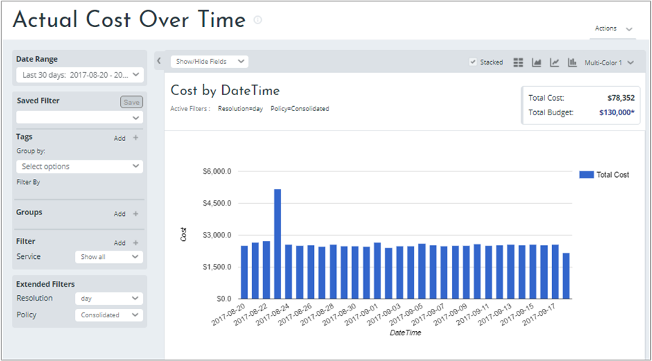
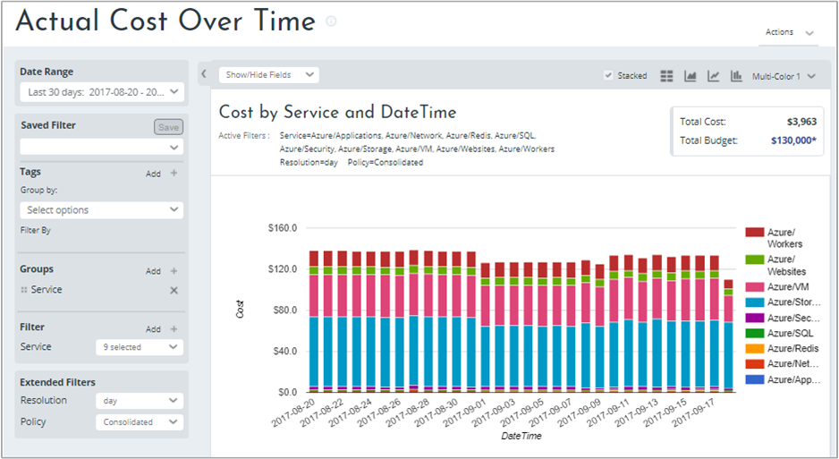
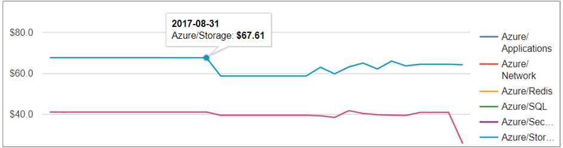
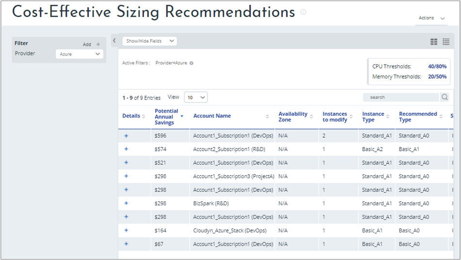
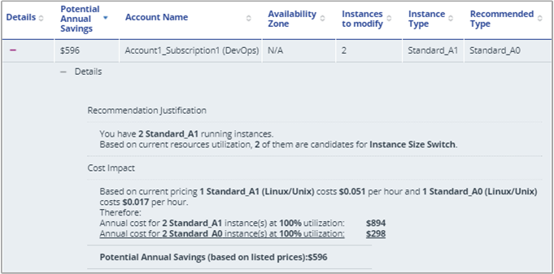
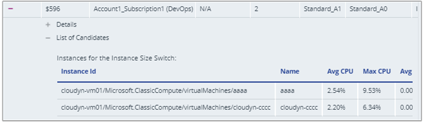
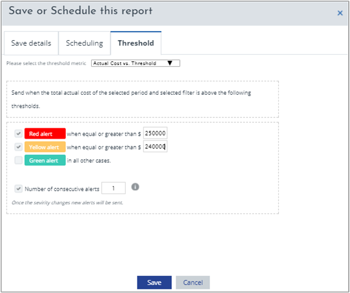

<!-- Intent: As a cloud-consuming user, I need to view usage and costs for my cloud resources and services.
-->

# Tutorial: Review usage and costs

Cloudyn shows you usage and costs so that you can track trends, detect inefficiencies, and create alerts. All usage and cost data is displayed in Cloudyn dashboards and reports. The examples in this tutorial walk you though reviewing usage and costs using dashboards and reports.

Azure Cost Management offers similar functionality to Cloudyn. Azure Cost Management is a native Azure cost management solution. It helps you analyze costs, create and manage budgets, export data, and review and act on optimization recommendations to save money. For more information, see [Azure Cost Management](overview-cost-mgt.md).

In this tutorial, you learn how to:

> [!div class="checklist"]
> * Track usage and cost trends
> * Detect usage inefficiencies
> * Create alerts for unusual spending or overspending
> * Export data

If you don't have an Azure subscription, create a  [free account](https://azure.microsoft.com/free/?WT.mc_id=A261C142F) before you begin.

## Prerequisites

- You must have an Azure account.
- You must have either a trial registration or paid subscription for Cloudyn.

## Open the Cloudyn portal

You review all usage and costs in the Cloudyn portal. Open the Cloudyn portal from the Azure portal or navigate to https://azure.cloudyn.com and sign in.

## Track usage and cost trends

You track actual money spent for usage and costs with Over Time reports to identify trends. To start looking at trends, use the Actual Cost Over Time report. On the top left of the portal, click **Costs** > **Cost Analysis** > **Actual Cost Over Time**. When you first open the report, no groups or filters are applied to it.

Here is an example report:

The report shows all spending over the last 30 days. To view only spending for Azure services, apply the Service group and then filter for all Azure services. The following image shows the filtered services.

In the preceding example, less money was spent starting on 2017-08-31 than before. That cost trend continues for the various services for about nine days. Then, additional spending continues as before. However, too many columns can obscure an obvious trend. You can change the report view to a line or area chart to see the data displayed in other views. The following image shows the trend more clearly.

In the example, you clearly see that Azure Storage cost dropped starting on 2017-08-31 while spending on other Azure services remained level. So, what caused that reduction in spending? In this example, some employees were on vacation away from work and did not use the Storage service.

To watch a tutorial video about tracking usage and cost trends, see [Analyzing your cloud billing data vs. time with Cloudyn](https://youtu.be/7LsVPHglM0g).

## Detect usage inefficiencies

Optimizer reports improve efficiency, optimize usage, and identify ways to save money spent on your cloud resources. They are especially helpful with cost-effective sizing recommendations intended to help reduce idle or expensive VMs.

A common problem that affects organizations when they initially move resources in to the cloud is their virtualization strategy. They often use an approach similar to the one they used for creating virtual machines for the on-premises virtualization environment. And, they assume that costs are reduced by moving their on-premises VMs to the cloud, as-is. However, that approach is not likely to reduce costs.

The problem is that their existing infrastructure was already paid for. Users could create and keep large VMs running if they liked—idle or not and with little consequence. Moving large or idle VMs to the cloud is likely to *increase* costs. Cost allocation for resources is important when you enter into agreements with cloud service providers. You must pay for what you commit to whether you use the resource fully or not.

The Cost Effective Sizing Recommendations report identifies potential annual savings by comparing VM instance type capacity to their historical CPU and memory usage data.  

On the menu at the top of the portal, click **Optimizer** > **Sizing Optimization** > **Cost Effective Sizing Recommendations**. Filter the provider to Azure to look at only Azure VMs. Here’s an example image.

In this example, $3,114 could be saved by following the recommendations to change the VM instance types. Click the plus symbol (+) under **Details** for the first recommendation. Here are details about the first recommendation.

View VM instance IDs by clicking the plus symbol next to **List of Candidates**.

To watch a tutorial video about detecting usage inefficiencies, see [Optimizing VM Size in Cloudyn](https://youtu.be/1xaZBNmV704).

## Create alerts for unusual spending

You can alert stakeholders automatically for spending anomalies and overspending risks. You can quickly and easily create alerts using reports that support alerts based on budget and cost thresholds.

You create an alert for any spending using any Cost report. In this example, use the Actual Cost Over Time report to notify you when Azure VM spending nears your total budget. All the following steps are needed to create the alert. On the menu at the top of the portal, click **Costs** > **Cost Analysis** > **Actual Cost Over Time**. Set **Groups** to **Service** and set **Filter on the service** to **Azure/VM**. In the top right of the report, click **Actions** and then select **Schedule report**.

In the Save or Schedule this report box, use the **Scheduling** tab to send yourself an email of the report using the frequency that you want. Be sure to select **Send via email**. Any tags, grouping, and filtering you used are included in the emailed report. Click the **Threshold** tab and select choose **Actual Cost vs. Threshold**. If you had a total budget of $500,000 and you wanted notification when costs near about half, create a **Red alert** at $250,000 and a **Yellow alert** at $240,000. Don't include commas in values that you enter. Then, choose the number of consecutive alerts. When you receive the total number of alerts that you specified, no additional alerts are sent. Save the scheduled report.

You can also choose the Cost Percentage vs. Budget threshold metric to create alerts. By using that metric, you can use budget percentages instead of currency values.

## Export data

Similar to way you create alerts for reports, you can also export data from any report. For example, you might want to export a list of Cloudyn accounts or other user data. To export any report, open the report and then in the top right of the report, click **Actions**. Some of the actions you might want to take are **Export all report data** so that you can download or print the information. Or, you can select **Schedule report** to schedule the report to get sent as an email.

## Next steps

In this tutorial, you learned how to:

> [!div class="checklist"]
> * Track usage and cost trends
> * Detect usage inefficiencies
> * Create alerts for unusual spending or overspending
> * Export data

Advance to the next tutorial to learn how to forecast spending using historical data.

> [!div class="nextstepaction"]
> [Forecast future spending](tutorial-forecast-spending.md)
